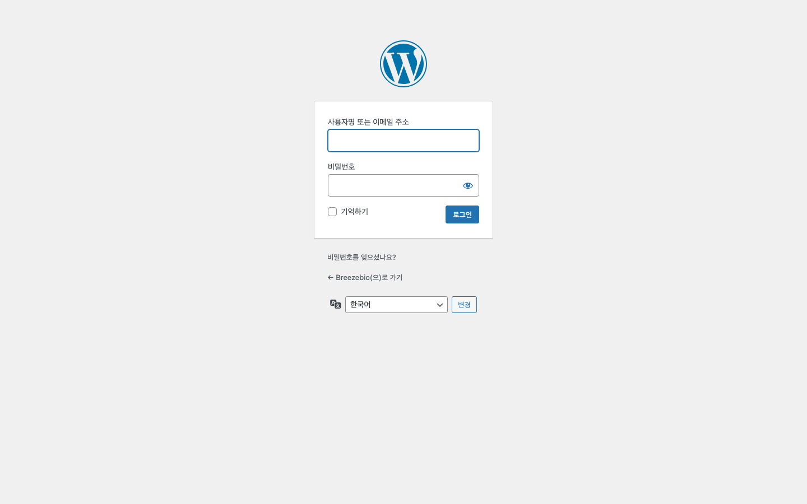
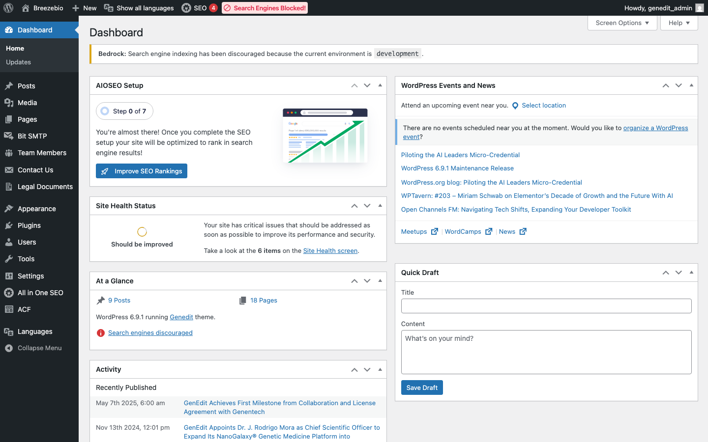
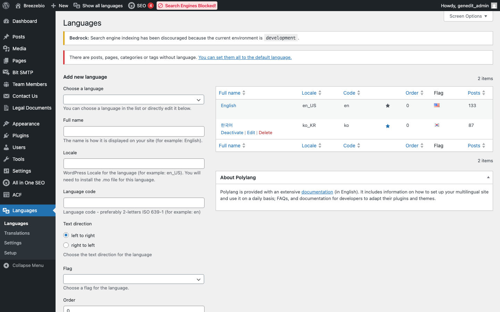

## 1. BreezeBio 웹사이트 소개

BreezeBio는 유전자 치료제 개발 전문 기업으로, NanoGalaxy® 플랫폼을 기반으로 혁신적인 유전자 의약품을 개발하고 있습니다. 이 웹사이트는 기업 소개, 기술 플랫폼, 파이프라인, 뉴스, 채용 정보를 제공합니다.

### 웹사이트 구성

| 메뉴 | 설명 | 경로 |
|------|------|------|
| **About** | 회사 소개, 미션, 팀 멤버 | `/about` |
| **NanoGalaxy** | NanoGalaxy® 기술 플랫폼 소개 | `/nanogalaxy` |
| **Science** | 치료제 기술 상세 | `/science` |
| **Pipeline** | 파이프라인 현황 | `/pipeline` |
| **News** | 뉴스 및 공지사항 | `/news` |
| **Careers** | 채용 정보 | `/careers` |
| **Contact** | 문의하기 | `/contact` |

### 다국어 지원

웹사이트는 **영어(기본)**와 **한국어**를 지원합니다. 각 언어별로 별도의 콘텐츠를 관리합니다.

---

## 2. WordPress 관리자 접속

### 접속 URL

| 환경 | 관리자 URL |
|------|------------|
| **운영** | https://breezebio.com/wp/wp-admin |
| **개발** | https://genedit.ddev.site/wp/wp-admin |

### 로그인 방법

1. 관리자 URL 접속
2. 사용자명과 비밀번호 입력
3. "로그인" 버튼 클릭



> **참고**: Bedrock 구조에서 WordPress 코어는 `/wp` 디렉토리에 위치하므로 관리자 URL이 `/wp/wp-admin`입니다.

---

## 3. 관리자 화면 구성

### 대시보드

로그인 후 대시보드가 표시됩니다. 좌측 메뉴에서 각 기능에 접근할 수 있습니다.



### 주요 메뉴

| 메뉴 | 설명 |
|------|------|
| **글 (Posts)** | 뉴스 게시물 관리 |
| **미디어** | 이미지, 파일 업로드 및 관리 |
| **페이지** | 웹사이트 페이지 관리 |
| **Team Members** | 팀 멤버 관리 (커스텀 포스트 타입) |
| **Contact Us** | 문의 내역 확인 (커스텀 포스트 타입) |
| **Legal Documents** | 법무 문서 관리 (커스텀 포스트 타입) |
| **Languages** | 다국어 설정 (Polylang) |

### 상단 바

- **사이트 보기**: 프론트엔드 웹사이트로 이동
- **언어 선택**: 관리자 화면 언어 변경
- **프로필**: 계정 설정, 로그아웃

---

## 4. 다국어 시스템 이해

### Polylang 플러그인

다국어 관리는 **Polylang** 플러그인을 통해 이루어집니다.

| 기능 | 설명 |
|------|------|
| **언어 추가** | 새 언어 생성 및 설정 |
| **번역 연결** | 같은 콘텐츠의 언어별 버전 연결 |
| **언어 스위처** | 프론트엔드에서 언어 전환 |

### 콘텐츠 언어 설정

각 게시물/페이지 편집 시 우측 사이드바에서 언어를 설정할 수 있습니다:

1. **언어 선택**: 현재 콘텐츠의 언어 지정
2. **번역 연결**: 다른 언어 버전 선택 또는 새로 생성



### 언어별 URL 구조

| 언어 | URL 예시 |
|------|----------|
| 영어 (기본) | `https://breezebio.com/about` |
| 한국어 | `https://breezebio.com/ko/about` |

---

## 5. 기술 스택 요약

이 섹션은 관리자가 알아두면 좋은 기술적 배경입니다.

### 핵심 스택

| 구성 요소 | 기술 | 버전 |
|----------|------|------|
| CMS | WordPress (Bedrock) | 6.9.1 |
| 템플릿 | Timber + Twig | |
| 프론트엔드 | Svelte 5 + Tailwind CSS v4 | |
| 블록 시스템 | ACF Pro | 6.7.0.2 |
| 다국어 | Polylang Pro | 3.7.8 |
| SEO | All in One SEO | 4.9.4.1 |
| GDPR | Complianz GDPR | 7.4.4.2 |
| 빌드 도구 | Vite | 7.3.1 |

### 주요 플러그인

| 플러그인 | 버전 | 용도 |
|---------|------|------|
| Advanced Custom Fields Pro | 6.7.0.2 | 커스텀 블록·필드 |
| Polylang Pro | 3.7.8 | 다국어 관리 |
| All in One SEO | 4.9.4.1 | SEO 메타·스키마 |
| Complianz GDPR | 7.4.4.2 | GDPR 쿠키 동의 |
| Complianz Terms & Conditions | 1.2.8 | 이용약관 연동 |
| Bit SMTP | 1.2.3 | 이메일 발송 |
| Post Types Order | 2.4.3 | 포스트 순서 관리 |
| Safe SVG | 2.4.0 | SVG 업로드 허용 |
| Custom Taxonomy Order | 4.0.2 | 택소노미 순서 |
| Disable Comments | 1.0.26 | 댓글 비활성화 |
| Remove Author Pages | 0.2 | 작성자 페이지 제거 |

### Bedrock 구조란?

일반 WordPress와 달리 폴더 구조가 분리되어 있습니다:

```
/var/www/genedit/        # Bedrock 루트
├── web/                 # 웹 루트 (DocumentRoot)
│   ├── app/             # 테마, 플러그인, 업로드
│   └── wp/              # WordPress 코어
├── config/              # 환경 설정
├── vendor/              # Composer 패키지
└── .env                 # 환경변수 (DB, URL 등)
```

이 구조 덕분에 WordPress 코어와 커스텀 코드가 분리되어 보안과 유지보수가 용이합니다.

---

## 6. 운영 서버 인프라

### 호스팅

| 항목 | 내용 |
|------|------|
| **클라우드** | AWS Lightsail |
| **리전** | us-west-2 (Oregon) |
| **OS** | Ubuntu 24.04.3 LTS (x86_64) |
| **Public IP** | 54.186.236.54 |
| **도메인** | breezebio.com |

### 서버 구성

| 구성 요소 | 버전/설정 |
|----------|----------|
| **웹서버** | Apache 2.4.58 |
| **PHP** | 8.3.6 (PHP-FPM) |
| **데이터베이스** | MariaDB 10.11.14 (Lightsail Managed DB) |
| **Node.js** | 24.13.1 (nvm) |
| **CDN/보안** | Cloudflare (DNS, SSL, 캐시) |

### PHP-FPM 설정

| 항목 | 값 |
|------|-----|
| pm.max_children | 15 |
| pm.start_servers | 4 |
| pm.min_spare_servers | 2 |
| pm.max_spare_servers | 6 |
| pm.max_requests | 1000 |

### 배포 방식

Git 기반 자동 배포를 사용합니다:

```
[로컬] → git push production main → [서버 bare repo] → post-receive hook → 배포
```

**배포 과정** (post-receive hook):

1. `main` 브랜치를 `/var/www/genedit/`에 checkout
2. `composer install -o --no-dev` 실행
3. 테마 디렉토리에서 `npm ci` → `npm run build` (Vite 빌드)
4. `php8.3-fpm` 리로드 (OPcache 초기화)
5. Slack 웹훅으로 배포 알림 발송

### SSH 접속

```bash
$ ssh genedit
```

> **참고**: SSH config에 `genedit` 호스트가 설정되어 있어야 합니다. 접속 설정이 필요하면 개발팀에 문의하세요.

### 디스크/메모리

| 항목 | 용량 |
|------|------|
| 디스크 | 77GB (사용 3.7GB / 5%) |
| 메모리 | 3.7GB (가용 3.0GB) |
| 업로드 폴더 | 168MB |

---

## 7. 보안 유의사항

| 주의사항 | 설명 |
|----------|------|
| **비밀번호 관리** | 강력한 비밀번호 사용, 주기적 변경 권장 |
| **로그아웃** | 공용 PC 사용 시 반드시 로그아웃 |
| **플러그인 설치** | 관리자 화면에서 플러그인 설치 비활성화됨 (보안상 Composer로만 관리) |
| **파일 수정** | 관리자 화면에서 테마/플러그인 코드 편집 비활성화됨 |

> **중요**: `DISALLOW_FILE_MODS` 설정으로 관리자 화면에서의 플러그인/테마 설치가 차단되어 있습니다. 새 플러그인이 필요한 경우 개발팀에 요청하세요.
