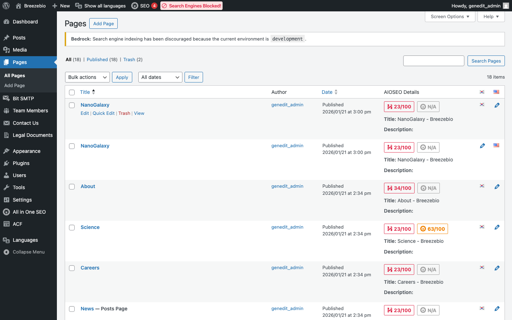
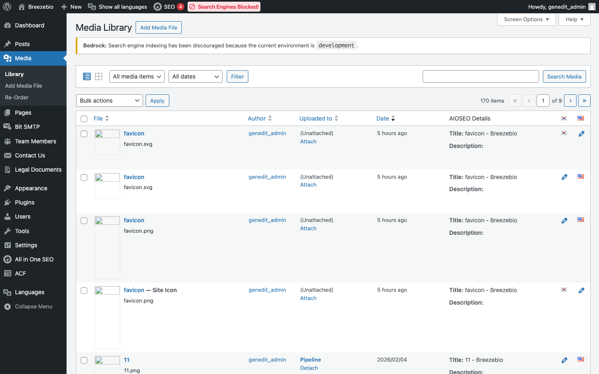
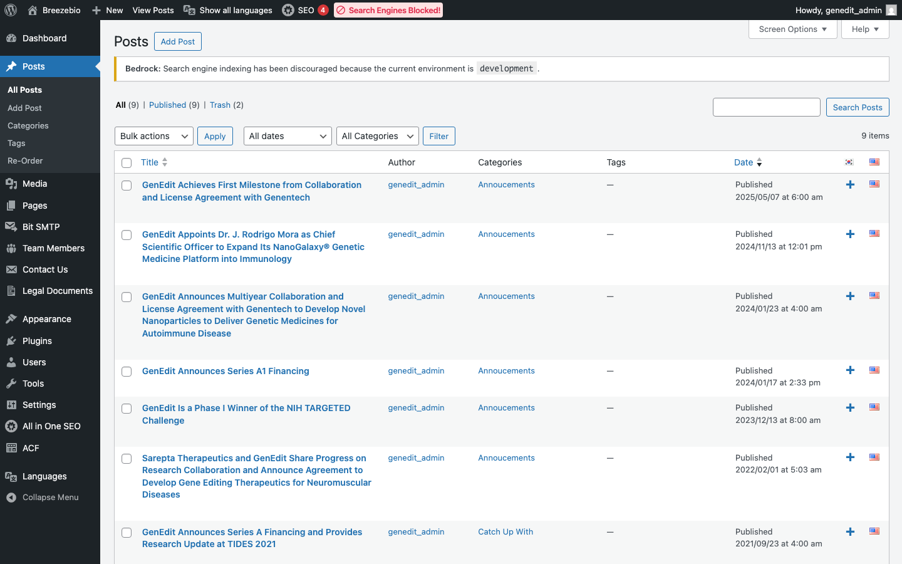

## 1. 페이지 관리

### 페이지 목록

**경로**: `관리자 > 페이지`

| 컬럼 | 설명 |
|------|------|
| **제목** | 페이지 제목 (클릭하여 편집) |
| **언어 플래그** | 해당 페이지의 언어 |
| **번역** | 연결된 다른 언어 버전 |
| **날짜** | 발행일/수정일 |

### 페이지 편집

1. 페이지 목록에서 편집할 페이지 제목 클릭
2. 블록 에디터에서 콘텐츠 수정
3. "업데이트" 버튼 클릭하여 저장

---

## 2. 블록 에디터 사용법

WordPress의 **Gutenberg 블록 에디터**와 **ACF 커스텀 블록**을 함께 사용합니다.

### 블록 추가

1. 편집 화면에서 `+` 버튼 클릭 또는 `/` 입력
2. "BreezeBio" 카테고리에서 원하는 블록 선택
3. 블록 설정 패널에서 필드 입력

### BreezeBio 커스텀 블록 목록

| 블록명 | 용도 |
|--------|------|
| **Hero Section** | 메인 페이지 히어로 영역 |
| **Page Hero** | 서브 페이지 상단 히어로 |
| **Section Title** | 섹션 제목 |
| **Feature Cards** | 특징 카드 그리드 |
| **Image Text** | 이미지 + 텍스트 레이아웃 |
| **Two Column Text** | 2단 텍스트 레이아웃 |
| **CTA Banner** | Call-to-Action 배너 |
| **Testimonials** | 인용/후기 |
| **Partners** | 파트너사 로고 |
| **Investors** | 투자사 로고 |
| **Team** | 팀 멤버 섹션 |
| **News** | 뉴스 목록 |
| **Careers** | 채용 정보 |
| **Q&A** | FAQ/Q&A |
| **Content Accordion** | 아코디언 콘텐츠 |
| **Pipeline Table** | 파이프라인 테이블 |
| **Program Section** | 프로그램 섹션 |
| **Program Detail** | 프로그램 상세 |
| **Contact Info** | 연락처 정보 |

### 블록 편집 모드

ACF 블록은 두 가지 모드로 표시됩니다:

| 모드 | 설명 |
|------|------|
| **Preview** | 실제 렌더링된 모습 미리보기 |
| **Edit** | 필드 입력 폼 표시 |

블록 상단 툴바에서 모드를 전환할 수 있습니다.

---

## 3. 미디어 관리

### 미디어 라이브러리

**경로**: `관리자 > 미디어`

### 이미지 업로드

1. "새로 추가" 버튼 클릭
2. 파일 드래그 앤 드롭 또는 "파일 선택"
3. 업로드 완료 후 미디어 라이브러리에 표시

### 이미지 최적화 가이드

| 용도 | 권장 크기 | 형식 |
|------|----------|------|
| Hero 배경 | 1920x1080px | JPG/WebP |
| 팀 멤버 사진 | 400x400px | JPG/WebP |
| 로고 이미지 | 200x100px | PNG/SVG |
| 뉴스 썸네일 | 800x600px | JPG/WebP |

> **팁**: SVG 파일도 업로드 가능합니다 (Safe SVG 플러그인 활성화됨).

---

## 4. 뉴스 관리

### 뉴스 목록

**경로**: `관리자 > 글`

### 새 뉴스 작성

1. "새 글 추가" 클릭
2. 제목 입력
3. 본문 작성 (블록 에디터)
4. 우측 사이드바에서:
   - **카테고리** 선택
   - **특성 이미지** 설정 (썸네일)
   - **언어** 선택
5. "발행" 클릭

### 카테고리 관리

**경로**: `관리자 > 글 > 카테고리`

| 기본 카테고리 | 설명 |
|--------------|------|
| Catch Up With | 일반 뉴스/소식 |
| Press Releases | 보도자료 |
| Announcements | 공지사항 |

> **참고**: 카테고리는 다국어별로 별도 관리됩니다. 영어/한국어 각각 동일한 이름의 카테고리가 존재합니다.

---

## 5. 발행 및 미리보기

### 발행 상태

| 상태 | 설명 |
|------|------|
| **발행됨** | 웹사이트에 공개 |
| **임시글** | 저장만 된 상태 (비공개) |
| **예약됨** | 지정 시간에 자동 발행 |
| **비공개** | 관리자만 볼 수 있음 |

### 미리보기

1. 편집 화면 상단 "미리보기" 버튼 클릭
2. "새 탭에서 미리보기" 선택
3. 실제 프론트엔드에서 콘텐츠 확인

### 리비전 (수정 이력)

WordPress는 자동으로 수정 이력을 저장합니다.

1. 편집 화면 우측 "리비전" 클릭
2. 이전 버전과 비교
3. 필요시 이전 버전으로 복원

---

## 6. 자주 묻는 질문

### Q: 페이지가 저장되지 않아요

**A**: 다음을 확인하세요:
- 필수 필드가 모두 입력되었는지
- 네트워크 연결 상태
- 브라우저 캐시 새로고침 (Ctrl+Shift+R)

### Q: 이미지가 표시되지 않아요

**A**: 
- 이미지 파일명에 한글이나 특수문자가 있으면 영문으로 변경 후 재업로드
- 이미지 크기가 너무 큰 경우 리사이즈 (최대 2MB 권장)

### Q: 블록이 깨져 보여요

**A**: 
- 블록을 선택 후 상단 메뉴에서 "블록 복구" 시도
- 해결되지 않으면 해당 블록 삭제 후 다시 추가
