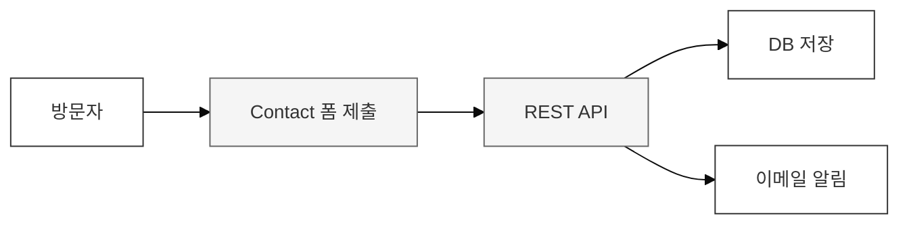
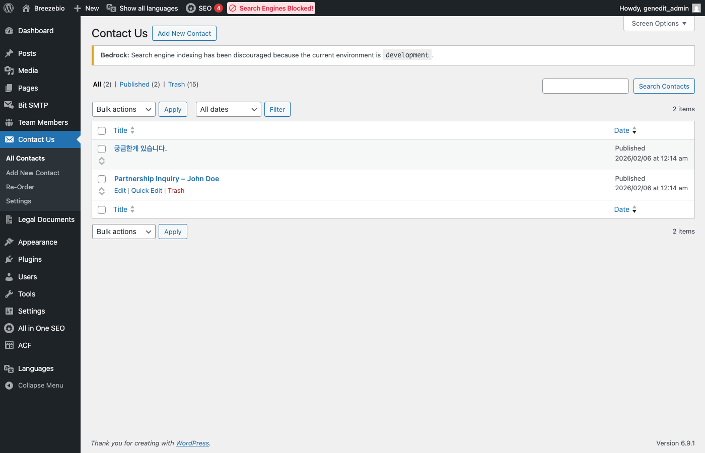
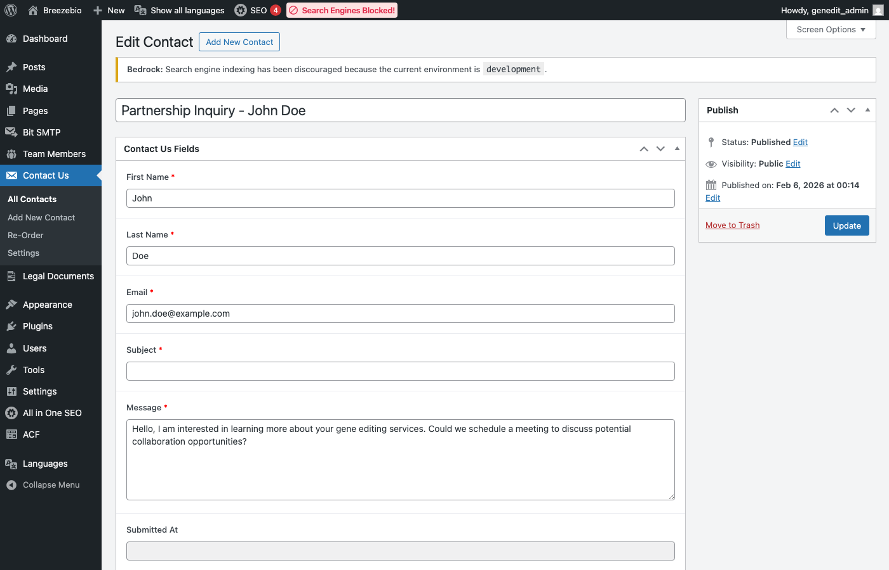

## 1. Contact Us 시스템 개요

웹사이트의 Contact 페이지에서 제출된 문의는 **Contact Us** 커스텀 포스트 타입으로 저장됩니다.

### 시스템 구성



| 기능 | 설명 |
|------|------|
| **폼 제출** | 프론트엔드에서 REST API로 전송 |
| **데이터 저장** | Contact Us CPT로 저장 |
| **이메일 알림** | 담당자에게 자동 발송 |

---

## 2. 문의 목록 확인

### 접근 경로

**관리자 > Contact Us**



### 목록 컬럼

| 컬럼 | 설명 |
|------|------|
| **제목** | 문의 제목 (자동 생성) |
| **이름** | 문의자 이름 |
| **이메일** | 문의자 이메일 |
| **회사** | 문의자 소속 |
| **날짜** | 제출 일시 |

---

## 3. 문의 상세 보기

문의 제목을 클릭하면 상세 정보를 확인할 수 있습니다.

### 저장 필드

| 필드명 | 설명 |
|--------|------|
| **First Name** | 이름 |
| **Last Name** | 성 |
| **Email** | 이메일 주소 |
| **Phone** | 전화번호 |
| **Company** | 회사명 |
| **Job Title** | 직책 |
| **Inquiry Type** | 문의 유형 |
| **Message** | 문의 내용 |
| **Country** | 국가 |
| **Source Page** | 문의 발송 페이지 |



---

## 4. 문의 처리

### 응대 방법

Contact Us 시스템은 **기록 보관** 목적입니다. 실제 응대는 다음 방법으로 진행합니다:

1. 문의 내용 확인
2. **담당자 이메일**로 직접 회신
3. 필요시 문의 게시물에 메모 추가 (비공개)

### 응대 완료 표시

현재 별도의 상태 관리 기능은 없습니다. 필요시 다음 방법을 사용할 수 있습니다:

- 제목에 "[완료]" 등의 접두사 추가
- 별도의 카테고리/태그 활용 (향후 개발 가능)

---

## 5. 이메일 알림

### 알림 발송

새 문의 제출 시 지정된 이메일 주소로 알림이 자동 발송됩니다.

### 이메일 내용

```
제목: [BreezeBio] 새로운 문의가 접수되었습니다

안녕하세요,

새로운 문의가 접수되었습니다.

이름: John Doe
이메일: john@example.com
회사: Example Corp
문의 유형: Partnership
메시지: ...

관리자 페이지에서 확인하세요.
```

### 수신자 변경

이메일 수신자 변경이 필요한 경우 개발팀에 요청하세요.

> **참고**: 이메일 발송은 Bit SMTP 플러그인을 통해 처리됩니다.

---

## 6. 데이터 관리

### 문의 삭제

1. 문의 목록에서 삭제할 항목에 마우스 오버
2. "휴지통" 클릭
3. 휴지통에서 "영구 삭제" 가능

### 대량 삭제

1. 삭제할 항목 체크박스 선택
2. 상단 "일괄 작업" 드롭다운에서 "휴지통으로 이동" 선택
3. "적용" 클릭

### 데이터 보관 정책

- 문의 데이터는 자동 삭제되지 않습니다
- 개인정보 보호를 위해 주기적인 검토 및 삭제 권장
- 필요시 CSV 내보내기 후 삭제 (개발팀 지원 필요)

---

## 7. REST API (개발자 참고)

### 엔드포인트

```
POST /wp-json/genedit/v1/contact
```

### 요청 필드

```json
{
  "first_name": "John",
  "last_name": "Doe",
  "email": "john@example.com",
  "phone": "+1-234-567-8900",
  "company": "Example Corp",
  "job_title": "CEO",
  "inquiry_type": "partnership",
  "message": "Hello...",
  "country": "United States"
}
```

### 응답

```json
{
  "success": true,
  "message": "Contact form submitted successfully",
  "post_id": 123
}
```

---

## 8. 자주 묻는 질문

### Q: 문의 이메일이 오지 않아요

**A**: 
1. 스팸함 확인
2. SMTP 설정 확인 (관리자 > 설정 > Bit SMTP)
3. 이메일 발송 테스트 실행
4. 해결되지 않으면 개발팀에 문의

### Q: 문의 내용을 수정할 수 있나요?

**A**: 기술적으로는 가능하지만, 원본 보존을 위해 권장하지 않습니다. 필요시 메모를 추가하세요.

### Q: 문의 데이터를 내보낼 수 있나요?

**A**: 기본 기능으로는 제공되지 않습니다. 개발팀에 CSV 내보내기를 요청하세요.
