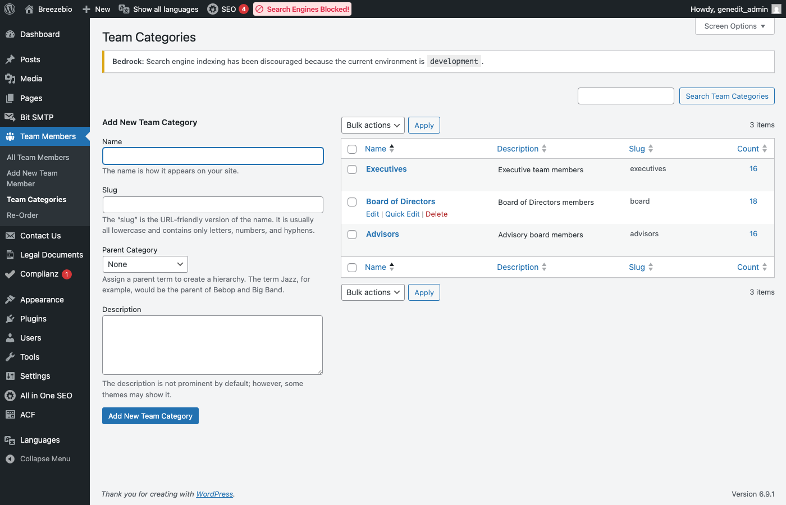
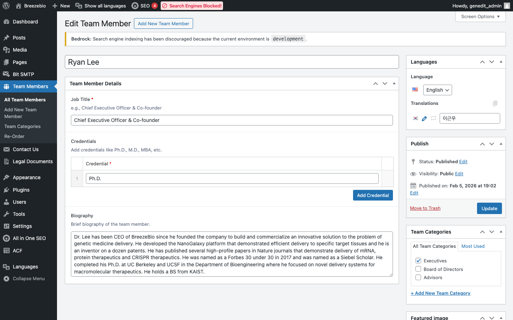
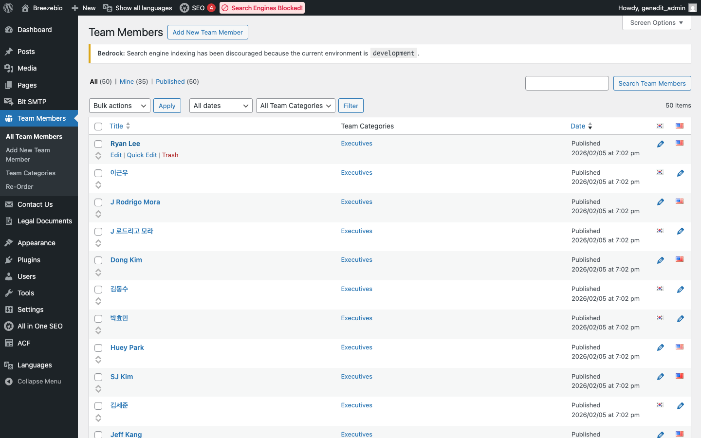
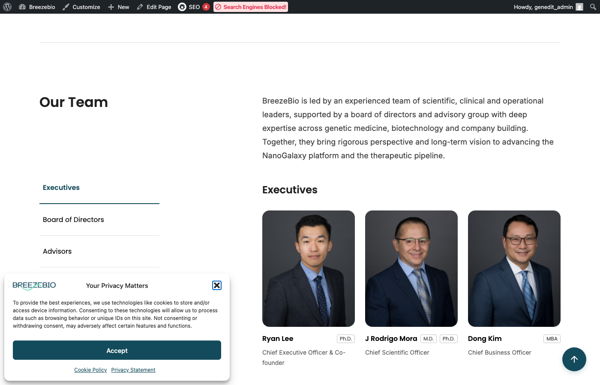

## 1. Team Members 개요

About 페이지의 팀 섹션에 표시되는 멤버 정보를 관리합니다.

### 접근 경로

**관리자 > Team Members**


---

## 2. 팀 카테고리

팀 멤버는 다음 카테고리로 분류됩니다:

| 카테고리 | 설명 | 탭 표시 |
|----------|------|---------|
| **Leadership** | 경영진 | Leadership |
| **Advisors** | 자문위원 | Advisors |
| **Board** | 이사회 | Board of Directors |

### 카테고리 관리

**관리자 > Team Members > Team Groups**



---

## 3. 팀 멤버 등록

### 새 멤버 추가

1. **Team Members > Add New** 클릭
2. 필수 정보 입력
3. "발행" 클릭

### 입력 필드

| 필드 | 설명 | 필수 |
|------|------|------|
| **제목** | 멤버 이름 | ✓ |
| **Position** | 직책 | ✓ |
| **Bio** | 약력/소개 | |
| **Profile Image** | 프로필 사진 | ✓ |
| **LinkedIn URL** | LinkedIn 프로필 링크 | |
| **Team Group** | 소속 카테고리 | ✓ |



### 프로필 이미지 가이드

| 항목 | 권장 사항 |
|------|----------|
| **크기** | 400x400px (정사각형) |
| **형식** | JPG 또는 WebP |
| **용량** | 200KB 이하 |
| **배경** | 일관된 배경색 권장 |

---

## 4. 멤버 정보 수정

1. Team Members 목록에서 편집할 멤버 클릭
2. 필드 수정
3. "업데이트" 클릭

### 프로필 사진 변경

1. **Profile Image** 필드에서 기존 이미지 클릭
2. "Remove" 또는 "Change Image" 클릭
3. 새 이미지 업로드
4. "업데이트" 클릭

---

## 5. 멤버 순서 변경

팀 멤버 표시 순서는 **Post Types Order** 플러그인으로 관리됩니다.

### 순서 변경 방법

1. **Team Members** 목록 페이지 접근
2. 드래그 앤 드롭으로 순서 변경
3. 자동 저장됨



> **참고**: 순서는 카테고리(Team Group) 내에서 적용됩니다.

---

## 6. 멤버 삭제/비활성화

### 임시 비활성화

멤버를 일시적으로 숨기려면:

1. 멤버 편집 화면 접근
2. 우측 **상태** 패널에서 "비공개" 선택
3. "업데이트" 클릭

### 완전 삭제

1. 멤버 목록에서 삭제할 멤버에 마우스 오버
2. "휴지통" 클릭
3. 필요시 휴지통에서 "영구 삭제"

---

## 7. 다국어 팀 멤버

### 언어별 관리

팀 멤버도 Polylang으로 다국어 지원됩니다.

| 필드 | 번역 필요 |
|------|----------|
| **이름** | 상황에 따라 (영문명 유지 또는 한글 병기) |
| **Position** | ✓ (예: CEO → 대표이사) |
| **Bio** | ✓ |
| **Profile Image** | 공유 가능 |

### 번역 연결

1. 영어 멤버 등록
2. 목록에서 🇰🇷 ➕ 아이콘 클릭
3. 한국어 정보 입력
4. 발행

---

## 8. 프론트엔드 표시

### Team 블록

About 페이지의 Team 블록은 자동으로 팀 멤버 데이터를 불러옵니다.



### 탭 구조

| 탭 | 표시 조건 |
|----|----------|
| Leadership | 해당 카테고리에 멤버가 1명 이상 |
| Advisors | 해당 카테고리에 멤버가 1명 이상 |
| Board of Directors | 해당 카테고리에 멤버가 1명 이상 |

> **참고**: 특정 카테고리에 멤버가 없으면 해당 탭은 표시되지 않습니다.

---

## 9. WP-CLI 명령어 (개발자 참고)

### 팀 멤버 조회

```bash
ddev wp genedit team list
```

### 팀 멤버 생성 (CSV)

```bash
ddev wp genedit team import /path/to/team.csv
```

### 팀 멤버 내보내기

```bash
ddev wp genedit team export /path/to/output.csv
```

---

## 10. 자주 묻는 질문

### Q: 팀 멤버 추가했는데 사이트에 안 보여요

**A**:
1. 멤버 상태가 "발행됨"인지 확인
2. Team Group(카테고리)이 선택되었는지 확인
3. 브라우저 캐시 새로고침 (Ctrl+Shift+R)
4. 프론트엔드 캐시 있으면 갱신 필요 (개발팀 문의)

### Q: 순서가 변경되지 않아요

**A**:
1. 목록 페이지에서 드래그 앤 드롭 후 페이지 새로고침
2. 같은 Team Group 내에서만 순서 비교됨
3. 해결되지 않으면 Post Types Order 플러그인 설정 확인

### Q: 프로필 이미지 비율이 이상해요

**A**:
1. 정사각형(1:1) 비율 이미지 사용 권장
2. 업로드 전 이미지 편집 도구로 크롭
3. 최소 400x400px 권장
