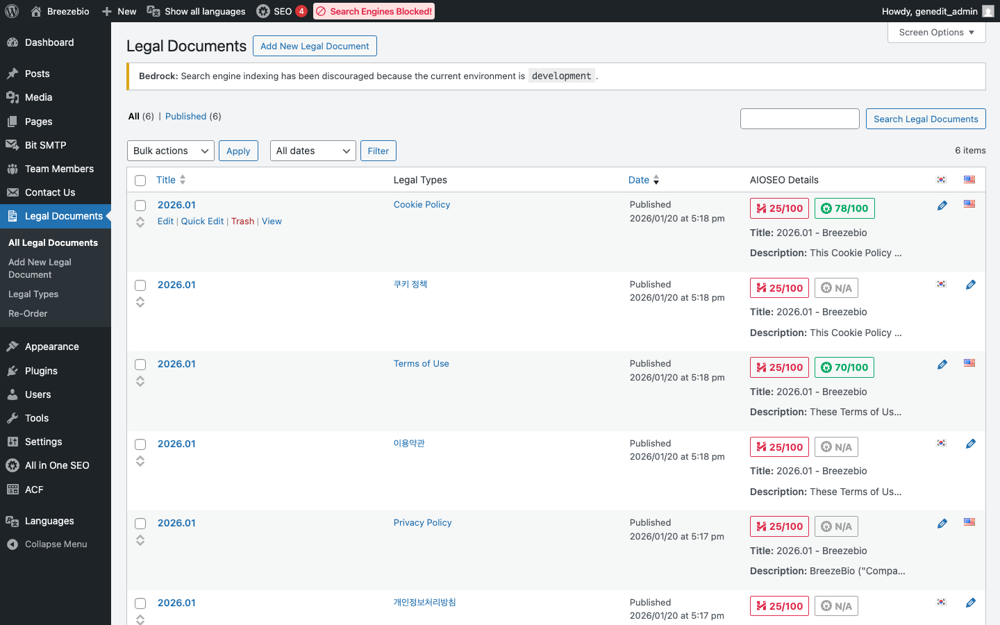
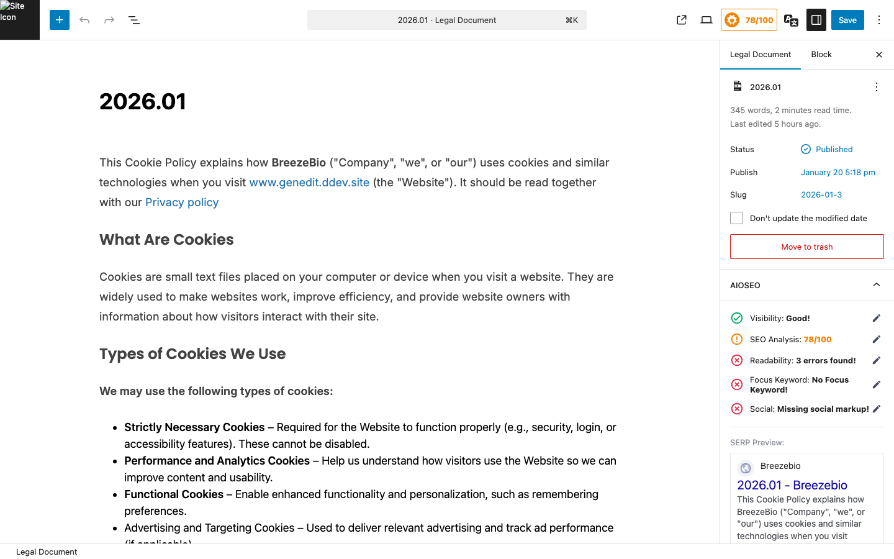
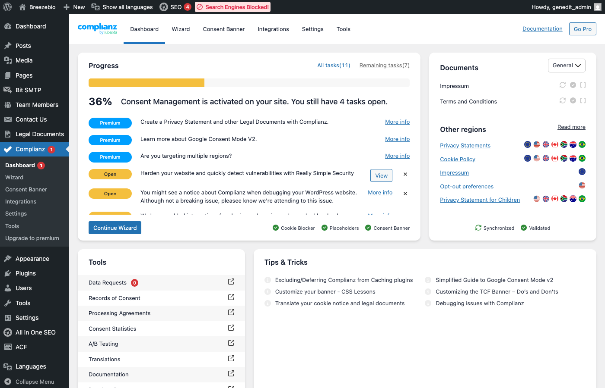

## 1. Legal Documents 개요

웹사이트의 법적 문서(이용약관, 개인정보처리방침 등)를 관리합니다.

### 접근 경로

**관리자 > Legal Documents**



---

## 2. 문서 유형

| 문서 유형 | 슬러그 | 설명 |
|----------|--------|------|
| **Terms of Service** | `terms` | 이용약관 |
| **Privacy Policy** | `privacy` | 개인정보처리방침 |
| **Cookie Policy** | `cookies` | 쿠키 정책 |

### 유형 관리

**관리자 > Legal Documents > Legal Types**



---

## 3. 문서 편집

### 편집 방법

1. **Legal Documents** 목록에서 편집할 문서 클릭
2. 블록 에디터에서 내용 수정
3. "업데이트" 클릭

### 문서 구조 권장

```
1. 개요
2. 목적
3. 정의
4. 주요 조항들...
n. 부칙
   - 시행일
   - 개정 이력
```

### 편집 시 주의사항

| 주의사항 | 설명 |
|----------|------|
| **법적 검토** | 내용 수정 전 법무 담당자 검토 권장 |
| **버전 관리** | 개정 시 시행일과 변경 내용 명시 |
| **다국어 동기화** | 양쪽 언어 버전 모두 업데이트 필요 |

---

## 4. 다국어 법무 문서

### 언어별 문서

법무 문서는 각 언어별로 별도 관리됩니다:

| 문서 | 영어 | 한국어 |
|------|------|--------|
| Terms | `/legal/terms` | `/ko/legal/terms` |
| Privacy | `/legal/privacy` | `/ko/legal/privacy` |
| Cookies | `/legal/cookies` | `/ko/legal/cookies` |

### 번역 연결

1. 영어 문서 편집 화면에서 우측 **Languages** 패널 확인
2. **Translations**에서 한국어 버전 연결
3. 한국어 문서도 동일하게 번역 내용 입력

> **중요**: 법무 문서의 번역은 법적 효력을 위해 전문 번역 검토 권장

---

## 5. 푸터 링크

법무 문서 링크는 웹사이트 푸터에 자동으로 표시됩니다.

### 푸터 표시

```
© 2026 BreezeBio. All rights reserved.
Terms of Service | Privacy Policy | Cookie Settings
```

### 링크 URL

| 문서 | URL |
|------|-----|
| Terms | `/legal/terms` |
| Privacy | `/legal/privacy` |
| Cookies | Complianz 팝업 트리거 |

---

## 6. Complianz (GDPR 동의)

### 개요

EU GDPR 준수를 위해 **Complianz GDPR/CCPA Cookie Consent** 플러그인을 사용합니다.

### 주요 기능

| 기능 | 설명 |
|------|------|
| **쿠키 배너** | 첫 방문 시 쿠키 동의 요청 |
| **동의 관리** | 사용자별 동의 기록 |
| **쿠키 정책** | 자동 생성된 쿠키 목록 |

### Complianz 설정

**관리자 > Complianz > Dashboard**



---

## 7. 문서 개정 가이드

### 개정 시 절차

1. **개정 내용 검토**: 법무 담당자와 검토
2. **시행일 결정**: 최소 7일 이상 사전 공지 권장
3. **문서 수정**: 관리자에서 내용 편집
4. **개정 이력 추가**: 문서 하단에 변경 사항 명시
5. **다국어 동기화**: 모든 언어 버전 업데이트
6. **공지**: 필요시 공지사항 등록

### 개정 이력 예시

```markdown
## 개정 이력

| 버전 | 시행일 | 변경 내용 |
|------|--------|----------|
| 1.1 | 2026-02-01 | 제3조 개인정보 수집 항목 변경 |
| 1.0 | 2025-01-01 | 최초 제정 |
```

---

## 8. URL 구조

### Taxonomy 기반 아카이브

법무 문서는 Legal Type 택소노미를 기반으로 URL이 구성됩니다:

```
/legal/terms     → Terms of Service 문서 목록
/legal/privacy   → Privacy Policy 문서 목록
```

### 개별 문서 URL

```
/legal-document/{slug}  → 개별 문서 상세
```

---

## 9. 자주 묻는 질문

### Q: 법무 문서를 새로 추가해야 해요

**A**:
1. Legal Documents > Add New
2. 제목과 내용 입력
3. Legal Type 선택 (없으면 새로 생성)
4. 발행
5. 푸터 링크는 개발팀에 추가 요청

### Q: 쿠키 배너가 표시되지 않아요

**A**:
1. Complianz 플러그인 활성화 확인
2. Complianz > Dashboard에서 설정 확인
3. 특정 지역(EU) 방문자에게만 표시되는 설정인지 확인

### Q: 이전 버전의 문서를 확인하고 싶어요

**A**:
1. 해당 문서 편집 화면 진입
2. 우측 "리비전" 클릭
3. 이전 버전 선택하여 비교/복원

### Q: 문서가 검색엔진에 노출되지 않게 하고 싶어요

**A**:
1. 해당 문서 편집 화면 진입
2. All in One SEO 패널에서 "Robots Meta" 설정
3. "noindex" 체크
4. 업데이트
