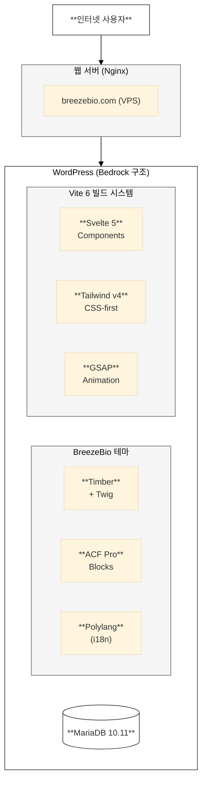
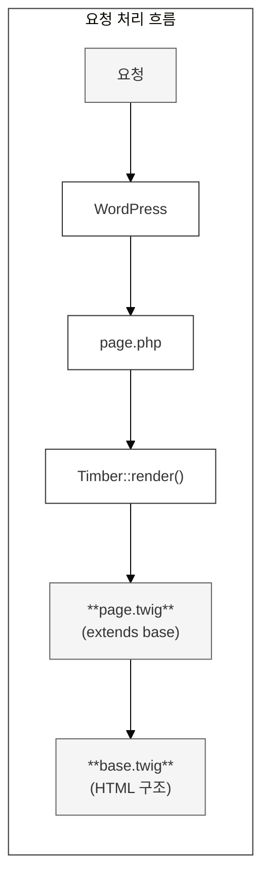
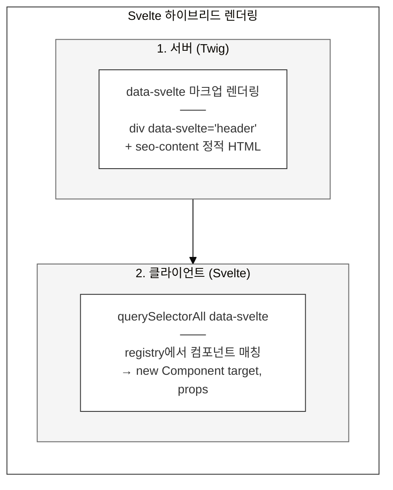
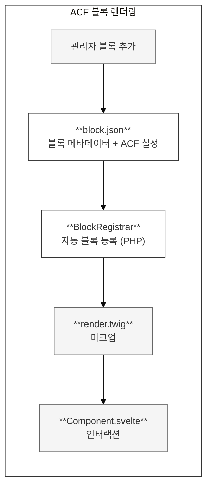
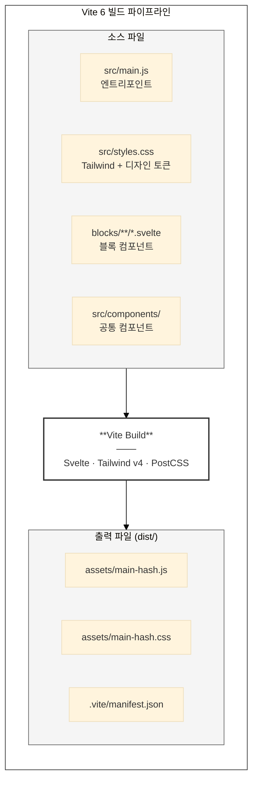
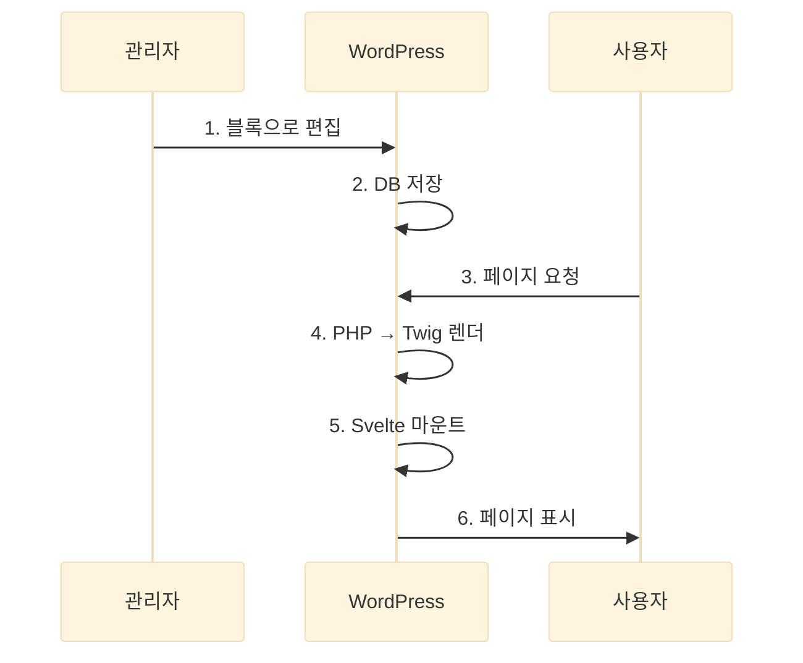
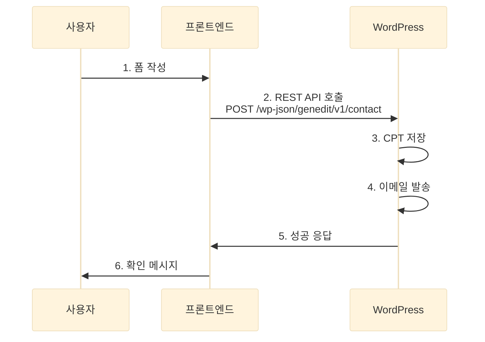

## 2.1 전체 구조

BreezeBio 웹사이트는 **WordPress Bedrock** 구조를 기반으로, **Timber/Twig** 템플릿 엔진과 **Svelte 5** 프론트엔드 프레임워크를 결합한 하이브리드 아키텍처입니다.



---

## 2.2 Bedrock 구조

### 디렉토리 구조

```
genedit/
├── config/                    # WordPress 설정
│   ├── application.php        # 공통 설정
│   └── environments/          # 환경별 오버라이드
│       ├── development.php
│       └── production.php
├── web/                       # 웹 루트
│   ├── app/                   # 커스텀 코드
│   │   ├── mu-plugins/        # Must-use 플러그인
│   │   ├── plugins/           # Composer 관리 플러그인
│   │   └── themes/            # 테마
│   │       └── genedit/       # 커스텀 테마
│   └── wp/                    # WordPress 코어
├── vendor/                    # Composer 패키지
├── .env                       # 환경 변수
├── composer.json              # PHP 의존성
└── composer.lock
```

### Bedrock의 장점

| 장점 | 설명 |
|------|------|
| **버전 관리** | WordPress 코어를 Composer로 관리, git에서 제외 |
| **환경 분리** | .env 파일로 환경별 설정 분리 |
| **보안 강화** | 웹 루트에 민감 파일 노출 방지 |
| **의존성 관리** | 플러그인/테마를 Composer로 일괄 관리 |

---

## 2.3 테마 아키텍처

### Timber + Twig

**Timber**는 WordPress를 MVC 패턴으로 사용할 수 있게 해주는 라이브러리입니다.



### Svelte 하이브리드

인터랙티브 컴포넌트는 **Svelte 5**로 구현되어 클라이언트에서 마운트됩니다.



---

## 2.4 ACF 블록 시스템

### 블록 렌더링 흐름



### 블록 디렉토리 구조

```
blocks/genedit-hero/
├── block.json           # 블록 메타데이터
├── render.twig          # Twig 템플릿
├── HeroSection.svelte   # Svelte 컴포넌트
└── hero.css             # 블록 스타일 (선택)
```

---

## 2.5 Vite 빌드 시스템

### 빌드 구성



### 개발 서버 (HMR)

```bash
ddev npm run dev
```

- Vite 개발 서버가 `http://localhost:5173`에서 실행
- HMR(Hot Module Replacement)로 실시간 반영
- Svelte 컴포넌트 변경 시 페이지 새로고침 없이 업데이트

---

## 2.6 데이터 흐름

### 콘텐츠 렌더링



### Contact 폼 제출



---

[← 이전: 1. 프로젝트 개요](./01-overview.md) | [다음: 3. 기술 스택 →](./03-tech-stack.md)
