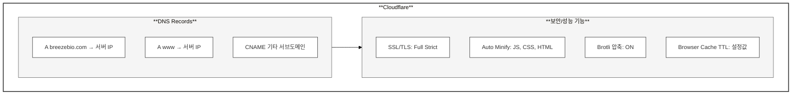

## 3.1 기술 스택 요약

| 계층 | 기술 | 버전 |
|------|------|------|
| **CMS** | WordPress (Bedrock) | 6.9 |
| **언어** | PHP | 8.3 |
| **데이터베이스** | MariaDB | 10.11 |
| **템플릿** | Timber + Twig | 2.3 |
| **프론트엔드** | Svelte | 5.x |
| **빌드 도구** | Vite | 6.x |
| **CSS** | Tailwind CSS | 4.x (CSS-first) |
| **애니메이션** | GSAP | 3.x |
| **슬라이더** | Swiper | 12.x |
| **스크롤** | Lenis | 1.x |
| **로컬 개발** | DDEV | 최신 |
| **DNS/CDN** | Cloudflare | - |

---

## 3.2 백엔드 스택

### WordPress (Bedrock)

| 구성 요소 | 설명 |
|----------|------|
| **roots/bedrock** | WordPress 보일러플레이트 |
| **roots/wordpress** | Composer로 관리되는 WP 코어 |
| **timber/timber** | Twig 템플릿 엔진 통합 |

### PHP 설정

```php
// config/application.php
Config::define('WP_DEBUG', false);
Config::define('DISALLOW_FILE_MODS', true);
Config::define('AUTOMATIC_UPDATER_DISABLED', true);
```

### 설치된 플러그인

| 플러그인 | 용도 |
|---------|------|
| **advanced-custom-fields-pro** | 커스텀 필드 + ACF 블록 |
| **timber/timber** | Twig 템플릿 엔진 |
| **polylang** | 다국어 관리 |
| **all-in-one-seo-pack** | SEO 최적화 |
| **bit-smtp** | 이메일 발송 (SMTP) |
| **complianz-gdpr** | GDPR 쿠키 동의 |
| **complianz-terms-conditions** | 이용약관 관리 |
| **safe-svg** | SVG 업로드 허용 |
| **post-types-order** | 포스트 순서 관리 |
| **disable-comments-rb** | 댓글 비활성화 |

---

## 3.3 프론트엔드 스택

### Svelte 5

Svelte 5의 **Runes** 문법을 사용합니다:

```javascript
// Svelte 5 Runes 예시
let { title, items } = $props();
let count = $state(0);
let doubled = $derived(count * 2);

$effect(() => {
  console.log('count changed:', count);
});
```

### Tailwind CSS v4 (CSS-first)

설정 파일 없이 CSS에서 직접 테마를 정의합니다:

```css
/* src/styles.css */
@import "tailwindcss";

@source "../templates/**/*.twig";
@source "../blocks/**/*.twig";
@source "../blocks/**/*.svelte";

@theme {
  --font-display: "Poppins", sans-serif;
  --font-body: "Inter", sans-serif;
  --font-korean: "Pretendard", sans-serif;
  
  --color-accent: #144B5C;
  --color-body: #424242;
}
```

### 애니메이션 라이브러리

| 라이브러리 | 용도 |
|-----------|------|
| **GSAP** | 복잡한 애니메이션, 스크롤 트리거 |
| **Lenis** | 부드러운 스크롤 |
| **Swiper** | 슬라이더/캐러셀 |

---

## 3.4 개발 환경

### DDEV

로컬 개발 환경으로 **DDEV**를 사용합니다.

```yaml
# .ddev/config.yaml
name: genedit
type: wordpress
docroot: web
php_version: "8.3"
database:
  type: mariadb
  version: "10.11"
```

### 주요 명령어

| 명령어 | 설명 |
|--------|------|
| `ddev start` | 환경 시작 |
| `ddev launch` | 브라우저에서 사이트 열기 |
| `ddev npm run dev` | Vite 개발 서버 |
| `ddev npm run build` | 프로덕션 빌드 |
| `ddev composer install` | PHP 의존성 설치 |
| `ddev wp` | WP-CLI 실행 |

> **중요**: 모든 npm/composer 명령은 반드시 `ddev` 접두사로 실행해야 합니다. 호스트(macOS)와 컨테이너(Linux) 간 네이티브 바이너리 불일치 문제를 방지합니다.

---

## 3.5 Cloudflare 설정

### DNS 관리

breezebio.com 도메인은 **Cloudflare**를 통해 DNS 및 CDN을 관리합니다.



### Cloudflare 주요 기능

| 기능 | 설명 | 상태 |
|------|------|------|
| **Proxy (주황색 구름)** | CDN + DDoS 보호 활성화 | ON |
| **SSL/TLS** | Full (Strict) 모드 | ON |
| **Auto Minify** | JS/CSS/HTML 자동 압축 | ON |
| **Always Use HTTPS** | HTTP → HTTPS 리다이렉트 | ON |
| **Brotli** | Brotli 압축 | ON |

### Cloudflare 관리자 접속

1. https://dash.cloudflare.com 접속
2. 계정 로그인
3. 좌측 메뉴에서 도메인 선택 (breezebio.com)

### DNS 레코드 수정

1. Cloudflare 대시보드 → DNS → Records
2. "Add record" 또는 기존 레코드 편집
3. 저장 (전파 시간: 즉시~수 분)

### 캐시 삭제

사이트 업데이트 후 캐시 문제가 있을 경우:

1. Cloudflare 대시보드 → Caching → Configuration
2. "Purge Everything" 클릭
3. 또는 특정 URL만 삭제: "Custom Purge"

### 개발 모드

긴급 수정 시 캐시를 일시 비활성화:

1. Caching → Configuration
2. "Development Mode" 토글 ON
3. 3시간 후 자동 OFF

---

## 3.6 버전 관리

### Git 저장소

| 저장소 | 용도 |
|--------|------|
| `origin` | GitHub (sknkwoxs/genedit) |
| `live` | 운영 서버 bare 저장소 |

### Git에서 제외되는 항목

```gitignore
# .gitignore (주요 항목)
/vendor/
/web/wp/
/web/app/plugins/
/web/app/uploads/
.env
node_modules/
```

### 빌드 산출물

`dist/` 디렉토리는 Git에 포함됩니다 (CI/CD 없이 수동 배포).

```bash
# 배포 전 빌드
ddev npm run build
git add dist/
git commit -m "빌드 산출물 업데이트"
git push live main
```

---

## 3.7 환경 변수

### .env 파일 구조

```bash
# 데이터베이스
DB_NAME='db'
DB_USER='db'
DB_PASSWORD='db'
DB_HOST='db'

# WordPress
WP_ENV='development'  # development | staging | production
WP_HOME='https://genedit.ddev.site'
WP_SITEURL='${WP_HOME}/wp'

# 보안 키 (자동 생성)
AUTH_KEY='...'
SECURE_AUTH_KEY='...'
# ... (8개 키)
```

### 환경별 설정

| 환경 | WP_ENV | WP_DEBUG | 캐시 |
|------|--------|----------|------|
| 개발 | development | true | 비활성화 |
| 스테이징 | staging | true | 활성화 |
| 운영 | production | false | 활성화 |

---

[← 이전: 2. 시스템 아키텍처](./02-architecture.md) | [다음: 4. 테마 구조 →](./04-theme-structure.md)
