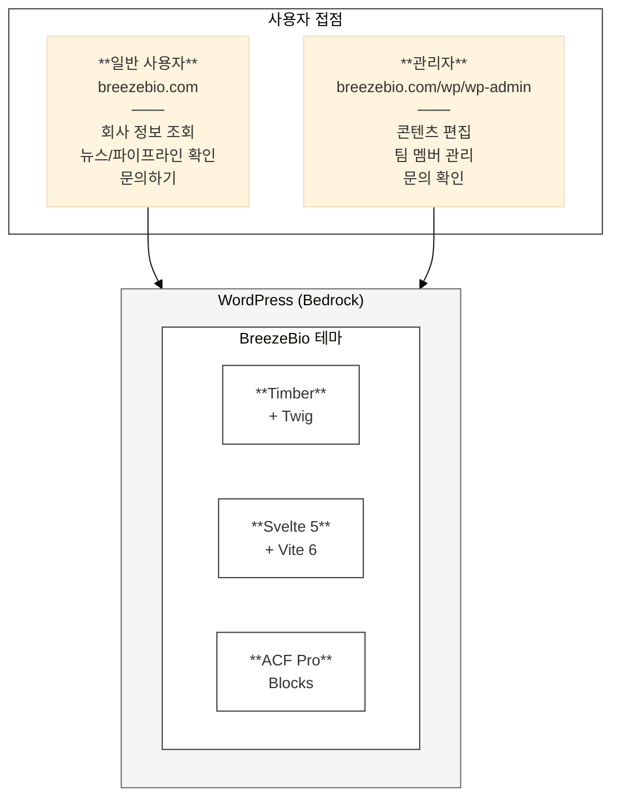

# BreezeBio 개발 명세서

BreezeBio 웹사이트 기술 개발 문서입니다.

---

## 문서 정보

| 항목 | 내용 |
|------|------|
| 프로젝트명 | BreezeBio 기업 웹사이트 |
| 고객사 | BreezeBio |
| 대상 | BreezeBio 웹사이트 (breezebio.com) |
| 버전 | 1.0 |
| 작성일 | 2026년 2월 5일 |
| 시스템 유형 | WordPress Bedrock 기반 기업 웹사이트 |

---

## 목차

| 장 | 제목 | 파일 | 주요 내용 |
|----|------|------|----------|
| 1 | [프로젝트 개요](./01-overview.md) | 01-overview.md | 시스템 목적, 주요 기능, 대상 사용자 |
| 2 | [시스템 아키텍처](./02-architecture.md) | 02-architecture.md | Bedrock 구조, 테마 아키텍처 |
| 3 | [기술 스택](./03-tech-stack.md) | 03-tech-stack.md | 사용 기술, 프레임워크, 개발 환경 |
| 4 | [테마 구조](./04-theme-structure.md) | 04-theme-structure.md | 디렉토리 구조, 파일 역할 |
| 5 | [ACF 블록 명세](./05-blocks.md) | 05-blocks.md | 커스텀 블록 목록 및 구현 |
| 6 | [커스텀 모듈](./06-custom-modules.md) | 06-modules.md | CPT, REST API, 커스텀 기능 |
| 7 | [부록](./07-appendix.md) | 07-appendix.md | 명령어, 용어집, 참고자료 |

---

## 시스템 한눈에 보기

---

## 문서 이력

| 버전 | 날짜 | 작성자 | 변경 내용 |
|------|------|--------|----------|
| 1.0 | 2026-02-05 | 스컹크웍스스튜디오 | 최초 작성 |
