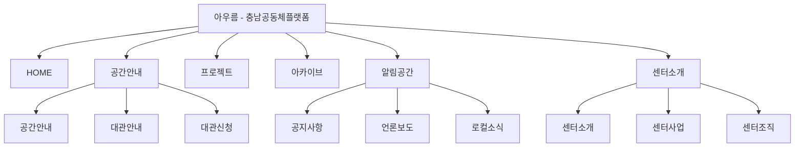
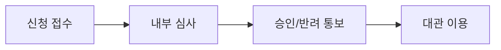
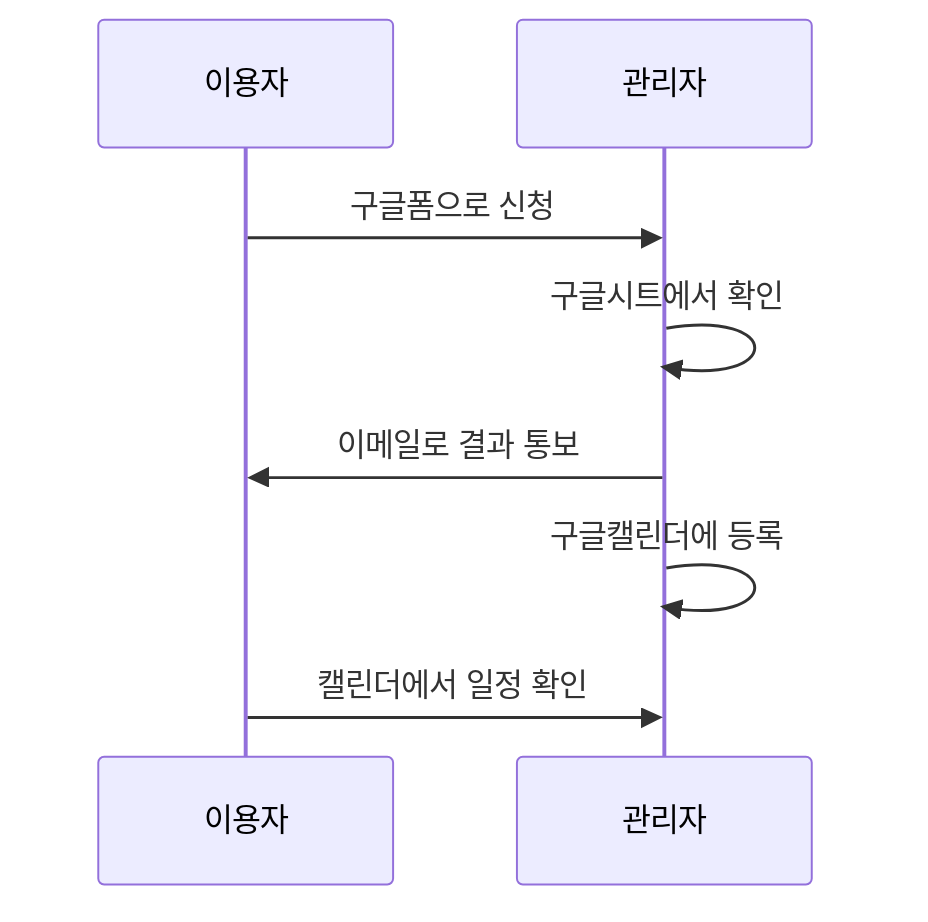
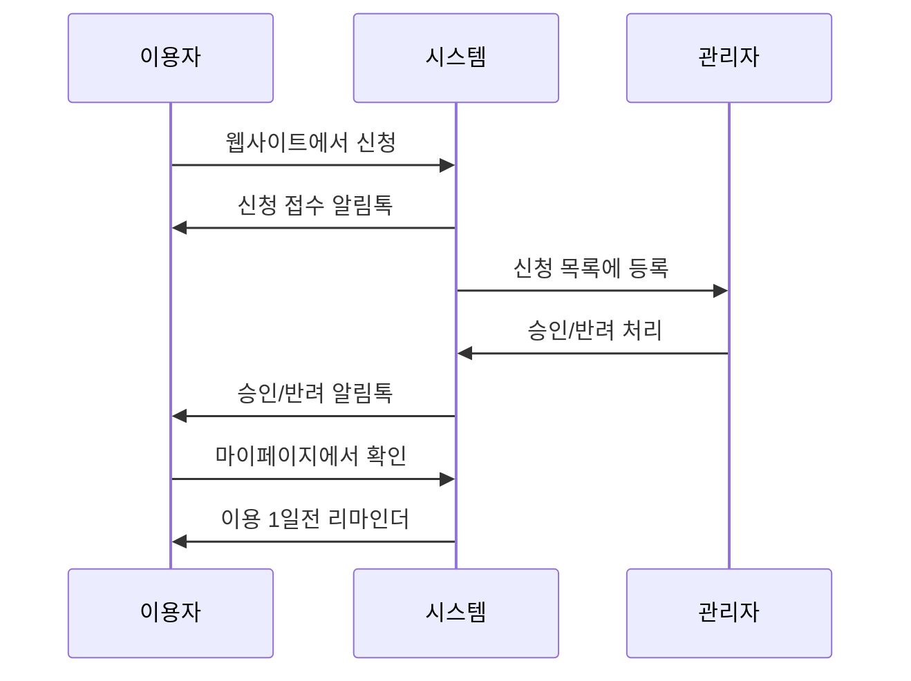

# 충남공동체플랫폼 아우름 분석 및 개선 제안

---

| 항목 | 내용 |
|------|------|
| **의뢰처** | 충남지역공동체활성화센터 |
| **웹사이트명** | 충남공동체플랫폼 아우름 |
| **대상 URL** | https://cnlocalcenter.mycafe24.com/ |
| **작성일** | 2026년 3월 7일 |

---

## 목차

1. 현재 시스템 현황
   - 1.1 메뉴 구조
   - 1.2 기술 환경
   - 1.3 대관 시스템 현황
2. 재구축 필요성
   - 2.1 확장성 한계
   - 2.2 유지보수 리스크
   - 2.3 브랜드 이미지
3. 대관 시스템 기능 요건
   - 3.1 공간 구성
   - 3.2 대관 정책 요건
   - 3.3 기능 요건
4. 개선 제안: A안 vs B안
   - 4.1 공통 사항
   - 4.2 A안: 경량 구축
   - 4.3 B안: 풀스펙 구축
   - 4.4 비교 및 권장 사항

---

## 1. 현재 시스템 현황

### 1.1 메뉴 구조

| 대메뉴 | 하위메뉴 | URL | 비고 |
|--------|----------|-----|------|
| HOME | - | / | 메인 페이지 |
| 공간안내 | 공간안내 | /공간안내 | 아우름 공간 소개 |
| | 대관안내 | /대관안내 | 대관 이용 안내 |
| | 대관신청 | /reservation-2 | 대관 신청 폼 |
| 프로젝트 | - | /프로젝트 | 진행 프로젝트 목록 |
| 아카이브 | - | /아카이브 | 활동 기록 |
| 알림공간 | 공지사항 | /공지사항 | |
| | 언론보도 | /언론보도 | |
| | 로컬소식 | /로컬소식 | |
| 센터소개 | 센터소개 | /센터소개 | |
| | 센터사업 | /센터사업 | |
| | 센터조직 | /센터조직도 | |

### 1.2 기술 환경

| 항목 | 내용 |
|------|------|
| 플랫폼 | WordPress |
| 호스팅 | Cafe24 (mycafe24.com 서브도메인) |
| 테마 | Starter Templates |
| 페이지 빌더 | Starter Templates 기반 |
| 대관 시스템 | WordPress 예약 플러그인 |
| 회원 시스템 | 자체 + 네이버 로그인 |
| 도메인 | mycafe24.com 서브도메인 (자체 도메인 미사용) |

### 1.3 대관 시스템 현황

#### 공간 구성

| 공간명 | 수용 인원 | 용도 |
|--------|----------|------|
| 중회의실 | 112명 | 대규모 행사, 세미나 |
| 소회의실 | 60명 | 중규모 모임 |
| 다목적실 | 36명 | 워크숍, 교육 |
| 메이커실 | 8명 | 소규모 작업 |

#### 현재 구현된 기능

| 기능 | 구현 여부 | 설명 |
|------|----------|------|
| 캘린더 뷰 | O | 공간별 예약 현황 표시 |
| 회원 시스템 | O | 자체 가입 + 네이버 로그인 |
| 이용규정 | O | 제한사항 11개, 취소규정, 승인제한 |
| 이용절차 안내 | O | 6단계 프로세스 안내 |
| 예약 신청 폼 | O | 기본 정보 입력 |
| 승인 프로세스 | △ | 수동 처리 (내부 검토 후 메일 안내, 1~2일 소요) |
| 관리자 대시보드 | △ | 미확인 |
| 알림 시스템 | X | 이메일 수동 발송 |
| 결제 기능 | - | 무료 대관 (불필요) |

#### 이용 절차 (현재)

1. 대관신청 페이지에서 신청서 작성
2. 내부 검토 (1~2일 소요)
3. 이메일로 승인/반려 안내
4. 대관 당일 방문 이용

---

## 2. 재구축 필요성

### 2.1 확장성 한계

| 구분 | 현황 | 한계점 |
|------|------|--------|
| 플랫폼 | Cafe24 호스팅 WordPress | 플러그인 호환성, 서버 설정 제약 |
| 커스터마이징 | Starter Templates 테마 | 디자인/기능 확장 어려움 |
| 연동 기능 | 기본 예약 플러그인 | 알림톡 등 외부 서비스 연동 어려움 |
| 데이터 | 플러그인 종속 | 데이터 구조 변경 어려움 |

### 2.2 유지보수 리스크

| 구분 | 현황 | 리스크 |
|------|------|--------|
| 개발 체계 | 1인 개발자 | 요구사항 대응 지연, 담당자 부재 시 운영 중단 |
| 문서화 | 미확인 | 인수인계 어려움, 유지보수 비용 증가 |
| 안정성 | 간헐적 이슈 발생 | 운영 신뢰도 저하 |
| 업데이트 | WordPress/플러그인 의존 | 보안 취약점, 호환성 문제 |

### 2.3 브랜드 이미지

| 구분 | 현황 | 개선 필요 |
|------|------|----------|
| 도메인 | mycafe24.com 서브도메인 | 기관 신뢰도 저하 |
| 디자인 | Starter Templates 기본 테마 | 아우름 브랜드 아이덴티티 미반영 |
| 사용자 경험 | 범용 UI | 대관 특화 UX 필요 |
| 메인 홈페이지 연계 | 별도 운영 | 통합 브랜드 경험 필요 |

---

## 3. 대관 시스템 기능 요건

### 3.1 공간 구성

충남지역공동체활성화센터 "아우름"은 충남지역 공동체를 대상으로 공간을 제공하는 시설로, 다음 4개 공간의 대관을 관리해야 한다.

| 공간 | 수용인원 | 주요 용도 | 비고 |
|------|----------|----------|------|
| 중회의실 | 112명 | 대규모 행사, 컨퍼런스, 세미나 | 마이크, 프로젝터 |
| 소회의실 | 60명 | 중규모 모임, 교육 | 기본 AV 장비 |
| 다목적실 | 36명 | 워크숍, 소규모 교육 | 이동식 테이블 |
| 메이커실 | 8명 | 창작 활동, 소모임 | 작업대, 도구 |

### 3.2 대관 정책 요건

#### 대관 대상

| 구분 | 내용 |
|------|------|
| 대상 | 충남지역 공동체 (지역 공동체 활성화 목적) |
| 심사 기준 | 신청 목적의 공동체 활성화 부합 여부 |
| 비용 | 무료 |

#### 심사 프로세스

| 단계 | 내용 | 담당 |
|------|------|------|
| 신청 접수 | 온라인 신청서 제출 | 이용자 |
| 내부 심사 | 신청 목적 검토, 일정 확인 | 센터 담당자 |
| 승인/반려 | 결과 통보 (사유 포함) | 센터 담당자 |
| 대관 이용 | 당일 방문 이용 | 이용자 |

#### 운영 정책

| 항목 | 내용 |
|------|------|
| 운영 시간 | 평일 09:00~18:00 (협의 가능) |
| 예약 단위 | 시간 단위 / 반일 / 종일 |
| 사전 예약 | 최소 3일 전 ~ 최대 30일 전 |
| 취소 규정 | 3일 전까지 취소 가능 |
| 이용 제한 | 상업 목적, 정치 활동, 종교 행사 등 제한 |

### 3.3 기능 요건

#### 이용자 기능

| 기능 | 설명 | 우선순위 |
|------|------|----------|
| 공간 조회 | 공간별 정보, 사진, 수용인원, 장비 확인 | 필수 |
| 일정 확인 | 캘린더 뷰로 예약 가능 일정 확인 | 필수 |
| 대관 신청 | 신청서 작성 (목적, 단체명, 인원 등) | 필수 |
| 신청 현황 | 본인 신청 내역 조회, 상태 확인 | 필수 |
| 취소 요청 | 승인 전/후 취소 요청 | 필수 |
| 알림 수신 | 승인/반려/리마인더 알림 | 권장 |

#### 관리자 기능

| 기능 | 설명 | 우선순위 |
|------|------|----------|
| 신청 목록 | 전체 신청 내역 조회 (상태별 필터) | 필수 |
| 승인/반려 | 신청 건별 승인/반려 처리 (사유 입력) | 필수 |
| 일정 관리 | 캘린더 뷰 일정 관리, 내부 일정 등록 | 필수 |
| 알림 발송 | 승인/반려/리마인더 알림 발송 | 권장 |
| 통계 조회 | 공간별/기간별 이용 현황 | 권장 |
| 회원 관리 | 이용자 정보 조회, 이용 이력 | 선택 |

#### 알림 기능 (B안 해당)

| 알림 유형 | 발송 시점 | 채널 |
|----------|----------|------|
| 신청 접수 확인 | 신청 즉시 | 카카오 알림톡 |
| 승인 완료 | 승인 처리 시 | 카카오 알림톡 |
| 반려 안내 | 반려 처리 시 (사유 포함) | 카카오 알림톡 |
| 이용 리마인더 | 이용 1일 전 | 카카오 알림톡 |
| 취소 확인 | 취소 처리 시 | 카카오 알림톡 |

---

## 4. 개선 제안: A안 vs B안

### 4.1 공통 사항

| 항목 | 내용 |
|------|------|
| 플랫폼 | WordPress |
| 호스팅 | AWS 또는 Cafe24 상용 서버 (고객 계정) |
| 도메인 | 자체 도메인 (고객 보유 또는 신규 구매) |
| 회원 마이그레이션 | 포함 (방식 추후 확정) |
| 운영 비용 | 고객 직접 계정 및 대금 지급 |

---

### 4.2 A안: 경량 구축

#### 개요

대관 신청 기능을 **구글폼 + 구글캘린더**로 대체하여 개발 범위를 최소화하고, 웹사이트는 **게시판 및 콘텐츠 중심**으로 구축하는 방안.

**참고 모델**: cmz054.kr (청도혁신센터)

#### 개발 범위

| 구분 | 포함 | 제외 |
|------|------|------|
| 메인 페이지 | O | |
| 공간 안내 | O | |
| 대관 안내 | O | |
| 대관 신청 | 구글폼 임베드 | 자체 개발 |
| 예약 캘린더 | 구글캘린더 임베드 | 자체 개발 |
| 프로젝트/아카이브 | O | |
| 공지사항/언론보도/로컬소식 | O | |
| 센터 소개 | O | |
| 회원 시스템 | 기본 (게시판용) | 대관 신청용 |
| 관리자 대시보드 | WordPress 기본 | 대관 전용 |
| 알림 시스템 | 구글폼 이메일 알림 | 알림톡 |

#### 대관 프로세스 (A안)

#### 기술 구성

| 항목 | 구성 |
|------|------|
| CMS | WordPress |
| 테마 | 커스텀 테마 (브랜드 디자인 적용) |
| 게시판 | WordPress 기본 + 커스텀 포스트 타입 |
| 대관 신청 | 구글폼 (iframe 임베드) |
| 예약 현황 | 구글캘린더 (iframe 임베드) |
| 신청 데이터 | 구글시트 (관리자 수동 관리) |
| 알림 | 구글폼 기본 이메일 알림 |

#### 비용 구조

**개발비**: 약 2,000만원

| 항목 | 내용 |
|------|------|
| 기획 | IA 설계, 와이어프레임 |
| 디자인 | 메인 + 서브 페이지 디자인 |
| 퍼블리싱 | 반응형 HTML/CSS |
| 개발 | WordPress 테마 개발, 게시판 구축 |
| 데이터 이관 | 기존 콘텐츠 및 회원 마이그레이션 |
| 테스트 | QA, 브라우저 호환성 |

**운영비 (월간, 고객 부담)**

| 항목 | 예상 비용 | 비고 |
|------|----------|------|
| 서버 호스팅 | 3~10만원/월 | AWS Lightsail 또는 Cafe24 |
| 도메인 | 2~3만원/년 | .kr 도메인 기준 |
| SSL 인증서 | 무료~5만원/년 | Let's Encrypt 또는 유료 |
| 구글 Workspace | 무료 | 기본 구글 계정 사용 시 |

#### 장단점

| 장점 | 단점 |
|------|------|
| 빠른 구축 (2개월 내 오픈) | 수동 관리 (구글시트 처리) |
| 낮은 비용 | 알림 한계 (이메일만 가능) |
| 검증된 도구 (구글폼/캘린더) | 브랜드 경험 (임베드로 UX 제약) |
| 유지보수 용이 | 데이터 분산 (구글 외부) |

---

### 4.3 B안: 풀스펙 구축

#### 개요

대관 신청/승인/관리 기능을 **WordPress 예약 플러그인 기반으로 자체 구축**하고, **카카오 알림톡 연동**으로 자동 알림 시스템까지 포함하는 방안.

**참고 모델**: commonzfield.kr (커먼즈필드 춘천)

#### 개발 범위

| 구분 | 포함 |
|------|------|
| 메인 페이지 | O |
| 공간 안내 | O |
| 대관 안내 | O |
| 대관 신청 | 자체 개발 (BookingPress Lite 기반) |
| 예약 캘린더 | 자체 개발 (공간별 캘린더 뷰) |
| 프로젝트/아카이브 | O |
| 공지사항/언론보도/로컬소식 | O |
| 센터 소개 | O |
| 회원 시스템 | 대관 신청용 (네이버/카카오 로그인) |
| 관리자 대시보드 | 대관 전용 (신청 목록, 승인/반려, 통계) |
| 알림 시스템 | 카카오 알림톡 연동 |

#### 대관 프로세스 (B안)

#### 기술 구성

| 항목 | 구성 |
|------|------|
| CMS | WordPress |
| 테마 | 커스텀 테마 (브랜드 디자인 적용) |
| 예약 시스템 | BookingPress Lite (무료) + 커스텀 개발 |
| 회원 시스템 | 네이버/카카오 소셜 로그인 |
| 관리자 기능 | 커스텀 대시보드 (신청 관리, 승인/반려, 통계) |
| 알림 시스템 | 카카오 알림톡 API 연동 (커스텀 개발) |
| 데이터 | WordPress DB + 커스텀 테이블 |

#### 알림톡 발송 시점

| 알림 유형 | 발송 시점 | 내용 |
|----------|----------|------|
| 신청 접수 | 신청 완료 즉시 | "신청이 접수되었습니다" |
| 승인 완료 | 관리자 승인 시 | "대관이 승인되었습니다" + 일정 정보 |
| 반려 안내 | 관리자 반려 시 | "대관이 반려되었습니다" + 사유 |
| 리마인더 | 이용 1일 전 | "내일 대관 일정이 있습니다" |
| 취소 확인 | 취소 처리 시 | "대관이 취소되었습니다" |

#### 비용 구조

**개발비**: 약 4,000~5,000만원

| 항목 | 내용 |
|------|------|
| 기획 | IA 설계, 와이어프레임, 대관 프로세스 설계 |
| 디자인 | 메인 + 서브 페이지 + 대관 UI 디자인 |
| 퍼블리싱 | 반응형 HTML/CSS |
| 개발 | WordPress 테마, 예약 플러그인 커스텀, 관리자 대시보드 |
| 알림톡 연동 | 카카오 비즈메시지 API 연동 개발 |
| 데이터 이관 | 기존 콘텐츠 및 회원 마이그레이션 |
| 테스트 | QA, 브라우저 호환성, 알림톡 테스트 |

**운영비 (월간, 고객 부담)**

| 항목 | 예상 비용 | 비고 |
|------|----------|------|
| 서버 호스팅 | 5~15만원/월 | AWS EC2 또는 Lightsail |
| 도메인 | 2~3만원/년 | .kr 도메인 기준 |
| SSL 인증서 | 무료~5만원/년 | Let's Encrypt 또는 유료 |
| 예약 플러그인 | 무료 | BookingPress Lite |
| 알림톡 발송비 | 1~5만원/월 | 건당 ~8원, 월 500~5,000건 기준 |

#### 장단점

| 장점 | 단점 |
|------|------|
| 통합 관리 (자체 시스템) | 높은 비용 (개발비 2~2.5배) |
| 자동화 (신청→승인→알림) | 구축 기간 (3~4개월) |
| 브랜드 경험 (일관된 UX) | 운영 비용 (알림톡 발송비) |
| 알림톡 실시간 안내 | 유지보수 (커스텀 기능) |
| 확장성 (통계, API 등) | |

---

### 4.4 비교 및 권장 사항

#### 기능 비교

| 기능 | A안 (경량) | B안 (풀스펙) |
|------|-----------|-------------|
| 웹사이트 (게시판, 콘텐츠) | O | O |
| 브랜드 디자인 | O | O |
| 대관 신청 | 구글폼 | 자체 시스템 |
| 예약 캘린더 | 구글캘린더 | 자체 시스템 |
| 관리자 승인/반려 | 구글시트 수동 | 대시보드 |
| 알림 | 이메일 | 카카오 알림톡 |
| 통계/리포트 | X | O |
| 회원 마이페이지 | X | O |

#### 비용 비교

| 항목 | A안 | B안 |
|------|-----|-----|
| 개발비 | ~2,000만원 | ~4,000~5,000만원 |
| 월 운영비 | 3~10만원 | 6~25만원 |
| 구축 기간 | 2개월 | 3~4개월 |

#### 운영 부담 비교

| 항목 | A안 | B안 |
|------|-----|-----|
| 신청 처리 | 구글시트 확인 → 이메일 발송 | 대시보드에서 클릭 |
| 일정 등록 | 구글캘린더 수동 등록 | 자동 등록 |
| 알림 발송 | 이메일 수동 작성 | 자동 알림톡 |
| 데이터 관리 | 구글시트 (분산) | 통합 DB |

#### 선택 기준

| 상황 | 권장 |
|------|------|
| 예산 제한, 빠른 오픈 필요 | A안 |
| 대관 건수 월 50건 이하, 수동 관리 가능 | A안 |
| 장기 운영, 확장 계획 있음 | B안 |
| 대관 건수 증가 예상, 자동화 필요 | B안 |
| 전문적 이미지, 알림톡 필수 | B안 |

#### 하이브리드 옵션

A안으로 시작 후 B안으로 확장하는 단계적 접근도 가능:

1. **1단계 (A안)**: 웹사이트 구축 + 구글폼 대관 (2,000만원)
2. **2단계 (확장)**: 자체 대관 시스템 + 알림톡 추가 (2,000~2,500만원)

단, 재개발 비용이 발생하므로 장기적으로 B안이 필요하다면 처음부터 B안 권장.

---

## 참고 사이트

| 사이트 | URL | 참고 포인트 |
|--------|-----|-------------|
| 청도혁신센터 | https://cmz054.kr | 아임웹 기반, 폼 기반 대관 신청 (A안 참고) |
| 커먼즈필드 춘천 | https://commonzfield.kr | Ruby on Rails 자체 개발, 실시간 통계, 풀스펙 대관 (B안 참고) |

---

## 운영비 안내 (고객 참고용)

### 서버 호스팅

고객이 직접 계정을 생성하고 대금을 지급합니다.

| 옵션 | 서비스 | 예상 비용 | 특징 |
|------|--------|----------|------|
| 1 | AWS Lightsail | $10~20/월 | 안정적, 확장성 |
| 2 | Cafe24 웹호스팅 | 3~10만원/월 | 국내 서비스, 쉬운 관리 |
| 3 | AWS EC2 | $20~50/월 | 고성능, 커스텀 설정 |

### 카카오 알림톡 (B안)

고객이 카카오 비즈니스 채널을 개설하고 비즈메시지 서비스에 가입합니다.

| 항목 | 내용 |
|------|------|
| 채널 개설 | 카카오톡 채널 (무료) |
| 비즈메시지 가입 | 비즈메시지 (기업 인증 필요) |
| 발송 비용 | 건당 ~8원 |
| 정산 방식 | 월간 후불 정산 |

---

**본 문서는 2026년 3월 7일 기준으로 작성되었습니다.**

SKUNKWORKS STUDIO
