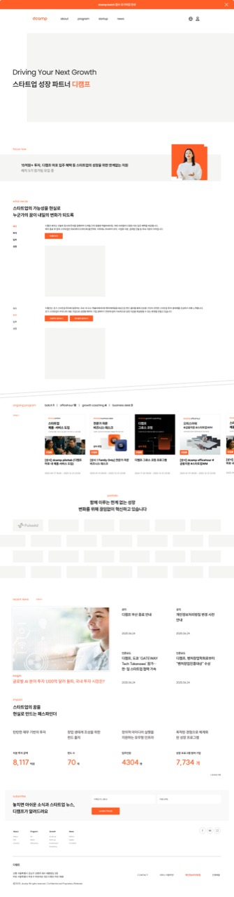

# 0. 메인 화면

## 화면 정보

| 항목 | 내용 |
|------|------|
| 화면 ID | 0000 |
| 화면명 | 메인 (Main) |
| 화면 경로 | / |
| 이미지 | [00_MAIN.jpg](./page-list/00_MAIN.jpg) |

---

## 화면 미리보기

---

## 화면 구성

| 순서 | 섹션명 | 설명 | 비고 |
|------|--------|------|------|
| 1 | 상단 안내 바 | 공지/이벤트 안내 (닫기 가능) | |
| 2 | 헤더 | 로고, 메뉴(about/program/startup/news), 검색/로그인 | |
| 3 | 히어로 | 메인 카피 "Driving Your Next Growth" | |
| 4 | About | 디칠프 소개 섹션 | |
| 5 | What we do | 활동 소개 섹션 | |
| 6 | Ongoing Program | 진행 중인 프로그램 카드 (탭 필터) | |
| 7 | Partnership | 파트너사/후원사 소개 | → 구현: Collaboration |
| 8 | Latest News | 최신 뉴스 리스트 | → 구현: News |
| 9 | Statistics | 주요 통계 (투자액, 펀드, 지원인원 등) | → 구현: Impact |
| 10 | Newsletter | 뉴스레터 구독 | 삭제됨 |
| 11 | 푸터 | 연락처, 링크, 저작권 | |

---

## 주요 기능

- 상단 안내 바: 클릭 시 상세 페이지 이동, X 버튼으로 닫기
- 프로그램 섹션: 탭으로 카테고리 필터링
- 뉴스레터: 이메일 입력 후 구독
- 통계: 숫자 카운팅 애니메이션

---

## 연관 화면

| 화면 ID | 화면명 | 연결 |
|---------|--------|------|
| 0101~0102 | About | 메뉴 |
| 0201~0209 | Program | 메뉴, 카드 클릭 |
| 0300 | Startup | 메뉴 |
| 0401~0402 | News | 메뉴, 뉴스 클릭 |
| 0501 | 로그인 | 헤더 아이콘 |
| 0601 | Contact | 푸터 |
