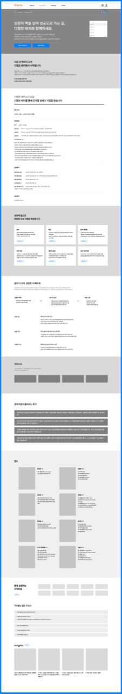
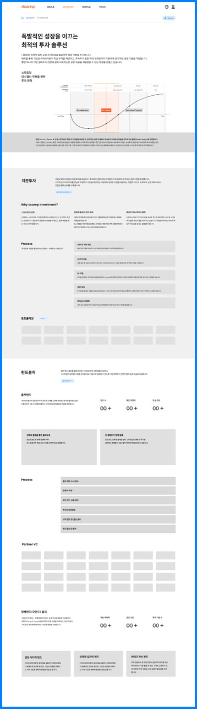
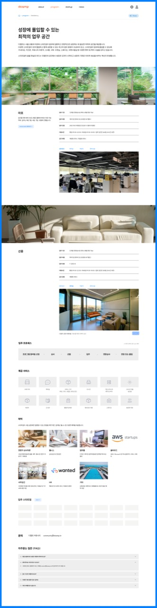
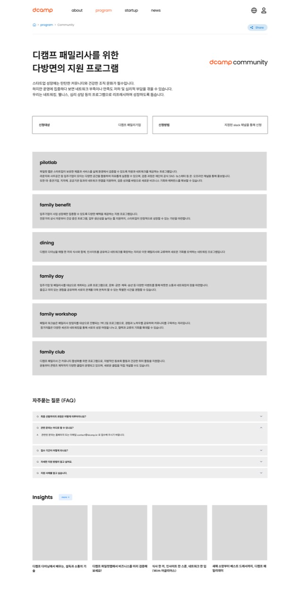
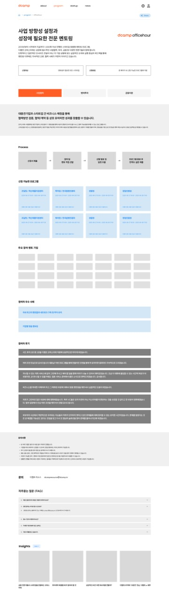
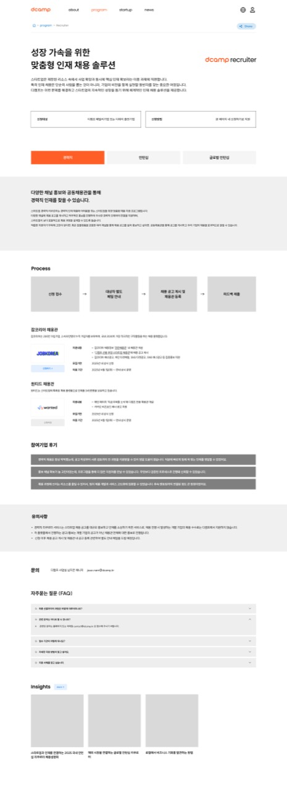
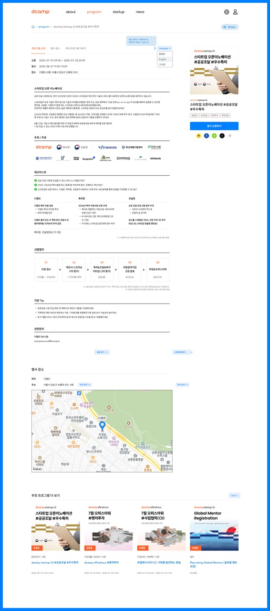
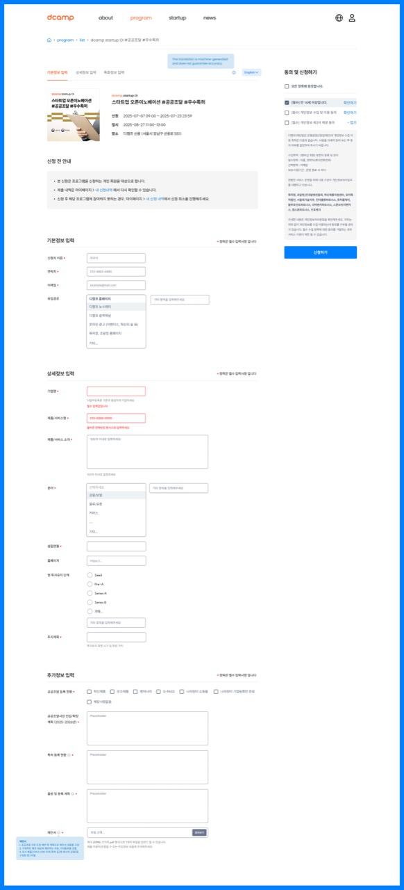
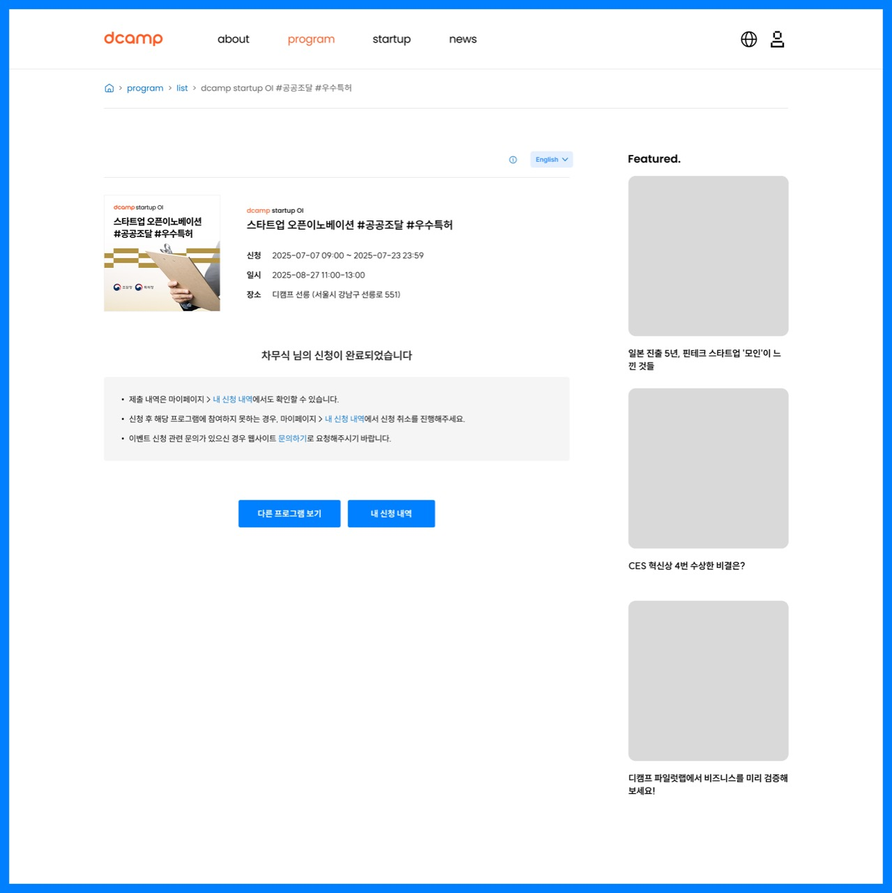

# 2. 프로그램 (Program)

## 개요

디캠프의 다양한 지원 프로그램을 소개하는 페이지들

---

## 2-1. Batch (0201)

### 화면 정보

| 항목 | 내용 |
|------|------|
| 화면 ID | 0201 |
| 화면명 | Batch |
| 화면 경로 | /program/batch |
| 이미지 | [0201_PROGRAM-Batch.jpg](./page-list/0201_PROGRAM-Batch.jpg) |

### 화면 미리보기

### 화면 구성

| 순서 | 섹션명 | 설명 |
|------|--------|------|
| 1 | 히어로 | "성장의 벽을 넘어 성공으로 가는 길, 디캠프 배치와 함께하세요" |
| 2 | 다음 단계로의 도약 | 디캠프 배치에서 시작됩니다 |
| 3 | 디캠프 배치 소개 | 배치를 통해 도약할 남다른 기업을 찾습니다 |
| 4 | 성장에 필요한 | 맞춤형 프로그램 제공 (멘토링, 네트워킹, 투자연계 등) |
| 5 | 졸업 기업 소개 | 성공한 졸업기업 사례 |
| 6 | 패밀리사 | 함께하는 패밀리사 목록 |
| 7 | 멘토 | 전문 멘토 소개 |
| 8 | 함께 성장하는 스타트업 | 현재 배치 참여 기업 소개 |
| 9 | Insights | 관련 콘텐츠 |

### 주요 기능

- 배치 신청하기 CTA 버튼
- 졸업 기업 필터링/검색
- 멘토 프로필 보기

### 타겟 그룹

스타트업

---

## 2-2. Investment (0202)

### 화면 정보

| 항목 | 내용 |
|------|------|
| 화면 ID | 0202 |
| 화면명 | Investment |
| 화면 경로 | /program/investment |
| 이미지 | [0202_PROGRAM-Investment.jpg](./page-list/0202_PROGRAM-Investment.jpg) |

### 화면 미리보기

### 화면 구성

| 순서 | 섹션명 | 설명 |
|------|--------|------|
| 1 | 히어로 | "폭발적인 성장을 이끄는 최적의 투자 솔루션" |
| 2 | 스테이지 | Pre-Seed ~ Venture Capital 단계별 투자 안내 |
| 3 | 지분투자 | Why dcamp investment?, Process 설명 |
| 4 | 포트폴리오 | 투자 포트폴리오 기업 |
| 5 | 펀드출자 | 출자펀드, Process, Partner VC |
| 6 | 함께펀드(모펀드) 출자 | 펀드 규모, 투자 기업 수 통계 |
| 7 | 상장 사례 펀드 | 성과 사례 |

### 주요 기능

- 투자 단계별 탭 전환 (Accelerator, Seed, Venture Capital)
- 포트폴리오 기업 보기
- 통계 카운팅 애니메이션

### 타겟 그룹

스타트업, VC

---

## 2-3. Residency (0203)

### 화면 정보

| 항목 | 내용 |
|------|------|
| 화면 ID | 0203 |
| 화면명 | Residency |
| 화면 경로 | /program/residency |
| 이미지 | [0203_PROGRAM-Residency.jpg](./page-list/0203_PROGRAM-Residency.jpg) |

> **비고**: 실제 구현에서는 `/program/space`로 경로가 변경되었습니다.

### 화면 미리보기

### 화면 구성

| 순서 | 섹션명 | 설명 |
|------|--------|------|
| 1 | 히어로 | "성장에 몰입할 수 있는 최적의 업무 공간" |
| 2 | 마포 | 마포 캠퍼스 소개 (위치, 운영시간, 층별 안내) |
| 3 | 선릉 | 선릉 캠퍼스 소개 |
| 4 | 입주 프로세스 | 프로그램 참여자 선정 → 심사 → 선발 → 입주 → 멘토링/네트워킹 → 성장 지속 지원 |
| 5 | 제공 서비스 | 사무공간, 회의실, 라운지, 네트워킹 등 |
| 6 | 협력 | AWS, Wanted 등 파트너 혜택 |
| 7 | 입주 스타트업 | 현재 입주 기업 목록 |
| 8 | 문의 | 연락처, FAQ |

### 주요 기능

- 층별 시설 사진 갤러리
- 입주 신청 연결
- FAQ 아코디언

### 타겟 그룹

스타트업

---

## 2-4. Community (0204)

### 화면 정보

| 항목 | 내용 |
|------|------|
| 화면 ID | 0204 |
| 화면명 | Community |
| 화면 경로 | /program/community |
| 이미지 | [0204_PROGRAM-Community.jpg](./page-list/0204_PROGRAM-Community.jpg) |

### 화면 미리보기

### 화면 구성

| 순서 | 섹션명 | 설명 |
|------|--------|------|
| 1 | 히어로 | "디캠프 패밀리사를 위한 다방면의 지원 프로그램" (dcamp community) |
| 2 | 탭 메뉴 | 신청대상, 디캠프 패밀리사 기업, 신청방법, 지정된 slack 채널 통해 신청 |
| 3 | pilotlab | 스타트업 제품/서비스 실증 테스트 지원 |
| 4 | family benefit | 입주기업 대상 다양한 혜택 프로그램 |
| 5 | dining | 디캠프 다이닝 (식사/네트워킹) |
| 6 | family day | 패밀리 데이 행사 |
| 7 | family workshop | 워크숍 프로그램 |
| 8 | family club | 커뮤니티 클럽 활동 |
| 9 | FAQ | 자주 묻는 질문 |
| 10 | Insights | 관련 콘텐츠 |

### 주요 기능

- 각 프로그램별 설명 아코디언
- FAQ 아코디언
- Slack 채널 연결

### 타겟 그룹

디캠프 패밀리사 (입주기업)

---

## 2-5. Officehour (0205)

### 화면 정보

| 항목 | 내용 |
|------|------|
| 화면 ID | 0205 |
| 화면명 | Officehour |
| 화면 경로 | /program/officehour |
| 이미지 | [0205_PROGRAM-Officehour.jpg](./page-list/0205_PROGRAM-Officehour.jpg) |

### 화면 미리보기

### 화면 구성

| 순서 | 섹션명 | 설명 |
|------|--------|------|
| 1 | 히어로 | "사업 방향성 설정과 성장에 필요한 전문 멘토링" (dcamp officehour) |
| 2 | 탭 메뉴 | 신청대상, 멘토/심사 필요여부, 신청방법 등 |
| 3 | 사업멘토링/멘토자문 | 탭 전환 (사업멘토링 / 멘토자문 / 긴급자문) |
| 4 | Process | 신청서 제출 → 멘토링 기준 검토/매칭 → 멘토 일정 및 세부사항 조율 → 멘토링 진행 및 만족도 조사 |
| 5 | 신청 가능한 프로그램 | 프로그램 카드 목록 |
| 6 | 주요 참여 멘토 기업 | 멘토 기업 로고 |
| 7 | 참여자 우수 사례 | 성공 사례 |
| 8 | 참여자 후기 | 후기 카드 |
| 9 | 유의사항 | 신청 시 유의사항 |
| 10 | 문의 | 연락처, FAQ |
| 11 | Insights | 관련 콘텐츠 |

### 주요 기능

- 탭 전환 (사업멘토링/멘토자문/긴급자문)
- 프로그램 카드 클릭 시 상세 페이지
- FAQ 아코디언

### 타겟 그룹

스타트업

---

## 2-6. Growth Coaching (0206)

### 화면 정보

| 항목 | 내용 |
|------|------|
| 화면 ID | 0206 |
| 화면명 | Growth Coaching |
| 화면 경로 | /program/growth-coaching |
| 이미지 | [0206_PROGRAM-Growth Coaching.jpg](./page-list/0206_PROGRAM-Growth%20Coaching.jpg) |

### 화면 미리보기

### 화면 구성

| 순서 | 섹션명 | 설명 |
|------|--------|------|
| 1 | 히어로 | "각 분야 최고의 전문가와 함께 고속 성장하기" (dcamp growth coaching) |
| 2 | 탭 메뉴 | 신청대상, 디캠프 패밀리사만 신청 가능, 신청방법 등 |
| 3 | 소개 | 프로덕트, GTM, 사업 운영 등 핵심 영역 전문가 코칭 |
| 4 | Process | 신청서 제출 → 영역/분야 기준 검토/매칭 → 전문 일정 및 세부사항 조율 → 코칭 종료 후 만족도 조사 |
| 5 | 전문가 Pool | 프로덕트, GTM, 디자인 분야별 전문가 소개 |
| 6 | 참여기업 후기 | 후기 카드 |
| 7 | 유의사항 | 신청 시 유의사항 |
| 8 | 문의 | 연락처, FAQ |
| 9 | Insights | 관련 콘텐츠 |

### 주요 기능

- 분야별 전문가 프로필 보기
- 코칭 신청하기 CTA
- FAQ 아코디언

### 타겟 그룹

디캠프 패밀리사

---

## 2-7. Business Desk (0207)

### 화면 정보

| 항목 | 내용 |
|------|------|
| 화면 ID | 0207 |
| 화면명 | Business Desk |
| 화면 경로 | /program/business-desk |
| 이미지 | [0207_PROGRAM-Business Desk.jpg](./page-list/0207_PROGRAM-Business%20Desk.jpg) |

### 화면 미리보기

### 화면 구성

| 순서 | 섹션명 | 설명 |
|------|--------|------|
| 1 | 히어로 | "다양한 사업분야의 문제 예방과 해결을 위한 전문 자문" (dcamp business desk) |
| 2 | 탭 메뉴 | 신청대상, 디캠프 패밀리사만 신청 가능, 신청방법 등 |
| 3 | Process | 상담 자문신청 접수 → 전문가 매칭(기관협업) + 자문 기업(협) → 자문 진행 → 피드백 제출 |
| 4 | 자문 분야 | 법률, 노무자문, 지식재산, 재무/회계(일반), 세무회계, 홍보 등 |
| 5 | 참여기업 후기 | 후기 카드 슬라이드 |
| 6 | 유의사항 | 신청 시 유의사항 |
| 7 | 문의 | 연락처, FAQ |
| 8 | Insights | 관련 콘텐츠 |

### 자문 분야 상세

| 분야 | 내용 |
|------|------|
| 법률 | 계약 검토, 분쟁 자문 등 |
| 노무자문 | 근로계약, 인사노무 관련 |
| 지식재산 | 특허, 상표, 디자인 출원 |
| 재무/회계 | 재무제표, 회계 감사 |
| 세무회계 | 세금 신고, 세무 조정 |
| 홍보 | PR, 마케팅 전략 |

### 주요 기능

- 분야별 자문 신청
- FAQ 아코디언

### 타겟 그룹

디캠프 패밀리사

---

## 2-8. Recruiter (0208)

### 화면 정보

| 항목 | 내용 |
|------|------|
| 화면 ID | 0208 |
| 화면명 | Recruiter |
| 화면 경로 | /program/recruiter |
| 이미지 | [0208_PROGRAM-Recruiter1.jpg](./page-list/0208_PROGRAM-Recruiter1.jpg) |

### 화면 미리보기

### 화면 구성

| 순서 | 섹션명 | 설명 |
|------|--------|------|
| 1 | 히어로 | "성장 가속을 위한 맞춤형 인재 채용 솔루션" (dcamp recruiter) |
| 2 | 탭 메뉴 | 신청대상, 디캠프 패밀리사 대상, 신청방법 등 |
| 3 | 탭 전환 | 공개채용 / 인턴십 / 글로벌 인턴십 |
| 4 | 소개 | 다양한 채널 홍보와 공동채용관을 통해 경력직 인재를 찾을 수 있습니다 |
| 5 | Process | 신청 접수 → 대상자 밸류업 채용 안내 → 채용 공고 게시 및 채용관 등록 → 피드백 제출 |
| 6 | 잡코리아 채용관 | 잡코리아 파트너십 |
| 7 | 원티드 채용관 | 원티드 파트너십 |
| 8 | 참여기업 후기 | 후기 카드 |
| 9 | 유의사항 | 신청 시 유의사항 |
| 10 | 문의 | 연락처, FAQ |
| 11 | Insights | 관련 콘텐츠 |

### 주요 기능

- 탭 전환 (공개채용/인턴십/글로벌 인턴십)
- 채용관 연결 (잡코리아, 원티드)
- FAQ 아코디언

### 타겟 그룹

디캠프 패밀리사

---

## 2-9. Startup OI (0209)

### 화면 정보

| 항목 | 내용 |
|------|------|
| 화면 ID | 0209 |
| 화면명 | Startup OI |
| 화면 경로 | /program/startup-oi |
| 이미지 | [0209_PROGRAM-Startup OI1.jpg](./page-list/0209_PROGRAM-Startup%20OI1.jpg) |

### 화면 미리보기

### 화면 구성

| 순서 | 섹션명 | 설명 |
|------|--------|------|
| 1 | 히어로 | "새로운 성장동력을 발굴하기 위한 혁신적인 전략" (dcamp startup OI) |
| 2 | 탭 메뉴 | 신청대상, 멘토/심사 필요여부, 신청방법 등 |
| 3 | 탭 전환 | IR / 글로벌 |
| 4 | 소개 | 국내 스타트업과 기업·기관을 연결해 새로운 협업과 성장을 만들어갈 수 있습니다 |
| 5 | Process | 신청 접수 → 제안서 1차 평가 → 참여 기업·기관 미팅/협업 신청 매칭 → 선발 스타트업 발표 → 미팅 |
| 6 | 공공조달 / 우수특허 | 공공조달 프로그램 안내 |
| 7 | 금융권 | 금융권 협업 프로그램 |
| 8 | CVC | CVC 연계 프로그램 |
| 9 | 참여 멤버 기업 | 참여 기업 로고 |
| 10 | 문의 | 연락처, FAQ |
| 11 | Insights | 관련 콘텐츠 |

### 주요 기능

- 탭 전환 (IR/글로벌)
- 각 프로그램별 신청하기 CTA
- FAQ 아코디언

### 타겟 그룹

스타트업, 대기업/기관 OI 담당자

---

## 2-10. 프로그램 상세 VIEW (02s)

### 화면 정보

| 항목 | 내용 |
|------|------|
| 화면 ID | 02s |
| 화면명 | 프로그램 상세 VIEW |
| 화면 경로 | /program/list/{id} |
| 이미지 | [02s_01-PROGRAM-VIEW.jpg](./page-list/02s_01-PROGRAM-VIEW.jpg) |

### 화면 미리보기

### 화면 구성

| 순서 | 섹션명 | 설명 |
|------|--------|------|
| 1 | 브레드크럼 | 홈 > program > list > 프로그램명 |
| 2 | 프로그램 정보 | 썸네일, 프로그램명, 신청기간, 일시, 장소 |
| 3 | 주최/주관 | 디캠프 및 파트너 로고 |
| 4 | 체크리스트 | 참가 조건, 주의사항 등 |
| 5. | 디테일 | 프로그램 상세 정보 (특허권, 조달청 등) |
| 6 | 선발일정 | 단계별 일정 타임라인 |
| 7 | 지원 Tip | 지원 시 도움되는 팁 |
| 8 | 관련문의 | 담당자 연락처 |
| 9 | 행사 장소 | 지도 및 주소 |
| 10 | 추천 프로그램 더 보기 | 관련 프로그램 카드 |

### 주요 기능

- 참가 신청하기 CTA 버튼
- 지도 연동 (카카오맵)
- 공유하기 (SNS)
- 관심 프로그램 저장

### 타겟 그룹

스타트업

---

## 2-11. 프로그램 신청 (02s-apply)

### 화면 정보

| 항목 | 내용 |
|------|------|
| 화면 ID | 02s-apply |
| 화면명 | 프로그램 신청 |
| 화면 경로 | /program/list/{id}/apply |
| 이미지 | [02s_PROGRAM-_APPLY.jpg](./page-list/02s_PROGRAM-_APPLY.jpg) |

### 화면 미리보기

### 화면 구성

| 순서 | 섹션명 | 설명 |
|------|--------|------|
| 1 | 탭 메뉴 | 기본정보 입력 / 상세정보 입력 / 추가정보 입력 |
| 2 | 프로그램 정보 | 썸네일, 프로그램명, 신청기간, 일시, 장소 |
| 3 | 신청 전 안내 | 개인 회원만 신청 가능, 마이페이지에서 확인 등 |
| 4 | 기본정보 입력 | 신청자 이름, 연락처, 이메일, 취업현황 |
| 5 | 상세정보 입력 | 기업명, 제품/서비스 소개, 분야, 설립연도, 홈페이지, 투자유치 현황 등 |
| 6 | 추가정보 입력 | 공공정보 등록 현황, 공공조달시장 진입/확장 계획, 특허 등록 현황, 참여 및 출품 배경 |
| 7 | 동의 및 신청하기 | 개인정보 수집/이용 동의, 제3자 제공 동의 |

### 입력 필드

| 섹션 | 필드명 | 필수 |
|------|--------|------|
| 기본정보 | 신청자 이름 | Y |
| 기본정보 | 연락처 | Y |
| 기본정보 | 이메일 | Y |
| 기본정보 | 취업현황 | Y |
| 상세정보 | 기업명 | Y |
| 상세정보 | 제품/서비스명 | Y |
| 상세정보 | 제품/서비스 소개 | Y |
| 상세정보 | 분야 | Y |
| 상세정보 | 설립연도 | N |
| 상세정보 | 홈페이지 | N |
| 상세정보 | 투자유치 현황 | N |
| 상세정보 | 투자액 | N |

### 주요 기능

- 탭 단계별 입력
- 입력값 유효성 검사
- 임시저장
- 동의 체크박스

### 타겟 그룹

스타트업

---

## 2-12. 프로그램 신청 완료 (02s-done)

### 화면 정보

| 항목 | 내용 |
|------|------|
| 화면 ID | 02s-done |
| 화면명 | 프로그램 신청 완료 |
| 화면 경로 | /program/list/{id}/apply/done |
| 이미지 | [02s__PROGRAM-_APPLY-DONE.jpg](./page-list/02s__PROGRAM-_APPLY-DONE.jpg) |

### 화면 미리보기

### 화면 구성

| 순서 | 섹션명 | 설명 |
|------|--------|------|
| 1 | 완료 메시지 | "OOO 님의 신청이 완료되었습니다" |
| 2 | 프로그램 정보 | 썸네일, 프로그램명, 신청기간, 일시, 장소 |
| 3 | 안내사항 | 마이페이지에서 확인, 신청 취소 방법, 문의하기 연결 |
| 4 | CTA 버튼 | 다른 프로그램 보기, 내 신청 내역 |
| 5 | Featured | 관련 콘텐츠 추천 |

### 주요 기능

- 다른 프로그램 보기 버튼
- 내 신청 내역 버튼 (마이페이지 연결)

### 타겟 그룹

스타트업

---

## 연관 화면

| 화면 ID | 화면명 | 연결 |
|---------|--------|------|
| 0000 | 메인 | 헤더 메뉴 |
| 0102 | What we do | 사업 영역 카드 |
| 0506 | 내 신청내역 | 신청 완료 후 연결 |
| 0507 | 내 신청내역 상세 | 마이페이지 연결 |

