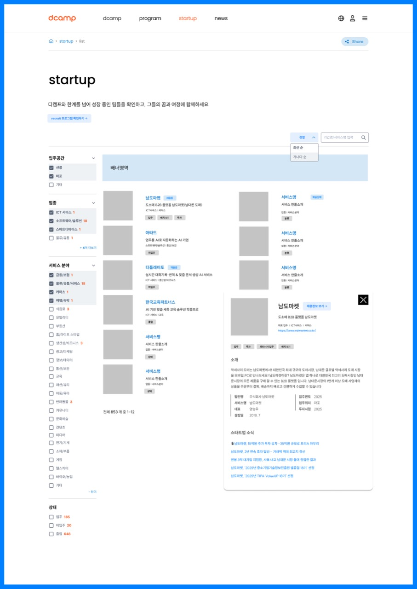

# 3. 스타트업 (Startup)

## 개요

디캠프와 함께 성장 중인 스타트업들을 소개하는 페이지

---

## 3-1. 스타트업 목록 (0300)

### 화면 정보

| 항목 | 내용 |
|------|------|
| 화면 ID | 0300 |
| 화면명 | Startup |
| 화면 경로 | /startup/list |
| 이미지 | [03_STARTUP.jpg](./page-list/03_STARTUP.jpg) |

> **비고**: 실제 구현에서는 `/startups`로 경로가 변경되었습니다.

### 화면 미리보기

### 화면 구성

| 순서 | 섹션명 | 설명 |
|------|--------|------|
| 1 | 히어로 | "디캠프와 한계를 넘어 성장 중인 팀들을 확인하고, 그들의 꿈과 여정에 함께하세요" |
| 2 | recruit 프로그램 확인하기 | 채용 프로그램 연결 버튼 |
| 3 | 필터 (좌측) | 입주공간, 업종, 서비스 분야, 상태 필터 |
| 4 | 정렬/검색 (우측 상단) | 정렬 (최신순/가나다순), 기업명/서비스명 검색 |
| 5 | 배너영역 | 프로모션 배너 |
| 6 | 스타트업 카드 목록 | 기업 카드 그리드 |
| 7 | 스타트업 상세 팝업 | 카드 클릭 시 상세 정보 모달 |

### 필터 옵션

| 필터명 | 옵션 |
|--------|------|
| 입주공간 | 선릉, 마포, 기타 |
| 업종 | ICT 서비스, 소프트웨어/솔루션, 스마트디바이스, 물류/유통 등 |
| 서비스 분야 | 금융/보험, 물류/유통/서비스, 커머스, 여행/숙박, 식음료, 모빌리티, 부동산, 홈/라이프 스타일, 생산성/비즈니스, 광고/마케팅, 정보/데이터, 통신/보안, 교육, 패션/뷰티, 아동/육아, 반려동물, 커뮤니티, 문화/예술, 콘텐츠, 미디어, 전기/기계, 소재/부품, 게임, 헬스케어, 바이오/농업, 기타 |
| 상태 | 입주 (185), 미입주 (20), 졸업 (648) |

### 스타트업 카드 정보

| 항목 | 설명 |
|------|------|
| 썸네일 | 기업 로고/이미지 |
| 기업명 | 스타트업 이름 |
| 태그 | 채용중, 투자유치 등 |
| 한줄 소개 | 서비스 설명 |
| 분야 | ICT서비스, 서비스/플랫폼 등 |
| 키워드 | 입주, 배치5기, 배치7기 등 |

### 스타트업 상세 팝업 정보

| 항목 | 설명 |
|------|------|
| 기업명 | 스타트업 이름 + 채용정보 보기 버튼 |
| 서비스 소개 | 서비스 상세 설명 |
| 소개 | 기업 소개 텍스트 |
| 기본 정보 | 법인명, 서비스명, 대표, 설립일 |
| 입주 정보 | 입주연도, 입주위치, 투자시점 |
| 스타트업 소식 | 관련 뉴스 링크 목록 |

### 주요 기능

- 다중 필터 적용 (체크박스)
- 정렬 변경 (최신순/가나다순)
- 키워드 검색
- 카드 클릭 시 상세 팝업 (모달)
- 채용정보 보기 연결
- 공유하기

### 타겟 그룹

스타트업, 협력/지원 관계자, 구직자, 일반 이용자

---

## 연관 화면

| 화면 ID | 화면명 | 연결 |
|---------|--------|------|
| 0000 | 메인 | 헤더 메뉴 |
| 0208 | Recruiter | recruit 프로그램 확인하기 버튼 |
| 0401 | Notice | 스타트업 소식 링크 |

