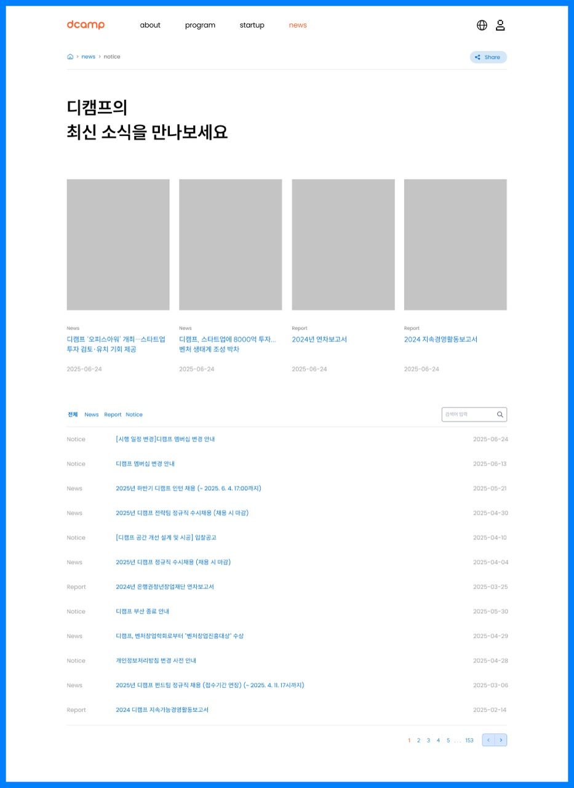
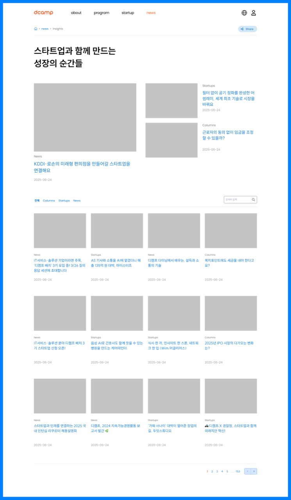
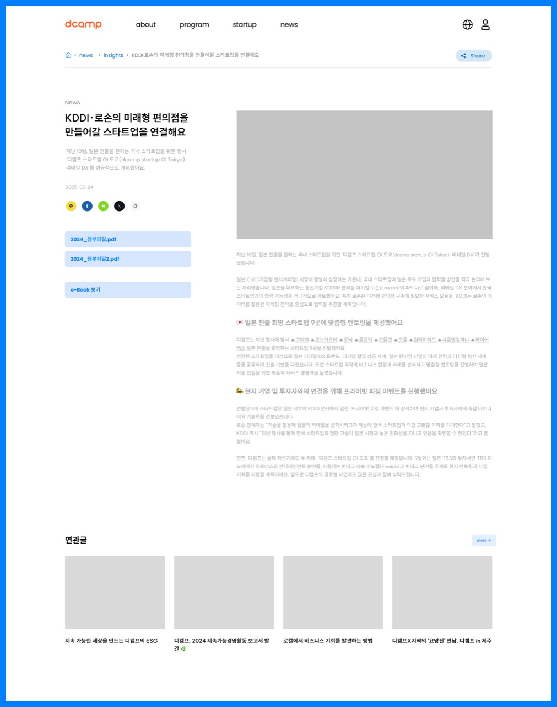

# 4. 소식 (News)

## 개요

디캠프의 공지사항, 인사이트, 보고서 등 소식을 전하는 페이지들

---

## 4-1. Notice (0401)

### 화면 정보

| 항목 | 내용 |
|------|------|
| 화면 ID | 0401 |
| 화면명 | Notice |
| 화면 경로 | /news/notice |
| 이미지 | [0401_NEWS-Notice.jpg](./page-list/0401_NEWS-Notice.jpg) |

### 화면 미리보기

### 화면 구성

| 순서 | 섹션명 | 설명 |
|------|--------|------|
| 1 | 히어로 | "디캠프의 최신 소식을 만나보세요" |
| 2 | 주요 콘텐츠 카드 | 상단 4개 카드 (News, Report 등) |
| 3 | 탭 필터 | 전체 / News / Report / Notice |
| 4 | 검색 | 검색어 입력 |
| 5 | 리스트 | 소식 목록 (카테고리, 제목, 날짜) |
| 6 | 페이지네이션 | 1, 2, 3, 4, 5 ... 153 |

### 카드/리스트 정보

| 항목 | 설명 |
|------|------|
| 카테고리 | News, Report, Notice |
| 썸네일 | 콘텐츠 대표 이미지 |
| 제목 | 소식 제목 |
| 날짜 | 게시일 (YYYY-MM-DD) |

### 카테고리 설명

| 카테고리 | 설명 |
|----------|------|
| News | 디캠프 관련 뉴스, 언론보도 |
| Report | 연차보고서, 지속경영활동보고서 등 |
| Notice | 공지사항, 채용공고, 입찰공고 등 |

### 주요 기능

- 탭 필터링 (전체/News/Report/Notice)
- 키워드 검색
- 페이지네이션
- 공유하기

### 타겟 그룹

스타트업, 협력/지원 관계자, 일반 이용자

---

## 4-2. Insight (0402)

### 화면 정보

| 항목 | 내용 |
|------|------|
| 화면 ID | 0402 |
| 화면명 | Insight |
| 화면 경로 | /news/insights |
| 이미지 | [0402_NEWS-Insight.jpg](./page-list/0402_NEWS-Insight.jpg) |

> **비고**: 실제 구현에서는 **Story**로 명칭이 변경되었으며, 경로는 `/news/story`입니다.

### 화면 미리보기

### 화면 구성

| 순서 | 섹션명 | 설명 |
|------|--------|------|
| 1 | 히어로 | "스타트업과 함께 만드는 성장의 순간들" |
| 2 | 메인 피처드 | 좌측 큰 카드 + 우측 작은 카드 2개 |
| 3 | 탭 필터 | 전체 / Columns / Startups / News |
| 4 | 검색 | 검색어 입력 |
| 5 | 카드 그리드 | 4열 카드 목록 |
| 6 | 페이지네이션 | 1, 2, 3, 4, 5 ... 153 |

### 카드 정보

| 항목 | 설명 |
|------|------|
| 카테고리 | Columns, Startups, News |
| 썸네일 | 콘텐츠 대표 이미지 |
| 제목 | 인사이트 제목 |
| 날짜 | 게시일 (YYYY-MM-DD) |

### 카테고리 설명

| 카테고리 | 설명 |
|----------|------|
| Columns | 디캠프 칼럼, 기고문 |
| Startups | 스타트업 소식, 성공 사례 |
| News | 관련 뉴스 |

### 주요 기능

- 탭 필터링 (전체/Columns/Startups/News)
- 키워드 검색
- 카드 그리드 레이아웃
- 페이지네이션
- 공유하기

### 타겟 그룹

스타트업, 협력/지원 관계자, 일반 이용자

---

## 4-3. 소식 상세 VIEW (04s)

### 화면 정보

| 항목 | 내용 |
|------|------|
| 화면 ID | 04s |
| 화면명 | 소식 상세 VIEW |
| 화면 경로 | /news/insights/{id} 또는 /news/notice/{id} |
| 이미지 | [04s_NEWS-공통_VIEW.jpg](./page-list/04s_NEWS-공통_VIEW.jpg) |

### 화면 미리보기

### 화면 구성

| 순서 | 섹션명 | 설명 |
|------|--------|------|
| 1 | 브레드크럼 | 홈 > news > insights > 글 제목 |
| 2 | 카테고리 | News, Columns 등 |
| 3 | 제목 | 소식 제목 |
| 4 | 요약 | 소식 요약문 |
| 5 | 날짜 | 게시일 |
| 6 | 공유 버튼 | 카카오톡, 페이스북, 네이버, X, 링크복사 |
| 7 | 첨부파일 | PDF 다운로드 버튼 |
| 8 | e-Book 보기 | e-Book 뷰어 연결 |
| 9 | 본문 | 소식 상세 내용 (이미지, 텍스트) |
| 10 | 연관글 | 관련 콘텐츠 카드 4개 |

### 공유 기능

| 채널 | 아이콘 |
|------|--------|
| 카카오톡 | 말풍선 |
| 페이스북 | f |
| 네이버 | N |
| X (트위터) | X |
| 링크복사 | 링크 |

### 주요 기능

- SNS 공유 (카카오톡, 페이스북, 네이버, X)
- 링크 복사
- 첨부파일 다운로드 (PDF)
- e-Book 뷰어
- 연관글 추천

### 타겟 그룹

스타트업, 협력/지원 관계자, 일반 이용자

---

## 연관 화면

| 화면 ID | 화면명 | 연결 |
|---------|--------|------|
| 0000 | 메인 | 헤더 메뉴, Latest News 섹션 |
| 0300 | Startup | 스타트업 소식 링크 |

