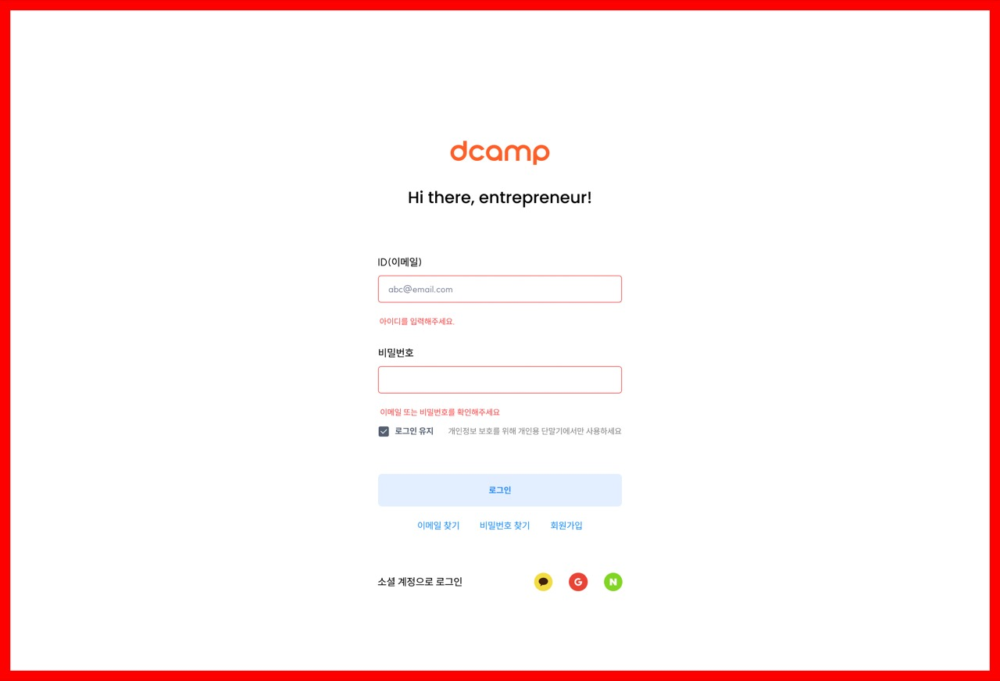

# 5. 회원 (User)

## 개요

로그인, 회원가입, 마이페이지 등 회원 관련 페이지들

---

## 5-1. 로그인 (0501)

### 화면 정보

| 항목 | 내용 |
|------|------|
| 화면 ID | 0501 |
| 화면명 | Login |
| 화면 경로 | /user/login |
| 이미지 | [0501-[USER]-LOGIN.jpg](./page-list/0501-[USER]-LOGIN.jpg) |

### 화면 미리보기

### 화면 구성

| 순서 | 섹션명 | 설명 |
|------|--------|------|
| 1 | 로고 | dcamp 로고 |
| 2 | 인사말 | "Hi there, entrepreneur!" |
| 3 | 로그인 폼 | ID(이메일), 비밀번호 입력 |
| 4 | 로그인 유지 | 체크박스 (개인정보 보호를 위해 개인용 단말기에서만 사용하세요) |
| 5 | 로그인 버튼 | 로그인 CTA |
| 6 | 링크 | 이메일 찾기, 비밀번호 찾기, 회원가입 |
| 7 | 소셜 로그인 | 카카오톡, Google, 네이버 |

### 입력 필드

| 필드명 | 타입 | 필수 | 설명 |
|--------|------|------|------|
| ID(이메일) | email | Y | abc@email.com |
| 비밀번호 | password | Y | 비밀번호 입력 |

### 주요 기능

- 이메일/비밀번호 로그인
- 소셜 로그인 (카카오, Google, 네이버)
- 로그인 유지 옵션
- 유효성 검사 (아이디를 입력해주세요, 이메일 또는 비밀번호를 확인해주세요)

### 타겟 그룹

스타트업, 일반 이용자

---

## 5-2. 아이디 찾기 (0502)

### 화면 정보

| 항목 | 내용 |
|------|------|
| 화면 ID | 0502 |
| 화면명 | Find ID |
| 화면 경로 | /user/find-id |
| 이미지 | [0502-[USER]-FIND ID.jpg](./page-list/0502-[USER]-FIND%20ID.jpg) |

### 화면 미리보기

### 화면 구성

| 순서 | 섹션명 | 설명 |
|------|--------|------|
| 1 | 로고 | dcamp 로고 |
| 2 | 타이틀 | "Find ID" |
| 3 | 입력 폼 | 이름, 가입 연락처(휴대전화) |
| 4 | 이메일 찾기 버튼 | 찾기 CTA |
| 5 | 결과 표시 | "입력하신 정보로 등록된 아이디는 다음과 같습니다" + 마스킹된 이메일 |
| 6 | 링크 | 로그인, 비밀번호 찾기 |

### 입력 필드

| 필드명 | 타입 | 필수 | 설명 |
|--------|------|------|------|
| 이름 | text | Y | 가입 시 사용한 이름 |
| 가입 연락처(휴대전화) | tel | Y | 010-0000-0000 |

### 주요 기능

- 이름 + 휴대전화로 이메일 찾기
- 결과 마스킹 처리 (**@skunkworks.co.kr)
- 유효성 검사 (필수 입력항목 입니다, 입력하신 정보에 해당하는 계정이 없습니다)

### 타겟 그룹

스타트업, 일반 이용자

---

## 5-3. 비밀번호 찾기 (0503)

### 화면 정보

| 항목 | 내용 |
|------|------|
| 화면 ID | 0503 |
| 화면명 | Find Password |
| 화면 경로 | /user/find-password |
| 이미지 | [0503-[USER]-FIND PW.jpg](./page-list/0503-[USER]-FIND%20PW.jpg) |

### 화면 미리보기

### 화면 구성

| 순서 | 섹션명 | 설명 |
|------|--------|------|
| 1 | 로고 | dcamp 로고 |
| 2 | 타이틀 | "Find password" |
| 3 | 안내문 | 회원가입 시 등록한 이메일 주소를 입력하면, 신규 비밀번호 및 비밀번호 재설정 지침을 이메일로 보내드립니다 |
| 4 | 입력 폼 | 가입 ID(이메일) |
| 5 | 비밀번호 찾기 버튼 | 찾기 CTA |

### 입력 필드

| 필드명 | 타입 | 필수 | 설명 |
|--------|------|------|------|
| 가입 ID(이메일) | email | Y | abc@email.com |

### 주요 기능

- 이메일로 비밀번호 재설정 링크 발송
- 유효성 검사 (입력하신 정보에 해당하는 계정이 없습니다)

### 타겟 그룹

스타트업, 일반 이용자

---

## 5-4. 회원가입 (0504)

### 화면 정보

| 항목 | 내용 |
|------|------|
| 화면 ID | 0504 |
| 화면명 | Sign Up |
| 화면 경로 | /user/register |
| 이미지 | [0504-[USER]-SIGN UP.jpg](./page-list/0504-[USER]-SIGN%20UP.jpg) |

### 화면 미리보기

### 화면 구성

| 순서 | 섹션명 | 설명 |
|------|--------|------|
| 1 | 타이틀 | "Sign up" |
| 2 | 소셜 회원가입 | 카카오톡, Google, 네이버 |
| 3 | 구분선 | "or" |
| 4 | 회원가입 폼 | ID, 이메일 인증, 이름, 비밀번호, 소속 |
| 5 | 약관 동의 | 필수/선택 약관 체크박스 |
| 6 | 회원가입 버튼 | 가입 CTA |
| 7 | 푸터 | dcamp 로고 + "Driving Your Next Growth" |

### 입력 필드

| 필드명 | 타입 | 필수 | 설명 |
|--------|------|------|------|
| ID(이메일) | email | Y | 중복 확인 필요 |
| 인증번호 | number | Y | 이메일로 인증번호 발송, 6자리 입력 |
| 이름 | text | Y | 이름 입력 |
| 비밀번호 | password | Y | 6~20자의 알파벳+숫자+특수문자(@,$,!,%,*,#,?,&) 조합 |
| 소속(회사명) | select | N | 선택사항 |

### 약관 동의

| 항목 | 필수 | 내용보기 |
|------|------|----------|
| 만 14세 이상입니다 | Y | - |
| 이용약관 동의 | Y | 내용보기 |
| 개인정보 수집 및 이용동의 | Y | 내용보기 |
| 홍보 및 마케팅 정보 수신 동의(뉴스레터) | N | 내용보기 |

### 주요 기능

- 소셜 회원가입 (카카오, Google, 네이버)
- 이메일 중복 확인
- 이메일 인증번호 발송 (2분 타이머)
- 비밀번호 유효성 검사
- 약관 동의 체크

### 타겟 그룹

스타트업, 일반 이용자

---

## 5-5. 소셜로그인 후 동의절차 (0505)

### 화면 정보

| 항목 | 내용 |
|------|------|
| 화면 ID | 0505 |
| 화면명 | 소셜로그인 후 동의절차 |
| 화면 경로 | /user/register/social |
| 이미지 | [0505-[USER]-SIGN UP_소셜로그인 후 동의절차.jpg](./page-list/0505-[USER]-SIGN%20UP_소셜로그인%20후%20동의절차.jpg) |

### 화면 미리보기

### 화면 구성

| 순서 | 섹션명 | 설명 |
|------|--------|------|
| 1 | 타이틀 | "Sign up" |
| 2 | 가입한 소셜 계정 | 카카오톡, Google, 네이버 아이콘 표시 |
| 3 | 회원정보 | ID(이메일), 이름 (소셜에서 가져온 정보, 읽기전용) |
| 4 | 소속(회사명) | 선택사항 입력 |
| 5 | 약관 동의 | 필수/선택 약관 체크박스 |
| 6 | 회원가입 버튼 | 가입 CTA |
| 7 | 푸터 | dcamp 로고 + "Driving Your Next Growth" |

### 주요 기능

- 소셜 계정에서 가져온 정보 자동 입력
- 추가 정보 입력 (소속)
- 약관 동의 체크

### 타겟 그룹

스타트업, 일반 이용자

---

## 5-6. 내 신청내역 목록 (0506)

### 화면 정보

| 항목 | 내용 |
|------|------|
| 화면 ID | 0506 |
| 화면명 | 내 신청내역 목록 |
| 화면 경로 | /mypage/applications |
| 이미지 | [0506-[USER]-MY PAGE-내 신청내역_LIST.jpg](./page-list/0506-[USER]-MY%20PAGE-내%20신청내역_LIST.jpg) |

### 화면 미리보기

### 화면 구성

| 순서 | 섹션명 | 설명 |
|------|--------|------|
| 1 | 타이틀 | "My page" |
| 2 | 좌측 메뉴 | 내 신청내역, 내 문의내역, 회원정보 |
| 3 | 신청 목록 | 프로그램 유형, 프로그램명, 날짜, 상태 |
| 4 | 페이지네이션 | 1, 2, 3, 4, 5 ... 153 |

### 목록 정보

| 항목 | 설명 |
|------|------|
| 프로그램 유형 | dcamp batch, officehour, business desk, startup OI 등 |
| 프로그램명 | 신청한 프로그램 제목 |
| 날짜 | 신청일 (YYYY-MM-DD) |
| 상태 | 접수중, 접수완료 |

### 주요 기능

- 신청 목록 조회
- 상태별 표시 (접수중/접수완료)
- 클릭 시 상세 페이지 이동

### 타겟 그룹

스타트업, 일반 이용자

---

## 5-7. 내 신청내역 상세 (0507)

### 화면 정보

| 항목 | 내용 |
|------|------|
| 화면 ID | 0507 |
| 화면명 | 내 신청내역 상세 |
| 화면 경로 | /mypage/applications/{id} |
| 이미지 | [0507-[USER]-MY PAGE-내 신청내역_VIEW.jpg](./page-list/0507-[USER]-MY%20PAGE-내%20신청내역_VIEW.jpg) |

### 화면 미리보기

### 화면 구성

| 순서 | 섹션명 | 설명 |
|------|--------|------|
| 1 | 프로그램 정보 | 프로그램 유형, 프로그램명, 최종제출일 |
| 2 | 기본정보 | 대표자명, 이메일주소, 휴대번호, 법인명, 서비스 한 줄 소개, 설립연월, 본사 소재지, 산업분야, 사업계획서/IR자료 |
| 3 | 상세정보 | 직전 투자시 기업가치, 금번 라운드 희망 기업가치, 투자유치규모, 희망 라운드 마무리 일정 |
| 4 | 추가정보 | 배치 프로그램을 통해 얻고싶은 것, 현재 기술의 개발 수준, 팀 전체인원, 홈페이지 주소 |
| 5 | 개인정보 동의 | 수집·이용 동의, 제3자 제공 동의 여부 |

### 주요 기능

- 신청 상세 정보 조회
- 첨부파일 다운로드 (사업계획서/IR자료)

### 타겟 그룹

스타트업, 일반 이용자

---

## 5-8. 내 문의내역 목록 (0508)

### 화면 정보

| 항목 | 내용 |
|------|------|
| 화면 ID | 0508 |
| 화면명 | 내 문의내역 목록 |
| 화면 경로 | /mypage/inquiries |
| 이미지 | [0508-[USER]-MY PAGE-내 문의내역_LIST.jpg](./page-list/0508-[USER]-MY%20PAGE-내%20문의내역_LIST.jpg) |

### 화면 미리보기

### 화면 구성

| 순서 | 섹션명 | 설명 |
|------|--------|------|
| 1 | 안내문 | 작성하신 문의 내역은 개인정보보호를 위해 답변 완료 후 30일이 지나면 자동 삭제됩니다 |
| 2 | 문의하기 버튼 | 새 문의 작성 |
| 3 | 문의 목록 | 문의 유형, 문의 제목, 날짜, 상태 |
| 4 | 페이지네이션 | 1, 2, 3, 4, 5 ... 153 |

### 목록 정보

| 항목 | 설명 |
|------|------|
| 문의 유형 | 일반 문의, 대관 문의, 방문 문의, 계정 문의 |
| 문의 제목 | 문의 내용 제목 |
| 날짜 | 문의일 (YYYY-MM-DD) |
| 상태 | 답변대기, 답변완료 |

### 주요 기능

- 문의 목록 조회
- 문의하기 버튼 (새 문의 작성)
- 상태별 표시 (답변대기/답변완료)

### 타겟 그룹

스타트업, 일반 이용자

---

## 5-9. 내 문의내역 상세 (0509)

### 화면 정보

| 항목 | 내용 |
|------|------|
| 화면 ID | 0509 |
| 화면명 | 내 문의내역 상세 |
| 화면 경로 | /mypage/inquiries/{id} |
| 이미지 | [0509-[USER]-MY PAGE-내 문의내역_VIEW.jpg](./page-list/0509-[USER]-MY%20PAGE-내%20문의내역_VIEW.jpg) |

### 화면 미리보기

### 화면 구성

| 순서 | 섹션명 | 설명 |
|------|--------|------|
| 1 | 문의내역 | 문의 유형, 문의 제목, 문의 날짜/시간 |
| 2 | 문의 내용 | 사용자가 작성한 문의 내용 |
| 3 | 답변내역 | 디캠프 답변, 답변 날짜 |

### 주요 기능

- 문의 상세 내용 조회
- 답변 확인

### 타겟 그룹

스타트업, 일반 이용자

---

## 5-10. 회원정보 (프로필) (0510)

### 화면 정보

| 항목 | 내용 |
|------|------|
| 화면 ID | 0510 |
| 화면명 | 회원정보 (Profile) |
| 화면 경로 | /mypage/profile |
| 이미지 | [0510-[USER]-MY PAGE-Profile.jpg](./page-list/0510-[USER]-MY%20PAGE-Profile.jpg) |

### 화면 미리보기

### 화면 구성

| 순서 | 섹션명 | 설명 |
|------|--------|------|
| 1 | ID(이메일) | 현재 이메일 (읽기전용 또는 변경 가능) |
| 2 | 이름 | 이름 입력 |
| 3 | 비밀번호 | 비밀번호 변경 (설정된 비밀번호는 이메일로 로그인 및 회원탈퇴 시 확인을 위해 사용됩니다) |
| 4 | 소속(회사명) | 선택사항 |
| 5 | 회원가입 방식 | 이메일 / 소셜 미디어 (Kakao, Google, Naver) |
| 6 | 마케팅 수신 동의 | 홍보 및 마케팅 정보 수신 동의(뉴스레터) |
| 7 | 회원탈퇴 | 탈퇴하기 링크 |
| 8 | 수정하기 버튼 | 정보 저장 |

### 이메일 변경 시

- 새 이메일 입력
- 중복 확인
- 이메일로 인증번호 발송
- 인증번호 6자리 입력 후 인증하기

### 주요 기능

- 회원정보 조회/수정
- 이메일 변경 (인증 필요)
- 비밀번호 변경
- 마케팅 수신 동의 변경
- 회원탈퇴 연결

### 타겟 그룹

스타트업, 일반 이용자

---

## 5-11. 회원탈퇴 (0511)

### 화면 정보

| 항목 | 내용 |
|------|------|
| 화면 ID | 0511 |
| 화면명 | 회원탈퇴 |
| 화면 경로 | /mypage/profile (모달) |
| 이미지 | [0511__[USER]-MY PAGE-Profile_탈퇴하기.jpg](./page-list/0511__[USER]-MY%20PAGE-Profile_탈퇴하기.jpg) |

### 화면 미리보기

### 화면 구성 (모달)

| 순서 | 섹션명 | 설명 |
|------|--------|------|
| 1 | 타이틀 | "회원 탈퇴를 원하시나요?" |
| 2 | 안내사항 | 탈퇴 후 복구 불가, 동일한 이메일로 재가입 가능 |
| 3 | 보관 안내 | 전자상거래법 등 관계 법령에 따라 거래 관련 기록은 최대 5년간 보관 |
| 4 | 게시물 안내 | 회원이 작성한 게시물, 댓글 등은 탈퇴 후에도 삭제되지 않음 |
| 5 | 동의 체크박스 | "안내사항을 모두 확인하였으며, 이에 동의합니다" |
| 6 | 탈퇴사유 (선택) | "알려주신 의견을 토대로 더욱 개선하겠습니다" 텍스트 입력 |
| 7 | 버튼 | 회원탈퇴, 취소 |

### 주요 기능

- 탈퇴 안내사항 확인
- 동의 체크 후 탈퇴 가능
- 탈퇴사유 입력 (선택)

### 타겟 그룹

스타트업, 일반 이용자

---

## 연관 화면

| 화면 ID | 화면명 | 연결 |
|---------|--------|------|
| 0000 | 메인 | 헤더 로그인 아이콘 |
| 02s-apply | 프로그램 신청 | 로그인 필요 |
| 0506~0507 | 내 신청내역 | 프로그램 신청 완료 후 |
| 0602 | Contact Form | 문의하기 연결 |

