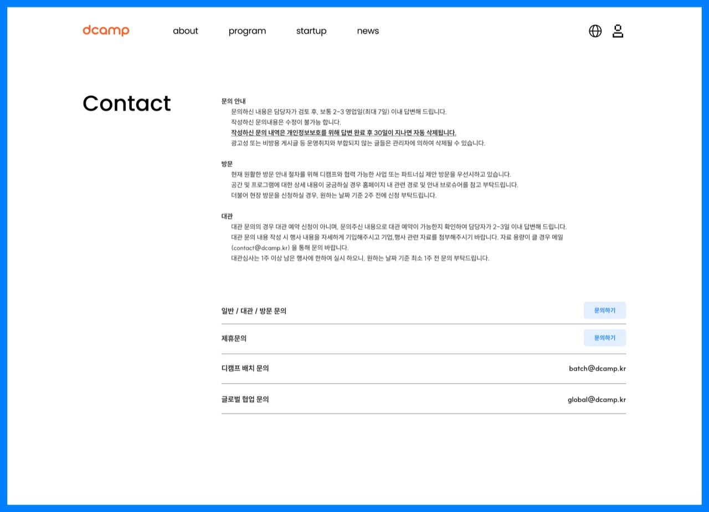
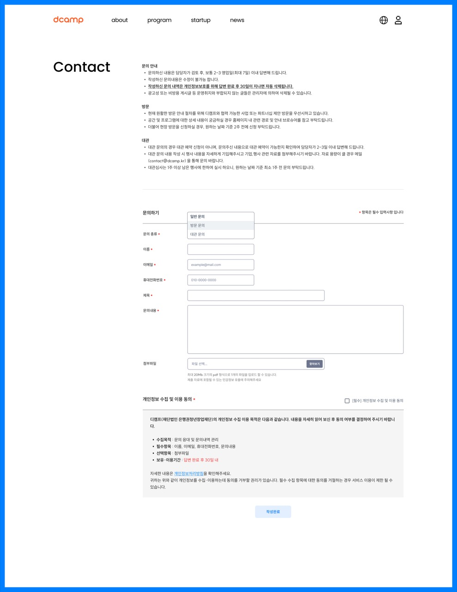
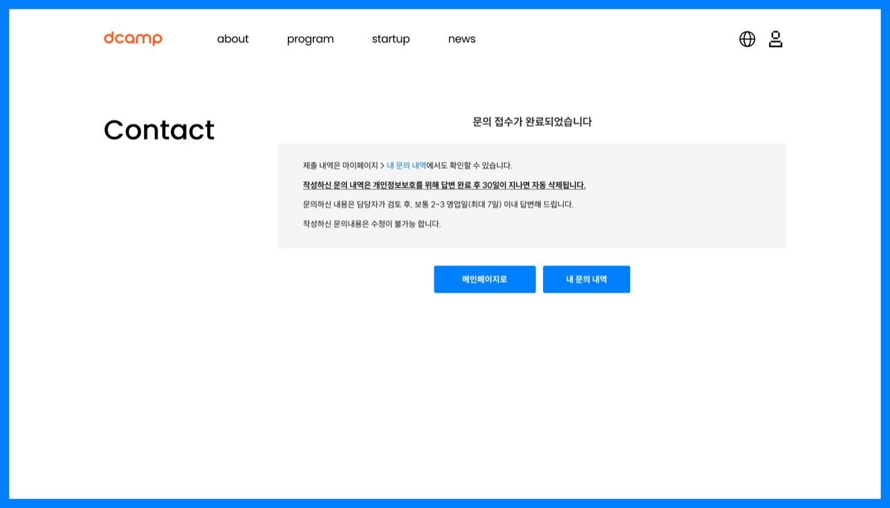
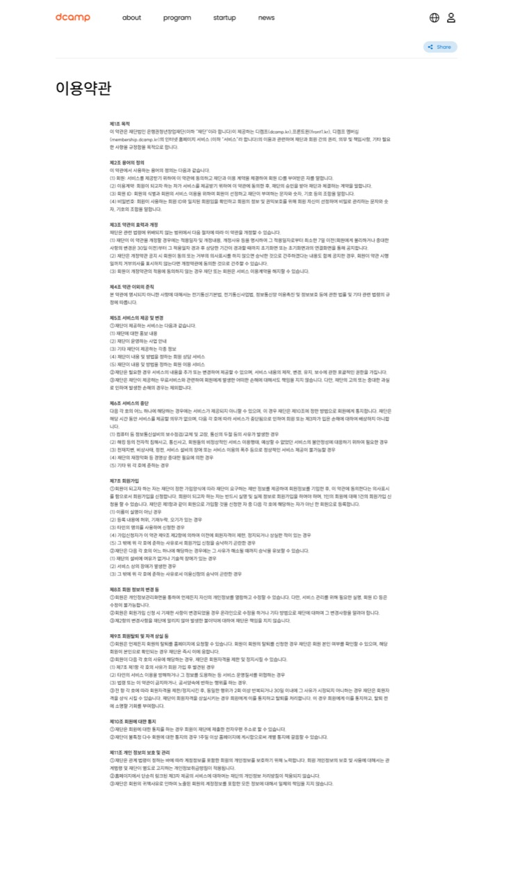
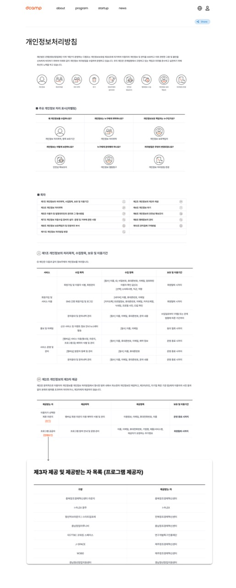

# 6. 푸터 (Footer)

## 개요

문의하기, 이용약관, 개인정보처리방침 등 푸터 영역에서 접근하는 페이지들

---

## 6-1. Contact (0601)

### 화면 정보

| 항목 | 내용 |
|------|------|
| 화면 ID | 0601 |
| 화면명 | Contact |
| 화면 경로 | /contact |
| 이미지 | [0601-[FOOTER]-CONTACT.jpg](./page-list/0601-[FOOTER]-CONTACT.jpg) |

### 화면 미리보기

### 화면 구성

| 순서 | 섹션명 | 설명 |
|------|--------|------|
| 1 | 히어로 | "Contact us" 타이틀 |
| 2 | 문의 유형 카드 | 유형별 문의 버튼 (일반 문의, 대관, IR, 후원, 채용 등) |
| 3 | 연락처 정보 | 전화번호, 이메일, 주소 |
| 4 | 지도 | 선릉/마포 캠퍼스 위치 |

### 문의 유형

| 유형 | 설명 | 연결 |
|------|------|------|
| 일반 문의 | 디캠프 관련 일반 문의 | Contact Form |
| 대관 문의 | 공간 대관 관련 문의 | Contact Form |
| IR 문의 | 투자/IR 관련 문의 | Contact Form |
| 후원 문의 | 후원/파트너십 관련 문의 | Contact Form |
| 채용 문의 | 채용 관련 문의 | Contact Form |

### 주요 기능

- 문의 유형 선택 시 해당 폼으로 이동
- 지도 연동 (카카오맵/네이버맵)
- 전화/이메일 클릭 시 바로 연결

### 타겟 그룹

스타트업, 협력/지원 관계자, 일반 이용자

---

## 6-2. Contact Form (0602)

### 화면 정보

| 항목 | 내용 |
|------|------|
| 화면 ID | 0602 |
| 화면명 | Contact Form |
| 화면 경로 | /contact/form |
| 이미지 | [0602-[FOOTER]-CONTACT_FORM.jpg](./page-list/0602-[FOOTER]-CONTACT_FORM.jpg) |

> **비고**: 실제 구현에서는 `/contact/inquiry`로 경로가 변경되었습니다.

### 화면 미리보기

### 화면 구성

| 순서 | 섹션명 | 설명 |
|------|--------|------|
| 1 | 타이틀 | "문의하기" |
| 2 | 문의 유형 | 드롭다운 선택 |
| 3 | 입력 폼 | 이름, 이메일, 연락처, 제목, 내용 |
| 4 | 개인정보 동의 | 체크박스 |
| 5 | 제출 버튼 | 문의하기 CTA |

### 입력 필드

| 필드명 | 타입 | 필수 | 설명 |
|--------|------|------|------|
| 문의 유형 | select | Y | 일반/대관/IR/후원/채용 |
| 이름 | text | Y | 문의자 이름 |
| 이메일 | email | Y | 연락받을 이메일 |
| 연락처 | tel | Y | 연락처 (010-0000-0000) |
| 제목 | text | Y | 문의 제목 |
| 내용 | textarea | Y | 문의 내용 |
| 개인정보 수집 동의 | checkbox | Y | 개인정보 수집 및 이용 동의 |

### 주요 기능

- 필수 입력 필드 유효성 검사
- 문의 유형에 따른 담당자 자동 배정
- 제출 완료 시 확인 화면으로 이동
- 이메일 형식 검증
- 전화번호 형식 자동 포맷팅

### 타겟 그룹

스타트업, 협력/지원 관계자, 일반 이용자

---

## 6-3. Contact 확인 (0603)

### 화면 정보

| 항목 | 내용 |
|------|------|
| 화면 ID | 0603 |
| 화면명 | Contact Confirmation |
| 화면 경로 | /contact/confirmation |
| 이미지 | [0603-[FOOTER]-CONTACT_FORM-comfirminaton.jpg](./page-list/0603-[FOOTER]-CONTACT_FORM-comfirminaton.jpg) |

### 화면 미리보기

### 화면 구성

| 순서 | 섹션명 | 설명 |
|------|--------|------|
| 1 | 완료 아이콘 | 체크 아이콘 |
| 2 | 완료 메시지 | "문의가 접수되었습니다" |
| 3 | 안내 텍스트 | "담당자 확인 후 빠른 시일 내에 연락드리겠습니다" |
| 4 | 버튼 | 메인으로 / 다른 문의하기 |

### 주요 기능

- 문의 접수 완료 알림
- 메인 페이지 또는 문의 폼으로 이동

### 타겟 그룹

스타트업, 협력/지원 관계자, 일반 이용자

---

## 6-4. 이용약관 (0605)

### 화면 정보

| 항목 | 내용 |
|------|------|
| 화면 ID | 0605 |
| 화면명 | Terms of Service |
| 화면 경로 | /terms |
| 이미지 | [0605-[FOOTER]-이용약관.jpg](./page-list/0605-[FOOTER]-이용약관.jpg) |

### 화면 미리보기

### 화면 구성

| 순서 | 섹션명 | 설명 |
|------|--------|------|
| 1 | 타이틀 | "이용약관" |
| 2 | 시행일 | 약관 시행일 |
| 3 | 목차 | 조항 목차 (사이드바 또는 상단) |
| 4 | 본문 | 조항별 상세 내용 |

### 약관 목차

| 조항 | 제목 |
|------|------|
| 제1조 | 목적 |
| 제2조 | 용어의 정의 |
| 제3조 | 약관의 효력 및 변경 |
| 제4조 | 서비스의 제공 |
| 제5조 | 서비스 이용계약의 성립 |
| 제6조 | 회원정보의 변경 |
| 제7조 | 회원의 의무 |
| 제8조 | 서비스 이용의 제한 및 정지 |
| 제9조 | 계약해지 및 자격상실 |
| 제10조 | 손해배상 |
| 제11조 | 면책조항 |
| 제12조 | 분쟁해결 및 관할법원 |

### 주요 기능

- 목차 클릭 시 해당 조항으로 스크롤
- 인쇄 기능
- PDF 다운로드 (선택)

### 타겟 그룹

스타트업, 협력/지원 관계자, 일반 이용자

---

## 6-5. 개인정보처리방침 (0606)

### 화면 정보

| 항목 | 내용 |
|------|------|
| 화면 ID | 0606 |
| 화면명 | Privacy Policy |
| 화면 경로 | /privacy |
| 이미지 | [0606-[FOOTER]-개인정보처리방침.jpg](./page-list/0606-[FOOTER]-개인정보처리방침.jpg) |

### 화면 미리보기

### 화면 구성

| 순서 | 섹션명 | 설명 |
|------|--------|------|
| 1 | 타이틀 | "개인정보처리방침" |
| 2 | 시행일 | 방침 시행일 |
| 3 | 버전 선택 | 이전 버전 열람 드롭다운 |
| 4 | 목차 | 조항 목차 |
| 5 | 본문 | 조항별 상세 내용 |

### 방침 목차

| 조항 | 제목 |
|------|------|
| 제1조 | 개인정보의 수집 항목 및 방법 |
| 제2조 | 개인정보의 수집 및 이용 목적 |
| 제3조 | 개인정보의 보유 및 이용기간 |
| 제4조 | 개인정보의 파기 절차 및 방법 |
| 제5조 | 개인정보의 제3자 제공 |
| 제6조 | 개인정보의 처리 위탁 |
| 제7조 | 정보주체의 권리·의무 및 행사방법 |
| 제8조 | 개인정보 보호책임자 |
| 제9조 | 개인정보 자동수집 장치의 설치·운영 및 거부 |
| 제10조 | 개인정보처리방침의 변경 |

### 주요 기능

- 목차 클릭 시 해당 조항으로 스크롤
- 이전 버전 방침 열람
- 인쇄 기능
- PDF 다운로드 (선택)

### 타겟 그룹

스타트업, 협력/지원 관계자, 일반 이용자

---

## 6-6. 제3자 제공 목록 (0607)

### 화면 정보

| 항목 | 내용 |
|------|------|
| 화면 ID | 0607 |
| 화면명 | Third Party Disclosure |
| 화면 경로 | /privacy/third-party |
| 이미지 | [0607-[FOOTER]-제3자 제공 및 제공받는자 목록.jpg](./page-list/0607-[FOOTER]-제3자%20제공%20및%20제공받는자%20목록.jpg) |

### 화면 미리보기

### 화면 구성

| 순서 | 섹션명 | 설명 |
|------|--------|------|
| 1 | 타이틀 | "제3자 제공 및 제공받는자 목록" |
| 2 | 안내 텍스트 | 제3자 제공 관련 설명 |
| 3 | 제공 목록 테이블 | 제공받는자, 제공 항목, 이용 목적, 보유기간 |

### 제공 목록 테이블

| 항목 | 설명 |
|------|------|
| 제공받는자 | 개인정보를 제공받는 기관/업체명 |
| 제공 항목 | 제공되는 개인정보 항목 |
| 이용 목적 | 개인정보 이용 목적 |
| 보유 및 이용기간 | 개인정보 보유 기간 |

### 주요 기능

- 테이블 정렬/검색 (선택)
- 인쇄 기능
- PDF 다운로드 (선택)

### 타겟 그룹

스타트업, 협력/지원 관계자, 일반 이용자

---

## 연관 화면

| 화면 ID | 화면명 | 연결 |
|---------|--------|------|
| 0000 | 메인 | 푸터 링크 |
| 0504 | 회원가입 | 약관 동의 링크 |
| 0505 | 소셜로그인 동의 | 약관 동의 링크 |
| 02s-apply | 프로그램 신청 | 개인정보 동의 링크 |
