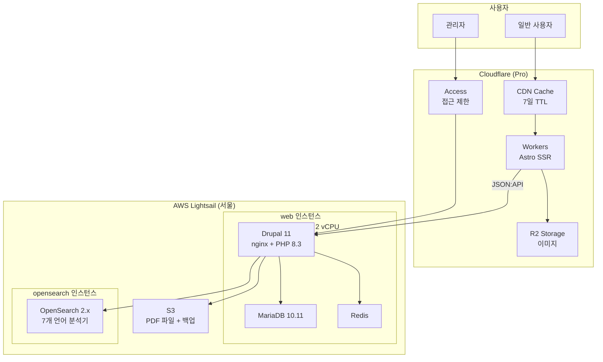

# 인프라 현황

> 마지막 업데이트: 2026-02-24

## 개요

GCED Clearinghouse는 2024년 12월 10일 Drupal 11 기반으로 새롭게 오픈했습니다.
2026년 2월 11일 레거시 Drupal 7 서버를 완전히 종료하고, 현재는 경량화된 인프라로 운영 중입니다.

---

## 현재 운영 인프라

### AWS Lightsail 인스턴스

| 인스턴스 | 사양 | IP | 용도 | 월 비용 |
|---------|------|-----|------|--------|
| **web** | 4GB RAM, 2 vCPU, 80GB SSD | 3.38.214.240 | Drupal 11 Admin | ~$20 |
| **opensearch** | 2GB RAM, 2 vCPU, 60GB SSD | 3.36.108.128 | OpenSearch 2.x | ~$12 |

- **리전**: ap-northeast-2 (서울)
- **SSH 호스트**: `gced-production` (web), `opensearch` (opensearch)

### 도메인 구성

| 도메인 | 용도 | 서비스 |
|--------|------|--------|
| `gcedclearinghouse.org` | 프론트엔드 (사용자) | Cloudflare Workers |
| `admin.gcedclearinghouse.org` | 백엔드 (관리자 + API) | AWS Lightsail (web) |
| `www.gcedclearinghouse.org` | 리다이렉트 | Cloudflare → apex |

### Cloudflare

| 서비스 | 플랜 | 비용 | 갱신일 |
|--------|------|------|--------|
| CDN + DNS + Cache | Pro | 연 $240 (월 $20) | 2027-01-13 |
| Workers | Free tier | $0 | - |
| R2 Storage | Free tier | $0 | - |

**사용 기능**:
- CDN 캐싱 (7일 TTL)
- DNS 관리
- Workers (Astro SSR)
- R2 (이미지 스토리지)
- Page Rules / Cache Rules

### AWS 기타 서비스

| 서비스 | 용도 | 월 비용 |
|--------|------|--------|
| S3 | 파일 스토리지, 백업 | ~$0 (Free tier) |
| SES | 트랜잭션 이메일 | ~$0 (Free tier) |
| Route 53 | DNS (일부) | ~$0.50 |

### 데이터베이스

| 항목 | 값 |
|------|-----|
| 엔진 | MariaDB 10.11 |
| 위치 | web 인스턴스 내 로컬 |
| 크기 | ~2GB (2026-01 기준) |
| 백업 | 일일 자동 → S3 |
| 보관 | 30일 |

### 검색 엔진

| 항목 | 값 |
|------|-----|
| 엔진 | OpenSearch 2.x |
| 위치 | opensearch 인스턴스 (별도) |
| 지원 언어 | 7개 (ko, en, zh-hans, fr, ru, es, ar) |
| 플러그인 | ingest-attachment (PDF 추출) |

### 모니터링

| 항목 | 값 |
|------|-----|
| 시스템 | Bash 스크립트 + Slack |
| 채널 | #prj-gced-clearinghouse |
| 주기 | 2분마다 |
| 대상 | nginx, MariaDB, 디스크, 메모리, 로드 |

---

## 비용 현황

### 월 운영 비용 (현재)

| 항목 | 월 비용 (USD) | 월 비용 (KRW) |
|------|-------------|---------------|
| AWS Lightsail (web) | ~$20 | ~₩29,000 |
| AWS Lightsail (opensearch) | ~$12 | ~₩17,000 |
| AWS Route 53 | ~$0.50 | ~₩700 |
| AWS Tax | ~$4 | ~₩5,800 |
| Cloudflare Pro | ~$20 | ~₩29,000 |
| **합계** | **~$57** | **~₩82,000** |

### 비용 절감 효과

레거시 서버 종료(2026-02-11)로 인한 비용 절감:

| 항목 | 이전 | 현재 | 절감 |
|------|------|------|------|
| 월 비용 | ~$400 | ~$57 | **~$343/월** |
| 연간 비용 | ~$4,800 | ~$684 | **~$4,116/년** |

### AWS 비용 추이

| 월 | 총 비용 | Lightsail | Tax | 비고 |
|----|---------|-----------|-----|------|
| 8월 2025 | $336 | $305 | $31 | 레거시 + 신규 병행 |
| 9월 2025 | $321 | $291 | $29 | |
| 10월 2025 | $348 | $316 | $32 | |
| 11월 2025 | $380 | $345 | $35 | |
| 12월 2025 | $469 | $426 | $43 | |
| 1월 2026 | $426 | $387 | $39 | |
| **2월 2026~** | **~$50** | **~$35** | **~$4** | **레거시 종료 후** |

---

## 인프라 다이어그램

---

## 종료된 레거시 서버

:::note[레거시 서버 종료 완료]
2026년 2월 11일, 구 클리어링하우스(Drupal 7) 서버가 완전히 종료되었습니다.
:::

### 서버 정보

| 인스턴스 | 사양 | IP | 용도 |
|---------|------|-----|------|
| **GCED_WEB** | 32GB RAM, 8 vCPU, 640GB SSD | 13.124.170.22 | Drupal 7 웹서버 |
| **GCED_SearchEngine** | 16GB RAM, 4 vCPU, 320GB SSD | 3.36.144.68 | 검색 엔진 |
| **GCED_LB** | Load Balancer | - | 로드 밸런서 |

### 종료 정보

| 항목 | 값 |
|------|-----|
| 도메인 | old.gcedclearinghouse.org |
| 리전 | ap-northeast-2 (서울) |
| 종료일 | 2026-02-11 |
| 월 비용 | ~$260 (인스턴스 $240 + LB $18 + 기타) |
| DNS | 완전 정리됨 |

### 데이터 처리

- **마이그레이션**: Drupal 7 → Drupal 11로 콘텐츠 마이그레이션 완료 (2025-07-21)
- **백업**: 마이그레이션 완료 후 레거시 데이터는 별도 보관 불필요
- **코드**: 레거시 코드 아카이브 불필요 (새 시스템으로 완전 교체)

---

## 변경 이력

| 날짜 | 변경사항 |
|------|----------|
| 2026-02-24 | 문서 최초 작성 |
| 2026-02-11 | 레거시 서버 종료 |
| 2025-07-21 | Drupal 7 → 11 마이그레이션 완료 |
| 2024-12-10 | 신규 시스템 오픈 |

---

## 다음 단계

- [← 시스템 개요](./01-system-overview) - 시스템 아키텍처 및 기술 스택
- [역할 및 권한 →](./02-user-roles) - 관리자 역할 구성 및 권한 안내
