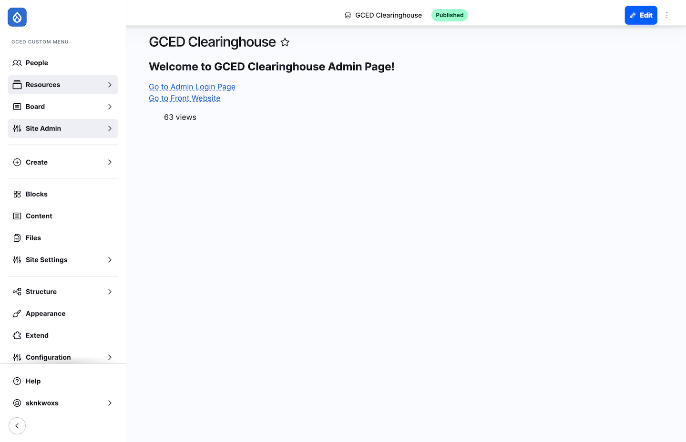
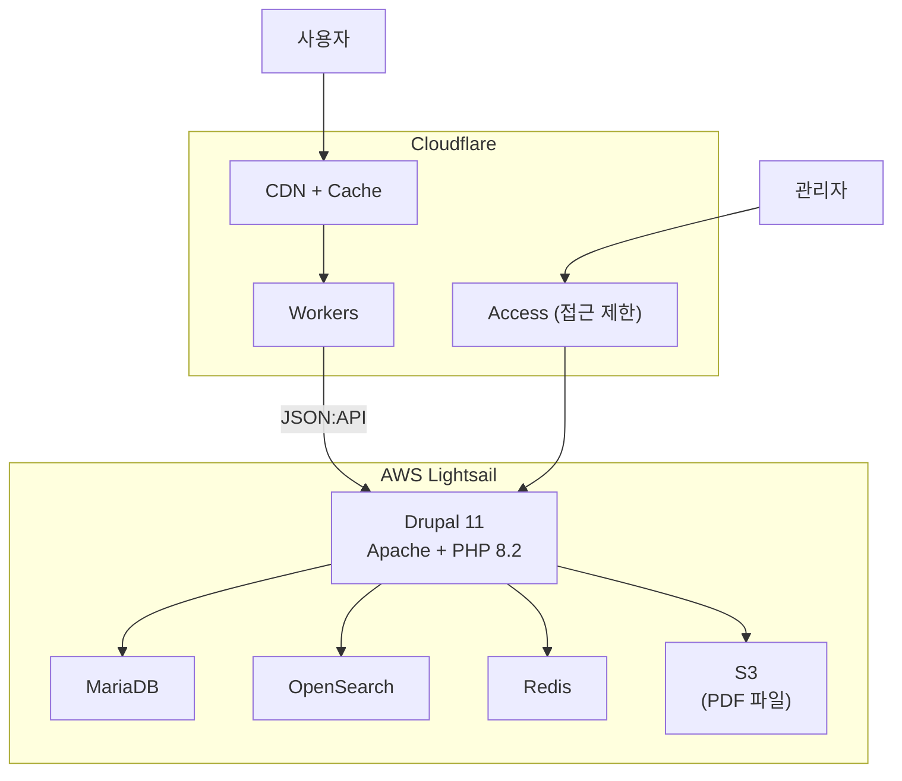

# 시스템 개요

## 클리어링하우스 웹사이트 안내

세계시민교육(GCED) 클리어링하우스는 2025년 11월 리뉴얼되었습니다.

### 리뉴얼 주요 내용

- 전반적 디자인 개선을 통해 향상된 사용자 경험 제공
- 데이터 및 인프라 이관으로 안정적이고 지속 가능한 운영 확보

### 주요 기능

- 사용자 중심 UI/UX 개선
- 자료 검색 기능 고도화
- 다국어(7개 언어) 출력 기능
- 자료 관리, 번역 관리 등 관리 편의성 제고

---

## 웹사이트 접근

### 사용자 화면 (FRONT)

| 환경 | URL | 인프라 |
|------|-----|--------|
| **운영** | https://gcedclearinghouse.org | AWS + Cloudflare (gcedclearinghouse.org) |

:::note
레거시 서버(구 클리어링하우스)는 데이터 이관 및 최종 확인 완료 후 종료되었습니다.
:::

### 관리자 화면 (ADMIN)

| 환경 | URL |
|------|-----|
| **운영** | https://admin.gcedclearinghouse.org |

### Cloudflare Access 접근 제한

관리자 화면(`admin.gcedclearinghouse.org`)은 Cloudflare Access 접근 제한 정책이 적용되어 있습니다.

- 정해진 인원/그룹만 접근 가능
- 최초 접근 시 Cloudflare Access 화면에서 본인 이메일 입력
- 이메일에 수신된 Login code를 입력하면 관리자 화면 접근 가능

**접근 허용 그룹:**

| 그룹 | 허용 조건 | 비고 |
|------|----------|------|
| 아태교육원 | `@unescoapceiu.org`로 끝나는 이메일 | - |
| 다큐멘탈리스트 | 개별 이메일 등록 | 담당자 변동 시 개발사에 요청 |
| 개발사 | `@skunkworks.co.kr`로 끝나는 이메일 | - |

:::note
다큐멘탈리스트 담당자 변동 시, 추가/삭제할 이메일을 개발사에 전달해주세요.
:::

---

## 관리자 화면 구성

관리자 화면은 Drupal 11 기반의 Gin 관리자 테마를 사용합니다.

### 주요 메뉴 구성

| 메뉴 | 설명 | 경로 |
|------|------|------|
| **Board** | 콘텐츠 관리 (Resources, Events, News, Useful Links) | `/admin/content` |
| **Resources** | 리소스 전용 관리 (워크플로우, 택소노미) | `/admin/content/resources-workflow` |
| **Translation** | 번역 관리 (TMGMT) | `/admin/tmgmt` |
| **People** | 회원 관리 | `/admin/people` |
| **Site Admin** | 사이트 설정 (메인화면, 팝업, 통계) | `/admin/gced/settings` |

---

## 다국어 시스템

클리어링하우스는 사용자 화면(프론트)과 관리자 화면(어드민) 모두 7개 언어를 지원합니다.

- 사용자 화면: URL 경로로 언어 전환 (예: `/en/resources`, `/ko/resources`)
- 관리자 화면: 화면 상단에서 언어 전환 가능

| 언어 | 코드 | 방향 | 비고 |
|------|------|:----:|------|
| English | en | LTR | 기본 언어 |
| French | fr | LTR | UN 공식 언어 |
| Spanish | es | LTR | UN 공식 언어 |
| Russian | ru | LTR | UN 공식 언어 |
| Arabic | ar | **RTL** | UN 공식 언어 |
| Chinese (Simplified) | zh-hans | LTR | UN 공식 언어 |
| Korean | ko | LTR | - |

### 콘텐츠 번역

- 각 콘텐츠는 원본 언어(Source Language)로 작성 후 번역 추가
- 번역이 없는 언어에서는 원본 언어 콘텐츠가 표시됨

<!-- 

-->

---

## 인프라 구성

### 시스템 아키텍처

### 기술 스택

| 구분 | 기술 | 비고 |
|------|------|------|
| **CMS** | Drupal 11 (Headless) | Gin 관리자 테마 |
| **프론트엔드** | Astro | Cloudflare Workers에서 서빙 |
| **API** | Drupal JSON:API | CDN 캐시 7일, 자동 퍼지 |
| **웹서버** | Apache2 + PHP 8.2 | - |
| **데이터베이스** | MariaDB | - |
| **검색엔진** | OpenSearch | 7개 언어별 형태소 분석기, PDF 인덱싱 |
| **캐시** | Redis + Cloudflare CDN | - |
| **번역** | TMGMT + DeepL | AI 자동 번역 |
| **파일 저장** | AWS S3 | PDF 약 9,300건 |
| **모니터링** | 서버 모니터링 스크립트 → Slack | 2분 간격 |
| **분석** | Google Analytics | - |

### 서버 정보

| 항목 | 내용 |
|------|------|
| **호스팅** | AWS Lightsail ($20/월) |
| **사양** | 4 GB RAM, 458 GB 디스크 |
| **배포 방식** | Git push + SSH + Drush (수동) |

---

## 운영 문서

| 문서 | 링크 |
|------|------|
| **운영유지 시트** | [SKNK-2026 클리어링하우스-운영유지 시트](https://docs.google.com/presentation/d/1GzXqvwbFJJSe0iHXuHSdtjLo4iXigZsfl0cU11Ajssc/edit) |
| **운영유지 리포트** | [APCEIU-클리어링하우스 운영유지 리포트](https://docs.google.com/spreadsheets/d/146HSpjdbClMZ02SH2kM_8ZnEtvxRBlGbfwYgGJ6n5a8/edit) |

---

## 다음 단계

- [역할 및 권한](./02-user-roles) - 관리자 역할 구성 및 권한 안내
- [콘텐츠 관리](./03-content-management/) - Resources, Events, News, Useful Links 관리 방법
