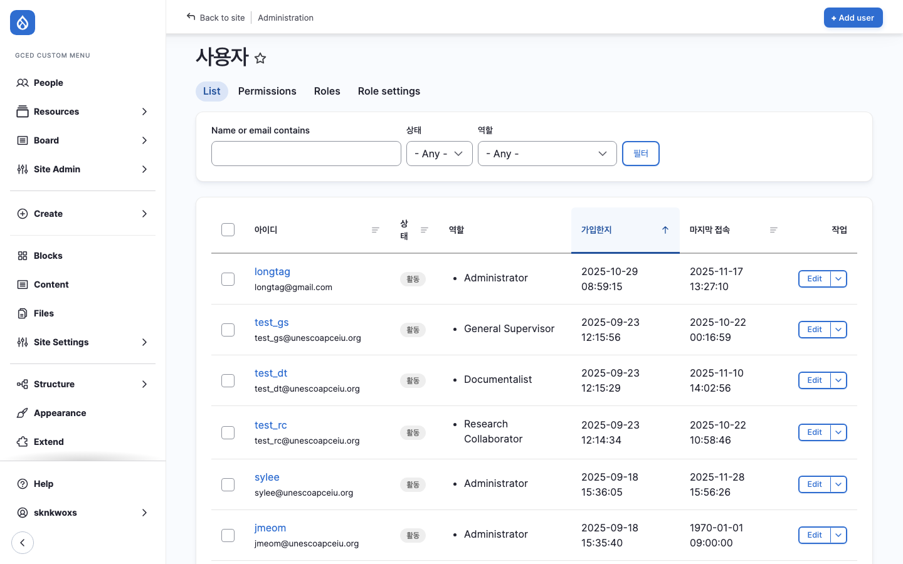
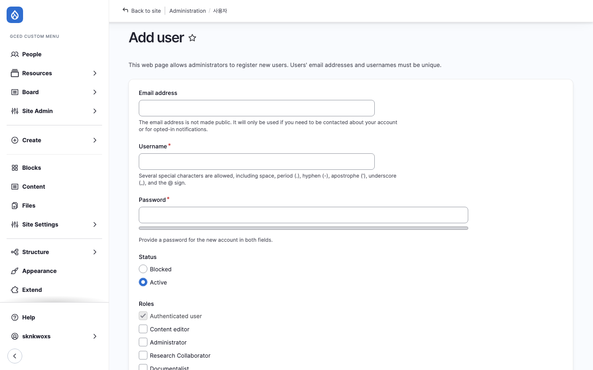

# 역할 및 권한

클리어링하우스 관리자 회원 역할과 권한을 안내합니다.

---

## 개요

클리어링하우스 웹사이트의 회원은 일반 사용자가 아닌 **관리자 회원**으로만 구성됩니다.

- 관리자 회원은 게시물의 등록, 검토, 번역 및 웹사이트 관리 업무를 수행
- 계정의 생성, 수정, 삭제는 **Administrator** 역할을 가진 회원만 가능
- 하나의 계정에 여러 역할 등록 가능

:::note
역할 변경, 권한 수정, 계정 관련 문의는 개발사(SKUNKWORKS)에 연락해 주세요.
:::

---

## 역할 구성

| 역할 | 설명 | 기계명 |
|------|------|--------|
| **최고관리자** | 시스템 관리자 및 업무 총괄 관리 | Administrator |
| **DB 총괄관리자** | 승인된 데이터의 메타데이터 형식 검토 및 시스템 최종 반영 | General Supervisor |
| **다큐멘탈리스트** | Resources 콘텐츠 등록, 검수, 번역 업무 담당 | Documentalist |

:::note[협력연구자 역할 통합]
기존 협력연구자(Research Collaborator) 역할은 다큐멘탈리스트에 통합되었습니다. 협력연구자는 현재 관리자 사이트에 접근하지 않습니다.
:::

---

## 역할별 상세 안내

### Administrator (최고관리자)

| 항목 | 내용 |
|------|------|
| **기계명** | administrator |
| **설명** | 시스템 관리자 및 업무 총괄 관리 |

**주요 권한:**
- 모든 시스템 기능에 대한 접근 및 관리 권한 보유
- 모든 콘텐츠 타입 게시글 관리
- 회원 계정 관리 (생성/수정/삭제)
- 사이트 설정 관리
- 번역 요청 관리

---

### General Supervisor (DB 총괄관리자)

| 항목 | 내용 |
|------|------|
| **기계명** | general_supervisor |
| **설명** | 승인된 데이터의 메타데이터 형식 검토 및 시스템 최종 반영 |

**주요 권한:**
- 협력연구자가 제공한 데이터의 형식 검토 및 수정
- Resource 상태 변경: **Draft → Published**
- Taxonomy 관리 (Keywords, Creator)

---

### Documentalist (다큐멘탈리스트)

| 항목 | 내용 |
|------|------|
| **기계명** | documentalist |
| **설명** | Resources 콘텐츠 등록, 검수, 번역 업무 담당 |
| **구성** | 7개 언어별 담당자 6명 (한/영, 중, 프, 러, 스, 아) |

**주요 권한:**
- Resources 콘텐츠 신규 등록 (Draft 또는 Published)
- Resource 상태 변경: **Draft → Published**, **Archive**
- 번역 검토 및 직접 번역

---

## 참고: 협력연구자 (Research Collaborator)

:::caution[현재 미사용]
협력연구자 역할은 다큐멘탈리스트에 통합되어 현재 관리자 사이트에 접근하지 않습니다. 아래 내용은 참고용입니다.
:::

| 항목 | 내용 |
|------|------|
| **기계명** | research_collaborator |
| **설명** | 7개 언어 담당자 그룹 (역할 통합됨) |

---

## 역할별 워크플로우 권한

| 상태 변경 | Documentalist | General Supervisor | Administrator |
|----------|:-------------:|:------------------:|:-------------:|
| Draft 작성 | O | O | O |
| Draft → Published | O | O | O |
| → Archived | O | O | O |
| Archived 유지 | O | O | O |
| Archived → Draft | O | O | O |

---

## 역할별 콘텐츠 권한

| 콘텐츠 타입 | Documentalist | General Supervisor | Administrator |
|------------|:-------------:|:------------------:|:-------------:|
| Resources | CRUD | CRUD | CRUD |
| Events | - | - | CRUD |
| News | - | - | CRUD |
| Useful Links | - | - | CRUD |
| Taxonomy | - | CRUD | CRUD |

---

## 회원 관리 (People)

### 회원 목록

| 항목 | 내용 |
|------|------|
| **위치** | People |
| **경로** | `/admin/people` |
| **접근 권한** | Administrator |

- 등록된 관리자 계정 목록 확인
- 계정 상태, 역할 확인 및 수정

### 회원 추가

| 항목 | 내용 |
|------|------|
| **위치** | People > Add user |
| **경로** | `/admin/people/create` |

#### 입력 필드

| 필드 | 설명 | 필수 |
|------|------|:----:|
| **Email address** | 등록할 회원의 이메일 | O |
| **Username** | 등록할 회원의 아이디(ID) | O |
| **Password** | 등록할 회원의 비밀번호 | O |
| **Status** | Active(활성화) / Blocked(비활성화) | O |
| **Roles** | 등록할 역할 (복수 선택 가능) | O |
| **번역 가능 언어** | 번역 업무를 담당할 언어 선택 (번역담당자만 설정) | - |

:::note
- 임시 비밀번호 입력 후 회원이 스스로 수정하도록 안내하세요.
- 번역 가능 언어는 번역 업무를 담당하는 회원(Documentalist)에게만 설정합니다. 이 설정에 따라 Manage Tasks 페이지에서 해당 언어의 번역 할당 내역이 표시됩니다.
:::

---

## 기타 역할 (참고)

| 역할 | 설명 | 기계명 |
|------|------|--------|
| Content editor | OLD 웹사이트에서 사용하던 역할 (현재 미사용) | content_editor |
| Authenticated user | 회원가입 했지만 권한 없음 (미사용) | authenticated |
| Anonymous user | 비회원 (미사용) | anonymous |

---

## 다음 단계

- [콘텐츠 관리](./03-content-management/) - Resources, Events, News, Useful Links 관리 방법
