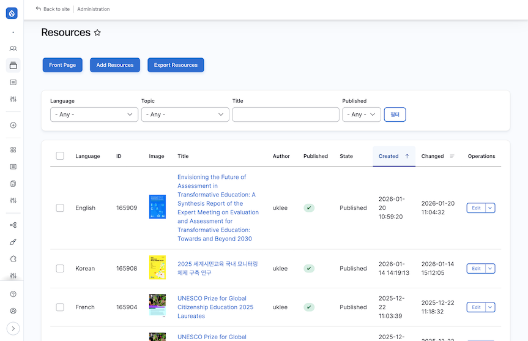
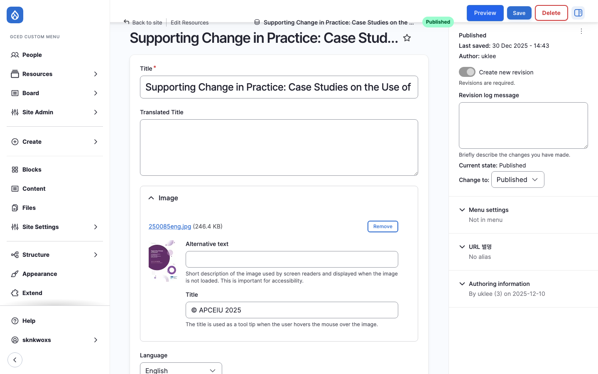

# Resources

세계시민교육 관련 자료를 관리합니다. 클리어링하우스의 핵심 콘텐츠 타입입니다.

| 항목 | 내용 |
|------|------|
| 위치 | Board > Resources |
| 경로 | `/admin/content?type=resources` |
| 접근 권한 | Administrator, General Supervisor, Documentalist |

---

## 목록 화면

Resources 목록 화면에서 등록된 자료를 확인하고 관리합니다.

### 상단 버튼

| 버튼 | 설명 |
|------|------|
| Front Page | 사용자 화면(프론트)에서 Resources 목록 열람 |
| Add Resource | 새 Resource 추가 화면으로 이동 |
| Export Resources | Resources 목록을 파일로 내보내기 |

### 목록 컬럼

| 컬럼 | 설명 |
|------|------|
| Language | 콘텐츠 언어 (English, Korean, French 등) |
| ID | 콘텐츠 고유 번호 |
| Image | 자료 표지 이미지 썸네일 |
| Title | 자료 제목 (클릭하면 프론트 화면으로 이동) |
| Author | 작성자 계정 |
| Published | 공개 여부 (체크 아이콘으로 표시) |
| State | 워크플로우 상태 (Published, Draft, Archived) |
| Created | 최초 작성 일시 |
| Changed | 마지막 수정 일시 |
| Operations | 작업 드롭다운 (Edit 등) |

### Operations 드롭다운

| 작업 | 설명 |
|------|------|
| Edit | 콘텐츠 수정 화면으로 이동 |
| Translate | 번역 화면으로 이동 |
| Delete | 콘텐츠 삭제 |
| View | 콘텐츠 보기 (Headless 구조에서는 Drupal 자체 화면이므로 실제 활용도가 낮음. 미리보기가 필요한 경우 수정 화면의 Preview 기능을 사용하세요) |

---

## 입력/수정 화면

Resource의 각 필드를 입력하거나 수정하는 화면입니다. 새 콘텐츠 추가(Add Resource)와 기존 콘텐츠 수정(Edit) 모두 동일한 화면을 사용합니다.

- 목록에서 Operations > Edit 클릭
- 목록 상단의 Add Resources 버튼 클릭

### 기본 정보

| 필드 | 설명 | 필수 |
|------|------|:----:|
| Title | 자료 제목. 목록과 프론트 화면에 표시되는 대표 제목 | O |
| Translated Title | 번역 제목. 원본 언어가 아닌 다른 언어의 제목을 기록할 때 사용 | - |
| Image | 자료 표지 이미지. 업로드 후 Alternative text(대체 텍스트)와 Title(마우스 hover 시 툴팁, 예: "© UNESCO 2025")을 입력 | - |
| Language | 콘텐츠 언어 선택 (English, Korean, French 등). 최초 저장 후에는 변경 불가 | - |

:::note
Image 업로드 시 Alternative text는 접근성(스크린 리더)을 위해 반드시 입력하세요.
:::

### 저자 정보

Creator Taxonomy와 연동됩니다. 입력란에 텍스트를 입력하면 자동완성으로 기존 항목을 검색할 수 있습니다. 여러 명을 등록하려면 [Add another item] 버튼을 클릭하여 입력란을 추가하세요.

| 필드 | 설명 | 필수 |
|------|------|:----:|
| Author | 저자 (Taxonomy: Creator). 개인 저자명 입력 | - |
| Corporate Author | 단체 저자 (Taxonomy: Creator). 기관/단체명 입력 (예: UNESCO, APCEIU) | - |
| Translator | 번역자 (Taxonomy: Creator) | - |

:::caution
자동완성 목록에 없는 항목은 직접 등록할 수 없습니다. 등록하고자 하는 저자명을 입력해도 검색되지 않는 경우, [택소노미 관리](../04-taxonomy)에서 먼저 항목을 추가한 후 다시 입력하세요.
:::

저자 정보의 Taxonomy 구조와 관리 방법은 [택소노미 관리](../04-taxonomy)에서 자세히 살펴보세요.

### 본문

| 필드 | 설명 | 필수 |
|------|------|:----:|
| 본문 (Body) | 자료 설명. WYSIWYG 에디터(CKEditor5)로 서식, 링크, 표, 이미지, 영상 등을 삽입할 수 있음 | - |

에디터 사용법과 문서 작성 규칙은 [스타일 가이드](https://admin.gcedclearinghouse.org/en/styleguide)를 참고하세요.

### 분류 정보

| 필드 | 설명 | 필수 |
|------|------|:----:|
| Region | 지역 분류. 라디오 버튼에서 선택 (Africa, Arab States, Asia and the Pacific, Europe and North America, Latin America and the Caribbean, Global) | - |
| Resource type | 자료 유형. 라디오 버튼에서 선택 (International normative instruments / policy and advocacy documents, Research papers / journal articles, Conference and programme reports, Curriculum / teaching-learning materials and guides, Multimedia materials, Other) | - |
| Level of education | 교육 단계. 라디오 버튼에서 선택 (Early childhood care and education (ECCE), Primary education, Secondary education, Higher education, Lifelong learning, Technical and Vocational education and training, Non-formal education, Other) | - |
| Topic | 주제 분류. 라디오 버튼에서 선택 (Civic / Citizenship / Democracy, Diversity / Cultural literacy / Interculturalness, Human rights, Globalization and social justice / International understanding, Peace / Culture of peace, Preventing violent extremism and genocide, Sustainable development / Sustainability, Media and information literacy / Digital citizenship, Transformative initiatives / Transformative pedagogies, Others) | - |

### Resource Languages

| 필드 | 설명 | 필수 |
|------|------|:----:|
| Resource Languages | 자료 자체의 언어. 해당 자료가 어떤 언어로 작성되었는지 선택 (콘텐츠 Language와 별도) | - |

### 출판 정보

| 필드 | 설명 | 필수 |
|------|------|:----:|
| Place of publication | 출판 장소 | - |
| Year of publication | 출판 연도. 숫자 4자리 입력 (예: 2025) | - |
| Collation | 페이지 수 등 물리적 정보 | - |
| ISBN | 국제표준도서번호. 형식: ISBN-978-x-xxx-xxxxx-x | - |

### Keywords

Taxonomy: Keywords와 연동됩니다. 입력란에 텍스트를 입력하면 자동완성으로 기존 키워드를 검색할 수 있습니다. 여러 개를 등록하려면 [Add another item] 버튼을 클릭하여 입력란을 추가하세요.

| 필드 | 설명 | 필수 |
|------|------|:----:|
| Keywords | 키워드 (Taxonomy: Keywords) | - |

:::caution
자동완성 목록에 없는 키워드는 직접 등록할 수 없습니다. 검색되지 않는 경우 [택소노미 관리](../04-taxonomy)에서 먼저 항목을 추가한 후 다시 입력하세요.
:::

### 자료 형식

| 필드 | 설명 | 필수 |
|------|------|:----:|
| Format | 자료 형식. 드롭다운 선택 | - |
| File type | 파일 유형. 드롭다운 선택 | - |

### 파일 및 링크

| 필드 | 설명 | 필수 |
|------|------|:----:|
| Files | 첨부 파일 업로드 (PDF 등). 복수 파일 업로드 가능. 프론트 화면에서 다운로드 링크로 제공됨 | - |
| Resource URL | 외부 자료 링크. 원문이 외부 사이트에 있는 경우 URL 입력 | - |
| Ebook URL | 전자책 URL | - |
| DB URL | 데이터베이스 URL | - |

:::tip
파일 업로드 후 Description 필드를 반드시 입력하세요. 이 값이 사용자 화면(프론트)에서 다운로드 버튼의 텍스트로 표시됩니다. 비워두면 파일명(예: 250077eng.pdf)이 그대로 노출됩니다.
:::

:::note
File과 Resource URL 중 하나 이상 입력하는 것을 권장합니다. 둘 다 비어 있으면 사용자가 자료에 접근할 수 없습니다.
:::

### 상태 관리 (사이드바)

화면 오른쪽 사이드바에서 공개 상태와 워크플로우를 관리합니다.

| 필드 | 설명 | 필수 |
|------|------|:----:|
| Published | 공개/비공개 여부 체크박스 | O |
| Moderation state | 워크플로우 상태 (Draft / Published / Archived) | O |

:::note
리비전은 저장 시 **자동으로 생성**됩니다. 별도 체크박스 없이 모든 수정 사항이 기록됩니다.
:::

:::note
Published 체크박스와 Moderation state는 별도로 관리됩니다. Moderation state가 Published가 아니면 Published 체크와 관계없이 비공개 처리됩니다.
:::

### 저장

화면 상단의 Save 버튼을 클릭하여 저장합니다. 저장 전 Preview 버튼으로 미리보기를 확인할 수 있습니다.

---

## 워크플로우 상태

Resources에는 워크플로우가 적용됩니다. 자세한 내용은 [워크플로우](../05-workflow) 문서를 참조하세요.

:::note
시스템에는 5단계 워크플로우(Draft → Picked → Staged → Published → Archived)가 구현되어 있으나, 현재 운영 편의를 위해 3단계(Draft → Published → Archived)로 단순화하여 사용 중입니다. 향후 필요에 따라 Picked, Staged 단계를 활성화할 수 있습니다.
:::

| 상태 | 설명 | 공개 여부 |
|------|------|:--------:|
| Draft | 초안. 다큐멘탈리스트가 작성 | 비공개 |
| Published | 게시 완료. DB 총괄관리자가 승인 | 공개 |
| Archived | 보관 처리 | 비공개 |

---

## 역할별 권한

| 기능 | Documentalist | General Supervisor | Administrator |
|------|:-------------:|:------------------:|:-------------:|
| 목록 조회 | O | O | O |
| 콘텐츠 추가 (Draft) | O | O | O |
| 콘텐츠 수정 | O | O | O |
| 상태 변경 (Draft → Published) | O | O | O |
| 번역 요청 | - | - | O |

---

## 다음 단계

- [Events](./02-events) - 행사/이벤트 관리
- [택소노미 관리](../04-taxonomy) - Keywords, Creator 관리
- [워크플로우](../05-workflow) - Resources 검토 및 승인 프로세스
