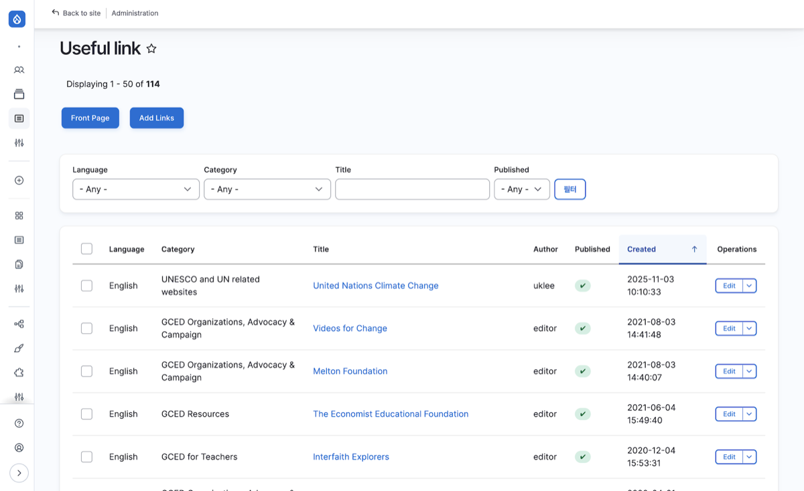

# Useful Links

세계시민교육 관련 유용한 외부 링크를 관리합니다.

| 항목 | 내용 |
|------|------|
| 위치 | Board > Useful link |
| 경로 | `/admin/content?type=useful_links` |
| 접근 권한 | Administrator |

---

## 목록 화면

Useful Links 목록 화면에서 등록된 링크를 확인하고 관리합니다.

### 상단 버튼

| 버튼 | 설명 |
|------|------|
| Front Page | 사용자 화면(프론트)에서 Useful Links 목록 열람 |
| Add Links | 새 Link 추가 화면으로 이동 |

### 목록 컬럼

| 컬럼 | 설명 |
|------|------|
| Language | 콘텐츠 언어 (English, Korean, French 등) |
| Category | 링크 분류 (UNESCO and UN related websites, GCED Resources 등) |
| Title | 링크 제목 (클릭하면 프론트 화면으로 이동) |
| Author | 작성자 계정 |
| Published | 공개 여부 (체크 아이콘으로 표시) |
| Created | 최초 작성 일시 |
| Operations | 작업 드롭다운 (Edit 등) |

### Operations 드롭다운

| 작업 | 설명 |
|------|------|
| Edit | 콘텐츠 수정 화면으로 이동 |
| Translate | 번역 화면으로 이동 |
| Delete | 콘텐츠 삭제 |
| View | 콘텐츠 보기 (Headless 구조에서는 Drupal 자체 화면이므로 실제 활용도가 낮음. 미리보기가 필요한 경우 수정 화면의 Preview 기능을 사용하세요) |

---

## 입력/수정 화면

Useful Links의 각 필드를 입력하거나 수정하는 화면입니다. 새 콘텐츠 추가(Add Links)와 기존 콘텐츠 수정(Edit) 모두 동일한 화면을 사용합니다.

- 목록에서 Operations > Edit 클릭
- 목록 상단의 Add Links 버튼 클릭

### 기본 정보

| 필드 | 설명 | 필수 |
|------|------|:----:|
| Title | 링크 제목. 목록과 프론트 화면에 표시되는 대표 제목 | O |
| Category | 링크 분류. 드롭다운에서 선택 | - |
| Language | 콘텐츠 언어 선택 (English, Korean, French 등). 최초 저장 후에는 변경 불가 | - |
| URL | 외부 링크 주소. 내부/외부 URL 입력 가능 | - |

Category 선택 항목:

| 값 | 설명 |
|------|------|
| UNESCO and UN related websites | 유네스코 및 UN 관련 웹사이트 |
| GCED Organizations, Advocacy & Campaign | GCED 관련 기관, 옹호, 캠페인 |
| GCED for Teachers | 교사를 위한 GCED |
| GCED for Students | 학생을 위한 GCED |
| GCED Resources | GCED 자료 |
| Others | 기타 |

### 본문

| 필드 | 설명 | 필수 |
|------|------|:----:|
| Body | 링크 설명. WYSIWYG 에디터(CKEditor5)로 서식, 링크, 표, 이미지, 영상 등을 삽입할 수 있음 | O |

에디터 사용법과 문서 작성 규칙은 [스타일 가이드](https://admin.gcedclearinghouse.org/en/styleguide)를 참고하세요.

### 상태 관리 (사이드바)

화면 오른쪽 사이드바에서 공개 상태를 관리합니다.

| 필드 | 설명 | 필수 |
|------|------|:----:|
| Published | 공개/비공개 여부 | O |
| Create new revision | 리비전 생성 여부. 기본 활성화 (필수) | - |
| Revision log message | 수정 내용 메모. 어떤 변경을 했는지 간단히 기록 | - |
| Authoring information | 작성자 및 작성일 정보. 기본값은 현재 로그인 사용자와 현재 시간 | - |

:::note
Useful Links에는 워크플로우가 적용되지 않습니다. Published 체크박스로 공개/비공개를 직접 설정합니다.
:::

### 저장

화면 상단의 Save 버튼을 클릭하여 저장합니다. 저장 전 Preview 버튼으로 미리보기를 확인할 수 있습니다.

---

## 다음 단계

- [Resources](./01-resources) - 세계시민교육 자료 관리
- [택소노미 관리](../04-taxonomy) - Keywords, Creator 관리
