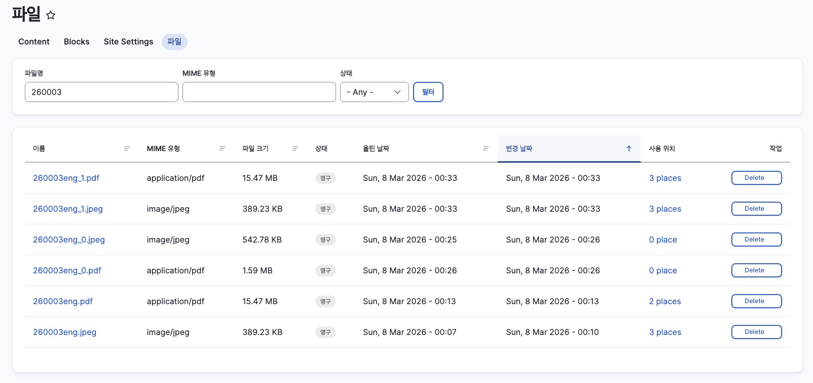
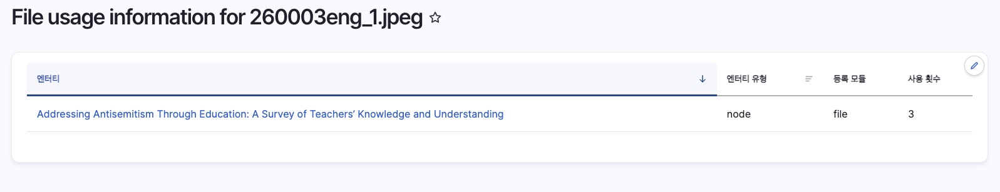
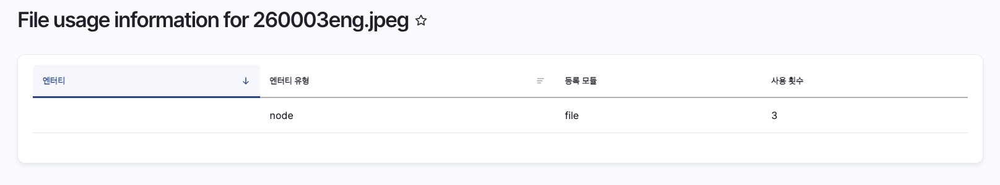

# 파일 관리

시스템에 업로드된 모든 파일을 관리하고, 파일이 어느 콘텐츠에서 사용되는지 확인할 수 있습니다.

| 항목 | 내용 |
|------|------|
| 위치 | Content > Files |
| 경로 | `/admin/content/files` |
| 접근 권한 | 최고관리자 |

---

## 목록 화면

Files 목록 화면에서 업로드된 파일을 검색하고 관리합니다.

### 검색 필터

| 필터 | 설명 |
|------|------|
| 파일명 | 파일명으로 검색 (예: 260003) |
| MIME 유형 | 파일 종류로 필터링 (image/jpeg, application/pdf 등) |
| 상태 | 파일 상태 필터링 |

### 목록 컬럼

| 컬럼 | 설명 |
|------|------|
| 이름 | 파일명 (클릭하면 파일 상세 페이지로 이동) |
| MIME 유형 | 파일 종류 (image/jpeg, application/pdf 등) |
| 파일 크기 | 파일 용량 |
| 상태 | 파일 상태 (영구 등) |
| 올린 날짜 | 최초 업로드 일시 |
| 변경 날짜 | 마지막 수정 일시 |
| **사용 위치** | 이 파일이 연결된 콘텐츠 수 |
| 작업 | Delete 버튼 |

---

## "사용 위치" 이해하기

"사용 위치" 컬럼은 해당 파일이 몇 개의 콘텐츠에서 사용되고 있는지 보여줍니다.

| 표시 | 의미 |
|------|------|
| 3 places | 3개의 콘텐츠에서 이 파일을 사용 중 |
| 0 place | 어느 콘텐츠에도 연결되어 있지 않음 (미사용 파일) |

:::tip
"사용 위치" 숫자를 클릭하면 **파일 사용 정보 페이지**로 이동하여, 해당 파일이 어느 콘텐츠에서 사용되고 있는지 확인할 수 있습니다.
:::

---

## 파일 사용 정보 페이지

"사용 위치" 숫자를 클릭하면 파일 사용 정보 페이지로 이동합니다.

**경로**: `/admin/content/files/usage/{file_id}`

### 정상적으로 연결된 경우

| 엔터티 | 엔터티 유형 | 등록 모듈 | 사용 횟수 |
|--------|------------|----------|----------|
| Addressing Antisemitism Through Education... | node | file | 3 |

- **엔터티** 컬럼에 콘텐츠 제목이 표시됩니다
- 제목을 클릭하면 해당 콘텐츠로 이동할 수 있습니다

### 연결된 콘텐츠가 삭제된 경우

| 엔터티 | 엔터티 유형 | 등록 모듈 | 사용 횟수 |
|--------|------------|----------|----------|
| (빈값) | node | file | 3 |

- **엔터티** 컬럼이 비어있으면, 원래 연결되어 있던 콘텐츠가 **삭제**된 것입니다
- 파일은 서버에 남아있지만 실제로는 사용되지 않는 상태입니다

---

## 파일명에 숫자가 붙는 경우 (_0, _1)

동일한 파일명으로 여러 번 업로드하면, 시스템이 자동으로 `_0`, `_1` 등의 숫자를 추가합니다.

**예시**: `260003eng.jpeg`로 여러 번 업로드한 경우

| 파일명 | 설명 |
|--------|------|
| 260003eng.jpeg | 최초 업로드 파일 |
| 260003eng_0.jpeg | 두 번째 업로드 (동일 파일명이 이미 존재) |
| 260003eng_1.jpeg | 세 번째 업로드 |

:::note
2025년 3월 31일 이후 업로드된 파일은 타임스탬프 기반 디렉토리에 저장되어 원본 파일명이 그대로 유지됩니다. `_0`, `_1` 등의 숫자가 붙는 현상은 이전에 업로드된 파일에만 해당됩니다.
:::

---

## 파일 상태 확인 예시

260003으로 검색했을 때 다음과 같은 결과가 나올 수 있습니다:

| 파일명 | 사용 위치 | 상태 |
|--------|----------|------|
| 260003eng_1.pdf | 3 places | ✅ 정상 - 특정 리소스에서 사용 중 |
| 260003eng_1.jpeg | 3 places | ✅ 정상 - 특정 리소스에서 사용 중 |
| 260003eng_0.jpeg | 0 place | ⚠️ 미사용 - 어디에도 연결되지 않음 |
| 260003eng_0.pdf | 0 place | ⚠️ 미사용 |
| 260003eng.jpeg | 3 places | ⚠️ 확인 필요 - 사용 정보 페이지에서 엔터티 확인 |

**"사용 위치"가 있는데 엔터티가 비어있는 경우**: 원래 연결된 콘텐츠가 삭제되어 파일만 남은 상태입니다.

---

## 자주 묻는 질문

### Q: 파일을 클릭했는데 다른 리소스가 열려요

파일 상세 페이지에서 연결된 리소스로 이동할 때, 해당 파일이 연결된 리소스가 표시됩니다. 파일명과 리소스 ID가 다른 경우는:

1. 리소스 등록 후 파일을 교체한 경우
2. 다른 리소스에서 해당 파일을 사용하는 경우

"사용 위치"를 클릭하여 실제로 어느 콘텐츠에서 사용 중인지 확인하세요.

### Q: 미사용 파일(0 place)은 삭제해도 되나요?

"사용 위치"가 0인 파일은 어느 콘텐츠에도 연결되어 있지 않으므로 삭제해도 됩니다. 단, 삭제 전 "사용 위치"를 다시 확인하시기 바랍니다.

### Q: 같은 파일명인데 여러 개가 있어요

동일한 파일명으로 여러 번 업로드하면 `_0`, `_1` 등의 숫자가 자동으로 붙습니다. 각 파일의 "사용 위치"를 확인하여 실제 사용 중인 파일과 미사용 파일을 구분하세요.

---

## 다음 단계

- [Resources](./01-resources) - 세계시민교육 자료 관리
- [택소노미 관리](../04-taxonomy) - Keywords, Creator 관리
