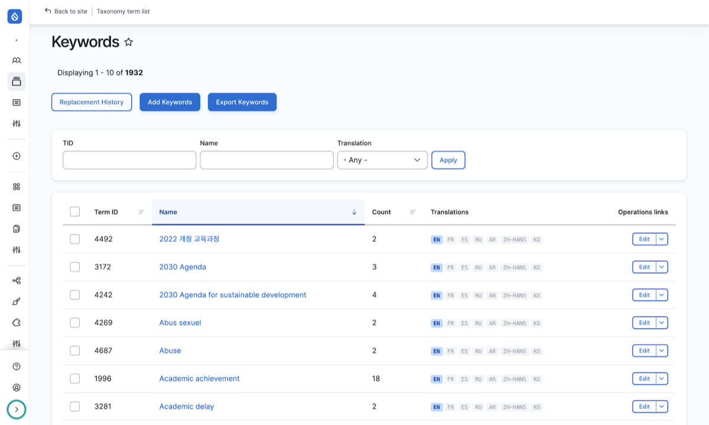
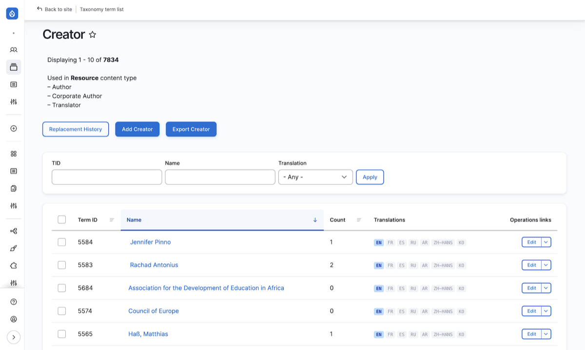
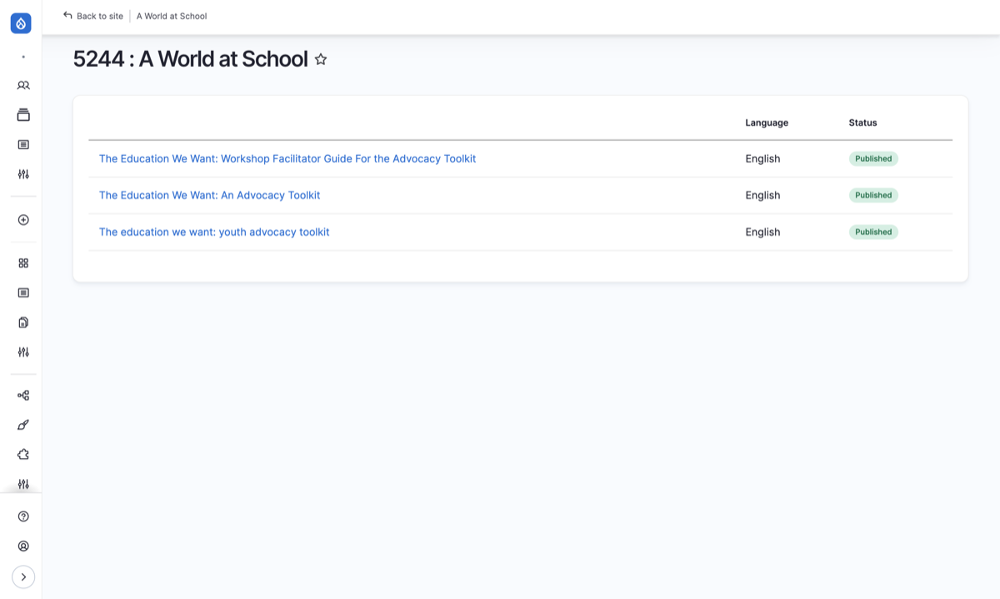
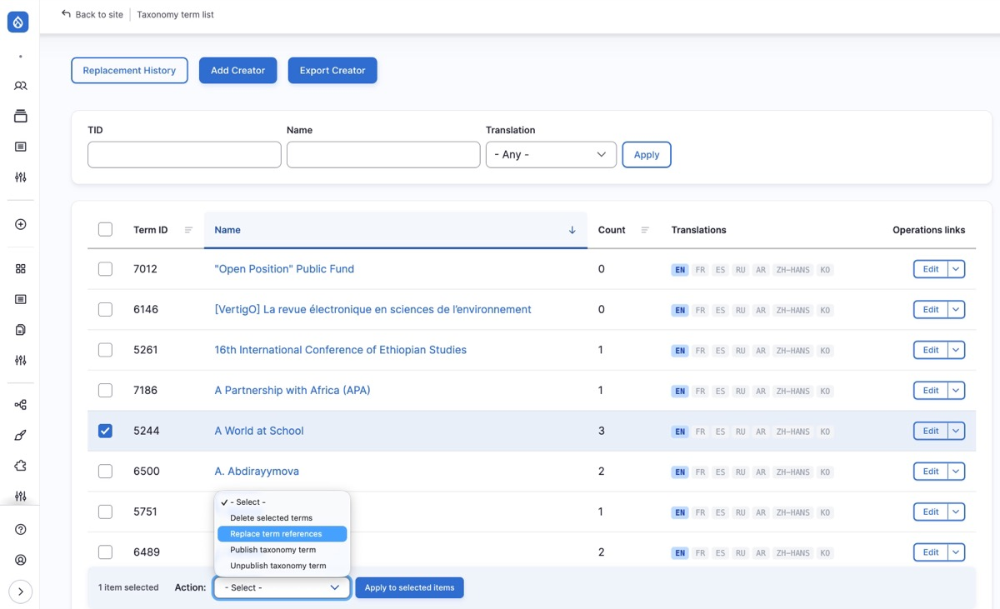
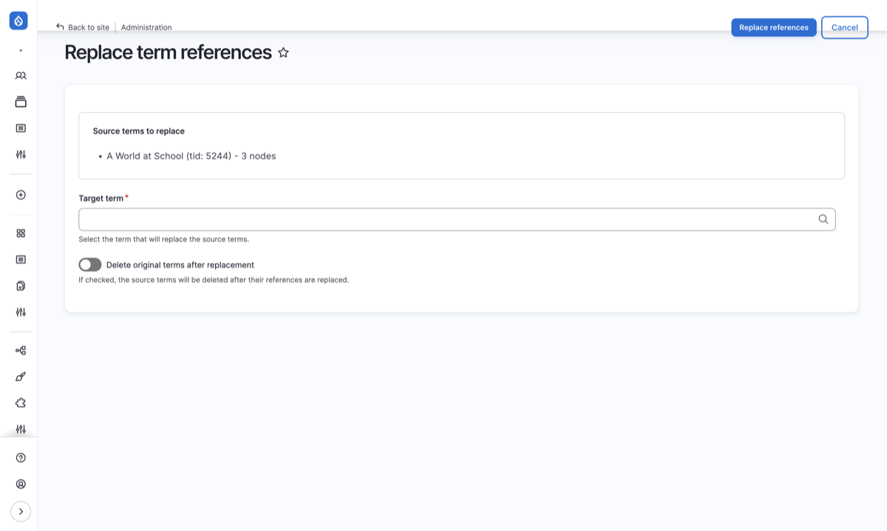
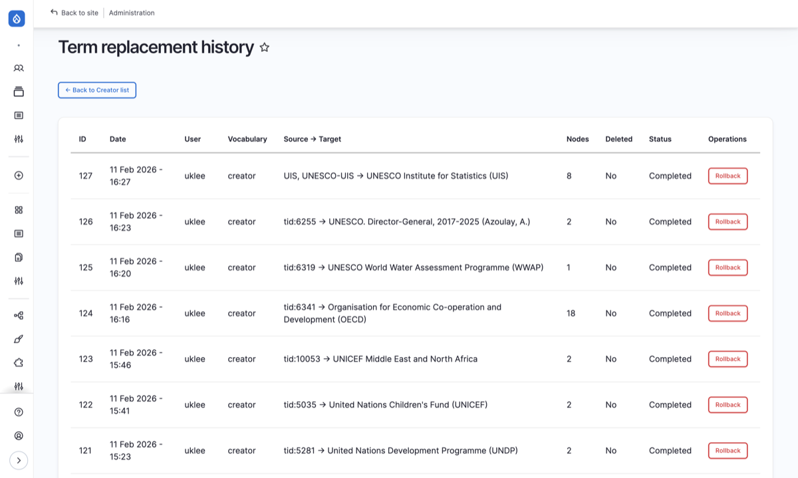

# 택소노미 관리

Resources와 연계되어 구성된 Keywords, Creator 용어 목록을 관리합니다.

---

## 개요

| 항목 | 내용 |
|------|------|
| **위치** | Resources > Taxonomy |
| **경로** | `/taxonomy-term-list` |
| **접근 권한** | Administrator, General Supervisor |

### 택소노미 종류

| 택소노미 | 설명 |
|----------|------|
| **Keywords** | 키워드. 자료 분류 및 검색에 사용 |
| **Creator** | 저작자. Author, Corporate Author, Translator 포함 |

---

## Keywords 관리

자료의 주제 분류를 위한 키워드를 관리합니다.

| 항목 | 내용 |
|------|------|
| **위치** | Resources > Taxonomy > Keywords |
| **경로** | `/taxonomy-term-list/keywords` |

### 키워드 목록 확인

1. Resources > Taxonomy > **Keywords** 클릭
2. 등록된 키워드 목록 확인
3. 각 키워드 옆 **Edit** 버튼으로 수정 가능

#### 목록 컬럼

| 컬럼 | 설명 |
|------|------|
| Bulk update | 일괄 작업용 체크박스 |
| Term ID | 용어 고유 번호 |
| Name | 키워드명. 클릭 시 해당 키워드를 사용하는 콘텐츠 목록으로 이동 |
| Count | 해당 키워드가 연결된 콘텐츠 수. 클릭 시 연결된 콘텐츠 목록 확인 |
| Translations | 다국어 번역 상태 배지 (en, fr, es, ru, ar, zh-hans, ko) |
| Operations | Edit, Delete 등 작업 링크 |

:::note[Translations 배지 색상]
- 파란색: 원본 언어
- 초록색: 번역 완료 (클릭 시 번역 편집으로 이동)
- 회색: 번역 없음
:::

#### 상단 버튼

| 버튼 | 설명 |
|------|------|
| Replacement History | 용어 교체 이력 확인 |
| Add Keywords | 새 키워드 추가 (별도 탭에서 열림) |
| Export Keywords | 키워드 목록 CSV 내보내기 |

### 키워드 추가

1. 상단 **[Add Keywords]** 버튼 클릭
2. **Name** 필드에 키워드 입력
3. 필요시 다국어 번역 추가
4. **Save** 버튼 클릭

### 키워드 번역

등록된 키워드에 다국어 번역을 추가할 수 있습니다.

1. 키워드 목록에서 **Translations** 컬럼의 배지 클릭
   - 초록색: 번역 편집
   - 회색: 새 번역 추가
2. 번역할 언어의 **Add** 또는 **Edit** 클릭
3. 번역된 키워드명 입력
4. **Save** 버튼 클릭

:::tip
키워드 번역은 검색 및 필터 기능에서 해당 언어로 키워드가 표시되도록 합니다. 주요 키워드는 7개 언어 모두 번역하는 것을 권장합니다.
:::

---

## Creator 관리

자료의 저작자 정보를 관리합니다. Author, Corporate Author, Translator가 모두 Creator 택소노미에 포함됩니다.

| 항목 | 내용 |
|------|------|
| **위치** | Resources > Taxonomy > Creator |
| **경로** | `/taxonomy-term-list/creator` |

### Creator 유형

| 유형 | 설명 | 예시 |
|------|------|------|
| **Author** | 개인 저자 | 홍길동, John Doe |
| **Corporate Author** | 단체/기관 저자 | UNESCO, APCEIU |
| **Translator** | 번역자 | 김번역 |

### Creator 목록 확인

1. Resources > Taxonomy > **Creator** 클릭
2. 등록된 Creator 목록 확인
3. 필터를 사용하여 유형별 검색 가능

#### 목록 컬럼

| 컬럼 | 설명 |
|------|------|
| Bulk update | 일괄 작업용 체크박스 |
| Term ID | 용어 고유 번호 |
| Name | Creator명. 클릭 시 해당 Creator를 사용하는 콘텐츠 목록으로 이동 |
| Count | 해당 Creator가 연결된 콘텐츠 수. 클릭 시 연결된 콘텐츠 목록 확인 |
| Translations | 다국어 번역 상태 배지 (en, fr, es, ru, ar, zh-hans, ko) |
| Operations | Edit, Delete 등 작업 링크 |

#### 상단 버튼

| 버튼 | 설명 |
|------|------|
| Replacement History | 용어 교체 이력 확인 |
| Add Creator | 새 Creator 추가 (별도 탭에서 열림) |
| Export Creator | Creator 목록 CSV 내보내기 |

### Creator 추가

1. 상단 **[Add Creator]** 버튼 클릭
2. **Name** 필드에 저작자명 입력
3. 필요시 **Description** 입력
4. **Save** 버튼 클릭

:::tip[Description 활용]
Description은 사용자 화면에 표시되지 않는 내부 메모입니다. 택소노미 등록 과정에서 다른 작업자들에게 공유하고자 하는 내용(예: 동명이인 구분, 소속 정보, 등록 사유 등)을 적어두면 유용합니다.
:::

:::note
Creator Type(Author / Corporate Author / Translator)은 Creator 등록 시 선택하지 않습니다. Resources 편집 화면에서 해당 Creator를 어느 필드(Author, Corporate Author, Translator)에 연결하느냐에 따라 유형이 결정됩니다.
:::

---

## 택소노미 활용

### Resources 콘텐츠에서 택소노미 연결

1. Resource 편집 화면에서 해당 필드 찾기
   - **Keywords** 필드: 키워드 선택/추가
   - **Author** 필드: 저자 선택/추가
   - **Corporate Author** 필드: 단체 저자 선택/추가
   - **Translator** 필드: 번역자 선택/추가

2. 자동완성 기능 사용
   - 필드에 텍스트 입력 시 기존 용어 자동 제안
   - 목록에 없는 용어는 택소노미 관리 페이지에서 먼저 추가해야 합니다

### 데이터 정제 도구

택소노미 목록에서 중복/오타 용어를 정리할 수 있습니다. 전체 워크플로우는 다음과 같습니다:

#### 1. 사용처 확인

용어를 정리하기 전에 먼저 해당 용어가 어떤 콘텐츠에 연결되어 있는지 확인합니다.

1. 목록에서 용어의 **Name**을 클릭
2. 해당 용어를 참조하는 콘텐츠 목록이 표시됨
3. 각 콘텐츠의 제목, 언어, 게시 상태를 확인할 수 있음
4. 내용을 확인한 후 합칠지 여부를 판단

#### 2. 용어 교체 (Replace Term References)

중복/오타 용어의 참조를 올바른 용어로 일괄 교체합니다.

1. 목록에서 교체할 용어(source)를 **체크박스**로 선택 (복수 선택 가능)
2. Action 드롭다운에서 **"Replace term references"** 선택 → **Apply** 클릭

3. 확인 화면에서:
   - 선택한 source 용어 목록과 영향받는 콘텐츠 수 확인
   - **Target term** 필드에 교체 대상 용어(target) 입력 (자동완성)
   - 필요 시 **"Delete original terms after replacement"** 체크
4. **"Replace references"** 클릭

교체가 완료되면 성공 메시지와 함께 **"View history"** 링크가 표시됩니다.

:::note
- Target 용어는 같은 택소노미(Keywords 또는 Creator) 내에서만 선택 가능합니다
- Source 용어를 target으로 지정할 수 없습니다
- Creator의 경우 Author, Corporate Author, Translator 필드 모두에서 교체됩니다
:::

#### 3. 교체 이력 확인 (Replacement History)

상단 **[Replacement History]** 버튼으로 이력 페이지에 접근합니다.

| 컬럼 | 설명 |
|------|------|
| ID | 작업 번호 |
| Date | 작업 일시 |
| User | 작업 수행자 |
| Vocabulary | 택소노미 종류 (keywords / creator) |
| Source → Target | 교체된 용어 매핑 |
| Nodes | 영향받은 콘텐츠 수 |
| Deleted | source 용어 삭제 여부 |
| Status | Completed 또는 Rolled back |
| Operations | Rollback 버튼 (Completed 상태일 때만 표시) |

#### 4. 롤백 (Rollback)

교체 작업을 되돌려야 할 경우:

1. Replacement History에서 해당 작업의 **[Rollback]** 버튼 클릭
2. 확인 화면에서 복원될 내용 확인:
   - 원래 참조로 복원될 콘텐츠 수
   - 삭제된 용어가 있으면 재생성될 용어 목록
3. **"Confirm rollback"** 클릭

:::caution
삭제된 용어는 롤백 시 재생성되지만 새로운 Term ID가 부여됩니다. 원래 ID와 다를 수 있습니다.
:::

:::note
용어 교체, 삭제, 롤백 기능은 Administrator 권한이 필요합니다.
:::

---

## 역할별 권한

| 역할 | Keywords | Creator |
|------|:--------:|:-------:|
| Administrator | CRUD | CRUD |
| General Supervisor | CRUD | CRUD |
| Documentalist | - | - |

> CRUD: Create(생성), Read(읽기), Update(수정), Delete(삭제)

:::note
다큐멘탈리스트는 택소노미 관리 권한이 없습니다. 키워드/저작자 추가가 필요한 경우 DB 총괄관리자 또는 최고관리자에게 요청하세요.
:::

---

## 다음 단계

- [워크플로우](./05-workflow) - 콘텐츠 검토 및 승인 프로세스
- [번역 관리](./06-translation) - TMGMT를 통한 번역 관리
