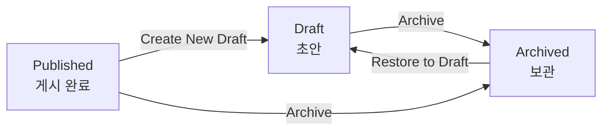
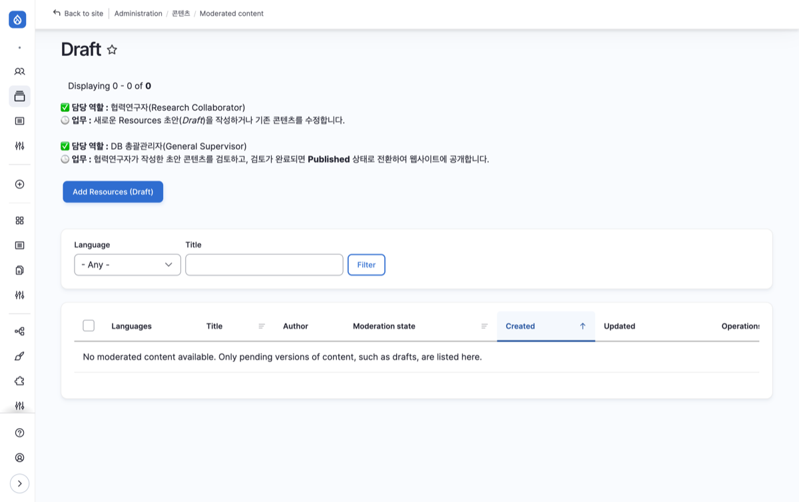

# 협력연구자 (Research Collaborator) 워크플로우

협력연구자는 Resources 콘텐츠의 초안을 등록하고 관리하는 역할입니다.

---

## 사용 가능한 상태 변경

| 전환 | 시작 상태 | 도착 상태 | 설명 |
|------|----------|----------|------|
| Create New Draft | Published | Draft | 게시된 콘텐츠를 수정하기 위해 초안으로 되돌림 |
| Archive | Draft, Published | Archived | 더 이상 필요 없는 콘텐츠를 보관 |
| Restore to Draft | Archived | Draft | 보관된 콘텐츠를 다시 초안으로 복원 |

:::note
협력연구자가 등록한 콘텐츠는 Draft 상태로 저장됩니다. 이후 DB 총괄관리자가 검토하여 게시(Publish)합니다.
:::

---

## 콘텐츠 등록

### 새 Resources를 Draft로 등록

| 항목 | 내용 |
|------|------|
| 위치 | Resources > Workflow > Draft |
| 버튼 | [Add Resources (Draft)] |

새로운 Resources 콘텐츠를 작성합니다. 작성된 콘텐츠는 Draft 상태로 저장되며, 웹사이트에 공개되지 않습니다.

---

## 상태 변경

콘텐츠의 상태는 Edit 화면 우측 사이드바의 **Change to** 드롭다운에서 변경합니다.

### 게시된 콘텐츠 수정 (Create New Draft)

이미 Published 상태인 콘텐츠를 수정해야 할 경우:

1. Resources > Workflow > Published에서 해당 게시글의 **Edit** 버튼 클릭
2. 우측 사이드바의 **Change to**에서 **Create New Draft** 선택
3. 콘텐츠를 수정한 후 **Save** 버튼 클릭

수정이 완료되면 DB 총괄관리자가 다시 Publish합니다.

### 콘텐츠 보관 (Archive)

더 이상 유지가 필요 없는 콘텐츠를 보관 처리합니다.

1. 해당 게시글의 **Edit** 버튼 클릭
2. 우측 사이드바의 **Change to**에서 **Archive** 선택
3. **Save** 버튼 클릭

### 보관된 콘텐츠 복원 (Restore to Draft)

보관된 콘텐츠를 다시 활용해야 할 경우:

1. Resources > Workflow > Archived에서 해당 게시글의 **Edit** 버튼 클릭
2. 우측 사이드바의 **Change to**에서 **Restore to Draft** 선택
3. 필요한 수정 후 **Save** 버튼 클릭
