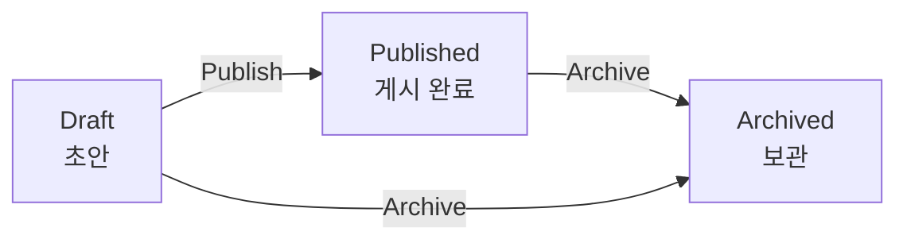

# DB 총괄관리자 (General Supervisor) 워크플로우

DB 총괄관리자는 협력연구자가 등록한 Resources 콘텐츠를 검토하고 게시(Publish)하는 역할입니다.

---

## 사용 가능한 상태 변경

| 전환 | 시작 상태 | 도착 상태 | 설명 |
|------|----------|----------|------|
| Publish | Draft | Published | 검토 완료된 콘텐츠를 웹사이트에 공개 |
| Archive | Draft, Published | Archived | 더 이상 필요 없는 콘텐츠를 보관 |

:::note
콘텐츠 초안 작성과 복원은 협력연구자가 담당하며, DB 총괄관리자는 검토 후 게시(Publish)합니다.
:::

---

## Draft 검토 및 게시 (Publish)

협력연구자가 등록한 Draft를 검토한 후 웹사이트에 공개합니다.

| 항목 | 내용 |
|------|------|
| 위치 | Resources > Workflow > Draft |
| 확인 사항 | 콘텐츠 내용, 분류(Taxonomy), 첨부파일 등 |

1. Resources > Workflow > Draft에서 검토할 게시글 확인
2. 게시글의 **Edit** 버튼 클릭
3. 콘텐츠 내용을 검토 (필요 시 수정)
4. 우측 사이드바의 **Change to**에서 **Published** 선택
5. **Save** 버튼 클릭

:::note
Published 상태의 콘텐츠는 웹사이트에 공개되며, 번역을 수행할 수 있습니다.
:::

---

## 게시된 콘텐츠 확인

| 항목 | 내용 |
|------|------|
| 위치 | Resources > Workflow > Published |

게시된 콘텐츠 목록을 확인하고 관리합니다.

---

## 콘텐츠 보관 (Archive)

더 이상 유지가 필요 없는 콘텐츠를 보관 처리합니다.

1. 해당 게시글의 **Edit** 버튼 클릭
2. 우측 사이드바의 **Change to**에서 **Archived** 선택
3. **Save** 버튼 클릭

---

## 콘텐츠 직접 등록

DB 총괄관리자는 필요 시 콘텐츠를 직접 등록하면서 바로 Published 상태로 저장할 수 있습니다.

| 항목 | 내용 |
|------|------|
| 위치 | Resources > Workflow > Draft |
| 버튼 | [Add Resources (Draft)] |

1. [Add Resources (Draft)] 버튼을 클릭하여 콘텐츠 작성
2. 우측 사이드바의 **Change to**에서 **Published** 선택
3. **Save** 버튼 클릭
