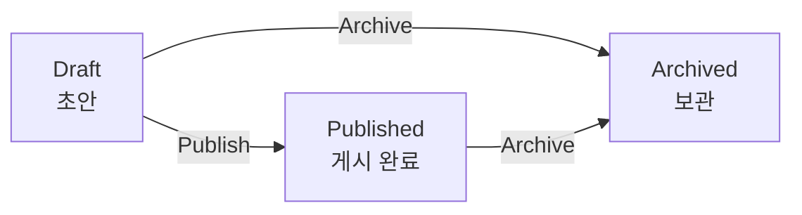

# 다큐멘탈리스트 (Documentalist) 워크플로우

다큐멘탈리스트는 협력연구자가 제공한 데이터를 검수하고, 검토가 완료된 콘텐츠를 게시(Publish)하거나 보관(Archive)합니다. 번역 관리에 대해서는 [번역 관리](../06-translation) 페이지를 참고하세요.

---

## 사용 가능한 상태 변경

| 전환 | 시작 상태 | 도착 상태 | 설명 |
|------|----------|----------|------|
| Publish | Draft | Published | 검토 완료된 콘텐츠를 웹사이트에 공개 |
| Archive | Draft, Published | Archived | 더 이상 필요 없는 콘텐츠를 보관 |

---

## Draft 검토 및 게시 (Publish)

협력연구자가 등록한 Draft를 검토한 후 웹사이트에 공개합니다.

| 항목 | 내용 |
|------|------|
| 위치 | Resources > Workflow > Draft |
| 확인 사항 | 콘텐츠 내용, 분류(Taxonomy), 첨부파일 등 |

1. Resources > Workflow > Draft에서 검토할 게시글 확인
2. 게시글의 **Edit** 버튼 클릭
3. 콘텐츠 내용을 검토 (필요 시 수정)
4. 우측 사이드바의 **Change to**에서 **Published** 선택
5. **Save** 버튼 클릭

---

## 콘텐츠 보관 (Archive)

더 이상 유지가 필요 없는 콘텐츠를 보관 처리합니다.

1. 해당 게시글의 **Edit** 버튼 클릭
2. 우측 사이드바의 **Change to**에서 **Archived** 선택
3. **Save** 버튼 클릭

---

## 관련 페이지

- [번역 관리](../06-translation) — 다큐멘탈리스트의 핵심 업무인 TMGMT 기반 번역 관리
