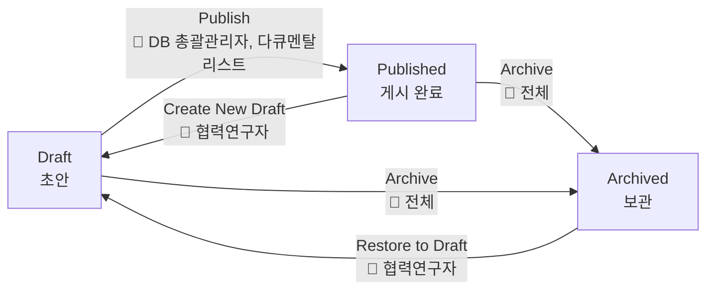
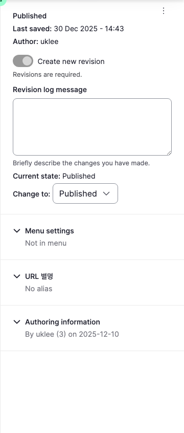
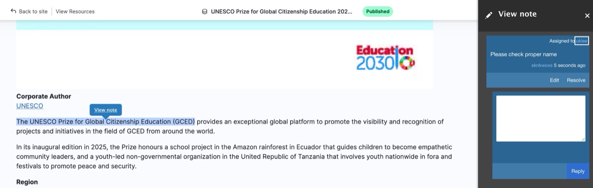

# 워크플로우

워크플로우(Workflow)는 Resources 콘텐츠의 등록, 검토, 게시, 보관 과정을 체계적으로 관리하기 위한 기능입니다.

---

## 상태 흐름

:::note
기존에는 Draft → Picked → Staged → Published → Archived 5단계 워크플로우였으나, 운영 효율을 위해 현재 3단계(Draft → Published → Archived)로 단순화하여 운영 중입니다.
:::

---

## 상태

| 상태 | 설명 | 공개 여부 |
|------|------|:--------:|
| **Draft** | 협력연구자가 작성한 초안 | 비공개 |
| **Published** | 최종 승인, 웹사이트에 공개 | **공개** |
| **Archived** | 더 이상 노출하지 않고 보관 | 비공개 |

---

## 콘텐츠 등록

Resources를 새로 등록할 때 두 가지 방식이 있습니다.

### Draft로 등록 (워크플로우 적용)

협력연구자가 콘텐츠를 **Draft** 상태로 등록합니다. 등록된 Draft는 DB 총괄관리자의 검토와 게시 승인을 거쳐 Published 상태가 됩니다.

| 수행자 | 작업 |
|--------|------|
| 협력연구자 | Draft로 콘텐츠 등록 |
| DB 총괄관리자 | Draft를 검토한 후 Publish |

### Published로 직접 등록 (워크플로우 생략)

DB 총괄관리자는 콘텐츠를 등록하면서 바로 **Published** 상태로 저장할 수 있습니다. 검토 과정이 필요 없는 콘텐츠에 활용합니다.

:::note
협력연구자는 Publish 권한이 없으므로, 반드시 Draft로만 등록할 수 있습니다.
:::

---

## 상태 변경

콘텐츠의 상태는 Edit 화면 우측 사이드바의 **Change to** 드롭다운에서 변경합니다.

1. 해당 게시글의 **Edit** 버튼 클릭
2. 필요한 경우 콘텐츠 수정
3. 우측 사이드바의 **Change to** 드롭다운에서 변경할 상태 선택
4. **Save** 버튼 클릭

### 상태 변경 종류

| 전환 | 시작 상태 | 도착 상태 | 설명 |
|------|----------|----------|------|
| Publish | Draft | Published | 검토 완료 후 웹사이트에 공개 |
| Create New Draft | Published | Draft | 게시된 콘텐츠를 수정하기 위해 초안으로 되돌림 |
| Archive | Draft, Published | Archived | 더 이상 필요 없는 콘텐츠를 보관 |
| Restore to Draft | Archived | Draft | 보관된 콘텐츠를 다시 초안으로 복원 |

### 역할별 권한

| 전환 | 협력연구자 | 다큐멘탈리스트 | DB 총괄관리자 |
|------|:--------:|:----------:|:----------:|
| Create New Draft | O | - | - |
| Publish | - | O | O |
| Archive | O | O | O |
| Restore to Draft | O | - | - |

---

## Moderation Notes (노트)

콘텐츠 검토 과정에서 작업자 간 의견을 주고받을 수 있는 기능입니다.

### 노트 작성

1. 콘텐츠 View 화면에서 의견을 남길 **텍스트를 드래그하여 선택**
2. **Add note** 버튼이 나타나면 클릭
3. **Assignee**에 담당자를 지정하고, 내용을 입력한 후 **Save**

### 노트 확인

콘텐츠 View 화면 우측 상단 메뉴에서 **View Note**를 클릭하면 우측 패널에 노트 목록이 표시됩니다.

- **Reply**: 노트에 답글 작성
- **Resolve**: 처리 완료된 노트를 해결 처리
- **Edit**: 노트 내용 수정

### 이메일 알림

노트가 작성되면 Assignee로 지정된 담당자에게 이메일 알림이 발송됩니다.

:::note
협력연구자, DB 총괄관리자, 다큐멘탈리스트 모두 노트 작성 및 확인이 가능합니다.
:::

---

## 워크플로우 화면 접근

상태별 게시글은 다음 관리자 화면에서 확인할 수 있습니다.

| 메뉴 | 경로 |
|------|------|
| 전체 | Resources > Workflow > All |
| Draft | Resources > Workflow > Draft |
| Published | Resources > Workflow > Published |
| Archived | Resources > Workflow > Archived |

---

## 역할별 워크플로우 안내

각 역할에 해당하는 상세 워크플로우를 확인하세요.

- [협력연구자 (Research Collaborator)](./01-research-collaborator) — 초안 등록, 수정, 보관, 복원
- [DB 총괄관리자 (General Supervisor)](./02-general-supervisor) — 검토, 게시 승인, 보관
- [다큐멘탈리스트 (Documentalist)](./03-documentalist) — 검수, 게시 승인, 보관
