# 번역 관리

TMGMT(Translation Management Tool) 모듈을 통해 콘텐츠 번역을 관리합니다.

---

## 개요

클리어링하우스는 7개 언어를 지원하며, 두 가지 번역 방법을 제공합니다:

1. **직접 번역**: 번역담당자가 직접 번역 콘텐츠 입력
2. **번역 요청**: DB 총괄관리자가 번역담당자에게 번역 업무 할당

### 지원 언어

English, Arabic, Chinese (Simplified), French, Russian, Spanish, Korean

### 번역 가능 콘텐츠

- Resources (Published 상태만)
- Events
- News
- Useful Links

:::note
Resources는 Published 상태에서만 번역이 가능합니다.
:::

---

## 번역담당자

번역담당자는 별도의 Drupal 역할이 아니라, **다큐멘탈리스트(Documentalist)** 역할을 가진 회원 중 번역 업무를 담당하는 사용자를 뜻합니다.

- People에서 회원 추가 시 **Translation skills**를 설정하면 해당 언어의 번역 업무가 할당됩니다
- 번역 권한은 다큐멘탈리스트와 최고관리자만 보유합니다

### Translation Skills 설정

번역담당자에게 번역 업무를 할당하려면 **Translation skills** 필드를 설정해야 합니다. 이 설정은 사용자가 어떤 언어에서 어떤 언어로 번역할 수 있는지를 정의합니다.

#### 설정 방법

1. **People** 메뉴에서 번역담당자로 지정할 사용자를 찾습니다
2. 사용자 이름을 클릭하여 **Edit** 화면으로 이동합니다
3. 화면 하단의 **Translation skills** 섹션을 찾습니다
4. **From** 드롭다운에서 원본 언어를 선택합니다
5. **To** 드롭다운에서 대상 언어를 선택합니다
6. 추가 언어 쌍이 필요한 경우 **Add another item** 버튼을 클릭합니다
7. **Save** 버튼을 클릭하여 저장합니다

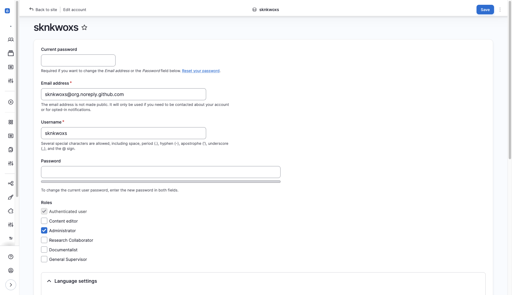

:::tip[여러 언어 쌍 설정]
한 명의 번역담당자에게 여러 언어 쌍을 설정할 수 있습니다. 예를 들어:
- English → Korean
- English → French
- French → Korean

이렇게 설정하면 해당 담당자는 세 가지 언어 조합의 번역 업무를 할당받을 수 있습니다.
:::

### 역할별 번역 권한

| 역할 | 번역 요청 | 직접 번역 | 번역 검토 |
|:----:|:--------:|:--------:|:--------:|
| 최고관리자 (Administrator) | O | O | O |
| DB 총괄관리자 (General Supervisor) | O | - | O |
| 다큐멘탈리스트 (Documentalist) | - | O | O |

:::note[번역 업무 흐름]
- **DB 총괄관리자**: 번역이 필요한 콘텐츠를 확인하고 다큐멘탈리스트에게 번역 요청 및 할당
- **다큐멘탈리스트**: 할당된 번역 작업을 수행하고, 완료 후 검토를 위해 제출
- **DB 총괄관리자**: 번역 결과를 검토한 후 최종 게시. 필요시 수정 요청
:::

---

## 번역 업무 흐름

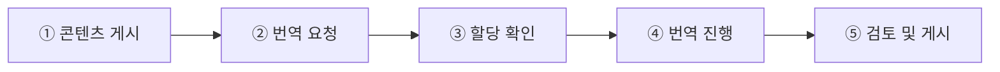

1. **콘텐츠 게시** — Published 상태의 콘텐츠 준비 `DB 총괄관리자`
2. **번역 요청** — 번역 화면에서 번역담당자에게 요청 `DB 총괄관리자`
3. **할당 확인** — Manage Tasks에서 번역 할당 내역 확인 `번역담당자`
4. **번역 진행** — 번역 콘텐츠 입력, 수정 후 저장 `번역담당자`
5. **검토 및 게시** — 번역 결과 검토 후 최종 게시 `DB 총괄관리자`

---

## 번역 메뉴 접근

### 방법 1: 콘텐츠 목록에서 접근

1. 콘텐츠 목록 화면에서 번역할 콘텐츠 찾기
2. **Operations** 컬럼의 드롭다운 클릭
3. **Translate** 선택

### 방법 2: 콘텐츠 편집 화면에서 접근

1. 콘텐츠 편집 화면 진입
2. 상단 탭에서 **Translate** 클릭

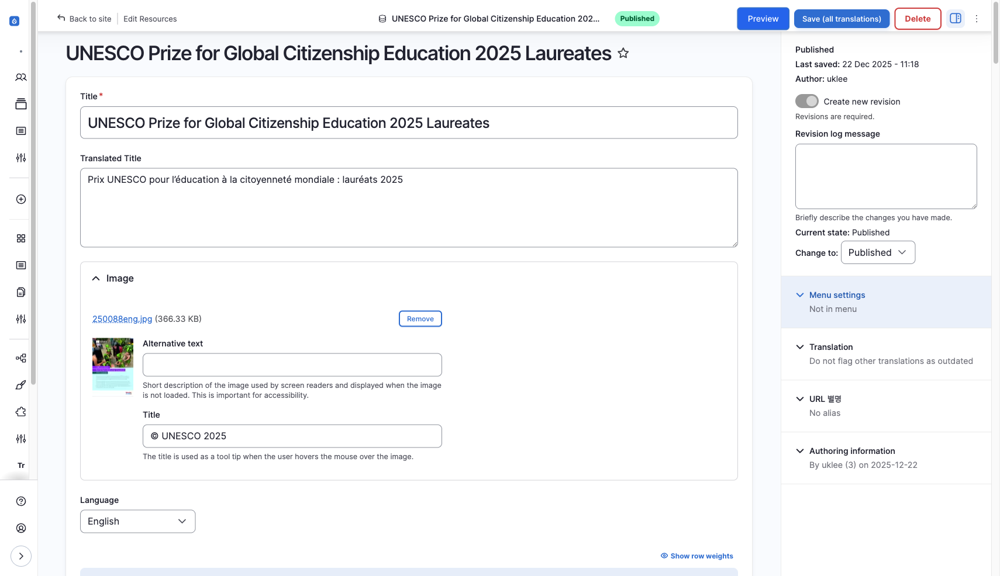

---

## 번역 화면 구성

번역 화면(`/node/{nid}/translations`)에서 각 언어별 번역 상태를 확인할 수 있습니다.

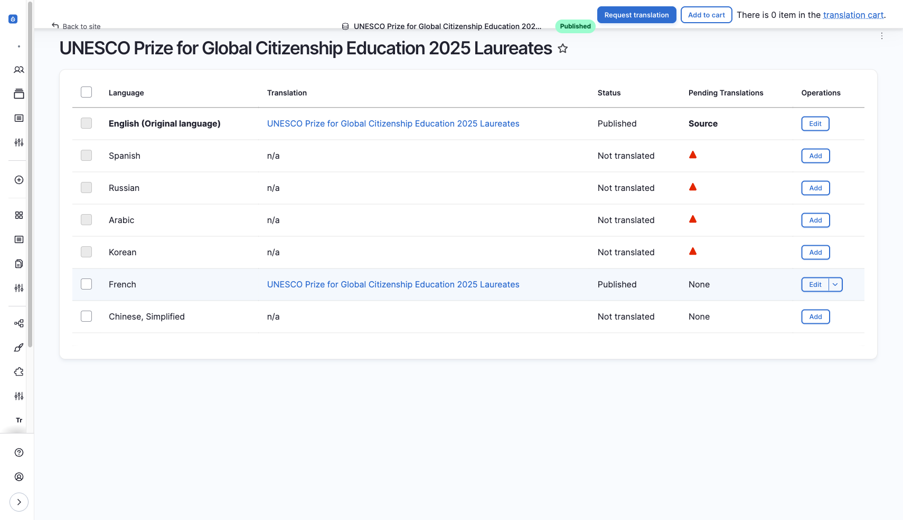

| 컬럼 | 설명 |
|------|------|
| **Language** | 언어명 |
| **Translation** | 번역 상태 (Original / Published / Not translated) |
| **Operations** | 작업 버튼 (View / Edit / Add) |

### 작업 버튼

| 버튼 | 설명 |
|------|------|
| **View** | 해당 언어 번역본 열람 |
| **Edit** | 기존 번역 수정 |
| **Add** | 새 번역 추가 (직접 번역) |
| **Request translation** | 번역담당자에게 번역 요청 |

---

## 1. 직접 번역

번역담당자가 직접 번역 작업을 수행합니다. 간단한 번역이나 즉시 처리가 필요한 경우에 활용합니다.

### 번역 진행 방법

1. 번역 화면에서 번역할 언어의 **Add** 버튼 클릭

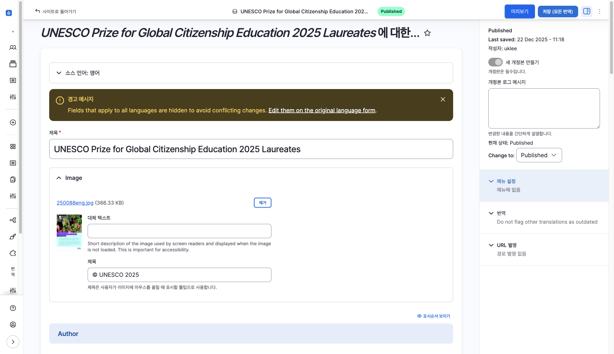

2. 원래 언어(Original language)의 각 필드를 번역 언어로 변경
3. **Save** 버튼 클릭

### 번역 대상 필드

모든 필드가 번역 대상에 포함되지는 않습니다.

**번역 대상 필드:**
- Title (제목)
- Description (본문)
- 기타 텍스트 필드

**번역 미대상 필드:**
- Author
- Corporate Author
- DB URL
- Ebook URL
- File
- Keyword
- Region
- Resource Info (Format, File type)
- Resource URL
- Topic
- Translate Title
- Translator
- Year of publication

:::note
번역 대상 필드 변경이 필요한 경우 개발팀에 요청해주세요.
:::

---

## 2. 번역 요청 (번역담당자 할당)

DB 총괄관리자가 번역담당자에게 번역 업무를 할당합니다.

### 요청 절차

1. 번역 화면에서 번역할 언어 선택 (체크박스)
2. **Request translation** 버튼 클릭
3. **Provider** 드롭다운에서 **Utilisateur Drupal** 선택

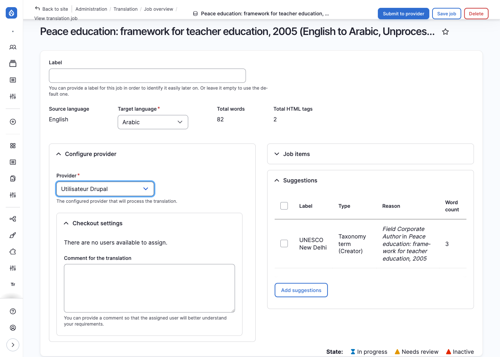

4. **Submit to provider** 클릭

### 할당 후 흐름

1. **자동 할당**: Translation skills가 일치하는 번역담당자에게 업무 할당
2. **담당자 확인**: Manage Tasks 화면에서 할당된 업무 확인
3. **번역 진행**: 담당자가 직접 번역 입력
4. **검토 및 저장**: DB 총괄관리자가 검토 후 Save as completed로 번역 완료

:::note[이메일 알림]
현재 번역 업무가 할당되어도 별도 이메일 알림이 발송되지 않습니다. 필요한 경우 개발팀에 요청하여 구현할 수 있습니다.
:::

---

## 번역 할당 확인 (Manage Tasks)

| 항목 | 내용 |
|------|------|
| **위치** | Manage Tasks |
| **경로** | `/manage-translate` |
| **접근 권한** | 번역담당자 (Documentalist) |

번역담당자는 이 페이지에서 자신에게 할당된 번역 작업 목록을 확인합니다.

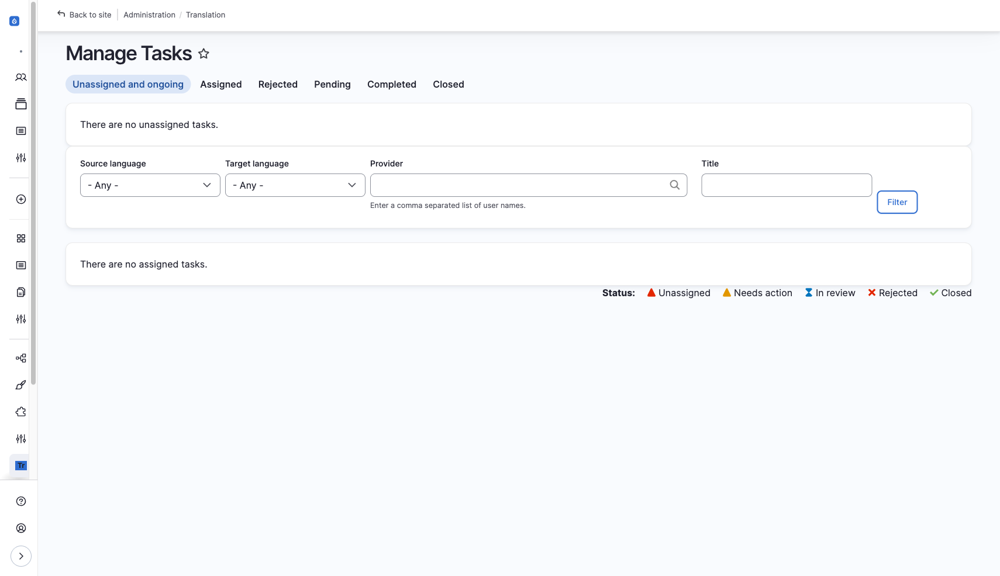

- 회원의 **번역 가능 언어** 설정에 따라 해당 언어의 번역 작업만 표시
- 할당된 번역 작업을 클릭하여 번역 진행 화면(`/translate/items/{tid}`)으로 이동

---

## 번역 검토 화면

번역담당자가 번역을 완료하면 DB 총괄관리자가 검토합니다.

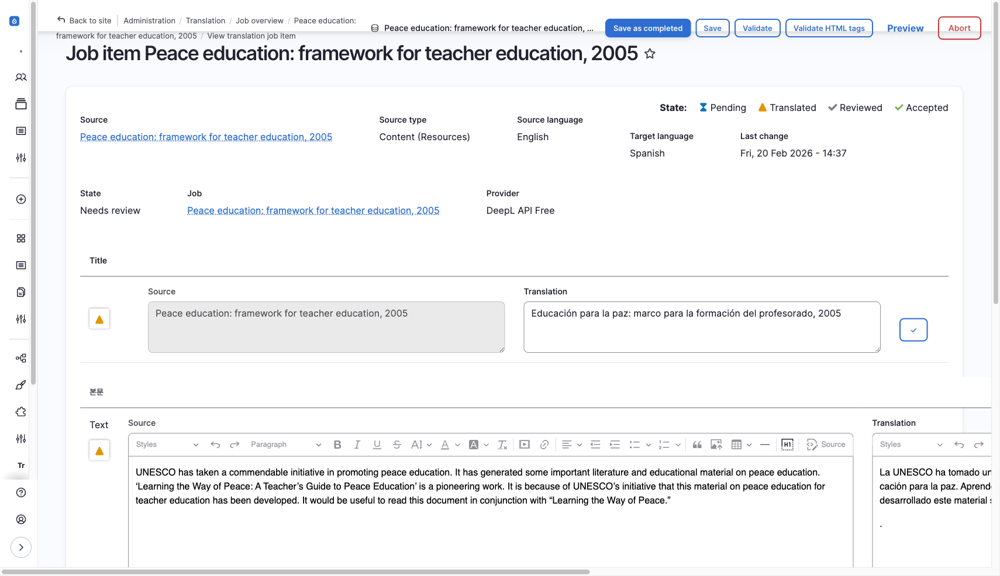

| 영역 | 설명 |
|------|------|
| **Source** | 원문 (원래 언어) |
| **Translation** | 번역문 |

### 저장 옵션

| 버튼 | 설명 |
|------|------|
| **Save** | 검토 상태 유지하고 저장 (수정 필요시) |
| **Save as completed** | 검토 완료 후 저장 및 공개 |

---

## 번역 요청 철회

이미 요청한 번역을 철회해야 하는 경우 (잘못 요청했거나 더 이상 번역이 필요 없는 경우) 다음 방법으로 처리합니다.

### 철회 방법

1. **Resources > Translation > Jobs** 로 이동 (`/admin/tmgmt/jobs`)
2. 철회할 번역 요청(Job)을 찾아 클릭
3. Job 상세 화면에서 **Abort job** 버튼 클릭
4. 확인 메시지에서 **Confirm** 클릭

:::caution[주의사항]
- **Abort**된 Job은 되돌릴 수 없습니다
- 번역담당자가 이미 작업 중인 경우, 해당 작업 내용이 삭제됩니다
- 필요한 경우 번역담당자에게 미리 알려주세요
:::

### Job 상태별 처리

| Job 상태 | 철회 가능 | 방법 |
|----------|----------|------|
| Unprocessed | O | Abort job |
| In progress | O | Abort job (작업 내용 삭제됨) |
| Finished | X | 이미 완료됨 (번역본 직접 삭제 필요) |

---

## 번역 관리 화면

### Jobs

| 항목 | 내용 |
|------|------|
| **위치** | Resources > Translation > Jobs |
| **경로** | `/admin/tmgmt/jobs` |

- 번역 요청 단위(Job)별 관리
- 하나의 Job에는 여러 Job Items가 포함될 수 있음
- 콘텐츠 확인 및 공개/비공개 설정 가능

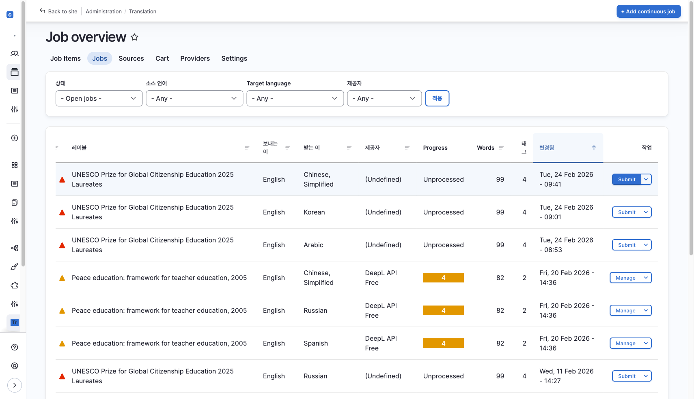

### Job Items

| 항목 | 내용 |
|------|------|
| **위치** | Resources > Translation > Job Items |
| **경로** | `/admin/tmgmt/items` |

- 콘텐츠별 번역 요청 내역 확인
- **Review** 버튼으로 번역 진행 내역 열람

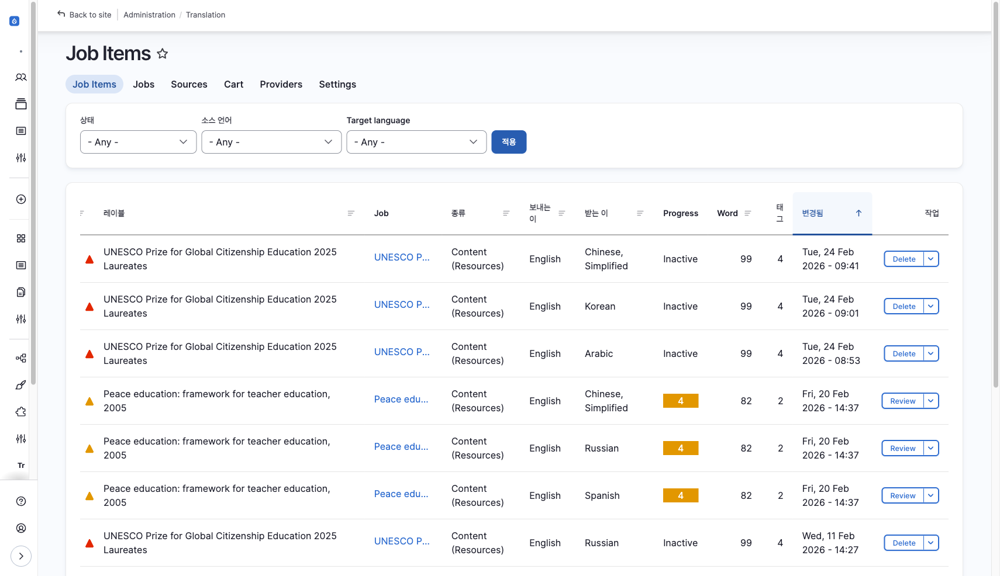

### Translation Sources

| 항목 | 내용 |
|------|------|
| **위치** | Resources > Translation > Translation Sources |
| **경로** | `/admin/tmgmt/sources` |

- 등록된 모든 콘텐츠의 언어별 번역 현황 확인
- 한 눈에 번역 상태 파악 가능

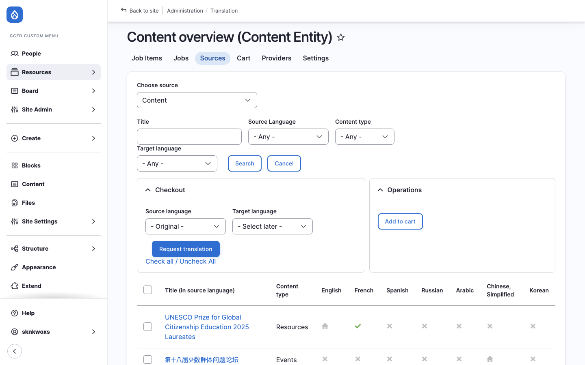

---

## 번역 워크플로우 요약

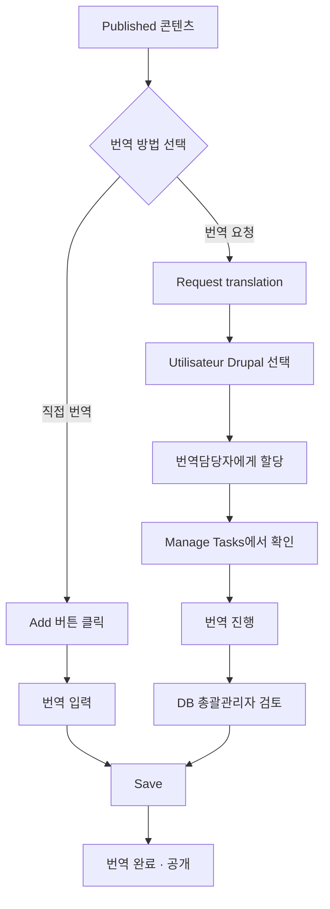

---

## 다음 단계

- [웹사이트 관리](./07-site-admin) — 메인화면, 팝업, 통계 관리
