# 번역 관리

TMGMT(Translation Management Tool) 모듈을 통해 콘텐츠 번역을 관리합니다.

---

## 개요

클리어링하우스는 7개 언어를 지원하며, 세 가지 번역 방법을 제공합니다:
1. **직접 번역**: 수동으로 번역 콘텐츠 입력
2. **AI 번역 요청**: DeepL을 통한 자동 번역 후 검토
3. **번역담당자 요청**: 담당자에게 번역 업무 할당

### 지원 언어

English, Arabic, Chinese (Simplified), French, Russian, Spanish, Korean

### 번역 가능 콘텐츠

- Resources (Published 상태만)
- Events
- News
- Useful Links

:::note
Resources는 Published 상태에서만 번역이 가능합니다.
:::

---

## 번역담당자

번역담당자는 별도의 Drupal 역할이 아니라, **다큐멘탈리스트(Documentalist)** 역할을 가진 회원 중 번역 업무를 담당하는 사용자를 뜻합니다.

- People에서 회원 추가 시 **Translation skills**를 설정하면 해당 언어의 번역 업무가 할당됩니다
- 번역 권한은 다큐멘탈리스트와 최고관리자만 보유합니다

### Translation Skills 설정

번역담당자에게 번역 업무를 할당하려면 **Translation skills** 필드를 설정해야 합니다. 이 설정은 사용자가 어떤 언어에서 어떤 언어로 번역할 수 있는지를 정의합니다.

#### 설정 방법

1. **People** 메뉴에서 번역담당자로 지정할 사용자를 찾습니다
2. 사용자 이름을 클릭하여 **Edit** 화면으로 이동합니다
3. 화면 하단의 **Translation skills** 섹션을 찾습니다
4. **From** 드롭다운에서 원본 언어를 선택합니다
5. **To** 드롭다운에서 대상 언어를 선택합니다
6. 추가 언어 쌍이 필요한 경우 **Add another item** 버튼을 클릭합니다
7. **Save** 버튼을 클릭하여 저장합니다

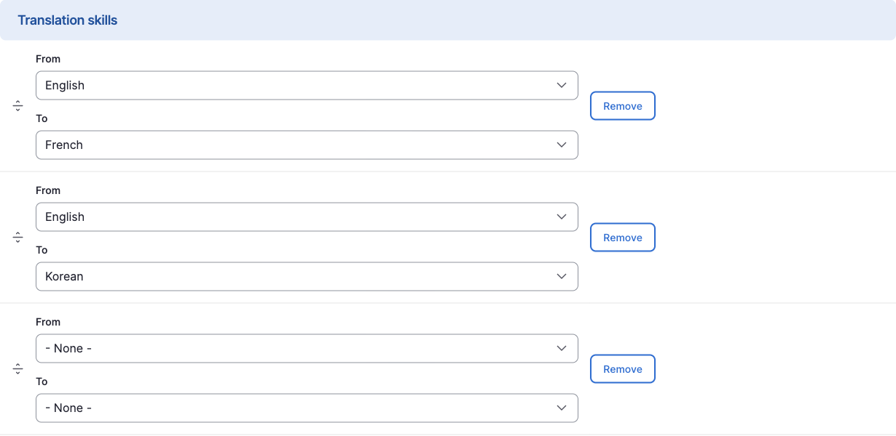

:::tip[여러 언어 쌍 설정]
한 명의 번역담당자에게 여러 언어 쌍을 설정할 수 있습니다. 예를 들어:
- English → Korean
- English → French
- French → Korean

이렇게 설정하면 해당 담당자는 세 가지 언어 조합의 번역 업무를 할당받을 수 있습니다.
:::

#### 번역 업무 자동 할당

Translation skills가 설정된 사용자에게는 번역 요청 시 자동으로 업무가 할당됩니다:

- 번역 요청의 **원본 언어**와 **대상 언어**가 사용자의 Translation skills와 일치하면 해당 사용자에게 업무가 할당됩니다
- People 목록 화면에서 **Translation skills** 컬럼을 통해 각 사용자의 설정된 언어 쌍을 확인할 수 있습니다

### 역할별 번역 권한

| 역할 | 번역 요청 | 직접 번역 | 번역 검토 |
|:----:|:--------:|:--------:|:--------:|
| 최고관리자 (Administrator) | O | O | O |
| 다큐멘탈리스트 (Documentalist) | O | O | O |
| DB 총괄관리자 (General Supervisor) | - | - | - |
| 협력연구자 (Research Collaborator) | - | - | - |

---

## 번역 업무 흐름

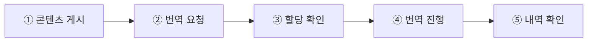

1. **콘텐츠 게시** — Published 상태의 콘텐츠 준비 `최고관리자 / DB 총괄관리자`
2. **번역 요청** — 번역 화면에서 AI 번역 요청 `최고관리자 / 번역담당자`
3. **할당 확인** — Manage Tasks에서 번역 할당 내역 확인 `번역담당자`
4. **번역 진행** — 번역 콘텐츠 검토, 수정 후 저장 `번역담당자`
5. **내역 확인** — Translation 관리 화면에서 상태 확인 `번역담당자`

---

## 번역 메뉴 접근

### 방법 1: 콘텐츠 목록에서 접근

1. 콘텐츠 목록 화면에서 번역할 콘텐츠 찾기
2. **Operations** 컬럼의 드롭다운 클릭
3. **Translate** 선택

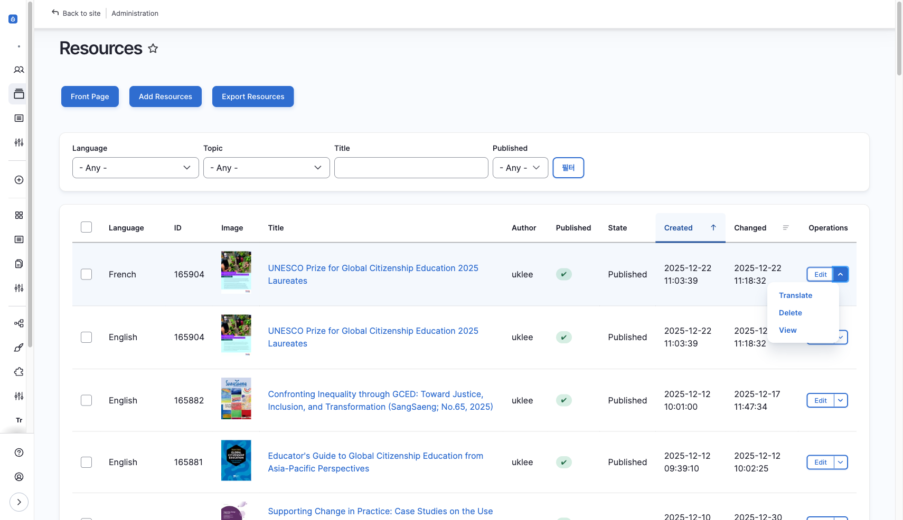

### 방법 2: 콘텐츠 편집 화면에서 접근

1. 콘텐츠 편집 화면 진입
2. 상단 탭에서 **Translate** 클릭

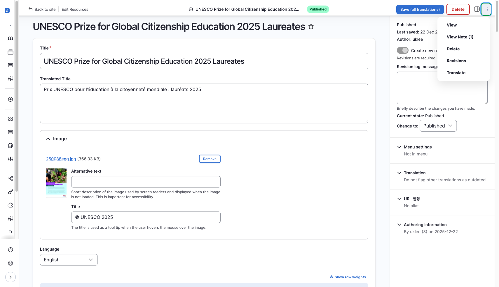

---

## 번역 화면 구성

번역 화면(`/node/{nid}/translations`)에서 각 언어별 번역 상태를 확인할 수 있습니다.

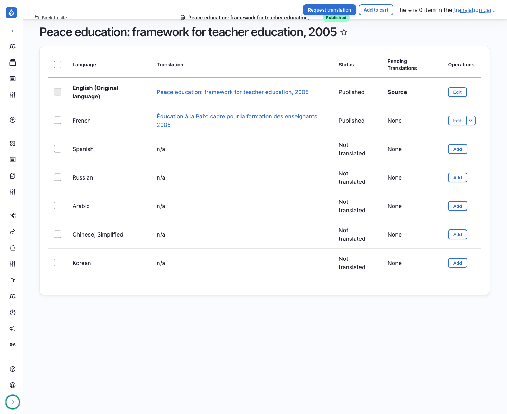

| 컬럼 | 설명 |
|------|------|
| **Language** | 언어명 |
| **Translation** | 번역 상태 (Original / Published / Not translated) |
| **Operations** | 작업 버튼 (View / Edit / Add) |

### 작업 버튼

| 버튼 | 설명 |
|------|------|
| **View** | 해당 언어 번역본 열람 |
| **Edit** | 기존 번역 수정 |
| **Add** | 새 번역 추가 (직접 번역) |
| **Request translation** | 번역 요청 (AI 번역 또는 번역담당자 요청) |

---

## 번역 요청 방법 구분

번역을 수행하는 방법은 크게 **직접 번역**과 **번역 요청** 두 가지로 나뉉니다.

### 직접 번역 vs 번역 요청

- **직접 번역**
  - 방법: Add 버튼 클릭
  - 번역 수행: 사용자가 직접 입력
  - 워크플로우: 즉시 저장
  - 적합한 경우: 간단한 번역, 즉시 처리 필요

- **번역 요청**
  - 방법: Request translation 버튼 클릭
  - 번역 수행: AI 또는 번역담당자
  - 워크플로우: 요청 → 번역 → 검토 → 저장
  - 적합한 경우: 대량 번역, 품질 관리 필요

### 번역 요청 종류: AI vs 번역담당자

**Request translation** 버튼을 클릭한 후, **Provider** 선택에 따라 번역 방식이 결정됩니다:

- **DeepL API** — AI가 자동 번역 수행 (빠른 번역 필요, 대량 처리)
- **Utilisateur Drupal** — 번역담당자에게 업무 할당 (전문 번역 필요, 품질 중시)

:::tip[번역담당자 요청의 장점]
번역담당자 요청 방식은 **Translation skills**가 설정된 담당자에게 자동으로 업무가 할당됩니다. 담당자는 **Manage Tasks** 화면에서 할당된 업무를 확인하고 번역을 진행합니다.
:::

---

## 직접 번역

이미 등록된 콘텐츠에 대해 직접 번역 작업을 수행합니다.

### 번역 진행 방법

1. 번역 화면에서 번역할 언어의 **Add** 버튼 클릭

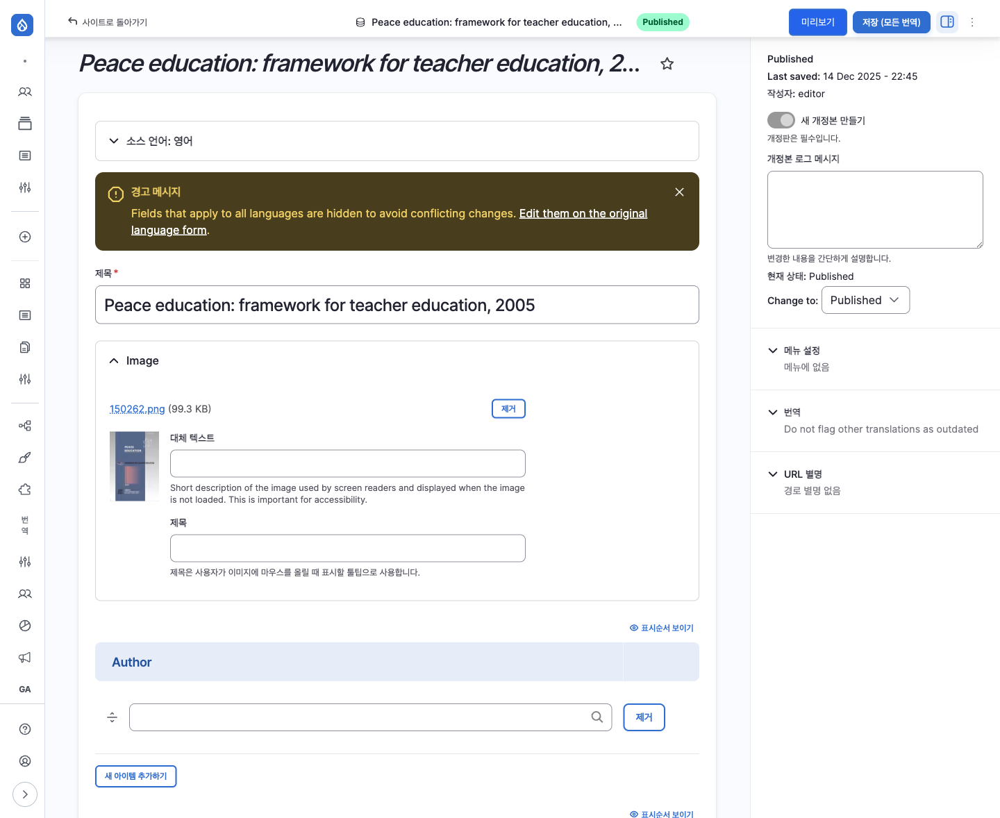

2. 원래 언어(Original language)의 각 필드를 번역 언어로 변경
3. **Save** 버튼 클릭

### 번역 대상 필드

모든 필드가 번역 대상에 포함되지는 않습니다.

**번역 대상 필드:**
- Title (제목)
- Description (본문)
- 기타 텍스트 필드

**번역 미대상 필드:**
- Author
- Corporate Author
- DB URL
- Ebook URL
- File
- Keyword
- Region
- Resource Info (Format, File type)
- Resource URL
- Topic
- Translate Title
- Translator
- Year of publication

:::note
번역 대상 필드 변경이 필요한 경우 개발팀에 요청해주세요.
:::

---

## AI 번역 요청 (TMGMT + DeepL)

DeepL을 통해 자동 번역을 수행합니다.

### 번역 요청 방법

1. 번역 화면에서 번역할 언어 선택 (체크박스)
2. **Request translation** 버튼 클릭

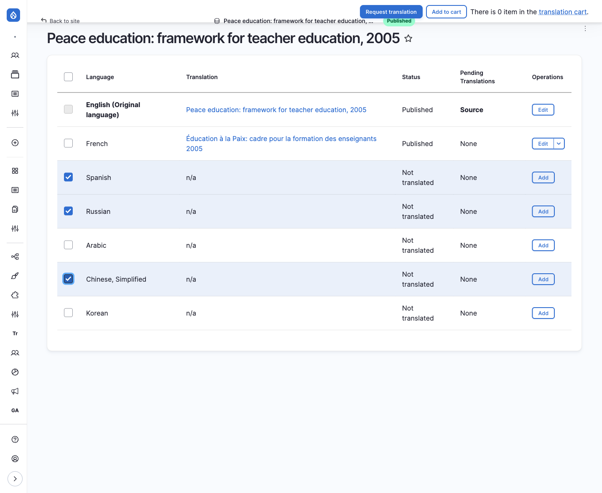

3. **Provider** 드롭다운에서 **DeepL API** 선택 후 **Submit to provider** 클릭

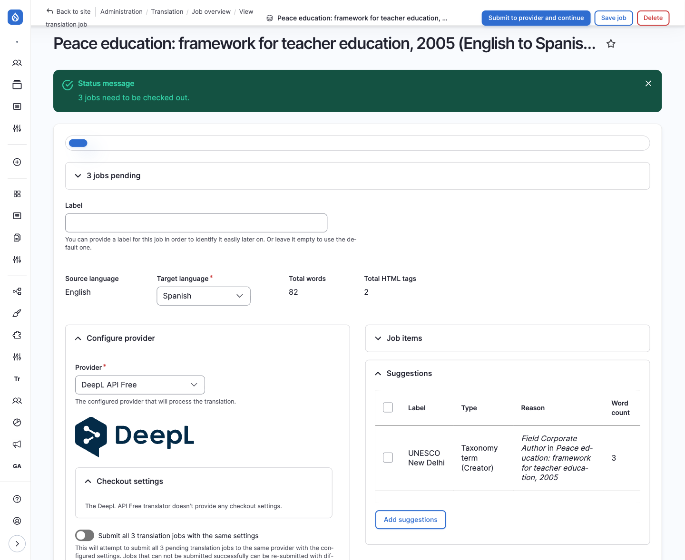

### 번역 완료 후

1. 번역 완료 시 메시지 출력
2. 번역 초안 작성 후, **검토 필요 상태(Needs review)**로 전환
3. 해당 버튼을 클릭하여 번역 내역 열람

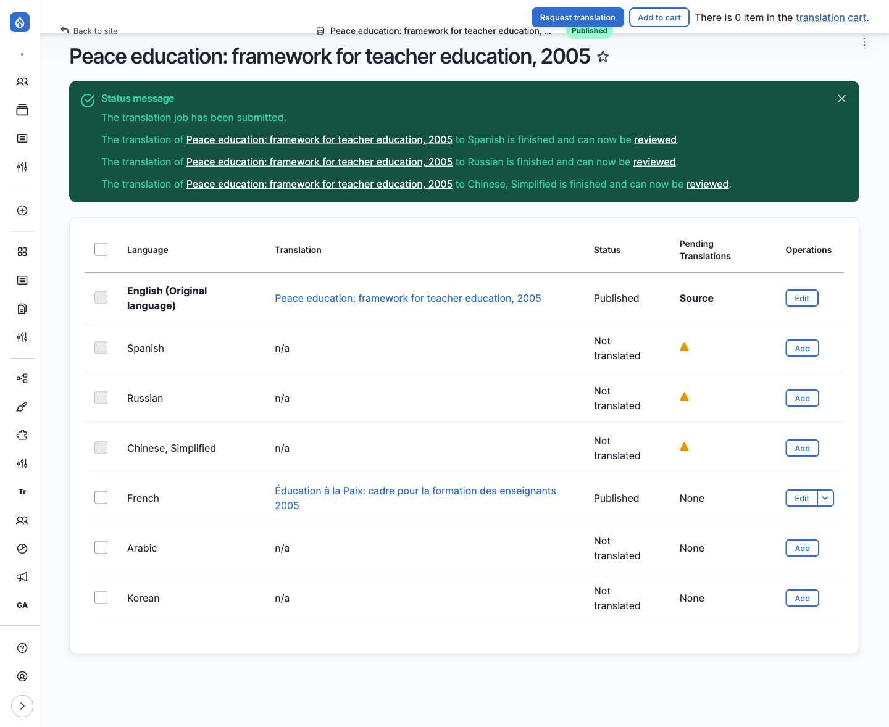

### 번역 검토 화면

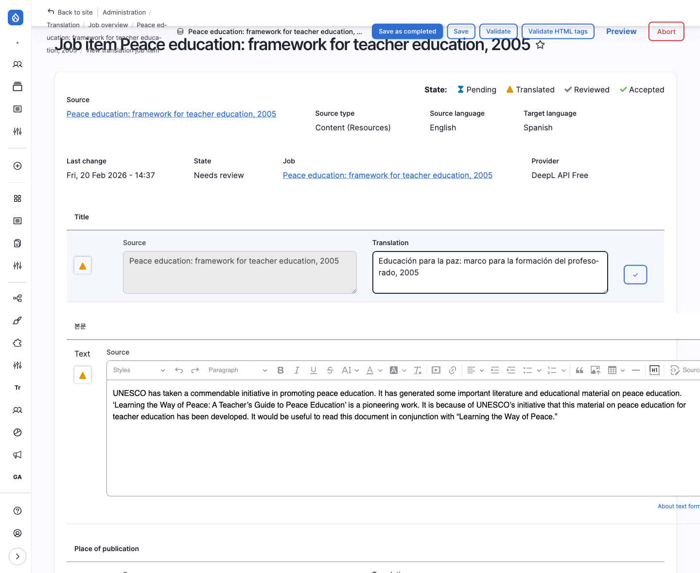

| 영역 | 설명 |
|------|------|
| **Source** | 원문 (원래 언어) |
| **Translation** | 번역문 (AI 번역 결과) |

### 저장 옵션

| 버튼 | 설명 |
|------|------|
| **Save** | 검토 상태 유지하고 저장 |
| **Save as completed** | 검토 완료 후 저장 및 공개 |

---

## 번역담당자 요청 (Utilisateur Drupal)

번역담당자에게 번역 업무를 할당합니다. AI 번역과 달리 사람이 직접 번역을 수행합니다.

### 요청 절차

1. 번역 화면에서 번역할 언어 선택 (체크박스)
2. **Request translation** 버튼 클릭
3. **Provider** 드롭다운에서 **Utilisateur Drupal** 선택

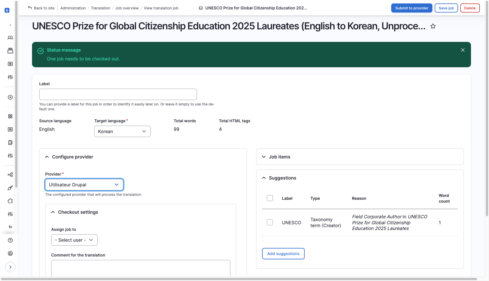

4. **Submit to provider** 클릭

:::caution[Provider 선택 주의]
DeepL API를 선택하면 AI 번역이 즉시 실행됩니다. 번역담당자에게 할당하려면 반드시 **Utilisateur Drupal**을 선택하세요.
:::

### 할당 후 흐름

1. **자동 할당**: Translation skills가 일치하는 번역담당자에게 업무 할당
2. **담당자 확인**: Manage Tasks 화면에서 할당된 업무 확인
3. **번역 진행**: 담당자가 직접 번역 입력
4. **검토 및 저장**: Save as completed로 번역 완료

:::note[이메일 알림]
현재 번역 업무가 할당되어도 별도 이메일 알림이 발송되지 않습니다. 필요한 경우 개발팀에 요청하여 구현할 수 있습니다.
:::

### AI 번역과의 차이점

- **AI 번역 요청**
  - 번역 수행: DeepL이 자동 번역
  - 처리 속도: 즉시 (수 초)
  - 비용: API 사용량에 따른 비용 발생
  - 품질: AI 번역 후 검토 필요
  - 적합한 경우: 대량 번역, 빠른 처리 필요

- **번역담당자 요청**
  - 번역 수행: 담당자가 직접 번역
  - 처리 속도: 담당자 작업 속도에 따름
  - 비용: 추가 비용 없음
  - 품질: 전문가 번역으로 품질 보장
  - 적합한 경우: 전문 번역, 버지턴 언어

:::note[번역담당자 설정 필요]
번역담당자 요청을 사용하려면 미리 **Translation skills**가 설정된 사용자가 있어야 합니다. [번역담당자](#번역담당자) 섹션을 참고하세요.
:::

---

## 번역 할당 확인 (Manage Tasks)

| 항목 | 내용 |
|------|------|
| **위치** | Manage Tasks |
| **경로** | `/manage-translate` |
| **접근 권한** | 번역담당자 (Documentalist) |

번역담당자는 이 페이지에서 자신에게 할당된 번역 작업 목록을 확인합니다.

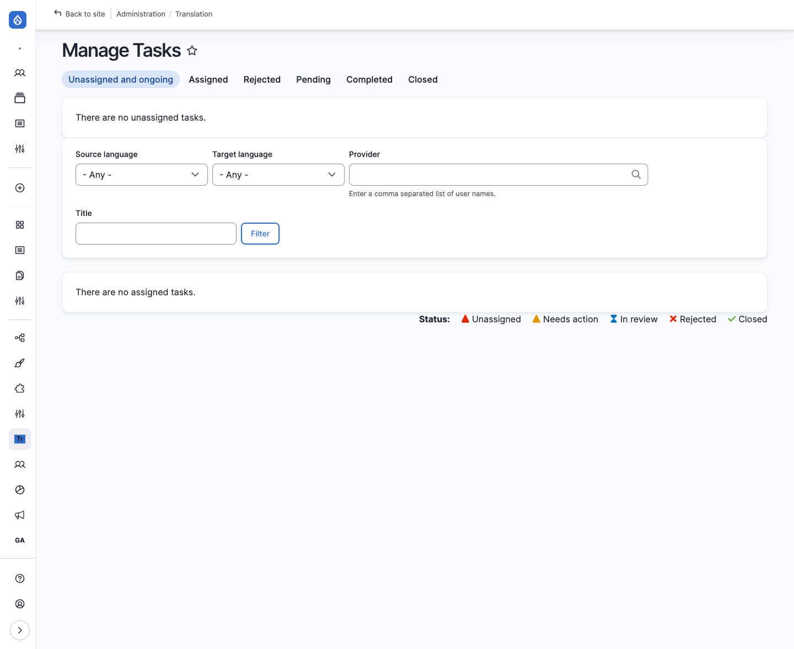

- 회원의 **번역 가능 언어** 설정에 따라 해당 언어의 번역 작업만 표시
- 할당된 번역 작업을 클릭하여 번역 진행 화면(`/translate/items/{tid}`)으로 이동

---

## 번역 관리 화면

### Jobs

| 항목 | 내용 |
|------|------|
| **위치** | Resources > Translation > Jobs |
| **경로** | `/admin/tmgmt/jobs` |

- 번역 요청 단위(Job)별 관리
- 하나의 Job에는 여러 Job Items가 포함될 수 있음
- 콘텐츠 확인 및 공개/비공개 설정 가능

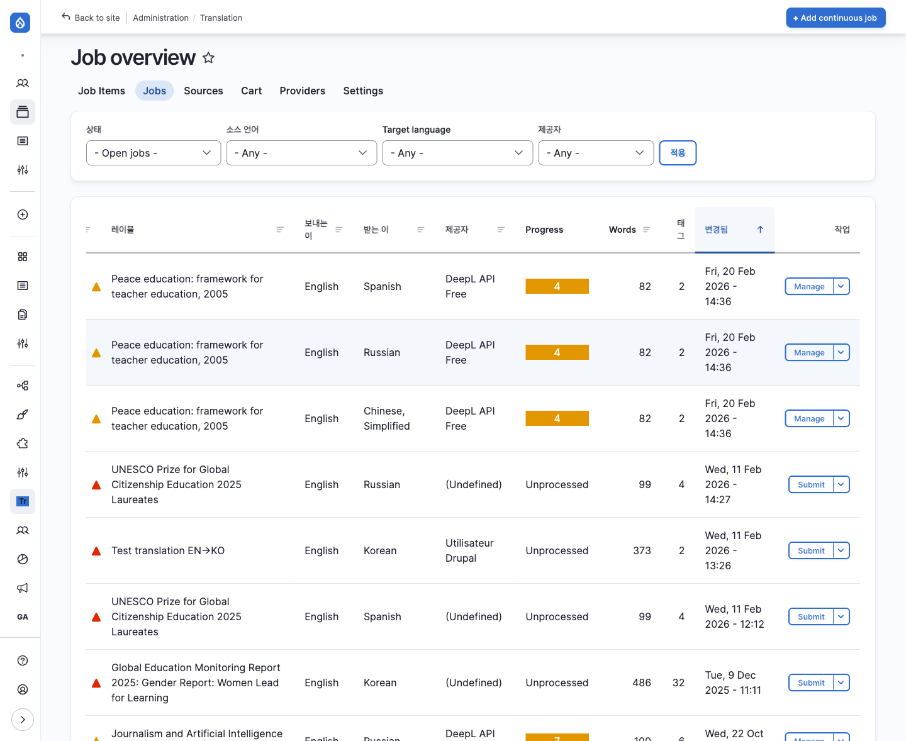

### Job Items

| 항목 | 내용 |
|------|------|
| **위치** | Resources > Translation > Job Items |
| **경로** | `/admin/tmgmt/items` |

- 콘텐츠별 번역 요청 내역 확인
- **Review** 버튼으로 번역 진행 내역 열람

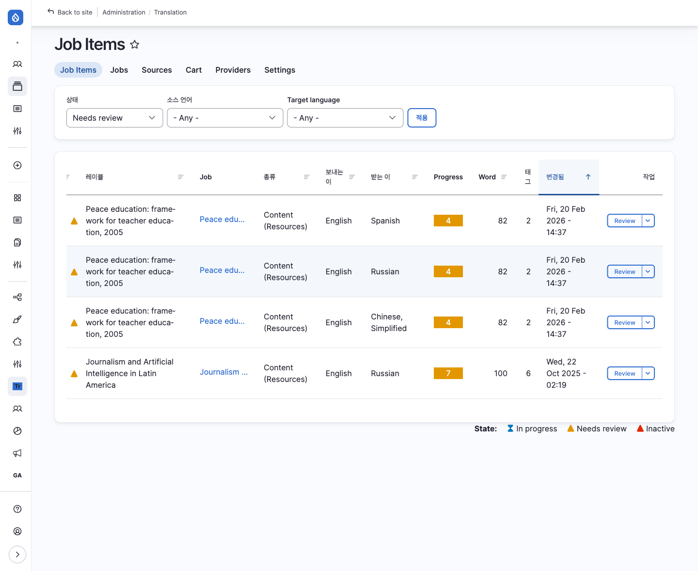

### Translation Sources

| 항목 | 내용 |
|------|------|
| **위치** | Resources > Translation > Translation Sources |
| **경로** | `/admin/tmgmt/sources` |

- 등록된 모든 콘텐츠의 언어별 번역 현황 확인
- 한 눈에 번역 상태 파악 가능

---

## 번역 워크플로우 요약

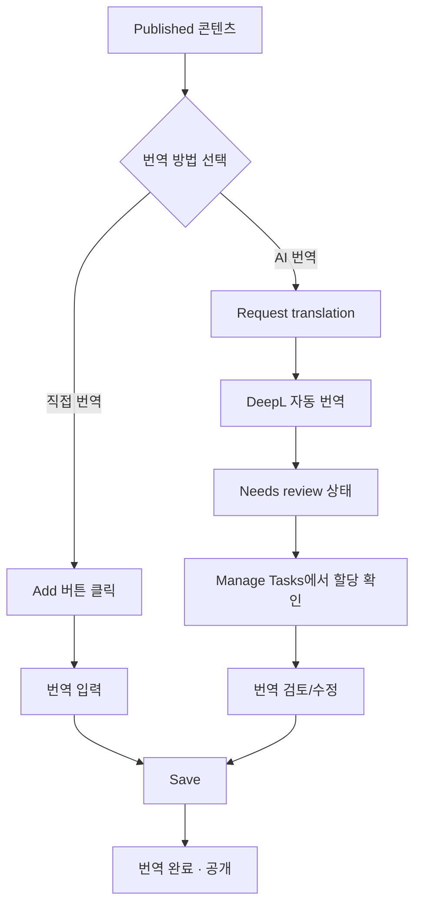

---

## 다음 단계

- [웹사이트 관리](./07-site-admin) — 메인화면, 팝업, 통계 관리
