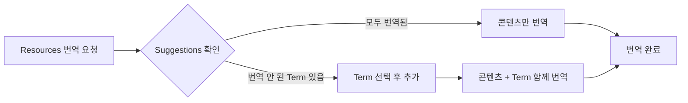

# 관련 Taxonomy 함께 번역하기 (Suggestions)

콘텐츠를 번역할 때, 해당 콘텐츠에 연결된 **Keyword**, **Creator** 등의 Taxonomy Term도 함께 번역해야 할 수 있습니다. TMGMT는 번역이 필요한 Term을 자동으로 감지하여 **Suggestions**(추천) 목록으로 제안합니다.

Suggestions는 **번역 요청(02-translation/01-admin의 번역 요청 단계)** 과정에서만 등장하는 옆길 작업입니다. 관리자의 기본 흐름(요청 → 할당 → 검토)과 별도 문서로 분리해 두었습니다.

---

## 왜 Taxonomy 번역이 필요한가요?

클리어링하우스의 Taxonomy(Keywords, Creator 등)는 기본적으로 영어(English)를 기준으로 등록되어 있습니다. 예를 들어 "Global Citizenship Education", "UNESCO", "Peace Education" 등의 키워드는 영어 원문 그대로 저장되어 있습니다.

하지만 사용자가 프랑스어, 아랍어, 한국어 등 다른 언어로 웹사이트를 이용할 때, 이러한 키워드들도 해당 언어로 표시되어야 합니다. 그래야 검색이나 필터 기능을 사용할 때 사용자가 자신의 언어로 키워드를 찾고 선택할 수 있습니다.

**Taxonomy 번역의 효과:**
- **검색**: 아랍어 사용자가 아랍어로 키워드를 검색할 수 있음
- **필터**: 각 언어 사용자가 자국어로 표시된 키워드 필터를 사용할 수 있음
- **콘텐츠 표시**: 번역된 콘텐츠 페이지에서 키워드도 해당 언어로 표시됨

:::tip[Taxonomy 관리 참고]
Taxonomy의 기본 구조, 용어 목록 확인, 개별 항목 번역 방법 등 자세한 내용은 **[택소노미 관리](../04-taxonomy)** 문서를 참고하세요. 특히 **키워드 번역** 섹션에서 Translations 배지를 통해 각 용어의 언어별 번역 상태를 확인하고 직접 번역을 추가하는 방법을 설명합니다.
:::

---

## 콘텐츠 번역과 Taxonomy 번역의 관계

콘텐츠(Resources, News 등)를 특정 언어로 번역할 때, 해당 콘텐츠에 연결된 Taxonomy Term도 함께 번역해야 완전한 다국어 지원이 됩니다. 이 과정을 별도로 진행하지 않고, **콘텐츠 번역 요청 시 함께 처리**할 수 있도록 TMGMT가 **Suggestions** 기능을 제공합니다.

**워크플로우 예시:**

이렇게 하면 콘텐츠 번역과 관련 Taxonomy 번역을 **하나의 번역 Job에서 함께 관리**할 수 있어, 번역 누락을 방지하고 작업 효율성을 높일 수 있습니다.

---

## Suggestions란?

번역 Job을 생성하면, 시스템이 해당 콘텐츠의 Entity Reference 필드(Keyword, Topic 등)를 검사합니다. 이 필드에 연결된 Taxonomy Term 중 **대상 언어로 아직 번역되지 않은 항목**이 있으면, Suggestions 목록에 자동으로 표시됩니다.

:::tip[예시]
Resources 콘텐츠를 영어에서 한국어로 번역 요청할 때:
- 해당 콘텐츠에 연결된 Keyword "Global Citizenship"이 한국어 번역이 없다면
- Suggestions 목록에 "Global Citizenship" Term이 표시됩니다
:::

---

## Suggestions 확인 방법

:::caution[Suggestions는 번역 요청 화면에서만 표시됩니다]
Suggestions 섹션은 **번역 요청 시 Provider 선택 화면**(Request translation → Drupal user 선택 후)에서만 표시됩니다. 이미 제출된 Job의 상세 화면(`/admin/tmgmt/jobs/{job_id}`)에서는 Suggestions가 표시되지 않습니다.
:::

1. 콘텐츠의 **Translate** 탭에서 언어를 선택하고 **Request translation** 클릭
2. Provider로 **Drupal user** 선택
3. 화면 우측에 **Job items**와 **Suggestions** 섹션이 표시됩니다
   - **Job items**: 현재 번역 대상 콘텐츠
   - **Suggestions**: 함께 번역할 수 있는 Taxonomy Term 목록

---

## Suggestions 추가하기

1. **Suggestions** 목록에서 번역할 Term의 **체크박스**를 선택합니다
2. **Add suggestions** 버튼을 클릭합니다
3. 선택한 Term이 **Job items** 테이블에 추가됩니다
   - 기존 콘텐츠와 함께 별도의 Job Item으로 표시됩니다

---

## 번역 진행

Suggestions로 추가된 Taxonomy Term은 콘텐츠와 **별도로** 번역합니다:

1. **Job items** 테이블에서 번역할 항목의 **Review** 버튼 클릭
2. 각 Job Item별로 개별 번역 화면이 열립니다
   - 콘텐츠 번역 화면: `/admin/tmgmt/items/{item_id}`
   - Term 번역 화면: `/admin/tmgmt/items/{item_id}` (별도 ID)
3. 각 항목을 번역 후 저장합니다

:::note[각 항목을 개별 저장]
콘텐츠(Node)와 Taxonomy Term은 같은 Job에 포함되어 있어도 **각각의 Review 화면에서 개별적으로 번역하고 저장**해야 합니다. 한 항목을 저장해도 다른 항목이 자동 저장되지 않으니, 모든 Job Item을 순서대로 완료해 주세요.
:::

---

## Suggestions가 표시되지 않는 경우

다음 경우에는 Suggestions 목록에 Term이 표시되지 않습니다:

| 상황 | 설명 |
|------|------|
| **이미 번역됨** | 해당 Term이 대상 언어로 이미 번역되어 있음 |
| **이미 Job에 포함됨** | 다른 번역 Job에서 이미 해당 Term을 번역 중 |
| **번역 대상 아님** | 해당 Taxonomy가 번역 가능하도록 설정되지 않음 |

:::caution[Suggestions가 안 보여요]
Suggestions 섹션 자체가 보이지 않거나 목록이 비어있다면:
- 연결된 모든 Term이 이미 번역되었거나
- 해당 콘텐츠에 Taxonomy Term이 연결되어 있지 않은 것입니다
:::

---

## 다음 단계

- [관리자용 번역 관리](./01-admin) - 번역 요청 및 검토
- [택소노미 관리](../04-taxonomy) - Keywords, Creator 관리
