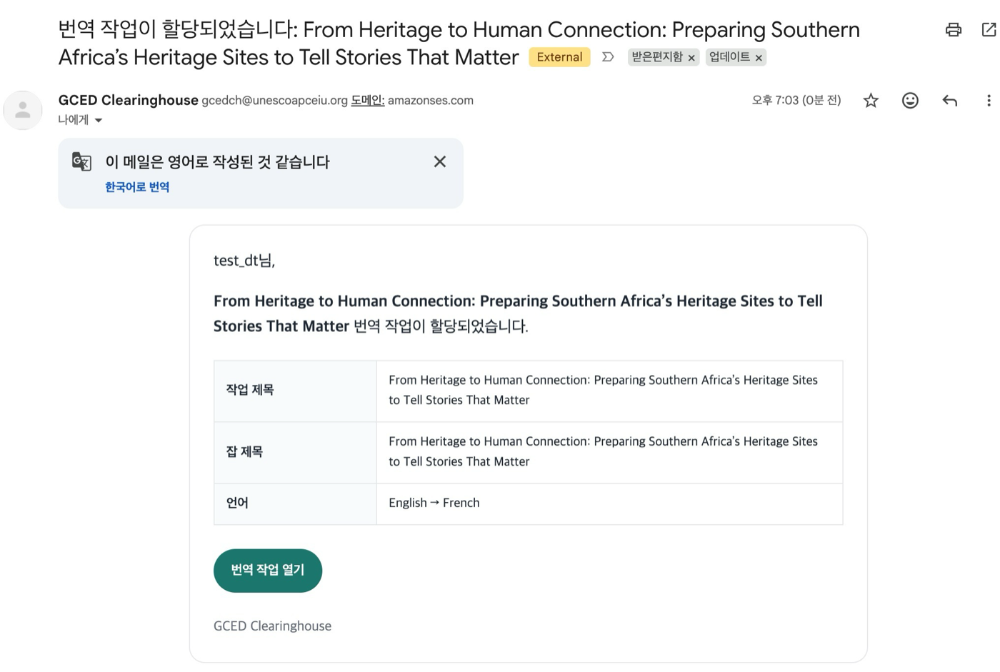

# 번역 요청하기

콘텐츠의 번역 화면을 열어, 직접 번역하거나 번역담당자에게 번역을 요청(Job 생성)하는 방법입니다.

이 페이지는 번역 요청 제출까지만 다룹니다. 제출했다고 담당자에게 전달되는 게 아니므로,
제출 뒤에는 [담당자에게 할당하기](./01-3-assign)에서 실제 할당까지 완료하세요.

---

## 번역 메뉴 접근

### 방법 1: 콘텐츠 목록에서 접근

1. 콘텐츠 목록 화면에서 번역할 콘텐츠 찾기
2. **Operations** 컬럼의 드롭다운 클릭
3. **Translate** 선택

### 방법 2: 콘텐츠 편집 화면에서 접근

1. 콘텐츠 편집 화면 진입
2. 상단 탭에서 **Translate** 클릭

---

## 번역 화면 구성

번역 화면(`/node/{nid}/translations`)에서 각 언어별 번역 상태를 확인할 수 있습니다.

| 컬럼 | 설명 |
|------|------|
| **Language** | 언어명 |
| **Translation** | 번역 상태 (Original / Published / Not translated) |
| **Operations** | 작업 버튼 (View / Edit / Add) |

### 작업 버튼

| 버튼 | 설명 |
|------|------|
| **View** | 해당 언어 번역본 열람 |
| **Edit** | 기존 번역 수정 |
| **Add** | 새 번역 추가 (직접 번역) |
| **Request translation** | 번역담당자에게 번역 요청 |

두 방식 중 어떤 것을 쓸지는 [번역 관리 개요의 방식 선택 가이드](./index#번역-방식-선택-가이드)를 참고하세요.

---

## 직접 번역

번역담당자가 직접 번역 작업을 수행합니다. 간단한 번역이나 즉시 처리가 필요한 경우에 활용합니다.

### 번역 진행 방법

1. 번역 화면에서 번역할 언어의 **⋮ (세로 점 세 개)** 버튼 클릭
2. 드롭다운 메뉴에서 **Add** 선택

:::tip[Add 버튼이 안 보여요]
**Add** 버튼은 **⋮ (세로 점 세 개)** 버튼을 클릭해야 드롭다운 메뉴에 표시됩니다. Operations 컬럼에서 직접 보이지 않으니 ⋮ 버튼을 먼저 클릭하세요.
:::

3. 원래 언어(Original language)의 각 필드를 번역 언어로 변경
4. **Save** 버튼 클릭

### 번역 대상 필드

콘텐츠의 모든 필드가 함께 번역되지는 않습니다. 필드 유형에 따라 번역 방식이 다릅니다.

**콘텐츠와 함께 번역되는 필드:**
- Title (제목)
- Description (본문)
- 기타 텍스트 필드

:::note[Taxonomy 필드는 번역 요청 대상이 아닙니다]
Keyword, Topic, Region은 Taxonomy(분류 체계)로 관리되어 콘텐츠 번역에 포함되지 않으며,
최고관리자가 별도로 관리합니다. 번역 요청 시 신경 쓸 필요 없습니다.
:::

**번역이 불필요한 필드:**

아래 필드들은 URL, 고유명사, 메타데이터 등으로 번역하지 않습니다.

- Author
- Corporate Author
- DB URL
- Ebook URL
- File
- Resource Info (Format, File type)
- Resource URL
- Translate Title
- Translator
- Year of publication

:::note
번역 대상 필드 변경이 필요한 경우 개발팀에 요청해주세요.
:::

---

## 번역 요청 (Job 생성)

DB 총괄관리자가 번역이 필요한 콘텐츠를 등록(Request translation)합니다.

### 요청 절차

1. 번역 화면에서 번역할 언어 선택 (체크박스)
2. **Request translation** 버튼 클릭
3. **Provider** 드롭다운에서 **Drupal User** (프랑스어 UI: Utilisateur Drupal) 선택

:::note[AI 번역 vs 사람 번역]
DeepL 등 AI 번역 서비스도 사용 가능하지만, 현재는 사람(유저)에게 번역 업무를 할당하는 정책으로 운영 중입니다.
:::

4. 담당자를 고릅니다. 단건 화면의 **Assign job to**에서 고릅니다.
   고른 뒤에는 반드시 5번까지 마쳐야 전달됩니다.

:::caution[이름을 고르고 저장만 하면 전달되지 않습니다]
**Assign job to**에서 이름을 골라도 **Submit to provider**를 누르기 전에는
아무것도 전달되지 않습니다. **저장**만 누르면 이름만 적혀 있고 제출은
안 된 상태로 멈춥니다. 화면 위에 초록색
"One job needs to be checked out." 문구가 보이면 아직 제출 전입니다.
:::

5. **Submit to provider** 클릭

### 제출 후 상태

1. **일감 등록**: 번역 요청이 시스템에 등록됩니다. 담당자를 고르지 않았다면
   담당자 없는 상태로 남습니다
2. **꼭 확인**: 여기서 끝이 아닙니다. [담당자에게 할당하기](./01-3-assign#할당이-실제로-됐는지-확인하는-방법)에서
   **Assigned** 탭에 담당자 이름이 있는지 확인하세요
3. **번역 진행**: 담당자 이름이 확인된 뒤 담당자가 직접 번역 입력
4. **검토 및 저장**: DB 총괄관리자가 검토 후 **Save as completed**로 번역 완료 (검토 절차는 [번역 검토·철회](./01-4-review) 참고)

:::note[이메일 알림: 정상 할당되면 담당자에게 메일이 발송됩니다]
번역 작업이 할당되면 담당자 계정의 이메일 주소로 할당 알림 메일이 **발송됩니다**.
(2026-09-14 운영 검증 완료. 이전에는 할당 자체가 저장되지 않아 메일이 나가지 않았습니다.)

- **발신**: `gcedch@unescoapceiu.org` (AWS SES `amazonses.com` 경유. 메일함에 **External** 표시가 붙을 수 있음)
- **제목 형식**: `번역 작업이 할당되었습니다: {리소스 제목}`
- **본문**: 작업 제목 / 잡 제목 / 언어 (`English → French` 형식) / **번역 작업 열기** 버튼
- **수신자**: 할당된 담당자 계정에 등록된 이메일 주소

메일이 오지 않았다면 할당이 안 됐을 가능성이 큽니다.
[할당이 실제로 됐는지 확인하는 방법](./01-3-assign#할당이-실제로-됐는지-확인하는-방법)으로 Assigned 탭을 먼저 확인하세요.
스팸함도 함께 확인하세요.
:::

---

## 자주 묻는 질문

#### Q: Assign job to에 "There are no users available to assign" (또는 원하는 사람이 안 뜹니다)

**A:** 목록에는 **해당 언어쌍 스킬 + 번역 권한 + 활성 계정**을 모두 갖춘 사람만 뜹니다.
아무도 안 뜨면 그 언어쌍(예: Russian → French) 스킬을 가진 번역담당자가 없다는 뜻입니다.

1. **원인 확인**: People에서 담당자 계정의 Translation skills에 해당 언어쌍이 있는지 확인 (예: Job 136이 Russian → French라면 "Russian → French" 스킬 필요)
2. **스킬이 없으면**: 최고관리자가 [Translation skills 설정](./index#translation-skills-설정)으로 언어쌍을 추가한 뒤 다시 열면 목록에 나타납니다
3. **스킬 추가 전에 제출해야 한다면**: 담당자 없이 **Submit to provider**해도 됩니다. 작업이 미할당(Unassigned) 상태로 등록되고, 스킬 설정 후 [Manage Tasks에서 할당](./01-3-assign#실제로-할당하는-방법-핵심-절차)하면 됩니다
4. **스킬을 추가했는데도 안 뜨면**: 번역 권한(다큐멘탈리스트 역할)과 계정 활성 상태를 확인하세요

#### Q: 한 번에 여러 건을 신청했는데 일부가 꼬입니다

**A:** 2026-09-14 수정 전까지 다중 제출 시 할당 저장 버그가 있었습니다 (운영 배포 완료).
지금은 해결됐지만, 제출 후에는 반드시
[할당이 실제로 됐는지 확인하는 방법](./01-3-assign#할당이-실제로-됐는지-확인하는-방법)으로 Assignee를 검증하세요.

---

## 다음 단계

- [담당자에게 할당하기](./01-3-assign): 제출한 요청을 담당자에게 실제로 배정
- [번역 검토·철회](./01-4-review): 담당자가 제출한 번역 검토 또는 요청 철회
