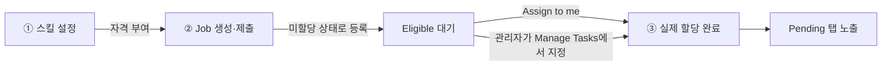
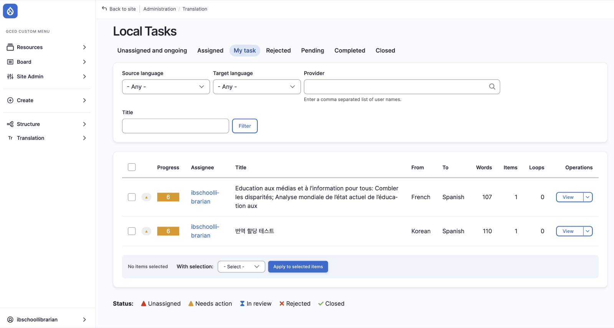

# 담당자에게 할당하기

제출된 번역 요청(Job)을 번역담당자에게 실제로 배정하는 방법입니다.

Manage Tasks 화면에서 미할당 작업을 찾아 담당자를 지정하고, 실제로 반영됐는지 검증합니다.
번역 요청 제출 자체는 [번역 요청하기](./01-2-request)에서 다룹니다.

---

## "요청"과 "할당"은 별개입니다

"번역 업무를 할당한다"는 하나의 동작이 아니라 **아래 3단계**로 이루어집니다. 이 중 어느 단계에서 멈췄는지에 따라 번역담당자에게 작업이 보이지 않을 수 있습니다.

| 단계 | 내용 | 수행 주체 |
|------|------|----------|
| **① 스킬 설정** | People에서 Translation skills(번역 가능 언어 쌍) 설정 → **할당받을 자격**만 생김 | 최고관리자 |
| **② Job 생성/제출** | 콘텐츠 번역 화면에서 **Request translation** 제출 → 작업이 시스템에 등록되지만 아직 **미할당(Unassigned/Eligible)** 상태 | DB 총괄관리자 |
| **③ 실제 할당** | 번역담당자가 Eligible 탭에서 **Assign to me**로 직접 가져가거나, 관리자가 **Manage Tasks**에서 특정 담당자를 명시적으로 지정 | 번역담당자 또는 DB 총괄관리자 |

**①②만 완료하고 ③을 건너뛰면**, Job은 시스템에 존재하지만 담당자가 지정되지 않은 채로 남아 있어 번역담당자의 **Pending 탭에는 절대 노출되지 않습니다.** ①②를 완료했다고 해서 자동으로 ③까지 되는 것이 아니므로, 반드시 **Manage Tasks에서 할당이 실제로 됐는지 확인**하세요.

**예시**: DB 총괄관리자가 번역담당자 A에게 리소스 "Global Citizenship Education Report"의 한국어 번역을 맡기려는 상황

| 단계 | 실제로 한 일 | 실제 시스템 상태 |
|------|------|------|
| ① | People에서 A의 계정에 English → Korean 스킬을 설정함 | A는 영→한 작업을 **받을 자격**만 갖춘 상태. 아직 이 리소스와는 무관 |
| ② | 리소스 편집 화면에서 Request translation을 제출함 | 리소스가 Job으로 등록됨. 하지만 **담당자는 아직 아무도 지정되지 않음(Unassigned)** |
| ③ | *(만약 이 단계를 잊고 여기서 끝냈다면)* | Job은 Manage Tasks의 **Unassigned and ongoing** 탭에 계속 남아있고, A의 Pending 탭에는 **영원히 뜨지 않음** |

**A가 실제로 작업을 받으려면**, 위 표의 ③번 줄처럼 아래 둘 중 하나가 반드시 일어나야 합니다:
- DB 총괄관리자가 **Manage Tasks → Unassigned and ongoing**에서 해당 리소스를 체크 → **Assign to...** → A를 지정 → Apply
- 또는 A 본인이 **Eligible 탭**(`/translate/elegible`)에서 이 리소스를 찾아 **Assign to me** 클릭

이 절차까지 완료해야 A의 **Pending 탭**(`/translate/pending`)에 리소스가 나타나고, 비로소 번역을 시작할 수 있습니다.

---

## Manage Tasks 화면

| 항목 | 내용 |
|------|------|
| **위치** | Manage Tasks |
| **경로** | `/manage-translate` |
| **접근 권한** | DB 총괄관리자, 최고관리자 |

관리자는 이 페이지에서 모든 번역 작업의 할당 상태를 확인하고, **실제 할당**(담당자 지정)을 수행합니다.

사이드바 **Translation** 메뉴에서 **My task / Manage tasks / Translate**를 바로 고를 수 있습니다.
번역 확인용은 My task, 할당 실행용은 Manage tasks입니다.

### 탭 구성

| 탭 | 의미 |
|------|------|
| **Unassigned and ongoing** | 아직 담당자가 지정되지 않은 전체 작업 |
| **Assigned** | 담당자가 지정된 작업 (Pending+Completed+Rejected) |
| **My task** | 로그인한 **나에게 할당된 작업만** (`/manage-translate/my_task`, 담당자 입력 없이 자동 필터링 |
| **Rejected / Pending / Completed / Closed** | 상태별 세부 목록 |

#### My task: 내 작업만 보기

Manage Tasks의 탭이 많아 헷갈리면 **My task**를 쓰세요. 로그인 계정 기준으로
자동 필터링되어 담당자 입력 없이 바로 내 담당분만 보입니다.
번역자에게 "내 일 확인"을 안내할 때도 이 경로가 가장 짧습니다.
(번역자 본인 화면 안내는 [번역자용 번역 작업](./02-translator#pending-탭)을 참고하세요.)

### 실제로 할당하는 방법 (핵심 절차)

:::tip[할당은 두 가지 길]
- **한 건씩**: Job 화면에서 **Assign job to** 지정 후 **Submit to provider**를
  누르면 바로 전달됩니다 (절차는 [번역 요청하기](./01-2-request#번역-요청-job-생성) 참고).
- **여러 건 한꺼번에**: 담당자가 비어 미할당 상태로 남습니다.
  아래 절차대로 Manage Tasks에서 모아 지정하세요.
:::

담당자가 비어 있는 일감은 아래 절차로 지정하세요.

1. **Unassigned and ongoing** 탭에서 방금 제출한 번역 요청을 찾습니다
2. 해당 행의 체크박스를 선택합니다 (여러 건을 한 번에 선택 가능)
3. 화면 하단(또는 상단)의 **With selection** 드롭다운에서 **Assign to...**를 선택합니다
4. 번역담당자의 사용자명을 입력합니다
5. **Apply to selected items** 버튼을 클릭합니다
6. 지정이 끝나면 해당 작업이 **Assigned** 탭으로 이동하고, **Assignee** 칸에 담당자 이름이 표시됩니다

:::tip[번역담당자가 직접 가져가는 방법도 있습니다]
관리자가 지정하는 대신, 번역담당자 본인이 **Eligible** 탭(`/translate/elegible`)에서
자신의 언어에 맞는 미할당 작업을 확인하고 **Assign to me**를 눌러 직접 가져갈 수도 있습니다.
:::

### 할당이 실제로 됐는지 확인하는 방법

할당 작업 후에는 담당자 이름이 제대로 들어갔는지 꼭 확인하세요.
화면에 완료 메시지가 떠도 저장이 안 된 경우가 있을 수 있습니다.

1. **Assigned** 탭으로 이동
2. **Provider** 칸에 방금 지정한 번역담당자의 사용자명을 입력 후 **Filter**
3. 방금 등록한 일감 제목이 목록에 뜨는지, **Assignee** 칸에 담당자 이름이 표시되는지 확인
4. 목록에 없거나 Assignee가 비어 있다면 아직 지정이 안 된 것입니다. 위 절차를 다시 진행하세요

:::note[Title 필터는 완전일치입니다]
Title 칸은 정확히 일치하는 제목만 찾습니다. 제목이 부정확하면 검색이 안 되니
"할당했다"고 알고 있는 리소스의 **정확한 제목**을 먼저 확인한 뒤 검색하세요.
:::

- 할당된 번역 작업을 클릭하여 번역 진행 화면(`/translate/items/{tid}`)으로 이동 가능

:::tip[(최고관리자) 번역자 화면 직접 확인]
번역자 계정으로 **Masquerade**(임의 로그인)한 뒤 `/translate/pending`에 해당 건이
뜨는지 직접 확인할 수 있습니다. 고객이 "안 보인다"고 할 때 재현용으로 유용합니다.
:::

---

## 자주 묻는 질문

#### Q: 번역담당자에게 할당했는데, 본인은 안 보인다고 해요

**A:** 아래 순서로 확인하세요.

1. **정말 실제 할당까지 했는지 확인**: Request translation을 제출한 것과 실제 할당은 다른 단계입니다. Translation skills 설정이나 Job 제출만으로는 담당자가 지정되지 않습니다. 반드시 [실제로 할당하는 방법](#실제로-할당하는-방법-핵심-절차)의 절차(체크박스 선택 → Assign to... → Apply)를 거쳤는지 확인하세요
2. **Assigned 탭 + Provider 필터로 검증**: [할당이 실제로 됐는지 확인하는 방법](#할당이-실제로-됐는지-확인하는-방법)대로 해당 담당자의 사용자명으로 필터링해서 Assignee 컬럼에 이름이 실제로 채워졌는지 확인
3. **여기서도 안 보이면**: 아직 **Unassigned and ongoing** 탭에 담당자 없는 상태로 남아있을 가능성이 큽니다. 다시 할당 절차를 진행하세요

:::note[정확히 어떤 리소스인지 확인하세요]
"할당했다"고 알고 있는 리소스의 **정확한 제목**을 먼저 확인한 뒤 Manage Tasks에서 검색하면 훨씬 빠르게 확인할 수 있습니다.
:::

---

## 다음 단계

- [번역 검토·철회](./01-4-review): 담당자가 제출한 번역 검토 또는 요청 철회
- [번역자용 번역 작업](./02-translator): 담당자 입장의 화면 안내
