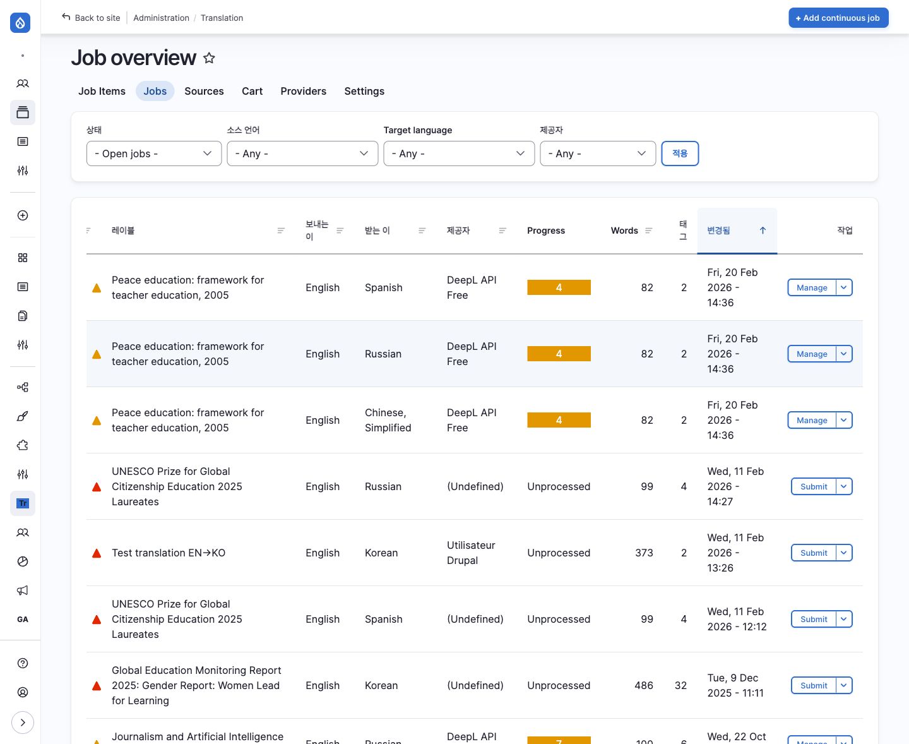
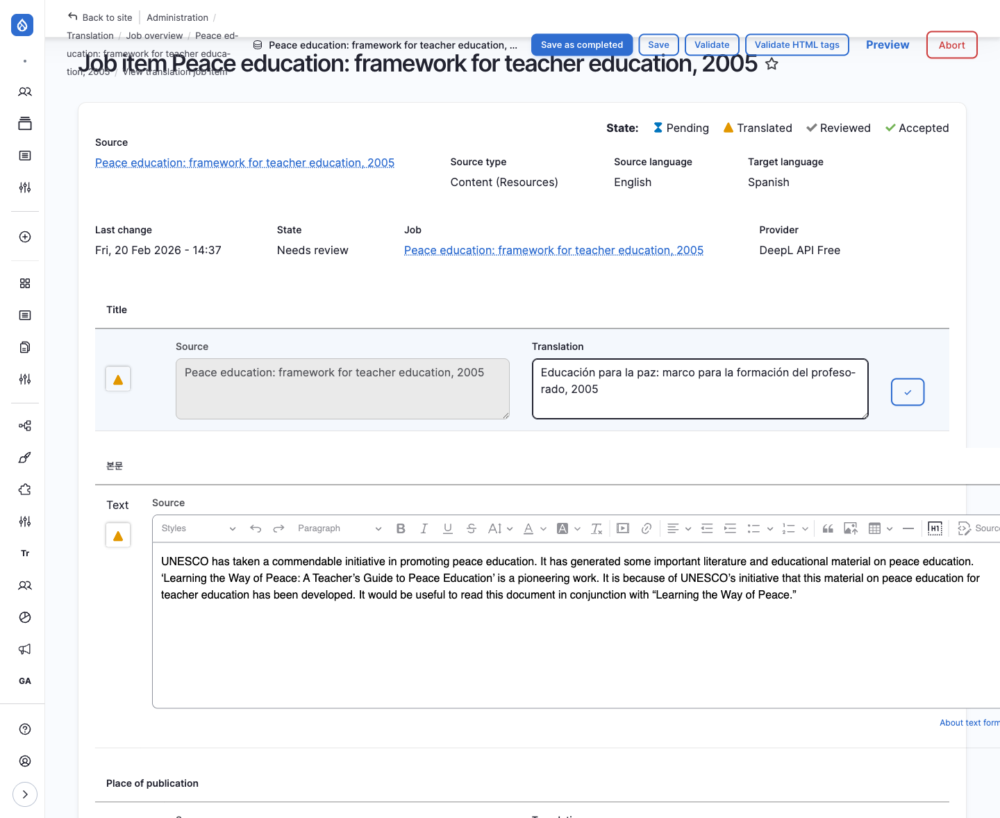
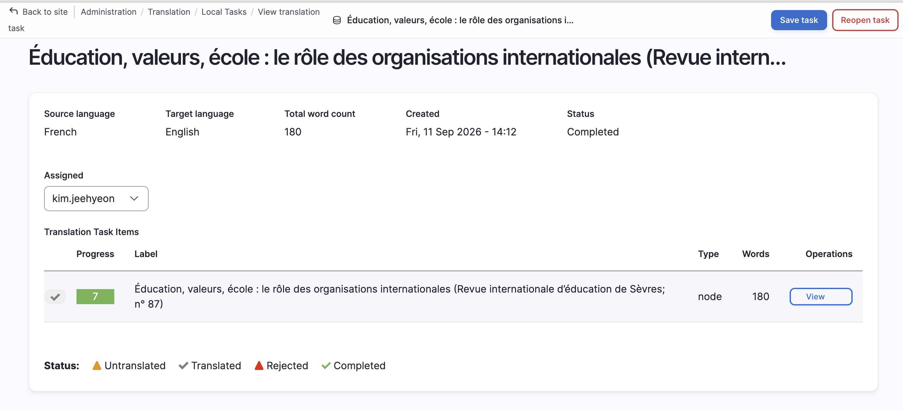
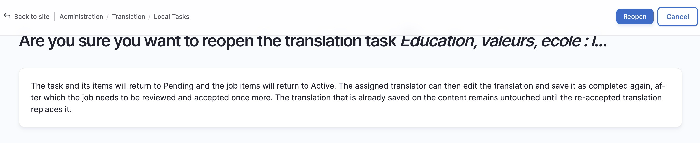
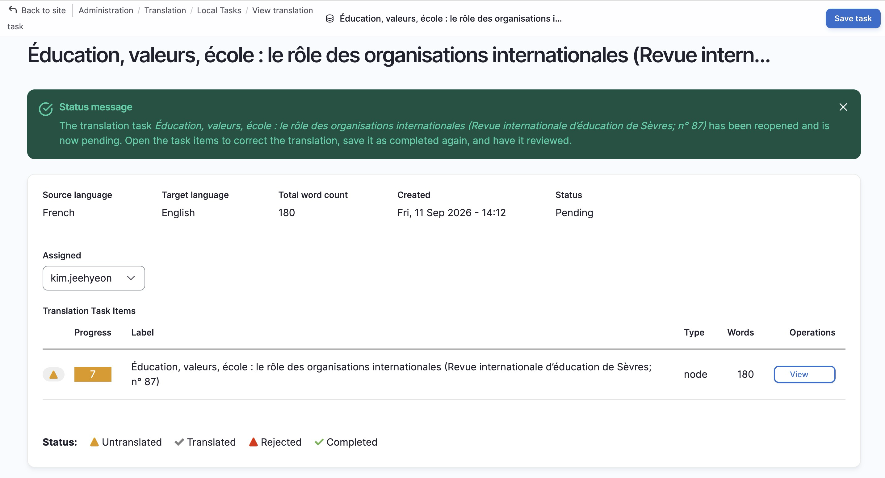

# 번역 검토·철회

다큐멘탈리스트가 제출한 번역을 검토해 공개하거나, 잘못된 요청을 철회하는 방법입니다.

검토 대기(Needs review) 항목을 찾아 확인하고 Save as completed(수락)로 공개합니다.
요청 제출은 [번역 요청하기](./01-2-request), 담당자 배정은 [담당자에게 할당하기](./01-3-assign)를 먼저 완료하세요.

---

## 번역 검토 화면

번역담당자가 번역을 완료(번역자 화면의 Save as completed)하면 해당 항목의 상태가 **Needs review**(검토 대기)로 바뀌고, DB 총괄관리자가 검토합니다. 검토가 끝나야 번역이 콘텐츠에 반영되어 공개됩니다.

### 검토 화면 진입 경로

검토 대기 항목을 찾는 방법은 두 가지입니다.

**방법 1: Job overview에서 상태로 찾기 (권장)**

1. 사이드바 **Translation** 메뉴 → **Job Overview (작업)** 클릭 (`/admin/tmgmt/jobs`)
2. 상단 **상태** 필터에서 **Items - Needs review** 선택 후 Filter 클릭
3. 검토 대기 항목이 있는 Job을 클릭하면 상세 화면의 **Job items** 테이블이 열립니다
4. 상태가 **Needs review**인 항목을 클릭하면 검토 화면(`/admin/tmgmt/items/{item_id}`)으로 이동합니다

**방법 2: Job Items 목록에서 찾기**

1. 사이드바 **Translation** 메뉴 → **Job Items** 클릭 (`/admin/tmgmt/job_items`)
2. **State** 컬럼에서 **Needs review** 상태인 항목을 찾아 클릭합니다

:::tip[번역자 제출 알림 따라가기]
번역담당자가 Save as completed로 제출하면 Job에 "The translation for ... needs to be reviewed." 메시지와 검토 화면 링크가 등록됩니다. Job 상세 화면의 **Message** 영역에서 링크를 클릭해도 같은 검토 화면으로 이동합니다.
:::

| 영역 | 설명 |
|------|------|
| **Source** | 원문 (원래 언어) |
| **Translation** | 번역문 |

### 검토 및 저장 옵션

| 버튼 | 설명 |
|------|------|
| Save as completed | **검토 완료(수락)**. 번역이 콘텐츠에 반영되고 공개됩니다. 검토 대기(Needs review) 화면에서만 표시됩니다 |
| Save | 검토 상태 유지하고 저장 (수정 필요시) |
| Validate | 번역 누락이 없는지 검사 |

Source와 Translation을 나란히 대조해서 확인하고, 필요하면 **Translation** 영역에서 직접 수정한 뒤 Save as completed를 누르세요. Save로만 저장하면 번역이 공개되지 않고 검토 대기 상태로 남습니다.

---

## 검토 완료 후 수정 (작업 다시 열기)

수락(Accept)까지 끝난 작업을 수정 가능 상태로 되돌리는 기능입니다.
공개 중인 번역본은 그대로 두며, 작업·Job의 상태만 되돌립니다.

### 어떤 상황에 무엇을 쓸지

| 상황 | 방법 |
|------|------|
| 공개 중인 번역에 오타·오역 발견, 즉시 바로잡아야 함 | 노드 번역 직접 편집 (빠름) |
| 공개 중인 번역에 오류, 번역담당자의 재작업이 필요 | **작업 다시 열기** (아래 절차) |
| 번역 요청 자체가 잘못됨 (대상·언어 오류) | 번역 요청 철회 (다음 섹션) |

:::caution[노출 자체가 문제인 심각한 오류는 직접 편집이 우선입니다]
작업 다시 열기는 수정 → 제출 → 재승인 사이클을 거치므로, 그 동안 오류본이
계속 공개됩니다. 심각한 오류는 노드에서 직접 수정하거나 비공개 처리한 뒤,
사후 정합성용으로 작업 다시 열기를 사용하세요.
:::

:::tip[철회(Abort)와의 차이]
**철회**(아래 섹션)는 번역 요청 자체를 파기하며 되돌릴 수 없습니다.
**작업 다시 열기**는 완료된 작업을 수정 가능 상태로 되돌리는 것으로,
공개본을 내리거나 삭제하지 않습니다.
:::

### 작업 다시 열기 절차

`Reopen translation tasks` 권한이 있는 역할(DB 총괄관리자)만 실행할 수 있습니다.

1. **Local Tasks**에서 상태가 **Completed** 또는 **Closed**인 작업을 클릭 (`/translate/{task_id}`)
2. 우측 상단 Reopen task 버튼 클릭
3. 확인 화면에서 안내를 읽고 Reopen 클릭
   - 작업과 작업 항목은 **Pending**으로, Job 항목과 Job은 **Active**로 돌아갑니다
   - 기존 번역문은 그대로 보존되어 편집 화면에 미리 채워집니다
   - 이미 공개된 번역본은 재승인 전까지 변경되지 않습니다
4. 번역담당자가 `/translate/items/{item_id}`에서 수정 후 Save as completed로 재제출
5. DB 총괄관리자가 `/admin/tmgmt/jobs/{job_id}`에서 다시 **Accept**
   - 수정본이 노드에 새 리비전으로 반영됩니다. 승인 전 최종 검토 필수입니다.
   - 번역본의 공개 상태(Draft/Published)가 의도와 맞는지 확인하세요.

### 화면 흐름

① 완료된 작업의 Reopen task 버튼:

② 확인 화면에서 Reopen 클릭:

③ 다시 열린 작업 (Pending, 담당자·번역문 유지):

---

## 번역 요청 철회

이미 요청한 번역을 철회해야 하는 경우 (잘못 요청했거나 더 이상 번역이 필요 없는 경우) 다음 방법으로 처리합니다.

### 철회 방법

1. **Resources > Translation > Jobs** 로 이동 (`/admin/tmgmt/jobs`)
2. 철회할 번역 요청(Job)을 찾아 클릭
3. Job 상세 화면에서 Abort job 버튼 클릭
4. 확인 메시지에서 Confirm 클릭

:::caution[주의사항]
- Abort된 Job은 되돌릴 수 없습니다
- 번역담당자가 이미 작업 중인 경우, 해당 작업 내용이 삭제됩니다
- 필요한 경우 번역담당자에게 미리 알려주세요
:::

### Job 상태별 처리

| Job 상태 | 철회 가능 | 방법 |
|----------|----------|------|
| Unprocessed | O | Abort job |
| In progress | O | Abort job (작업 내용 삭제됨) |
| Finished | X | 이미 완료됨 (번역본 직접 삭제 필요) |

---

## 다음 단계

- [번역 요청하기](./01-2-request): 새 번역 요청
- [담당자에게 할당하기](./01-3-assign): 검토 대기가 생기기 전 단계 (할당 절차)
- [번역자용 번역 작업](./02-translator): 담당자 입장의 화면 안내
