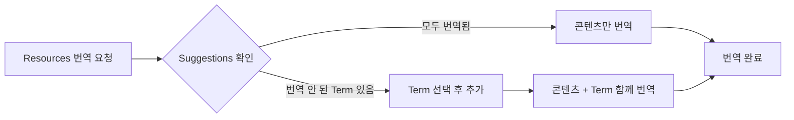
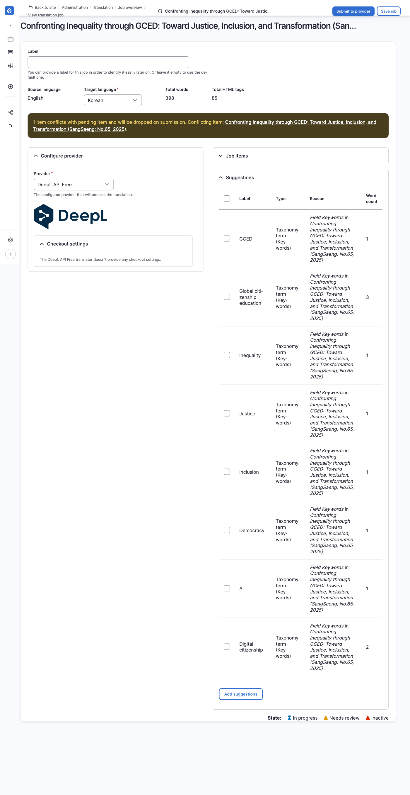
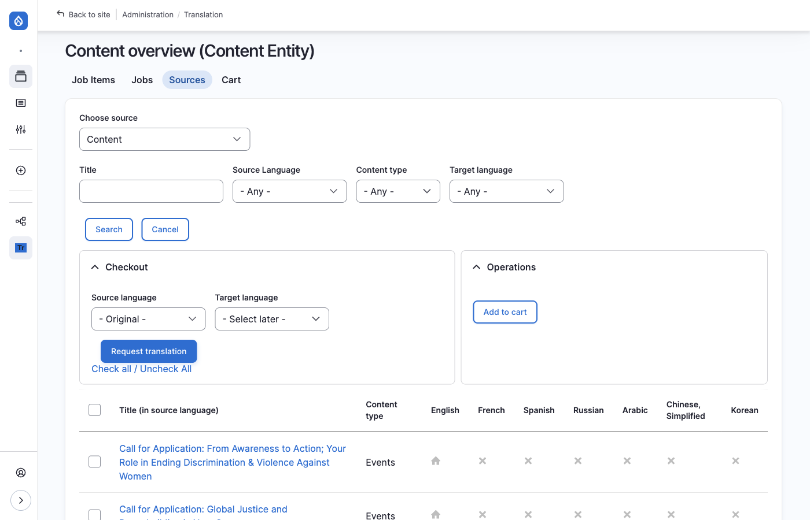
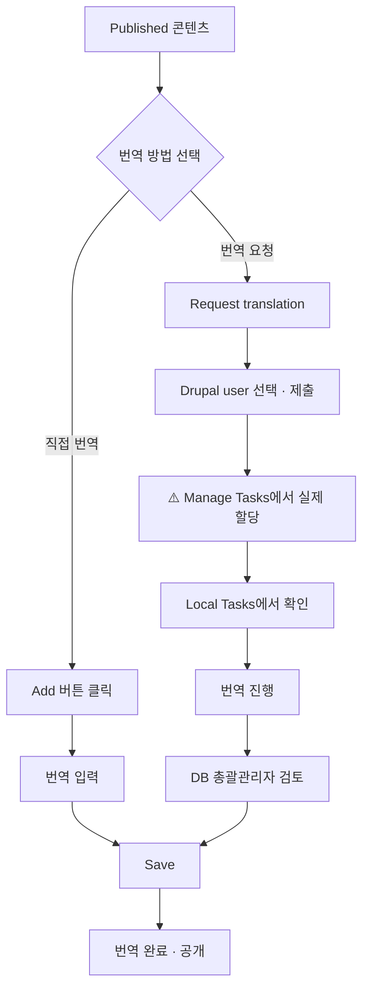

# 관리자용 번역 관리

DB 총괄관리자가 번역 요청, 검토, Job 관리를 수행하는 방법입니다.

---

## 번역 메뉴 접근

### 방법 1: 콘텐츠 목록에서 접근

1. 콘텐츠 목록 화면에서 번역할 콘텐츠 찾기
2. **Operations** 컬럼의 드롭다운 클릭
3. **Translate** 선택

### 방법 2: 콘텐츠 편집 화면에서 접근

1. 콘텐츠 편집 화면 진입
2. 상단 탭에서 **Translate** 클릭

---

## 번역 화면 구성

번역 화면(`/node/{nid}/translations`)에서 각 언어별 번역 상태를 확인할 수 있습니다.

| 컬럼 | 설명 |
|------|------|
| **Language** | 언어명 |
| **Translation** | 번역 상태 (Original / Published / Not translated) |
| **Operations** | 작업 버튼 (View / Edit / Add) |

### 작업 버튼

| 버튼 | 설명 |
|------|------|
| **View** | 해당 언어 번역본 열람 |
| **Edit** | 기존 번역 수정 |
| **Add** | 새 번역 추가 (직접 번역) |
| **Request translation** | 번역담당자에게 번역 요청 |

---

## 직접 번역

번역담당자가 직접 번역 작업을 수행합니다. 간단한 번역이나 즉시 처리가 필요한 경우에 활용합니다.

### 번역 진행 방법

1. 번역 화면에서 번역할 언어의 **⋮ (세로 점 세 개)** 버튼 클릭
2. 드롭다운 메뉴에서 **Add** 선택

:::tip[Add 버튼이 안 보여요]
**Add** 버튼은 **⋮ (세로 점 세 개)** 버튼을 클릭해야 드롭다운 메뉴에 표시됩니다. Operations 컬럼에서 직접 보이지 않으니 ⋮ 버튼을 먼저 클릭하세요.
:::

3. 원래 언어(Original language)의 각 필드를 번역 언어로 변경
4. **Save** 버튼 클릭

### 번역 대상 필드

콘텐츠의 모든 필드가 함께 번역되지는 않습니다. 필드 유형에 따라 번역 방식이 다릅니다.

**콘텐츠와 함께 번역되는 필드:**
- Title (제목)
- Description (본문)
- 기타 텍스트 필드

**별도 번역이 필요한 필드 (Taxonomy):**

아래 필드들은 Taxonomy(분류 체계)로 관리되어, 콘텐츠 번역 시 함께 번역되지 않습니다. [Suggestions 기능](#suggestions-활용)을 통해 별도로 번역합니다.

- Keyword
- Topic
- Region

**번역이 불필요한 필드:**

아래 필드들은 URL, 고유명사, 메타데이터 등으로 번역하지 않습니다.

- Author
- Corporate Author
- DB URL
- Ebook URL
- File
- Resource Info (Format, File type)
- Resource URL
- Translate Title
- Translator
- Year of publication

:::note
번역 대상 필드 변경이 필요한 경우 개발팀에 요청해주세요.
:::

---

## 번역 요청 (Job 생성)

DB 총괄관리자가 번역이 필요한 콘텐츠를 등록(Request translation)합니다.

:::caution[이 단계는 "요청"이지 "할당"이 아닙니다]
아래 절차는 번역 Job을 **생성·등록**하는 것일 뿐, 특정 번역담당자에게 **할당**하는 것이 아닙니다. Submit 이후 자동으로 담당자가 정해지지 않으므로, 반드시 [번역 할당 확인 (Manage Tasks)](#번역-할당-확인-manage-tasks)에서 **실제 할당까지 완료**해야 번역담당자의 Pending 탭에 작업이 노출됩니다.
:::

### 요청 절차

1. 번역 화면에서 번역할 언어 선택 (체크박스)
2. **Request translation** 버튼 클릭
3. **Provider** 드롭다운에서 **Utilisateur Drupal** 선택

:::note[AI 번역 vs 사람 번역]
DeepL 등 AI 번역 서비스도 사용 가능하지만, 현재는 사람(유저)에게 번역 업무를 할당하는 정책으로 운영 중입니다.
:::

4. **Submit to provider** 클릭

### 제출 후 상태

1. **Job 등록**: 번역 요청이 시스템에 등록되지만, 아직 **미할당(Unassigned/Eligible)** 상태입니다
2. **⚠️ 다음 단계 필수**: 여기서 끝이 아닙니다 — 반드시 아래 [번역 할당 확인 (Manage Tasks)](#번역-할당-확인-manage-tasks)에서 **특정 번역담당자에게 실제로 할당**해야 합니다
3. **번역 진행**: 할당이 완료된 후 담당자가 직접 번역 입력
4. **검토 및 저장**: DB 총괄관리자가 검토 후 Save as completed로 번역 완료

:::note[이메일 알림]
현재 번역 업무가 할당되어도 별도 이메일 알림이 발송되지 않습니다. 필요한 경우 개발팀에 요청하여 구현할 수 있습니다.
:::

---

## 번역 할당 확인 (Manage Tasks)

| 항목 | 내용 |
|------|------|
| **위치** | Manage Tasks |
| **경로** | `/manage-translate` |
| **접근 권한** | DB 총괄관리자, 최고관리자 |

관리자는 이 페이지에서 모든 번역 작업의 할당 상태를 확인하고, **실제 할당**(담당자 지정)을 수행합니다.

### 탭 구성

| 탭 | 의미 |
|------|------|
| **Unassigned and ongoing** | 아직 담당자가 지정되지 않은 전체 작업 |
| **Assigned** | 담당자가 지정된 작업 (Pending+Completed+Rejected) |
| **Rejected / Pending / Completed / Closed** | 상태별 세부 목록 |

### 실제로 할당하는 방법 (핵심 절차)

Request translation을 제출한 것만으로는 할당이 완료되지 않습니다. 아래 절차를 반드시 수행하세요.

1. **Unassigned and ongoing** 탭에서 방금 제출한 번역 요청을 찾습니다
2. 해당 행의 **체크박스**를 선택합니다 (여러 건을 한 번에 선택 가능)
3. 화면 하단(또는 상단)의 **"With selection"** 드롭다운에서 **"Assign to..."**를 선택합니다
4. 할당할 **번역담당자(Documentalist)의 사용자명**을 입력합니다
5. **"Apply to selected items"** 버튼을 클릭합니다
6. 할당이 완료되면 해당 작업이 **Assigned** 탭으로 이동하고, **Assignee** 컬럼에 담당자 이름이 표시됩니다

:::tip[번역담당자가 직접 가져가는 방법도 있습니다]
관리자가 특정 담당자를 지정하는 대신, 번역담당자 본인이 `/translate/elegible`(Eligible 탭)에서 자신의 스킬과 일치하는 미할당 작업을 확인하고 **Assign to me**를 클릭해 직접 가져갈 수도 있습니다.
:::

### 할당이 실제로 됐는지 확인하는 방법

할당 작업 후에는 반드시 아래 방법으로 **실제 반영 여부를 확인**하세요. 화면상 "완료" 메시지가 떠도 저장이 안 되는 경우가 있을 수 있습니다.

1. **Assigned** 탭으로 이동
2. **Provider** 필터에 방금 할당한 번역담당자의 사용자명을 입력 후 **Filter**
3. 방금 등록한 리소스 제목이 목록에 뜨는지, **Assignee 컬럼에 담당자 이름이 정상적으로 표시**되는지 확인
4. 목록에 없거나 Assignee가 비어있다면 할당이 완료되지 않은 것이므로 위 절차를 다시 수행하세요

- 할당된 번역 작업을 클릭하여 번역 진행 화면(`/translate/items/{tid}`)으로 이동 가능

### 자주 묻는 질문

#### Q: 번역담당자에게 할당했는데, 본인은 안 보인다고 해요

**A:** 아래 순서로 확인하세요.

1. **정말 실제 할당까지 했는지 확인**: Request translation을 제출한 것과 실제 할당은 다른 단계입니다. Translation skills 설정이나 Job 제출만으로는 담당자가 지정되지 않습니다. 반드시 [실제로 할당하는 방법](#실제로-할당하는-방법-핵심-절차)의 절차(체크박스 선택 → Assign to... → Apply)를 거쳤는지 확인하세요
2. **Assigned 탭 + Provider 필터로 검증**: [할당이 실제로 됐는지 확인하는 방법](#할당이-실제로-됐는지-확인하는-방법)대로 해당 담당자의 사용자명으로 필터링해서 Assignee 컬럼에 이름이 실제로 채워졌는지 확인
3. **여기서도 안 보이면**: 아직 **Unassigned and ongoing** 탭에 미할당 상태로 남아있을 가능성이 높습니다 — 다시 할당 절차를 진행하세요

:::note[정확히 어떤 리소스인지 확인하세요]
"할당했다"고 알고 있는 리소스의 **정확한 제목**을 먼저 확인한 뒤 Manage Tasks에서 검색하면 훨씬 빠르게 확인할 수 있습니다.
:::

---

## 번역 검토 화면

번역담당자가 번역을 완료하면 DB 총괄관리자가 검토합니다.

| 영역 | 설명 |
|------|------|
| **Source** | 원문 (원래 언어) |
| **Translation** | 번역문 |

### 저장 옵션

| 버튼 | 설명 |
|------|------|
| **Save** | 검토 상태 유지하고 저장 (수정 필요시) |
| **Save as completed** | 검토 완료 후 저장 및 공개 |

---

## 관련 Taxonomy 함께 번역하기 (Suggestions)

콘텐츠를 번역할 때, 해당 콘텐츠에 연결된 **Keyword**, **Creator** 등의 Taxonomy Term도 함께 번역해야 할 수 있습니다. TMGMT는 번역이 필요한 Term을 자동으로 감지하여 **Suggestions**(추천) 목록으로 제안합니다.

### 왜 Taxonomy 번역이 필요한가요?

클리어링하우스의 Taxonomy(Keywords, Creator 등)는 기본적으로 영어(English)를 기준으로 등록되어 있습니다. 예를 들어 "Global Citizenship Education", "UNESCO", "Peace Education" 등의 키워드는 영어 원문 그대로 저장되어 있습니다.

하지만 사용자가 프랑스어, 아랍어, 한국어 등 다른 언어로 웹사이트를 이용할 때, 이러한 키워드들도 해당 언어로 표시되어야 합니다. 그래야 검색이나 필터 기능을 사용할 때 사용자가 자신의 언어로 키워드를 찾고 선택할 수 있습니다.

**Taxonomy 번역의 효과:**
- **검색**: 아랍어 사용자가 아랍어로 키워드를 검색할 수 있음
- **필터**: 각 언어 사용자가 자국어로 표시된 키워드 필터를 사용할 수 있음
- **콘텐츠 표시**: 번역된 콘텐츠 페이지에서 키워드도 해당 언어로 표시됨

:::tip[Taxonomy 관리 참고]
Taxonomy의 기본 구조, 용어 목록 확인, 개별 항목 번역 방법 등 자세한 내용은 **[택소노미 관리](../04-taxonomy)** 문서를 참고하세요. 특히 **키워드 번역** 섹션에서 Translations 배지를 통해 각 용어의 언어별 번역 상태를 확인하고 직접 번역을 추가하는 방법을 설명합니다.
:::

### 콘텐츠 번역과 Taxonomy 번역의 관계

콘텐츠(Resources, News 등)를 특정 언어로 번역할 때, 해당 콘텐츠에 연결된 Taxonomy Term도 함께 번역해야 완전한 다국어 지원이 됩니다. 이 과정을 별도로 진행하지 않고, **콘텐츠 번역 요청 시 함께 처리**할 수 있도록 TMGMT가 **Suggestions** 기능을 제공합니다.

**워크플로우 예시:**

이렇게 하면 콘텐츠 번역과 관련 Taxonomy 번역을 **하나의 번역 Job에서 함께 관리**할 수 있어, 번역 누락을 방지하고 작업 효율성을 높일 수 있습니다.

### Suggestions란?

번역 Job을 생성하면, 시스템이 해당 콘텐츠의 Entity Reference 필드(Keyword, Topic 등)를 검사합니다. 이 필드에 연결된 Taxonomy Term 중 **대상 언어로 아직 번역되지 않은 항목**이 있으면, Suggestions 목록에 자동으로 표시됩니다.

:::tip[예시]
Resources 콘텐츠를 영어에서 한국어로 번역 요청할 때:
- 해당 콘텐츠에 연결된 Keyword "Global Citizenship"이 한국어 번역이 없다면
- Suggestions 목록에 "Global Citizenship" Term이 표시됩니다
:::

### Suggestions 확인 방법

:::caution[Suggestions는 번역 요청 화면에서만 표시됩니다]
Suggestions 섹션은 **번역 요청 시 Provider 선택 화면**(Request translation → Drupal user 선택 후)에서만 표시됩니다. 이미 제출된 Job의 상세 화면(`/admin/tmgmt/jobs/{job_id}`)에서는 Suggestions가 표시되지 않습니다.
:::

1. 콘텐츠의 **Translate** 탭에서 언어를 선택하고 **Request translation** 클릭
2. Provider로 **Drupal user** 선택
3. 화면 우측에 **Job items**와 **Suggestions** 섹션이 표시됩니다
   - **Job items**: 현재 번역 대상 콘텐츠
   - **Suggestions**: 함께 번역할 수 있는 Taxonomy Term 목록

### Suggestions 추가하기

1. **Suggestions** 목록에서 번역할 Term의 **체크박스**를 선택합니다
2. **Add suggestions** 버튼을 클릭합니다
3. 선택한 Term이 **Job items** 테이블에 추가됩니다
   - 기존 콘텐츠와 함께 별도의 Job Item으로 표시됩니다

### 번역 진행

Suggestions로 추가된 Taxonomy Term은 콘텐츠와 **별도로** 번역합니다:

1. **Job items** 테이블에서 번역할 항목의 **Review** 버튼 클릭
2. 각 Job Item별로 개별 번역 화면이 열립니다
   - 콘텐츠 번역 화면: `/admin/tmgmt/items/{item_id}`
   - Term 번역 화면: `/admin/tmgmt/items/{item_id}` (별도 ID)
3. 각 항목을 번역 후 저장합니다

:::note[각 항목을 개별 저장]
콘텐츠(Node)와 Taxonomy Term은 같은 Job에 포함되어 있어도 **각각의 Review 화면에서 개별적으로 번역하고 저장**해야 합니다. 한 항목을 저장해도 다른 항목이 자동 저장되지 않으니, 모든 Job Item을 순서대로 완료해 주세요.
:::

### Suggestions가 표시되지 않는 경우

다음 경우에는 Suggestions 목록에 Term이 표시되지 않습니다:

| 상황 | 설명 |
|------|------|
| **이미 번역됨** | 해당 Term이 대상 언어로 이미 번역되어 있음 |
| **이미 Job에 포함됨** | 다른 번역 Job에서 이미 해당 Term을 번역 중 |
| **번역 대상 아님** | 해당 Taxonomy가 번역 가능하도록 설정되지 않음 |

:::caution[Suggestions가 안 보여요]
Suggestions 섹션 자체가 보이지 않거나 목록이 비어있다면:
- 연결된 모든 Term이 이미 번역되었거나
- 해당 콘텐츠에 Taxonomy Term이 연결되어 있지 않은 것입니다
:::

---

## 번역 요청 철회

이미 요청한 번역을 철회해야 하는 경우 (잘못 요청했거나 더 이상 번역이 필요 없는 경우) 다음 방법으로 처리합니다.

### 철회 방법

1. **Resources > Translation > Jobs** 로 이동 (`/admin/tmgmt/jobs`)
2. 철회할 번역 요청(Job)을 찾아 클릭
3. Job 상세 화면에서 **Abort job** 버튼 클릭
4. 확인 메시지에서 **Confirm** 클릭

:::caution[주의사항]
- **Abort**된 Job은 되돌릴 수 없습니다
- 번역담당자가 이미 작업 중인 경우, 해당 작업 내용이 삭제됩니다
- 필요한 경우 번역담당자에게 미리 알려주세요
:::

### Job 상태별 처리

| Job 상태 | 철회 가능 | 방법 |
|----------|----------|------|
| Unprocessed | O | Abort job |
| In progress | O | Abort job (작업 내용 삭제됨) |
| Finished | X | 이미 완료됨 (번역본 직접 삭제 필요) |

---

## 번역 관리 화면

### Jobs

| 항목 | 내용 |
|------|------|
| **위치** | Resources > Translation > Jobs |
| **경로** | `/admin/tmgmt/jobs` |

- 번역 요청 단위(Job)별 관리
- 하나의 Job에는 여러 Job Items가 포함될 수 있음
- 콘텐츠 확인 및 공개/비공개 설정 가능

:::caution[필터 적용 필요]
Jobs 목록이 비어 보이는 경우, 상단 필터 영역에서 **적용** 버튼을 클릭해야 목록이 표시됩니다. 필터 조건을 변경하지 않아도 최초 진입 시 적용 버튼을 한 번 클릭해 주세요.
:::

### Job Items

| 항목 | 내용 |
|------|------|
| **위치** | Resources > Translation > Job Items |
| **경로** | `/admin/tmgmt/items` |

- 콘텐츠별 번역 요청 내역 확인
- **Review** 버튼으로 번역 진행 내역 열람

### Translation Sources

| 항목 | 내용 |
|------|------|
| **위치** | Resources > Translation > Translation Sources |
| **경로** | `/admin/tmgmt/sources` |

- 등록된 모든 콘텐츠의 언어별 번역 현황 확인
- 한 눈에 번역 상태 파악 가능

---

## 번역 워크플로우 요약

:::caution
`F`(제출) 이후 `G`(실제 할당)로 자동으로 넘어가지 않습니다. 반드시 [Manage Tasks에서 실제로 할당](#실제로-할당하는-방법-핵심-절차)까지 완료해야 번역담당자의 Local Tasks에 노출됩니다.
:::

---

## 다음 단계

- [번역자용 번역 작업](./02-translator) — 할당된 번역 작업 수행
- [택소노미 관리](../04-taxonomy) — Keywords, Creator 관리
