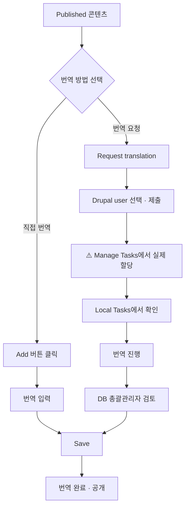

# 관리자용 번역 관리

DB 총괄관리자가 번역 요청, 검토, Job 관리를 수행하는 방법입니다.

---

## 번역 메뉴 접근

### 방법 1: 콘텐츠 목록에서 접근

1. 콘텐츠 목록 화면에서 번역할 콘텐츠 찾기
2. **Operations** 컬럼의 드롭다운 클릭
3. **Translate** 선택

### 방법 2: 콘텐츠 편집 화면에서 접근

1. 콘텐츠 편집 화면 진입
2. 상단 탭에서 **Translate** 클릭

---

## 번역 화면 구성

번역 화면(`/node/{nid}/translations`)에서 각 언어별 번역 상태를 확인할 수 있습니다.

| 컬럼 | 설명 |
|------|------|
| **Language** | 언어명 |
| **Translation** | 번역 상태 (Original / Published / Not translated) |
| **Operations** | 작업 버튼 (View / Edit / Add) |

### 작업 버튼

| 버튼 | 설명 |
|------|------|
| **View** | 해당 언어 번역본 열람 |
| **Edit** | 기존 번역 수정 |
| **Add** | 새 번역 추가 (직접 번역) |
| **Request translation** | 번역담당자에게 번역 요청 |

---

## 직접 번역

번역담당자가 직접 번역 작업을 수행합니다. 간단한 번역이나 즉시 처리가 필요한 경우에 활용합니다.

### 번역 진행 방법

1. 번역 화면에서 번역할 언어의 **⋮ (세로 점 세 개)** 버튼 클릭
2. 드롭다운 메뉴에서 **Add** 선택

:::tip[Add 버튼이 안 보여요]
**Add** 버튼은 **⋮ (세로 점 세 개)** 버튼을 클릭해야 드롭다운 메뉴에 표시됩니다. Operations 컬럼에서 직접 보이지 않으니 ⋮ 버튼을 먼저 클릭하세요.
:::

3. 원래 언어(Original language)의 각 필드를 번역 언어로 변경
4. **Save** 버튼 클릭

### 번역 대상 필드

콘텐츠의 모든 필드가 함께 번역되지는 않습니다. 필드 유형에 따라 번역 방식이 다릅니다.

**콘텐츠와 함께 번역되는 필드:**
- Title (제목)
- Description (본문)
- 기타 텍스트 필드

:::note[Taxonomy 필드는 번역 요청 대상이 아닙니다]
Keyword, Topic, Region은 Taxonomy(분류 체계)로 관리되어 콘텐츠 번역에 포함되지 않으며,
최고관리자가 별도로 관리합니다. 번역 요청 시 신경 쓸 필요 없습니다.
:::

**번역이 불필요한 필드:**

아래 필드들은 URL, 고유명사, 메타데이터 등으로 번역하지 않습니다.

- Author
- Corporate Author
- DB URL
- Ebook URL
- File
- Resource Info (Format, File type)
- Resource URL
- Translate Title
- Translator
- Year of publication

:::note
번역 대상 필드 변경이 필요한 경우 개발팀에 요청해주세요.
:::

---

## 번역 요청 (Job 생성)

DB 총괄관리자가 번역이 필요한 콘텐츠를 등록(Request translation)합니다.

:::caution[여기는 요청 단계입니다]
이 절차에서는 번역 일감을 시스템에 등록만 합니다. 단건 화면에서 담당자를
고르고 **Submit to provider**까지 눌렀다면 바로 전달됩니다. 담당자를
고르지 않았거나 **저장**만 눌렀다면 담당자 없는 상태로 남습니다.
제출 뒤에는 [번역 할당 확인](#번역-할당-확인-manage-tasks)에서
**Assigned** 탭에 담당자 이름이 있는지 꼭 확인하세요.
이름이 없으면 아래 할당 절차를 이어서 진행하세요.
:::

### 요청 절차

1. 번역 화면에서 번역할 언어 선택 (체크박스)
2. **Request translation** 버튼 클릭
3. **Provider** 드롭다운에서 **Drupal User** (프랑스어 UI: Utilisateur Drupal) 선택

:::note[AI 번역 vs 사람 번역]
DeepL 등 AI 번역 서비스도 사용 가능하지만, 현재는 사람(유저)에게 번역 업무를 할당하는 정책으로 운영 중입니다.
:::

4. 담당자를 고릅니다. 단건 화면의 **Assign job to**에서 고릅니다.
   고른 뒤에는 반드시 5번까지 마쳐야 전달됩니다.

:::caution[이름을 고르고 저장만 하면 전달되지 않습니다]
**Assign job to**에서 이름을 골라도 **Submit to provider**를 누르기 전에는
아무것도 전달되지 않습니다. **저장**만 누르면 이름만 적혀 있고 제출은
안 된 상태로 멈춥니다. 화면 위에 초록색
"One job needs to be checked out." 문구가 보이면 아직 제출 전입니다.
:::

5. **Submit to provider** 클릭

### 제출 후 상태

1. **일감 등록**: 번역 요청이 시스템에 등록됩니다. 담당자를 고르지 않았다면
   담당자 없는 상태로 남습니다
2. **꼭 확인**: 여기서 끝이 아닙니다. 아래 [번역 할당 확인](#번역-할당-확인-manage-tasks)에서
   **Assigned** 탭에 담당자 이름이 있는지 확인하세요
3. **번역 진행**: 담당자 이름이 확인된 뒤 담당자가 직접 번역 입력
4. **검토 및 저장**: DB 총괄관리자가 검토 후 **Save as completed**로 번역 완료

:::note[이메일 알림: 정상 할당되면 담당자에게 메일이 발송됩니다]
번역 작업이 할당되면 담당자 계정의 이메일 주소로 할당 알림 메일이 **발송됩니다**.
(2026-09-14 운영 검증 완료. 이전에는 할당 자체가 저장되지 않아 메일이 나가지 않았습니다.)

- **발신**: `gcedch@unescoapceiu.org` (AWS SES `amazonses.com` 경유. 메일함에 **External** 표시가 붙을 수 있음)
- **제목 형식**: `번역 작업이 할당되었습니다: {리소스 제목}`
- **본문**: 작업 제목 / 잡 제목 / 언어 (`English → French` 형식) / **번역 작업 열기** 버튼
- **수신자**: 할당된 담당자 계정에 등록된 이메일 주소

메일이 오지 않았다면 할당이 안 됐을 가능성이 큽니다.
[할당 확인 방법](#할당이-실제로-됐는지-확인하는-방법)으로 Assigned 탭을 먼저 확인하세요.
스팸함도 함께 확인하세요.
:::

---

## 번역 할당 확인 (Manage Tasks)

| 항목 | 내용 |
|------|------|
| **위치** | Manage Tasks |
| **경로** | `/manage-translate` |
| **접근 권한** | DB 총괄관리자, 최고관리자 |

관리자는 이 페이지에서 모든 번역 작업의 할당 상태를 확인하고, **실제 할당**(담당자 지정)을 수행합니다.

사이드바 **Translation** 메뉴에서 **My task / Manage tasks / Translate**를 바로 고를 수 있습니다.
번역 확인용은 My task, 할당 실행용은 Manage tasks입니다.

### 탭 구성

| 탭 | 의미 |
|------|------|
| **Unassigned and ongoing** | 아직 담당자가 지정되지 않은 전체 작업 |
| **Assigned** | 담당자가 지정된 작업 (Pending+Completed+Rejected) |
| **My task** | 로그인한 **나에게 할당된 작업만** (`/manage-translate/my_task`, 담당자 입력 없이 자동 필터링 |
| **Rejected / Pending / Completed / Closed** | 상태별 세부 목록 |

#### My task: 내 작업만 보기

Manage Tasks의 탭이 많아 헷갈리면 **My task**를 쓰세요. 로그인 계정 기준으로
자동 필터링되어 담당자 입력 없이 바로 내 담당분만 보입니다.
번역자에게 "내 일 확인"을 안내할 때도 이 경로가 가장 짧습니다.
(번역자 본인 화면 안내는 [번역자용 번역 작업](./02-translator#pending-탭)을 참고하세요.)

### 실제로 할당하는 방법 (핵심 절차)

:::tip[할당은 두 가지 길]
- **한 건씩**: Job 화면에서 **Assign job to** 지정 후 **Submit to provider**를
  누르면 바로 전달됩니다.
- **여러 건 한꺼번에**: 담당자가 비어 미할당 상태로 남습니다.
  아래 절차대로 Manage Tasks에서 모아 지정하세요.
:::

담당자가 비어 있는 일감은 아래 절차로 지정하세요.

1. **Unassigned and ongoing** 탭에서 방금 제출한 번역 요청을 찾습니다
2. 해당 행의 체크박스를 선택합니다 (여러 건을 한 번에 선택 가능)
3. 화면 하단(또는 상단)의 **With selection** 드롭다운에서 **Assign to...**를 선택합니다
4. 번역담당자의 사용자명을 입력합니다
5. **Apply to selected items** 버튼을 클릭합니다
6. 지정이 끝나면 해당 작업이 **Assigned** 탭으로 이동하고, **Assignee** 칸에 담당자 이름이 표시됩니다

:::tip[번역담당자가 직접 가져가는 방법도 있습니다]
관리자가 지정하는 대신, 번역담당자 본인이 **Eligible** 탭(`/translate/elegible`)에서
자신의 언어에 맞는 미할당 작업을 확인하고 **Assign to me**를 눌러 직접 가져갈 수도 있습니다.
:::

### 할당이 실제로 됐는지 확인하는 방법

할당 작업 후에는 담당자 이름이 제대로 들어갔는지 꼭 확인하세요.
화면에 완료 메시지가 떠도 저장이 안 된 경우가 있을 수 있습니다.

1. **Assigned** 탭으로 이동
2. **Provider** 칸에 방금 지정한 번역담당자의 사용자명을 입력 후 **Filter**
3. 방금 등록한 일감 제목이 목록에 뜨는지, **Assignee** 칸에 담당자 이름이 표시되는지 확인
4. 목록에 없거나 Assignee가 비어 있다면 아직 지정이 안 된 것입니다. 위 절차를 다시 진행하세요

:::note[Title 필터는 완전일치입니다]
Title 칸은 정확히 일치하는 제목만 찾습니다. 제목이 부정확하면 검색이 안 되니
"할당했다"고 알고 있는 리소스의 **정확한 제목**을 먼저 확인한 뒤 검색하세요.
:::

- 할당된 번역 작업을 클릭하여 번역 진행 화면(`/translate/items/{tid}`)으로 이동 가능

:::tip[(최고관리자) 번역자 화면 직접 확인]
번역자 계정으로 **Masquerade**(임의 로그인)한 뒤 `/translate/pending`에 해당 건이
뜨는지 직접 확인할 수 있습니다. 고객이 "안 보인다"고 할 때 재현용으로 유용합니다.
:::

### 자주 묻는 질문

#### Q: 번역담당자에게 할당했는데, 본인은 안 보인다고 해요

**A:** 아래 순서로 확인하세요.

1. **정말 실제 할당까지 했는지 확인**: Request translation을 제출한 것과 실제 할당은 다른 단계입니다. Translation skills 설정이나 Job 제출만으로는 담당자가 지정되지 않습니다. 반드시 [실제로 할당하는 방법](#실제로-할당하는-방법-핵심-절차)의 절차(체크박스 선택 → Assign to... → Apply)를 거쳤는지 확인하세요
2. **Assigned 탭 + Provider 필터로 검증**: [할당이 실제로 됐는지 확인하는 방법](#할당이-실제로-됐는지-확인하는-방법)대로 해당 담당자의 사용자명으로 필터링해서 Assignee 컬럼에 이름이 실제로 채워졌는지 확인
3. **여기서도 안 보이면**: 아직 **Unassigned and ongoing** 탭에 담당자 없는 상태로 남아있을 가능성이 큽니다. 다시 할당 절차를 진행하세요

:::note[정확히 어떤 리소스인지 확인하세요]
"할당했다"고 알고 있는 리소스의 **정확한 제목**을 먼저 확인한 뒤 Manage Tasks에서 검색하면 훨씬 빠르게 확인할 수 있습니다.
:::

#### Q: Assign job to에 "There are no users available to assign" (또는 원하는 사람이 안 뜹니다)

**A:** 목록에는 **해당 언어쌍 스킬 + 번역 권한 + 활성 계정**을 모두 갖춘 사람만 뜹니다.
아무도 안 뜨면 그 언어쌍(예: Russian → French) 스킬을 가진 번역담당자가 없다는 뜻입니다.

1. **원인 확인**: People에서 담당자 계정의 Translation skills에 해당 언어쌍이 있는지 확인 (예: Job 136이 Russian → French라면 "Russian → French" 스킬 필요)
2. **스킬이 없으면**: 최고관리자가 [Translation skills 설정](./index#translation-skills-설정)으로 언어쌍을 추가한 뒤 다시 열면 목록에 나타납니다
3. **스킬 추가 전에 제출해야 한다면**: 담당자 없이 **Submit to provider**해도 됩니다. 작업이 미할당(Unassigned) 상태로 등록되고, 스킬 설정 후 [Manage Tasks에서 할당](#실제로-할당하는-방법-핵심-절차)하면 됩니다
4. **스킬을 추가했는데도 안 뜨면**: 번역 권한(다큐멘탈리스트 역할)과 계정 활성 상태를 확인하세요

#### Q: 한 번에 여러 건을 신청했는데 일부가 꼬입니다

**A:** 2026-09-14 수정 전까지 다중 제출 시 할당 저장 버그가 있었습니다 (운영 배포 완료).
지금은 해결됐지만, 제출 후에는 반드시
[할당 확인 방법](#할당이-실제로-됐는지-확인하는-방법)으로 Assignee를 검증하세요.

---

## 번역 검토 화면

번역담당자가 번역을 완료(번역자 화면의 **Save as completed**)하면 해당 항목의 상태가 **Needs review**(검토 대기)로 바뀌고, DB 총괄관리자가 검토합니다. 검토가 끝나야 번역이 콘텐츠에 반영되어 공개됩니다.

### 검토 화면 진입 경로

검토 대기 항목을 찾는 방법은 두 가지입니다.

**방법 1: Job overview에서 상태로 찾기 (권장)**

1. 사이드바 **Translation** 메뉴 → **Job Overview (작업)** 클릭 (`/admin/tmgmt/jobs`)
2. 상단 **상태** 필터에서 **Items - Needs review** 선택 후 **Filter** 클릭
3. 검토 대기 항목이 있는 Job을 클릭하면 상세 화면의 **Job items** 테이블이 열립니다
4. 상태가 **Needs review**인 항목을 클릭하면 검토 화면(`/admin/tmgmt/items/{item_id}`)으로 이동합니다

**방법 2: Job Items 목록에서 찾기**

1. 사이드바 **Translation** 메뉴 → **Job Items** 클릭 (`/admin/tmgmt/job_items`)
2. **State** 컬럼에서 **Needs review** 상태인 항목을 찾아 클릭합니다

:::tip[번역자 제출 알림 따라가기]
번역담당자가 Save as completed로 제출하면 Job에 "The translation for ... needs to be reviewed." 메시지와 검토 화면 링크가 등록됩니다. Job 상세 화면의 **Message** 영역에서 링크를 클릭해도 같은 검토 화면으로 이동합니다.
:::

| 영역 | 설명 |
|------|------|
| **Source** | 원문 (원래 언어) |
| **Translation** | 번역문 |

### 검토 및 저장 옵션

| 버튼 | 설명 |
|------|------|
| **Save as completed** | **검토 완료(수락)** — 번역이 콘텐츠에 반영되고 공개됩니다. 검토 대기(Needs review) 화면에서만 표시됩니다 |
| **Save** | 검토 상태 유지하고 저장 (수정 필요시) |
| **Validate** | 번역 누락이 없는지 검사 |

Source와 Translation을 나란히 대조해서 확인하고, 필요하면 **Translation** 영역에서 직접 수정한 뒤 **Save as completed**를 누르세요. Save로만 저장하면 번역이 공개되지 않고 검토 대기 상태로 남습니다.

---

## 번역 요청 철회

이미 요청한 번역을 철회해야 하는 경우 (잘못 요청했거나 더 이상 번역이 필요 없는 경우) 다음 방법으로 처리합니다.

### 철회 방법

1. **Resources > Translation > Jobs** 로 이동 (`/admin/tmgmt/jobs`)
2. 철회할 번역 요청(Job)을 찾아 클릭
3. Job 상세 화면에서 **Abort job** 버튼 클릭
4. 확인 메시지에서 **Confirm** 클릭

:::caution[주의사항]
- **Abort**된 Job은 되돌릴 수 없습니다
- 번역담당자가 이미 작업 중인 경우, 해당 작업 내용이 삭제됩니다
- 필요한 경우 번역담당자에게 미리 알려주세요
:::

### Job 상태별 처리

| Job 상태 | 철회 가능 | 방법 |
|----------|----------|------|
| Unprocessed | O | Abort job |
| In progress | O | Abort job (작업 내용 삭제됨) |
| Finished | X | 이미 완료됨 (번역본 직접 삭제 필요) |

---

## 번역 관리 화면

### 화면 4종 용도 구분 (헷갈리면 이 표)

| 화면 | 경로 | 용도 | 담당자 확인 |
|------|------|------|----------|
| Sources | `/admin/tmgmt/sources` | 전체 콘텐츠의 언어별 번역 현황 + 번역 요청 제출 | 불가 (현황용) |
| Jobs (Overview) | `/admin/tmgmt/jobs` | Job 단위 전체 목록·상태·철회(Abort) | Job 상세의 "not assigned to any user" 문구로 미할당 판별. Translator 컬럼의 "Drupal User"는 플러그인 이름이라 사람 이름이 아님 |
| Manage Tasks | `/manage-translate` (+ `my_task`) | **실제 할당 실행 + 검증** (핵심 화면) | Assigned 탭 Assignee 컬럼 |
| Translate (Local Tasks) | `/translate/*` | 번역자 작업 수행 | 본인 것만 (Pending) |

:::caution[번역자에게 `/admin/tmgmt/jobs`를 안내하지 마세요]
번역자는 `/translate/pending` (또는 Translation 메뉴 → My task)으로만 안내합니다.
관리자용 Jobs 화면에서는 자기 작업이 안 보여 혼선이 생깁니다.
:::

### Jobs

| 항목 | 내용 |
|------|------|
| **위치** | Resources > Translation > Jobs |
| **경로** | `/admin/tmgmt/jobs` |

- 번역 요청 단위(Job)별 관리
- 하나의 Job에는 여러 Job Items가 포함될 수 있음
- 콘텐츠 확인 및 공개/비공개 설정 가능

:::caution[필터 적용 필요]
Jobs 목록이 비어 보이는 경우, 상단 필터 영역에서 **적용** 버튼을 클릭해야 목록이 표시됩니다. 필터 조건을 변경하지 않아도 최초 진입 시 적용 버튼을 한 번 클릭해 주세요.
:::

### Job Items

| 항목 | 내용 |
|------|------|
| **위치** | Resources > Translation > Job Items |
| **경로** | `/admin/tmgmt/job_items` |

- 콘텐츠별 번역 요청 내역 확인
- **Review** 버튼으로 번역 진행 내역 열람
- 개별 항목 화면은 `/admin/tmgmt/items/{item_id}` (검토 화면에서도 사용)

### Translation Sources

| 항목 | 내용 |
|------|------|
| **위치** | Resources > Translation > Translation Sources |
| **경로** | `/admin/tmgmt/sources` |

- 등록된 모든 콘텐츠의 언어별 번역 현황 확인
- 한 눈에 번역 상태 파악 가능

---

## 번역 워크플로우 요약

:::caution
`F`(제출) 이후 `G`(실제 할당)로 자동으로 넘어가지 않습니다. 반드시 [Manage Tasks에서 실제로 할당](#실제로-할당하는-방법-핵심-절차)까지 완료해야 번역담당자의 Local Tasks에 노출됩니다.
:::

---

## 다음 단계

- [번역자용 번역 작업](./02-translator): 할당된 번역 작업 수행
- [택소노미 관리](../04-taxonomy): Keywords, Creator 관리
