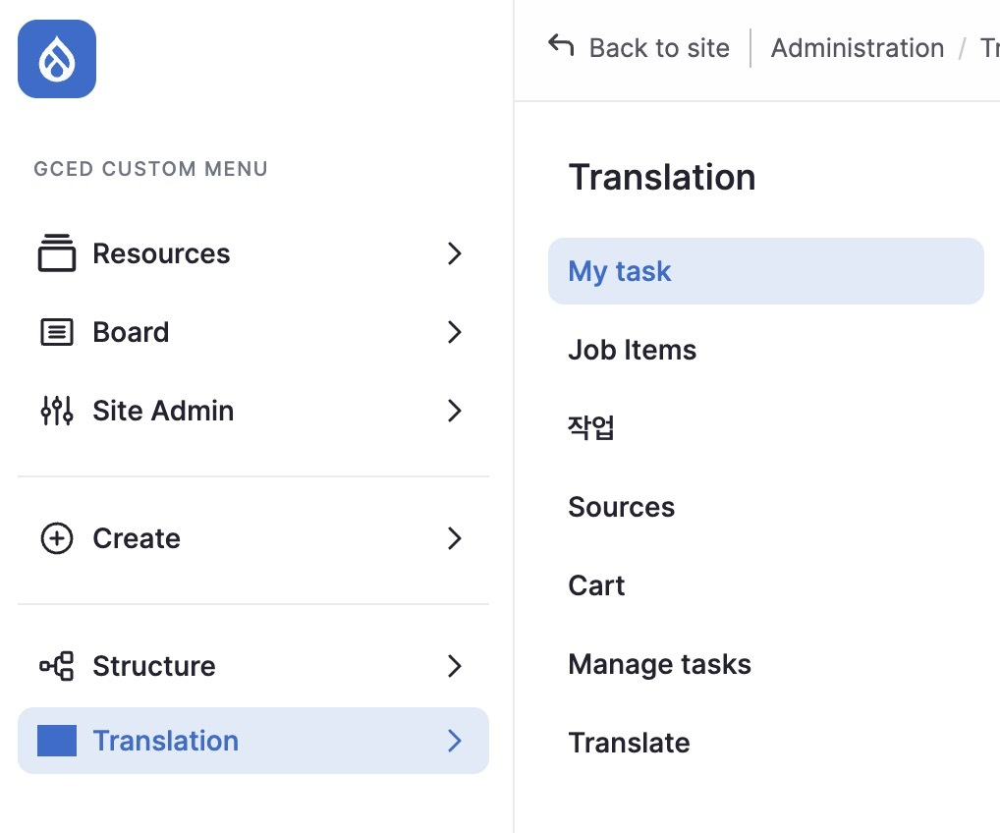
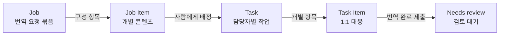
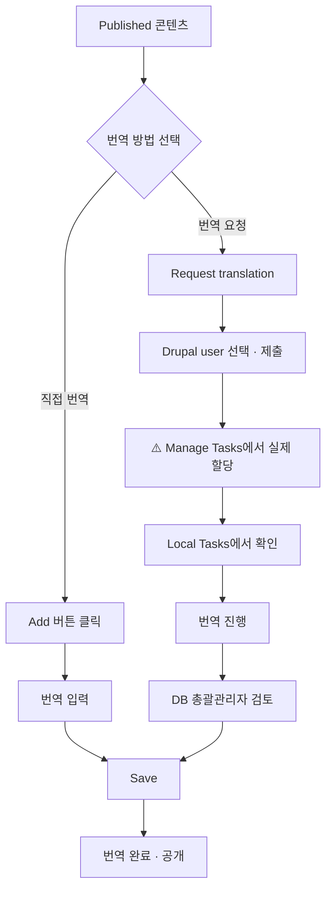

# 관리자용 번역 관리

DB 총괄관리자의 번역 업무(요청, 할당, 검토, 완료) 전체를 관리합니다.
이 페이지는 화면 구성과 용어를 정리한 개요이고, 각 작업은 아래의 전용 페이지에서 다룹니다.

| 하려는 일 | 문서 |
|------|------|
| 콘텐츠를 직접 번역하거나 번역을 요청하기 | [번역 요청하기](./01-2-request) |
| 요청한 일감을 담당자에게 배정하기 | [담당자에게 할당하기](./01-3-assign) |
| 담당자가 제출한 번역을 검토해 공개 / 잘못된 요청 철회 | [번역 검토·철회](./01-4-review) |
| 번역 담당자 입장의 화면 | [번역자용 번역 작업](./02-translator) |

---

## Translation 메뉴 구성

사이드바 **Translation** 메뉴에서 열 수 있는 화면은 아래와 같습니다.

| 메뉴 | 경로 | 용도 | 주 사용자 |
|------|------|------|----------|
| **Job Overview (작업)** | `/admin/tmgmt/jobs` | 번역 요청(Job) 전체 목록·상태·철회. 검토 대기는 상태 필터로 찾음 | DB 총괄관리자 |
| **Job Items** | `/admin/tmgmt/job_items` | Job을 이루는 개별 항목의 목록. 각 항목의 상태(State)로 검토 대기 확인 | DB 총괄관리자 |
| **Sources** | `/admin/tmgmt/sources` | 전체 콘텐츠의 언어별 번역 현황 + 번역 요청 제출 | DB 총괄관리자 |
| **Providers** | `/admin/tmgmt/translators` | 번역 제공 방식(AI/사람) 설정. 현재는 사람(Drupal User) 운영 | 최고관리자 (변경 시에만) |
| **Manage Tasks** | `/manage-translate` | 작업(Task)별 **실제 할당 실행 + 검증** | DB 총괄관리자 |
| **My task** | `/manage-translate/my_task` | 나에게 할당된 작업만 조회 | 전체 (각자) |
| **Translate (Local Tasks)** | `/translate` | 번역담당자가 할당받은 작업 수행 | 다큐멘탈리스트 |

---

## 주요 용어: Job과 Task

이름이 비슷해서 헷갈리기 쉬우니 구분해 두겠습니다.

- **Job (번역 요청)**: 콘텐츠를 번역해 달라고 시스템에 등록한 요청 묶음. 번역 요청(Request translation) 1회 제출당 Job이 하나 생기고, 요청부터 검토·완료까지 전체 흐름이 Job 단위로 관리됩니다.
- **Job Item (항목)**: Job 하나에 담긴 개별 콘텐츠입니다.
- **Task (작업)**: Job을 사람(Drupal User)에게 배정하면 생기는, 번역자 관점의 작업입니다. Manage Tasks와 Translate(Local Tasks) 화면에서 보는 단위입니다.
- **Task Item**: Task에 속한 개별 항목으로 Job Item과 1:1 대응입니다.

관계를 그림으로 표현하면:

:::tip[Job과 Task 헷갈릴 때]
Job은 요청 자체이고 Task는 그 요청을 담당자에게 나눠준 작업입니다.
Job 화면에서는 무엇을 누구에게 요청했는지, Manage Tasks에서는 누가 어떤 일을 맡고 있는지 확인합니다.
:::

---

## 화면 4종 용도 구분 (헷갈리면 이 표)

| 화면 | 경로 | 용도 | 담당자 확인 |
|------|------|------|----------|
| Sources | `/admin/tmgmt/sources` | 전체 콘텐츠의 언어별 번역 현황 + 번역 요청 제출 | 불가 (현황용) |
| Jobs (Overview) | `/admin/tmgmt/jobs` | Job 단위 전체 목록·상태·철회(Abort) | Job 상세의 "not assigned to any user" 문구로 미할당 판별. Translator 컬럼의 "Drupal User"는 플러그인 이름이라 사람 이름이 아님 |
| Manage Tasks | `/manage-translate` (+ `my_task`) | **실제 할당 실행 + 검증** (핵심 화면) | Assigned 탭 Assignee 컬럼 |
| Translate (Local Tasks) | `/translate/*` | 번역자 작업 수행 | 본인 것만 (Pending) |

:::caution[번역자에게 `/admin/tmgmt/jobs`를 안내하지 마세요]
번역자는 `/translate/pending` (또는 Translation 메뉴 → My task)으로만 안내합니다.
관리자용 Jobs 화면에서는 자기 작업이 안 보여 혼선이 생깁니다.
:::

---

## 각 화면 참고

### Jobs

| 항목 | 내용 |
|------|------|
| **위치** | Resources > Translation > Jobs |
| **경로** | `/admin/tmgmt/jobs` |

- 번역 요청 단위(Job)별 관리
- 하나의 Job에는 여러 Job Items가 포함될 수 있음
- 콘텐츠 확인 및 공개/비공개 설정 가능
- 검토 대기 항목 찾기 절차는 [번역 검토·철회](./01-4-review#검토-화면-진입-경로) 참고

:::caution[필터 적용 필요]
Jobs 목록이 비어 보이는 경우, 상단 필터 영역에서 **적용** 버튼을 클릭해야 목록이 표시됩니다. 필터 조건을 변경하지 않아도 최초 진입 시 적용 버튼을 한 번 클릭해 주세요.
:::

### Job Items

| 항목 | 내용 |
|------|------|
| **위치** | Resources > Translation > Job Items |
| **경로** | `/admin/tmgmt/job_items` |

- 콘텐츠별 번역 요청 내역 확인
- **Review** 버튼으로 번역 진행 내역 열람
- 개별 항목 화면은 `/admin/tmgmt/items/{item_id}` (검토 화면에서도 사용)

### Translation Sources

| 항목 | 내용 |
|------|------|
| **위치** | Resources > Translation > Translation Sources |
| **경로** | `/admin/tmgmt/sources` |

- 등록된 모든 콘텐츠의 언어별 번역 현황 확인
- 한 눈에 번역 상태 파악 가능

---

## 번역 워크플로우 요약

:::caution
`F`(제출) 이후 `G`(실제 할당)로 자동으로 넘어가지 않습니다. 반드시 [담당자에게 할당하기](./01-3-assign#실제로-할당하는-방법-핵심-절차)까지 완료해야 번역담당자의 Local Tasks에 노출됩니다.
:::

---

## 다음 단계

- [번역 요청하기](./01-2-request): 콘텐츠 번역 화면 열기부터 제출까지
- [번역자용 번역 작업](./02-translator): 할당된 번역 작업 수행
- [택소노미 관리](../04-taxonomy): Keywords, Creator 관리
