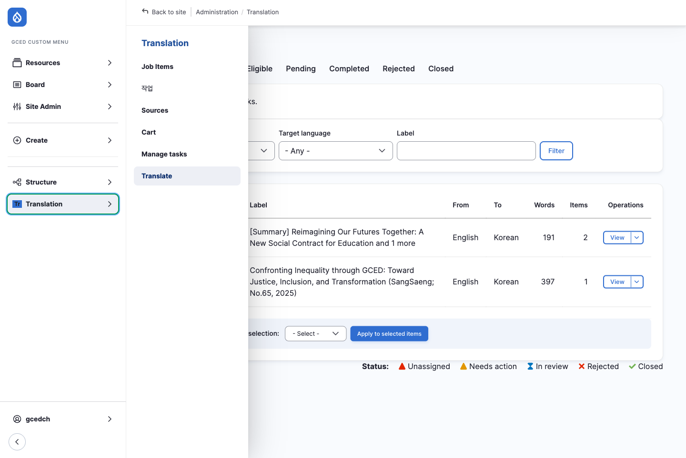
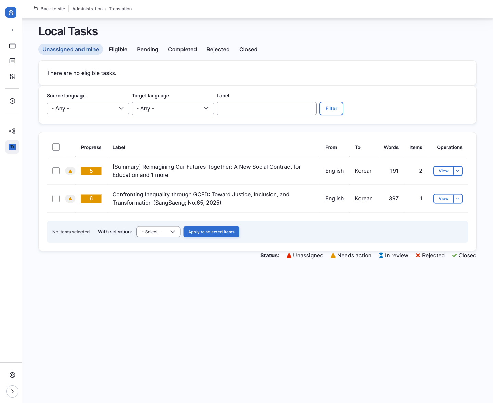
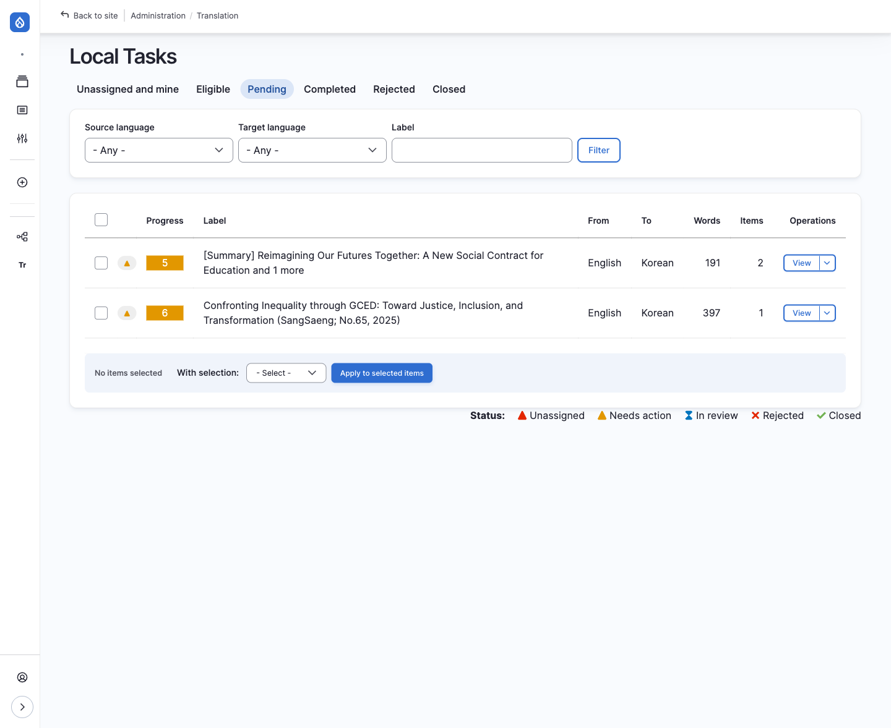
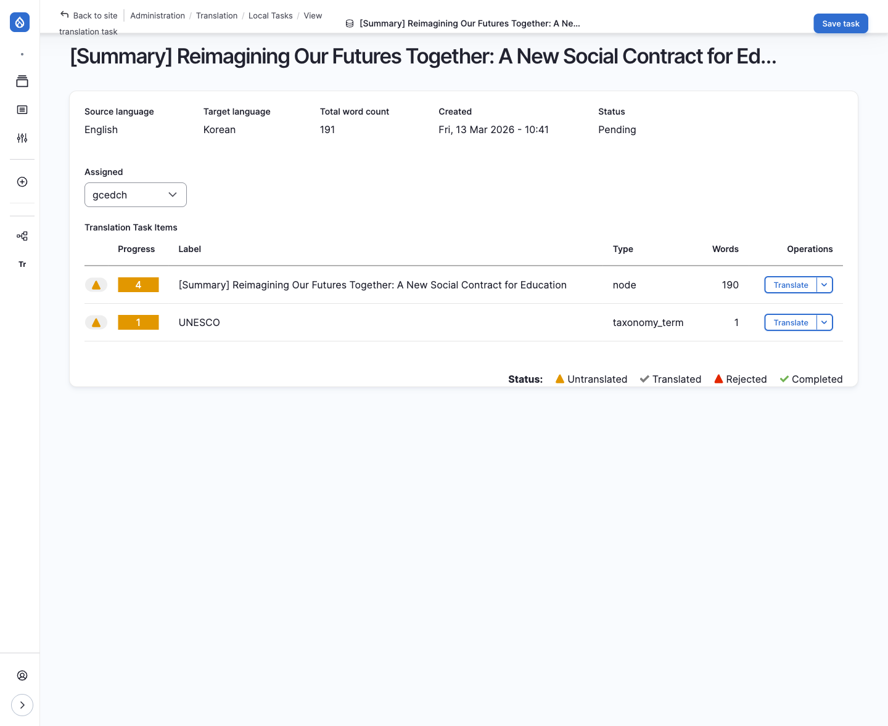
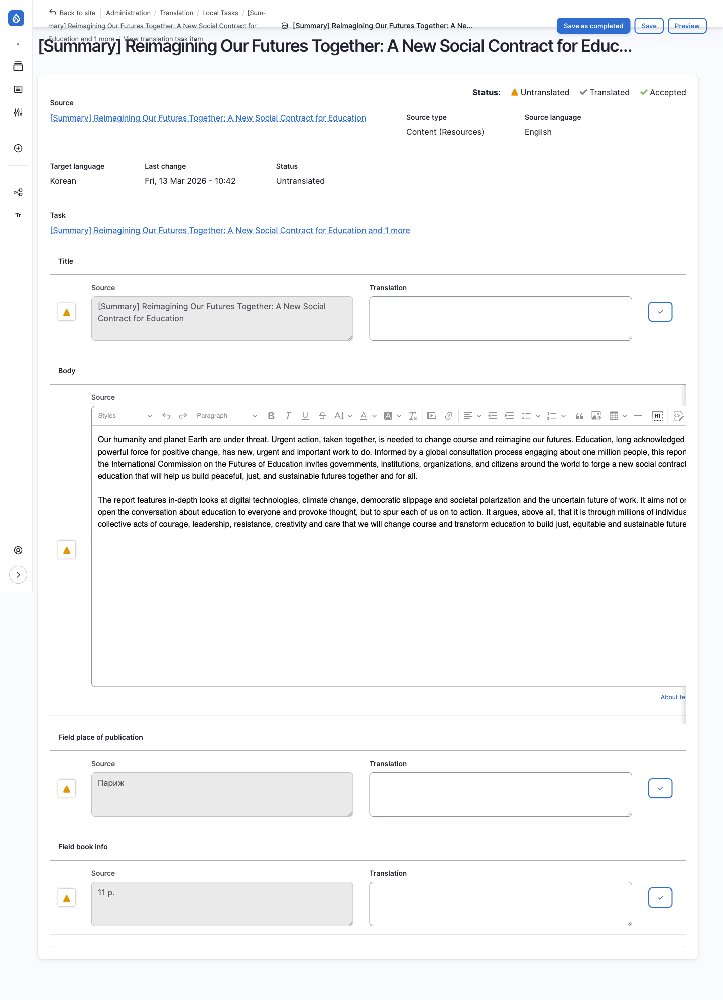
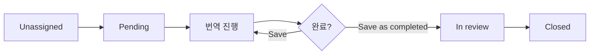

# 번역자용 번역 작업

번역담당자(Documentalist)가 할당된 번역 작업을 확인하고 수행하는 방법입니다.

---

## Local Tasks 접근

:::caution[중요: 올바른 URL 사용]
번역자는 `/admin/tmgmt/jobs`가 아닌 **`/translate`** 경로로 접근해야 합니다.
- `/admin/tmgmt/jobs` — 관리자용 Job 관리 페이지 (번역자 작업 미표시)
- `/translate` — **번역자용 작업 목록** (할당된 작업 표시)
:::

### 접근 방법

사이드바 메뉴에서 **Administration > Translation > Translate** 클릭

---

## Local Tasks 탭 구성

| 탭 | 경로 | 설명 |
|-----|-----|------|
| **Unassigned and mine** | `/translate` | 미할당 작업 + 내 작업 전체 |
| **Eligible** | `/translate/elegible` | 내가 수행할 수 있는 미할당 작업 |
| **Pending** | `/translate/pending` | 내가 할당받은 진행 중 작업 |
| **Completed** | `/translate/completed` | 완료된 작업 |
| **Rejected** | `/translate/rejected` | 거절된 작업 |
| **Closed** | `/translate/closed` | 종료된 작업 |

---

## Local Tasks 화면

| 컬럼 | 설명 |
|------|------|
| **Status** | 작업 상태 아이콘 (Unassigned, Needs action, In review, Rejected, Closed) |
| **Progress** | 번역 진행률 (미번역/번역완료/승인 수) |
| **Label** | 작업 제목 |
| **From/To** | 원본 언어 → 대상 언어 |
| **Words** | 단어 수 |
| **Items** | 번역 항목 수 |
| **Operations** | 작업 버튼 (View) |

---

## Pending 탭

자신에게 할당된 진행 중인 작업만 필터링하여 보여줍니다.

:::tip[할당된 작업 빠르게 확인]
**Pending** 탭을 즐겨찾기하면 자신에게 할당된 작업을 빠르게 확인할 수 있습니다.
:::

---

## 번역 작업 상세

**View** 버튼을 클릭하면 작업 상세 화면으로 이동합니다.

| 항목 | 설명 |
|------|------|
| **Source/Target language** | 원본 및 대상 언어 |
| **Total word count** | 총 단어 수 |
| **Assigned** | 할당된 번역자 (변경 가능) |
| **Translation Task Items** | 번역할 항목 목록 |

---

## 번역 인터페이스

**Translate** 버튼을 클릭하면 실제 번역을 수행하는 화면으로 이동합니다.

| 영역 | 설명 |
|------|------|
| **Source (좌측)** | 원본 텍스트 (수정 불가) |
| **Translation (우측)** | 번역 입력 필드 |
| **✓ 버튼** | 해당 필드 번역 완료 표시 |

### 번역 작업 순서

1. **Source** 영역의 원본 텍스트 확인
2. **Translation** 영역에 번역문 입력
3. 각 필드 번역 완료 시 **✓ 버튼** 클릭
4. 모든 필드 번역 완료 후 저장

---

## 저장 옵션

| 버튼 | 설명 |
|------|------|
| **Save** | 작업 저장 (나중에 계속) |
| **Save as completed** | 번역 완료 후 제출 |
| **Preview** | 번역 결과 미리보기 |

:::tip[작업 중단 시]
번역 작업 중 자리를 비워야 할 때는 **Save** 버튼을 클릭하여 현재까지의 작업을 저장하세요. 나중에 Pending 탭에서 해당 작업을 찾아 계속 진행할 수 있습니다.
:::

:::caution[Save as completed]
**Save as completed** 버튼은 번역이 완전히 끝났을 때만 클릭하세요. 이 버튼을 클릭하면 작업이 DB 총괄관리자의 검토 대기 상태로 전환됩니다.
:::

---

## 작업 상태 흐름

1. **Unassigned**: 아직 담당자가 지정되지 않음
2. **Pending**: 담당자에게 할당됨 (작업 시작 전)
3. **번역 진행**: 번역 작업 중
4. **In review**: 검토 대기 (DB 총괄관리자 확인 필요)
5. **Closed**: 최종 완료

---

## 자주 묻는 질문

### Q: 할당된 작업이 보이지 않아요

**A:** 다음 사항을 확인하세요:

1. **올바른 경로 확인**: `/translate/pending` 경로로 접근했는지 확인하세요. `/admin/tmgmt/jobs`는 관리자용 페이지로, 번역자에게 할당된 작업이 표시되지 않습니다.

2. **Translation Skills 설정 확인**: 자신의 프로필에 Translation Skills(번역 가능 언어 쌍)가 설정되어 있는지 확인하세요. 설정되지 않으면 Eligible 탭에 작업이 표시되지 않습니다.

3. **작업 할당 대기**: 번역 요청이 생성되었더라도 아직 본인에게 할당되지 않았을 수 있습니다. **Eligible** 탭에서 미할당 작업을 확인하고, 직접 **Assign to me**를 클릭하여 할당받을 수 있습니다.

:::tip[관리자에게 확인 요청하기]
"분명히 할당받았다"고 알고 있는데 Pending 탭에 안 보인다면, DB 총괄관리자에게 **Manage Tasks에서 실제로 할당이 완료됐는지** 확인을 요청하세요. Request translation 제출과 실제 할당은 별개 단계라, 제출만 되고 담당자 지정이 누락된 경우가 있을 수 있습니다. 관리자가 확인하는 방법은 [관리자용 번역 관리 — 번역 할당 확인](./01-admin#번역-할당-확인-manage-tasks)을 참고하세요.
:::

### Q: 번역 작업을 거절하고 싶어요

**A:** 작업 상세 화면에서 **Unassign** 옵션을 찾아 할당을 해제할 수 있습니다. 거절 사유가 있다면 DB 총괄관리자에게 별도로 연락해주세요.

### Q: 이미 완료한 작업을 수정하고 싶어요

**A:** **Save as completed** 후에는 직접 수정이 어렵습니다. DB 총괄관리자에게 연락하여 수정을 요청하세요.

---

## 다음 단계

- [번역 관리 개요](./index) — 전체 번역 업무 흐름
- [관리자용 번역 관리](./01-admin) — 번역 요청 및 검토 (관리자 전용)
