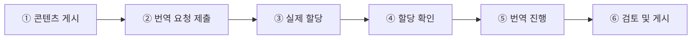

# 번역 관리

TMGMT(Translation Management Tool) 모듈을 통해 콘텐츠 번역을 관리합니다.

---

## 개요

클리어링하우스는 7개 언어를 지원하며, 두 가지 번역 방법을 제공합니다:

1. **직접 번역**: 번역담당자가 직접 번역 콘텐츠 입력
2. **번역 요청**: DB 총괄관리자가 번역담당자에게 번역 업무 할당

### 번역 화면 진입 방법

번역 기능은 콘텐츠 편집 화면의 **더보기 메뉴(⋮)** 안에 숨겨져 있습니다.

#### 진입 경로

1. 번역할 콘텐츠의 **편집(Edit) 화면**으로 이동합니다
2. 화면 **우측 상단**의 `미리보기`, `저장` 버튼 옆에 있는 **세로 점 3개 (⋮)** 버튼을 클릭합니다
3. 드롭다운 메뉴에서 **Translate**를 선택합니다
4. 번역 관리 화면으로 이동합니다

:::tip[버튼 위치]
`⋮` 버튼은 `저장 (모든 번역)` 버튼 바로 오른쪽에 있습니다. 눈에 잘 띄지 않으니 주의해서 찾아보세요.
:::

---

### 번역 방식 선택 가이드

번역 관리 화면에 진입하면 두 가지 번역 방식 중 선택할 수 있습니다.

| 구분 | 직접 번역 | 번역 요청 (TMGMT) |
|------|----------|------------------|
| **버튼** | `Add` (각 언어 행 우측) | `Request translation` (화면 상단) |
| **검토 절차** | 없음 | 있음 |
| **저장 시 상태** | 즉시 Published | 검토 전까지 미공개 |
| **적합한 경우** | 간단한 번역, 즉시 게시 OK | 검토가 필요한 경우 |

실무 기준: 간단·긴급하고 검토 없이 공개해도 되면 직접 번역, 담당자 분담·검토 후 게시가 필요하면 번역 요청을 쓰세요.

#### 직접 번역 (Add 버튼)

번역 관리 화면에서 각 언어 행의 **Operations** 열에 있는 `Add` 버튼을 클릭합니다.

#### 번역 요청 (Request translation 버튼)

번역 관리 화면 **상단**의 파란색 `Request translation` 버튼을 클릭합니다. 번역할 언어를 체크박스로 선택한 후 요청할 수 있습니다.

:::caution[직접 번역 시 주의사항]
**Resources 콘텐츠**의 경우, 원본이 Published 상태이면 번역본도 **Draft로 저장할 수 없습니다**.
저장 즉시 Published 되어 사용자 화면에 노출됩니다.

검토 후 게시가 필요한 경우, 반드시 **번역 요청** 방식을 사용하세요.
:::

### 지원 언어

English, Arabic, Chinese (Simplified), French, Russian, Spanish, Korean

### 번역 가능 콘텐츠

- Resources (Published 상태만)
- Events
- News
- Useful Links

:::note
Resources는 Published 상태에서만 번역이 가능합니다.
:::

---

## 번역담당자

번역담당자는 별도의 Drupal 역할이 아니라, **다큐멘탈리스트(Documentalist)** 역할을 가진 회원 중 번역 업무를 담당하는 사용자를 뜻합니다.

- People에서 회원 추가 시 **Translation skills**를 설정하면 해당 언어의 번역 업무를 **받을 자격**(Eligible)이 생깁니다
- 번역 권한은 다큐멘탈리스트와 최고관리자만 보유합니다

:::caution["할당"은 3단계로 구성됩니다: 스킬 설정만으로는 할당되지 않습니다]
번역 요청(Job 제출)과 실제 담당자 배정은 **다른 단계**입니다.
스킬 설정 → Job 제출 → 실제 할당의 3단계 흐름과 단계별 예시는
[담당자에게 할당하기](./01-3-assign#요청과-할당은-별개입니다)에서 자세히 설명합니다.
핵심은 **Manage Tasks에서 할당이 실제로 됐는지 확인**하는 것입니다.
:::

### Translation Skills 설정

번역담당자가 번역 업무를 **받을 자격**을 갖추려면 **Translation skills** 필드를 설정해야 합니다. 이 설정은 사용자가 어떤 언어에서 어떤 언어로 번역할 수 있는지를 정의할 뿐, **실제 작업 할당과는 별개**입니다 (위 3단계 참고).

#### 설정 방법

1. **People** 메뉴에서 번역담당자로 지정할 사용자를 찾습니다
2. 사용자 이름을 클릭하여 **Edit** 화면으로 이동합니다
3. 화면 하단의 **Translation skills** 섹션을 찾습니다
4. **From** 드롭다운에서 원본 언어를 선택합니다
5. **To** 드롭다운에서 대상 언어를 선택합니다
6. 추가 언어 쌍이 필요한 경우 **Add another item** 버튼을 클릭합니다
7. **Save** 버튼을 클릭하여 저장합니다

:::tip[여러 언어 쌍 설정]
한 명의 번역담당자에게 여러 언어 쌍을 설정할 수 있습니다. 예를 들어:
- English → Korean
- English → French
- French → Korean

이렇게 설정하면 해당 담당자는 세 가지 언어 조합의 번역 업무를 **받을 자격**을 갖추게 됩니다. 실제로 작업을 받으려면 위 3단계 중 ③(실제 할당)까지 진행되어야 합니다.
:::

### 역할별 번역 권한

| 역할 | 번역 요청 | 직접 번역 | 번역 검토 |
|:----:|:--------:|:--------:|:--------:|
| 최고관리자 (Administrator) | O | O | O |
| DB 총괄관리자 (General Supervisor) | O | - | O |
| 다큐멘탈리스트 (Documentalist) | - | O | O |

:::note[번역 업무 흐름]
- **DB 총괄관리자**: 번역이 필요한 콘텐츠를 확인하고 다큐멘탈리스트에게 번역 요청 및 **할당까지 직접 완료** (Request translation 제출만으로는 할당이 끝나지 않으니 반드시 Manage Tasks에서 확인)
- **다큐멘탈리스트**: 할당된 번역 작업을 수행하고, 완료 후 검토를 위해 제출
- **DB 총괄관리자**: 번역 결과를 검토한 후 최종 게시. 필요시 수정 요청
:::

---

## 번역 업무 흐름

1. **콘텐츠 게시** - Published 상태의 콘텐츠 준비 `DB 총괄관리자`
2. **번역 요청 제출** - 번역 화면에서 Request translation 제출 `DB 총괄관리자`
3. **실제 할당** - Manage Tasks에서 특정 번역담당자를 명시적으로 지정 (또는 번역담당자가 Eligible 탭에서 Assign to me) `DB 총괄관리자` / `번역담당자`
4. **할당 확인** - Local Tasks(Pending 탭)에서 할당된 작업이 실제로 노출되는지 확인 `번역담당자`
5. **번역 진행** - 번역 콘텐츠 입력, 수정 후 저장 `번역담당자`
6. **검토 및 게시** - 번역 결과 검토 후 최종 게시 `DB 총괄관리자`

:::caution[②에서 ③으로 자동으로 넘어가지 않습니다]
번역 요청(②)을 제출했다고 해서 자동으로 할당(③)이 완료되지 않습니다. **반드시 Manage Tasks에서 할당까지 완료했는지 확인**하세요. 자세한 방법은 [담당자에게 할당하기](./01-3-assign#할당이-실제로-됐는지-확인하는-방법)을 참고하세요.
:::

---

## 역할별 문서 안내

| 역할 | 문서 | 주요 내용 |
|------|------|----------|
| DB 총괄관리자 | [관리자 개요](./01-admin) | Translation 메뉴·용어, 전체 흐름 |
| DB 총괄관리자 | [번역 요청하기](./01-2-request) | 번역 요청, 직접 번역 |
| DB 총괄관리자 | [담당자에게 할당하기](./01-3-assign) | 실제 할당, 할당 검증 |
| DB 총괄관리자 | [번역 검토·철회](./01-4-review) | 검토 화면, 수락, 철회 |
| 번역담당자 | [번역자용 번역 작업](./02-translator) | Local Tasks 접근, 번역 수행, 저장 |

---

## 다음 단계

- [관리자용 번역 관리](./01-admin) - 번역 요청 및 검토
- [번역자용 번역 작업](./02-translator) - 할당된 작업 수행
