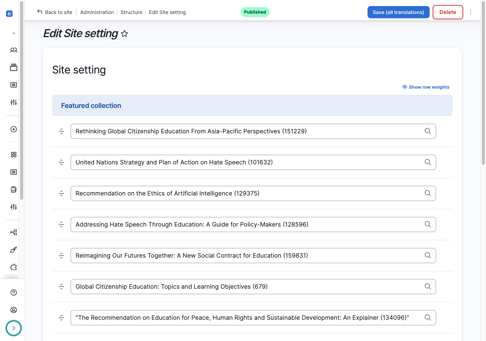
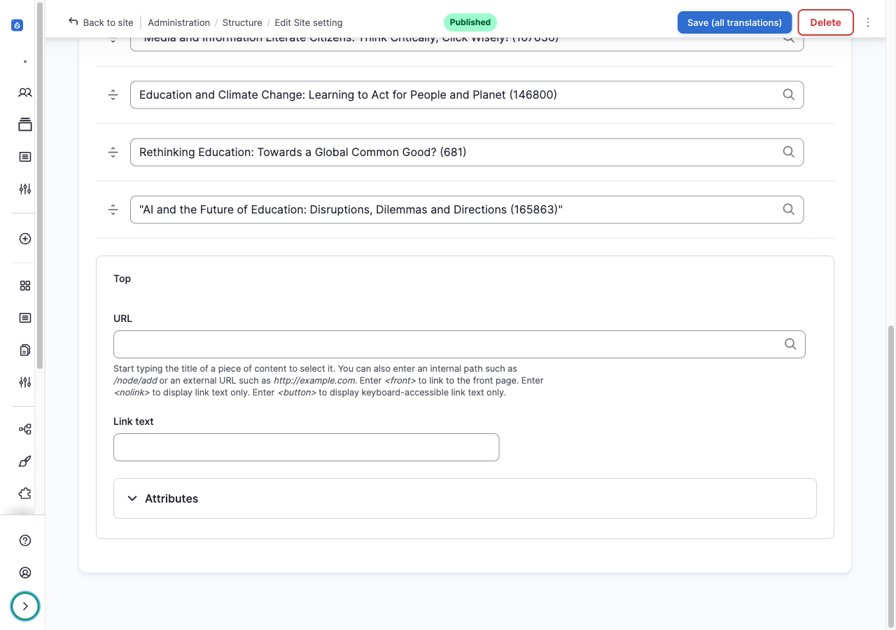
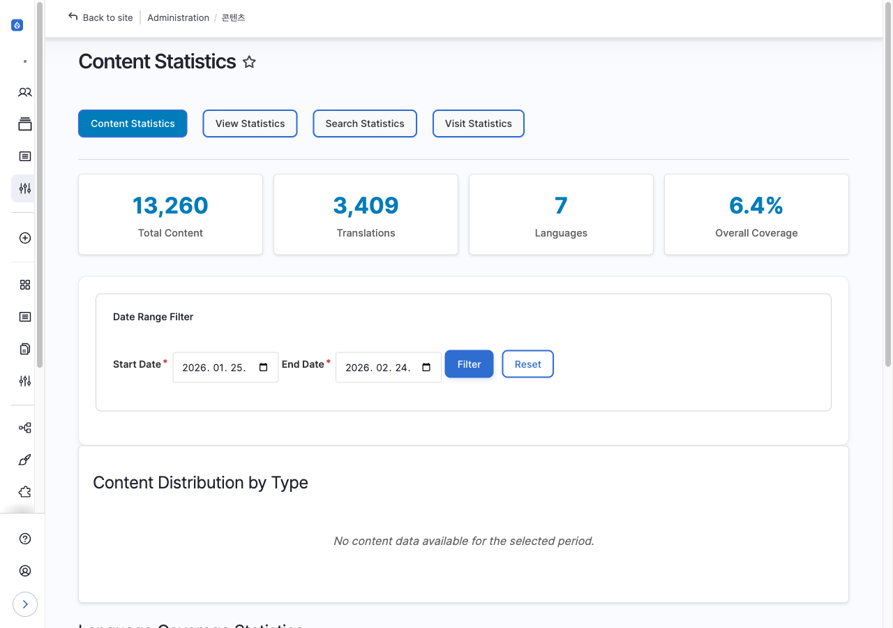
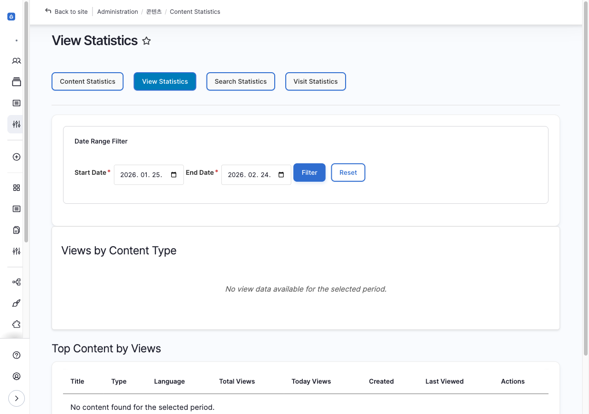
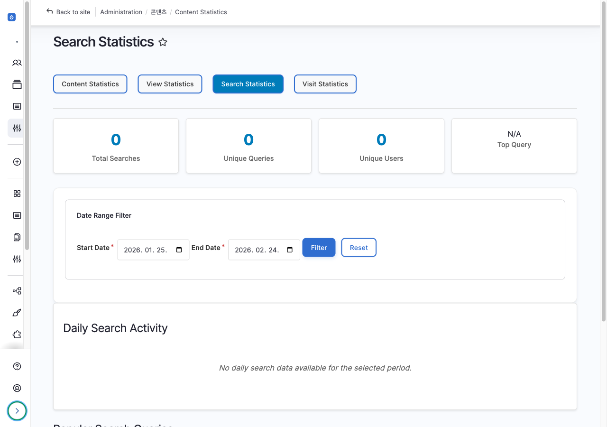
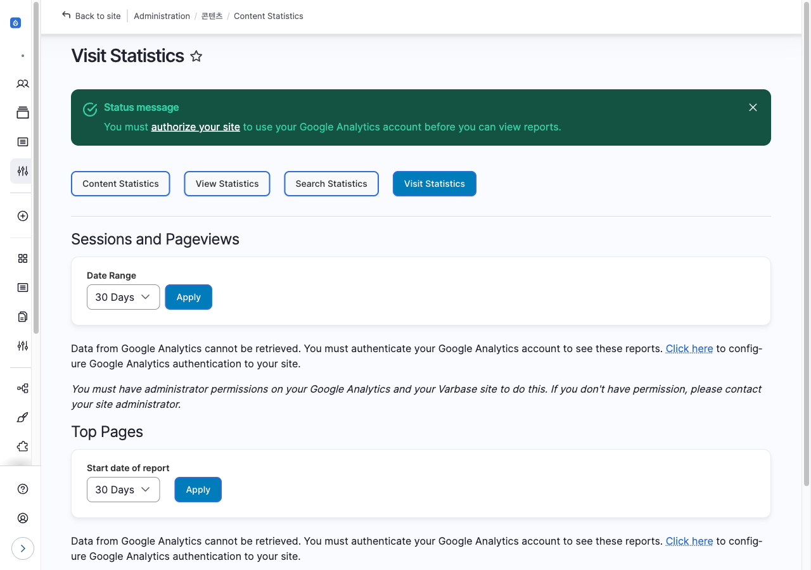

# 웹사이트 관리

메인화면, 상단 팝업, 통계 등 웹사이트 운영에 필요한 설정을 관리합니다.

---

## 메인화면 관리

### Featured Collection

메인 화면에 노출되는 주요 자료(Featured Collection)를 관리합니다.

| 항목 | 내용 |
|------|------|
| **위치** | Site Admin > Main & Popup |
| **경로** | `/en/admin/content/site-settings` |
| **접근 권한** | 최고관리자 (Administrator) |

#### 설정 방법

1. 각 언어별 화면(En, Fr, Es...)으로 접근
2. 빈 칸에 Resource 제목 입력
3. 스페이스바를 클릭하여 등록된 Resource 콘텐츠 불러오기
4. 콘텐츠 선택 (예: `Dialogue for Social Cohesion (165760)`)
5. 핸들을 위아래로 Drag & Drop 하여 순서 변경
6. **Save** 버튼 클릭

:::note
콘텐츠 옆에 (node id)가 포함되어야 정상적으로 입력됩니다.
:::

#### 언어별 콘텐츠 표시

- 각 언어별 화면(/en, /fr, /es...)에는 해당 언어로 등록된 콘텐츠가 우선 출력
- 콘텐츠가 해당 언어로 없을 경우 원래 언어(Source language)로 출력

---

## 상단 팝업 관리

사이트 상단에 표시되는 공지 팝업을 관리합니다.

| 항목 | 내용 |
|------|------|
| **위치** | Site Admin > Main & Popup |
| **경로** | `/en/admin/content/site-settings` |
| **접근 권한** | 최고관리자 (Administrator) |

#### 설정 방법

1. 각 언어(En, Fr, Es...) 선택
2. **URL** 필드에 링크 입력
3. **Link text** 필드에 제목 입력
4. **Save** 버튼 클릭

---

## 뉴스레터 관리

| 항목 | 내용 |
|------|------|
| **위치** | 사용자 화면 Footer > NEWSLETTER |
| **서비스** | Stibee (클리어링하우스 계정) |

#### 동작 방식

1. 사용자가 Email, Name 입력 후 [v] 버튼 클릭
2. 뉴스레터 서비스 Stibee 내 구독자 목록에 자동 추가

---

## 통계 관리

:::note
통계(Statistics)는 별도의 번역 없이 영어로만 제공됩니다.
:::

### Content Statistics

콘텐츠 전체에 대한 번역 비율을 확인합니다.

| 항목 | 내용 |
|------|------|
| **위치** | Site Admin > Statistics > Content Statistics |
| **경로** | `/en/admin/content/stat` |
| **기본 열람 기간** | 접속일 이전 30일 |

---

### View Statistics

등록된 콘텐츠에 대한 조회수를 확인합니다.

| 항목 | 내용 |
|------|------|
| **위치** | Site Admin > Statistics > View Statistics |
| **경로** | `/en/admin/content/stat/view` |
| **기본 열람 기간** | 접속일 이전 30일 |

---

### Search Statistics

검색창에 검색된 검색어 통계를 확인합니다.

| 항목 | 내용 |
|------|------|
| **위치** | Site Admin > Statistics > Search Statistics |
| **경로** | `/en/admin/content/stat/search` |
| **기본 열람 기간** | 접속일 이전 30일 |

---

### Visit Statistics

방문자 통계를 확인합니다. (Google Analytics 연동)

| 항목 | 내용 |
|------|------|
| **위치** | Site Admin > Statistics > Visit Statistics |
| **경로** | `/en/admin/content/stat/visit` |
| **기본 열람 기간** | 접속일 이전 30일 |

---

### 통계 요약

| 통계 | 내용 | 데이터 소스 |
|------|------|------------|
| **Content Statistics** | 번역 비율 | 내부 DB |
| **View Statistics** | 콘텐츠 조회수 | 내부 DB |
| **Search Statistics** | 검색어 통계 | 내부 DB |
| **Visit Statistics** | 방문자 통계 | Google Analytics |

---

## 문의 및 지원

시스템 관련 문의: **스컹크웍스스튜디오** (admin@skunkworks.co.kr)
