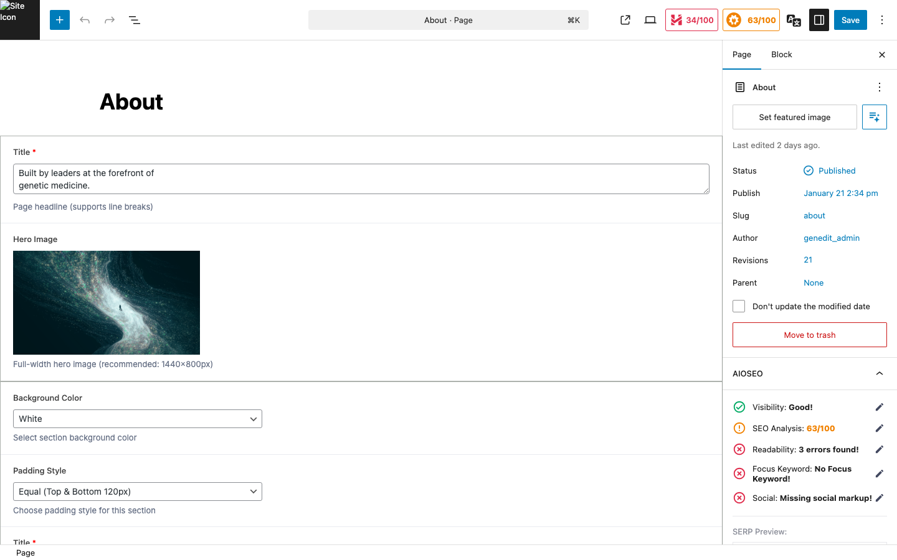

## 1. ACF 블록 개요

GenEdit 웹사이트는 **ACF Pro (Advanced Custom Fields)**를 사용하여 커스텀 블록을 제공합니다. 이 블록들은 Figma 디자인을 정확히 구현하며, 관리자가 쉽게 콘텐츠를 편집할 수 있습니다.

### 블록 접근 방법

1. 페이지 편집 화면에서 `+` 버튼 클릭
2. 블록 검색창에 "genedit" 또는 블록명 입력
3. **GenEdit** 카테고리에서 원하는 블록 선택

---

## 2. Hero 블록

### Hero Section (genedit-hero)

메인 페이지의 전체 화면 히어로 영역입니다.

| 필드 | 설명 | 필수 |
|------|------|------|
| **Title** | 큰 제목 텍스트 | ✓ |
| **Highlight Text** | 강조 텍스트 (뱃지) | |
| **Background Image** | 배경 이미지 | ✓ |
| **Background Video** | 배경 비디오 (선택) | |

### Page Hero (genedit-page-hero)

서브 페이지 상단의 히어로 영역입니다.

| 필드 | 설명 | 필수 |
|------|------|------|
| **Title** | 페이지 제목 | ✓ |
| **Subtitle** | 부제목 | |
| **Background Image** | 배경 이미지 | |

---

## 3. 콘텐츠 블록

### Section Title (genedit-section-title)

섹션의 제목과 설명을 표시합니다.

| 필드 | 설명 |
|------|------|
| **Title** | 섹션 제목 |
| **Description** | 섹션 설명 (선택) |
| **Alignment** | 정렬 (Left/Center) |

### Feature Cards (genedit-feature-cards)

특징을 카드 형태로 나열합니다.

| 필드 | 설명 |
|------|------|
| **Cards** (Repeater) | 카드 목록 |
| ㄴ **Icon** | 아이콘 이미지 |
| ㄴ **Title** | 카드 제목 |
| ㄴ **Description** | 카드 설명 |

### Image Text (genedit-image-text)

이미지와 텍스트를 나란히 배치합니다.

| 필드 | 설명 |
|------|------|
| **Image** | 이미지 |
| **Image Position** | 이미지 위치 (Left/Right) |
| **Title** | 제목 |
| **Content** | 본문 (WYSIWYG) |
| **Button** | 버튼 링크 (선택) |

### Two Column Text (genedit-two-column-text)

2단 텍스트 레이아웃입니다.

| 필드 | 설명 |
|------|------|
| **Left Column** | 왼쪽 열 콘텐츠 |
| **Right Column** | 오른쪽 열 콘텐츠 |

---

## 4. 인터랙티브 블록

### Q&A (genedit-qa)

자주 묻는 질문 형태의 아코디언입니다.

| 필드 | 설명 |
|------|------|
| **Section Title** | 섹션 제목 |
| **Items** (Repeater) | Q&A 항목 |
| ㄴ **Question** | 질문 |
| ㄴ **Answer** | 답변 |

### Content Accordion (genedit-content-accordion)

일반 콘텐츠 아코디언입니다.

| 필드 | 설명 |
|------|------|
| **Items** (Repeater) | 아코디언 항목 |
| ㄴ **Title** | 항목 제목 |
| ㄴ **Content** | 항목 내용 |

### Testimonials (genedit-testimonials)

인용문/후기를 슬라이더로 표시합니다.

| 필드 | 설명 |
|------|------|
| **Testimonials** (Repeater) | 후기 목록 |
| ㄴ **Quote** | 인용문 |
| ㄴ **Author** | 작성자 |
| ㄴ **Title** | 직책/소속 |

---

## 5. 로고/파트너 블록

### Partners (genedit-partners)

파트너사 로고를 그리드로 표시합니다.

| 필드 | 설명 |
|------|------|
| **Section Title** | 섹션 제목 |
| **Partners** (Repeater) | 파트너 목록 |
| ㄴ **Logo** | 로고 이미지 |
| ㄴ **Name** | 파트너명 |
| ㄴ **URL** | 링크 (선택) |

### Investors (genedit-investors)

투자사 로고를 표시합니다. Partners와 동일한 구조입니다.

---

## 6. 동적 콘텐츠 블록

### Team (genedit-team)

팀 멤버 CPT에서 데이터를 불러와 표시합니다.

| 필드 | 설명 |
|------|------|
| **Description** | 섹션 설명 |

> **참고**: 팀 멤버 데이터는 `Team Members` 메뉴에서 별도 관리됩니다. 블록은 자동으로 데이터를 불러옵니다.

### News (genedit-news)

최신 뉴스 게시물을 자동으로 표시합니다.

| 필드 | 설명 |
|------|------|
| **Title** | 섹션 제목 |
| **Count** | 표시할 뉴스 개수 |
| **Category** | 특정 카테고리만 표시 (선택) |

### Careers (genedit-careers)

채용 정보를 표시합니다.

| 필드 | 설명 |
|------|------|
| **Title** | 섹션 제목 |
| **Description** | 설명 |
| **Jobs** (Repeater) | 채용 공고 목록 |

---

## 7. 특수 블록

### Pipeline Table (genedit-pipeline-table)

파이프라인 현황을 테이블 형태로 표시합니다.

| 필드 | 설명 |
|------|------|
| **Programs** (Repeater) | 프로그램 목록 |
| ㄴ **Program Name** | 프로그램명 |
| ㄴ **Indication** | 적응증 |
| ㄴ **Stage** | 개발 단계 |
| ㄴ **Partner** | 협력사 |

### CTA Banner (genedit-cta-banner)

Call-to-Action 배너입니다.

| 필드 | 설명 |
|------|------|
| **Title** | 제목 |
| **Description** | 설명 |
| **Button Text** | 버튼 텍스트 |
| **Button URL** | 버튼 링크 |
| **Background** | 배경색/이미지 |

### Contact Info (genedit-contact-info)

연락처 정보를 표시합니다.

| 필드 | 설명 |
|------|------|
| **Address** | 주소 |
| **Email** | 이메일 |
| **Phone** | 전화번호 |
| **Map Embed** | 지도 임베드 코드 |

---

## 8. 블록 편집 팁

### 블록 정렬

일부 블록은 넓은 정렬 옵션을 지원합니다:

| 정렬 | 설명 |
|------|------|
| **None** | 기본 콘텐츠 너비 |
| **Wide** | 넓은 너비 |
| **Full** | 전체 화면 너비 |

### 블록 복사/이동

- **복사**: 블록 선택 → 상단 메뉴 `⋮` → "복제"
- **이동**: 블록 선택 → 드래그 또는 화살표 버튼 사용

### 블록 재사용

자주 사용하는 블록 구성은 "재사용 가능 블록"으로 저장할 수 있습니다:

1. 블록 선택
2. 상단 메뉴 `⋮` → "재사용 가능 블록에 추가"
3. 이름 지정 후 저장
4. 다른 페이지에서 해당 블록 검색하여 삽입
