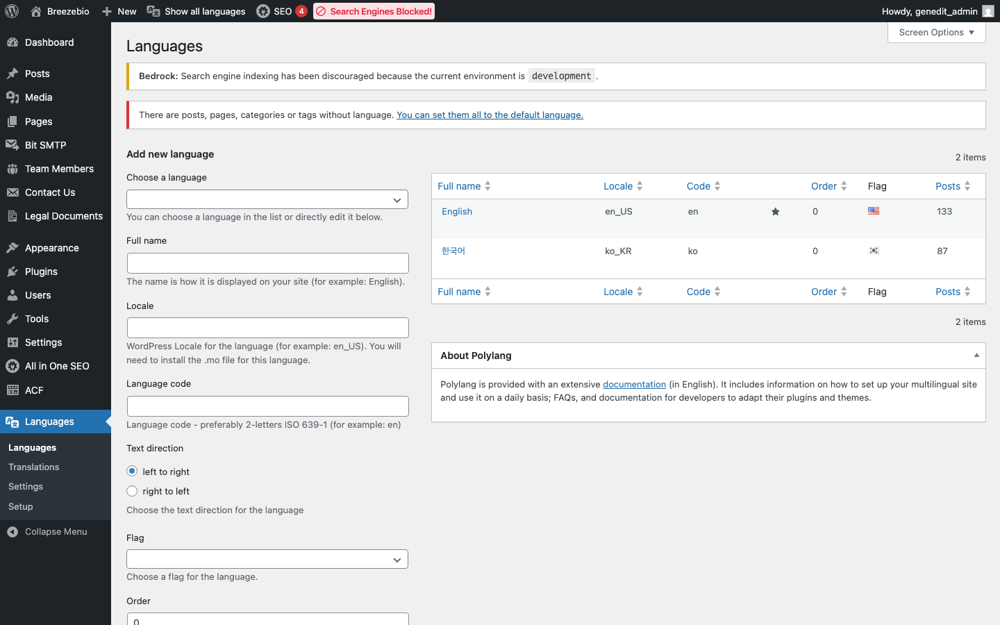
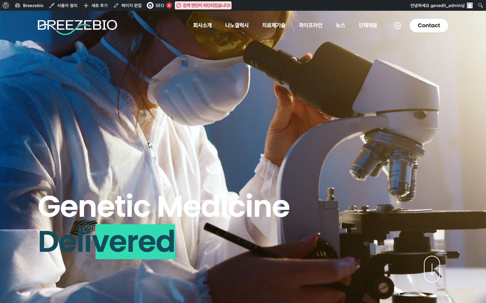

## 1. Polylang 개요

GenEdit 웹사이트는 **Polylang** 플러그인을 사용하여 다국어를 지원합니다.

### 지원 언어

| 언어 | 코드 | 기본 여부 | URL 구조 |
|------|------|----------|----------|
| English | `en` | ✓ 기본 | `breezebio.com/about` |
| 한국어 | `ko` | | `breezebio.com/ko/about` |

---

## 2. 언어별 콘텐츠 관리

### 콘텐츠 목록에서 언어 확인

페이지/글 목록에서 언어 플래그 아이콘으로 각 콘텐츠의 언어를 확인할 수 있습니다.



| 아이콘 | 의미 |
|--------|------|
| 🇺🇸 | 영어 버전 |
| 🇰🇷 | 한국어 버전 |
| ➕ | 해당 언어 번역 없음 (클릭하여 생성) |
| ✏️ | 번역 있음 (클릭하여 편집) |

### 콘텐츠 편집 시 언어 설정

편집 화면 우측 사이드바의 **Languages** 패널에서 설정합니다.


| 항목 | 설명 |
|------|------|
| **Language** | 현재 콘텐츠의 언어 |
| **Translations** | 연결된 다른 언어 버전 |

---

## 3. 번역 워크플로우

### 신규 콘텐츠 번역 추가

1. 원본 콘텐츠(예: 영어) 작성 및 발행
2. 목록에서 해당 콘텐츠의 ➕ 아이콘 클릭 (번역할 언어)
3. 번역 콘텐츠 작성
4. 발행

### 기존 콘텐츠에 번역 연결

이미 각각 작성된 콘텐츠를 서로 연결하는 방법:

1. 콘텐츠 편집 화면 진입
2. 우측 **Languages** 패널에서 **Translations** 드롭다운 확인
3. 연결할 다른 언어 콘텐츠 선택
4. 저장

> **주의**: 이미 다른 콘텐츠와 연결된 번역을 선택하면 기존 연결이 해제됩니다.

### 번역 동기화 주의사항

- 메타데이터(특성 이미지, 카테고리 등)는 언어별로 독립적으로 관리됩니다
- 한 언어에서 수정해도 다른 언어에 자동 반영되지 않습니다
- 양쪽 언어 콘텐츠를 각각 업데이트해야 합니다

---

## 4. 언어 스위처

### 프론트엔드 언어 전환

웹사이트 방문자는 헤더의 언어 스위처를 통해 언어를 전환할 수 있습니다.



### 언어 스위처 동작

| 상황 | 동작 |
|------|------|
| 번역 있음 | 해당 페이지의 번역 버전으로 이동 |
| 번역 없음 | 해당 언어의 홈페이지로 이동 |

---

## 5. 메뉴의 다국어 처리

### 메뉴 구조

현재 **단일 메뉴**를 사용하며, 메뉴 라벨은 코드에서 자동 번역됩니다.

| 영어 라벨 | 한국어 변환 |
|----------|-------------|
| About | 회사소개 |
| NanoGalaxy | 나노갤럭시 |
| Science | 치료제기술 |
| Pipeline | 파이프라인 |
| News | 뉴스 |
| Careers | 인재채용 |
| Contact | 문의하기 |

> **참고**: 메뉴 라벨 번역은 테마 코드(`GeneditSite.php`)에서 처리됩니다. 새로운 메뉴 항목 추가 시 개발팀에 번역 추가를 요청하세요.

---

## 6. 다국어 SEO

### URL 구조

Polylang은 언어별로 별도의 URL을 생성합니다:

```
영어: https://breezebio.com/about
한국어: https://breezebio.com/ko/about
```

### hreflang 태그

검색엔진에 언어 버전 정보를 알리는 `hreflang` 태그가 자동으로 삽입됩니다:

```html
<link rel="alternate" hreflang="en" href="https://breezebio.com/about" />
<link rel="alternate" hreflang="ko" href="https://breezebio.com/ko/about" />
```

### All in One SEO와 연동

SEO 설정(메타 제목, 설명)은 언어별로 개별 관리됩니다. 각 언어 콘텐츠에서 별도로 설정하세요.

---

## 7. 자주 묻는 질문

### Q: 번역 콘텐츠가 연결되지 않아요

**A**: 
1. 두 콘텐츠의 언어 설정이 서로 다른지 확인
2. 이미 다른 콘텐츠와 연결되어 있지 않은지 확인
3. 연결 후 반드시 "저장/업데이트" 클릭

### Q: 영어 페이지인데 URL에 /en/이 붙어요

**A**: 영어가 기본 언어로 설정되어 있으면 URL에 언어 코드가 붙지 않습니다. `/en/`이 붙는 경우:
- Polylang 설정에서 "기본 언어 URL에서 언어 정보 숨기기" 확인
- 설정 변경 필요 시 개발팀에 문의

### Q: 특정 페이지만 한국어 버전이 없어도 되나요?

**A**: 네, 가능합니다. 모든 콘텐츠가 반드시 양쪽 언어를 가질 필요는 없습니다. 다만 방문자가 언어 전환 시 홈페이지로 이동하게 됩니다.
