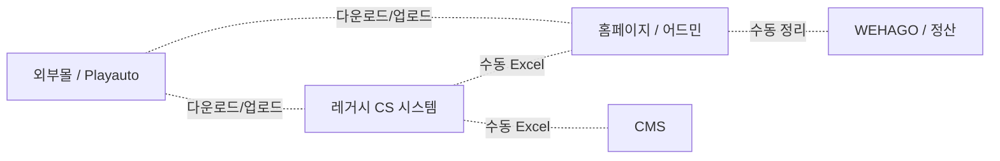
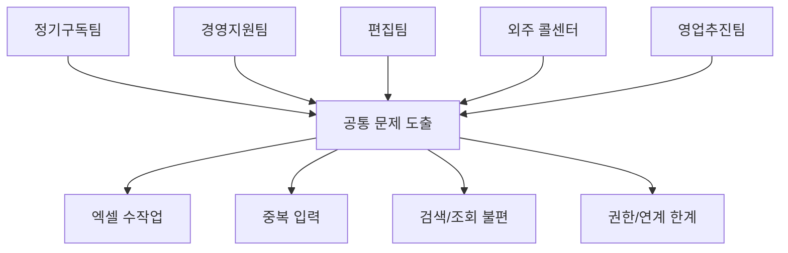
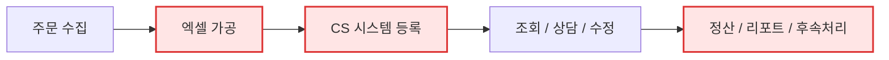
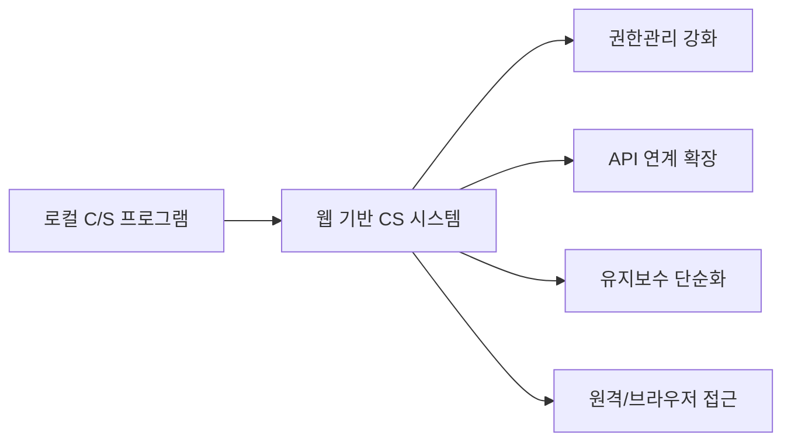
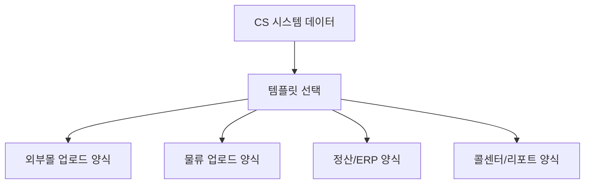
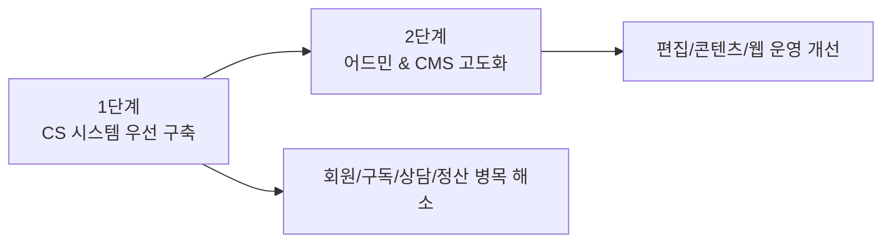
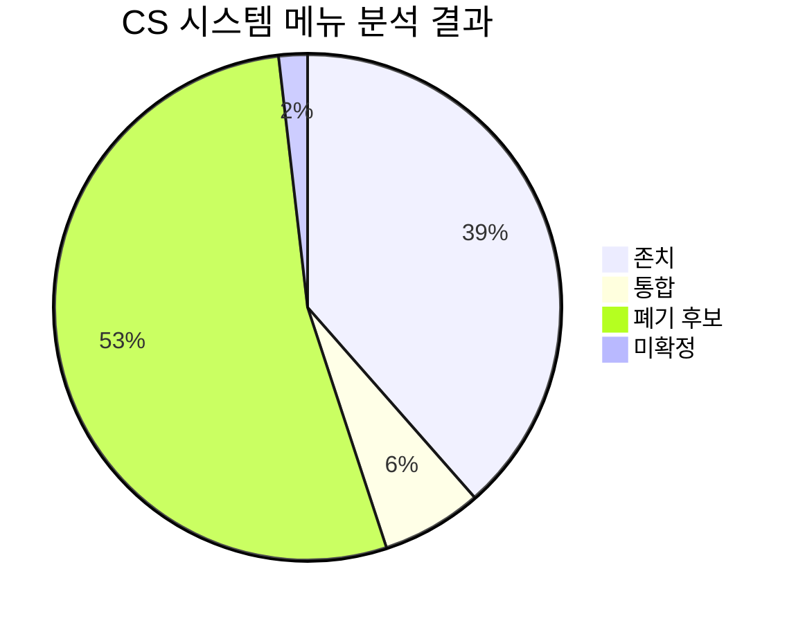
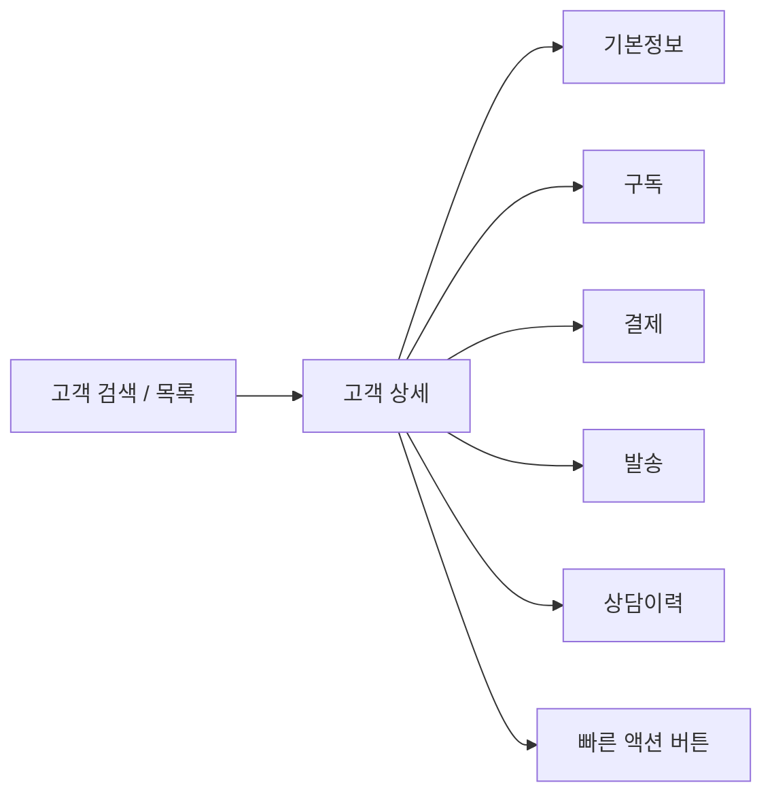
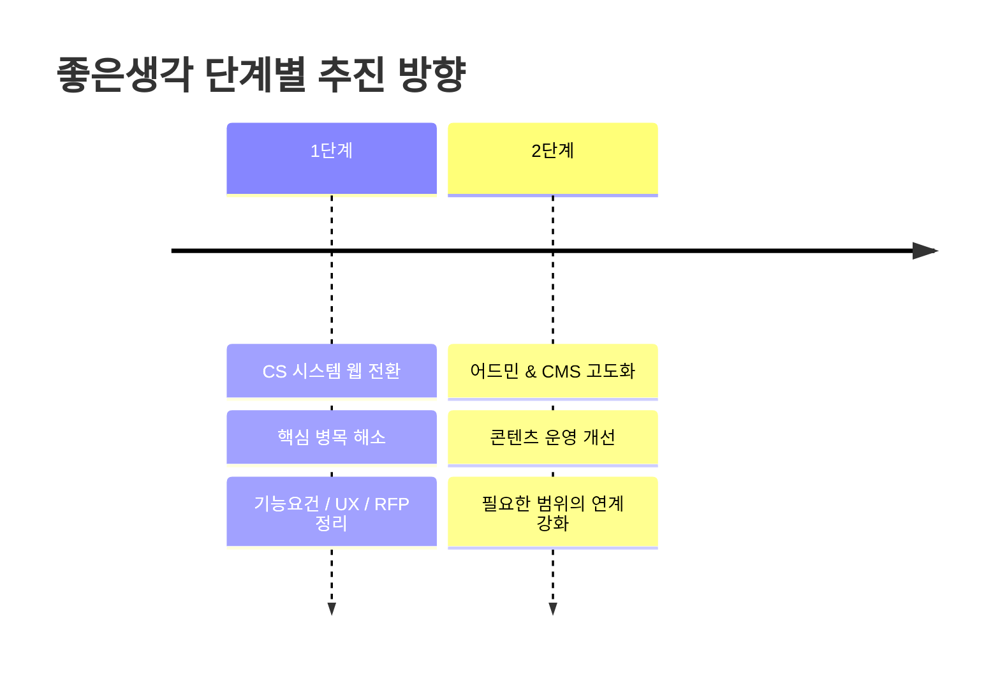

# Google Slides 발표자료 초안

> 목적: Google Slides에 **바로 복사-붙여넣기**할 수 있도록 슬라이드별 제목, 본문, 도식 초안을 정리한 문서입니다.
>
> 권장 사용법:
> 1. 슬라이드 제목/본문을 그대로 복사하여 붙여넣기
> 2. Mermaid 도식은 스크린샷으로 쓰거나, 도형으로 다시 그리기
> 3. 장표 수는 14~15장 기준이며 필요 시 축약 가능

---

## 슬라이드 1. 표지

### 제목
좋은생각 CS 시스템 웹 전환 ISP

### 부제
현행 시스템 분석 및 CS 중심 목표 모델 제안

### 하단 표기
- 프로젝트 기간: 2026.03 ~ 2026.05
- 수행: 스컹크웍스스튜디오
- 대상: 좋은생각사람들

---

## 슬라이드 2. 발표 목차

### 제목
발표 목차

### 본문
1. 프로젝트 개요  
2. 좋은생각 내 시스템 현황 분석  
3. 좋은생각 각 부서 인터뷰 진행  
4. 현행 시스템의 한계  
5. CS 시스템 핵심 병목현상 및 해결방안  
6. 메뉴 분석  
7. 기능요건 정리  
8. 개선된 CS 시스템 UX안  
9. 향후 진행 방향  

---

## 슬라이드 3. 프로젝트 개요

### 제목
1. 프로젝트 개요

### 본문
좋은생각은 30년 이상 축적된 구독·콘텐츠·고객 데이터를 기반으로 운영되는 출판/콘텐츠 기업입니다.  
그러나 현재 고객 응대, 구독 관리, 주문 처리, 정산, 콘텐츠 운영 업무는 서로 다른 시스템에 분산되어 있으며, 이로 인해 수작업과 중복 입력이 지속적으로 발생하고 있습니다.

이번 ISP의 목적은 단순한 시스템 교체가 아니라,  
**좋은생각의 핵심 운영 축인 CS 업무를 중심으로 디지털 전환 방향을 정리하고, 실제 구축이 가능한 목표 모델과 이행 계획을 수립하는 것**입니다.

### 핵심 목표
- 로컬 기반 CS 시스템의 웹 전환
- 분산 데이터의 통합 관리 기반 마련
- 수작업·엑셀 의존 업무의 구조적 축소
- 단계적 구축을 위한 RFP 및 실행 기준 수립

### 슬라이드용 한 줄 메시지
이번 ISP는 “시스템 교체”가 아니라 “운영 방식 재설계”를 위한 준비 단계입니다.

---

## 슬라이드 4. 좋은생각 내 시스템 현황 분석

### 제목
2. 좋은생각 내 시스템 현황 분석

### 본문
현재 좋은생각의 운영 환경은 하나의 통합 시스템이 아니라, 여러 시스템이 병렬적으로 운영되는 구조입니다.

### 현행 시스템 구성
- **CS 시스템**: 레거시 C/S 기반 고객관리 프로그램
- **홈페이지/어드민**: 웹 기반 주문 및 일부 운영 기능
- **CMS**: 콘텐츠 등록 및 관리
- **외부 채널**: 스마트스토어, 쿠팡 등 다수 채널
- **외부 솔루션**: Playauto, 나이스페이, WEHAGO, 배송 시스템 등

### 현황 요약
- On-Prem 시스템과 AWS 시스템이 이원화되어 있음
- 시스템 간 직접 연동이 부족하여 엑셀 수작업이 발생
- 동일 고객/주문/정산 정보가 여러 곳에 분산 저장됨
- 실질적으로는 “시스템이 연결된 구조”가 아니라  
  **사람이 시스템 사이를 연결하는 구조**로 운영되고 있음

### 그림 초안

### 디자인 메모
- 좌측에 시스템 박스 5개 배치
- 점선 화살표에 “수동”, “엑셀”, “재가공” 표시
- 하단에 빨간 문구: **직접 연동보다 사람 중심 운영 구조**

---

## 슬라이드 5. 좋은생각 각 부서 인터뷰 진행

### 제목
3. 좋은생각 각 부서 인터뷰 진행

### 본문
문서 분석만으로는 실제 병목을 정확히 파악하기 어렵기 때문에,  
주요 실사용 부서를 대상으로 인터뷰를 진행하여 현장의 업무 흐름과 불편사항을 검증했습니다.

### 인터뷰 대상
- 정기구독팀
- 경영지원팀
- 편집팀
- 외주 콜센터
- 영업추진팀

### 인터뷰를 통해 확인한 공통 사항
- 시스템 간 데이터가 이어지지 않아 중간 작업이 많음
- 엑셀 가공, 수동 업로드, 육안 검수 비중이 높음
- 메뉴는 많지만 실제로는 일부 기능에 사용이 집중됨
- 검색, 조회, 권한, 이력 확인 기능의 불편이 반복적으로 제기됨
- 부서마다 사용하는 시스템 목적이 달라 단일 통합 접근에 한계가 있음

### 결론
현장의 요구는 “기능 추가”보다  
**업무 흐름에 맞는 구조 재설계와 사용성 개선**에 더 가까웠습니다.

### 그림 초안

---

## 슬라이드 6. 현행 시스템의 한계

### 제목
4. 현행 시스템의 한계

### 본문
현행 시스템의 문제는 단순히 오래된 프로그램이라는 점이 아니라,  
업무 구조와 시스템 구조가 서로 맞지 않는 상태라는 점입니다.

### 주요 한계
- **레거시 구조**  
  로컬 설치형 C/S 시스템 중심으로 운영되어 접근성과 확장성이 낮음

- **데이터 분산**  
  고객, 주문, 결제, 구독, 콘텐츠 데이터가 시스템별로 분리되어 있음

- **수작업 의존**  
  엑셀 취합, 수동 업로드, 수동 다운로드, 육안 검수 업무가 지속 발생

- **운영 리스크**  
  권한 관리 미흡, 개인정보 수동 관리, CTI 중단, 외부업체 접근 범위 불명확

- **업무 비효율**  
  같은 업무를 여러 화면과 여러 시스템에서 나눠 처리하고 있음

### 핵심 진단
현재 구조는 기능 부족의 문제가 아니라,  
**업무 흐름을 시스템이 지원하지 못하고 있는 구조적 문제**입니다.

### 강조 문구
사람이 시스템 사이를 연결하고 있는 구조는 더 이상 지속 가능하지 않습니다.

---

## 슬라이드 7. CS 시스템 핵심 병목현상

### 제목
5. CS 시스템 핵심 병목현상

### 본문
CS 시스템은 좋은생각 운영의 중심 역할을 하고 있지만, 실제 현장에서는 여러 단계에서 병목이 발생하고 있습니다.

### 핵심 병목
1. **주문 수집 → 시스템 입력 구간 병목**  
   외부몰/자사몰 데이터를 모아 엑셀로 정리한 뒤 다시 시스템에 반영해야 함

2. **회원정보 조회 및 활용 병목**  
   동일 고객의 정보가 여러 회원번호와 이력으로 분산되어 통합 조회가 어려움

3. **양식 대응 병목**  
   외부 플랫폼별 업로드/다운로드 양식이 달라 매번 수작업 정제 필요

4. **정산 및 후속 처리 병목**  
   리포트, 정산, ERP 대응을 위한 별도 추출·가공 업무가 반복됨

5. **메뉴 구조 병목**  
   자주 쓰는 기능이 흩어져 있어 화면 이동과 우회 작업이 잦음

### 요약
CS 시스템의 병목은 특정 기능 하나의 문제가 아니라,  
**입력-조회-처리-후속관리 전체 흐름에 걸쳐 누적되어 있는 문제**입니다.

### 그림 초안

---

## 슬라이드 8. 해결방안 ① 웹 프로그램으로 전환

### 제목
5-1. 해결방안 ① 로컬 CS 시스템의 웹 전환

### 본문
첫 번째 해결방안은 현재 로컬 프로그램 중심의 CS 시스템을 웹 기반으로 전환하는 것입니다.

### 기대 효과
- 설치 환경 제약 해소
- 사용자 접근성 향상
- 중앙 통합 관리 및 유지보수 용이
- 권한 및 접속 이력 관리 강화
- 외부 시스템 연계를 위한 API 구조 확장 가능

### 왜 필요한가
현재 C/S 구조는 기능을 조금 보완한다고 해결되는 단계가 아닙니다.  
웹 전환을 통해서만 향후 데이터 통합, 자동화, 권한 관리, 화면 재구성의 기반을 만들 수 있습니다.

### 결론
**CS 시스템 웹 전환은 선택 기능이 아니라, 이후 개선의 전제 조건입니다.**

### 그림 초안

---

## 슬라이드 9. 해결방안 ② 업로드/다운로드 템플릿 기능 도입

### 제목
5-2. 해결방안 ② 템플릿 제작 기능 도입

### 본문
두 번째 해결방안은 CS 시스템 내 회원정보와 주문정보를  
원하는 형식으로 업로드/다운로드할 수 있는 **템플릿 기반 기능**을 도입하는 것입니다.

### 필요 배경
- 외부 플랫폼마다 요구하는 양식이 다름
- 현재는 담당자가 엑셀 열 순서, 주소 분리, 항목명을 수작업으로 맞추고 있음
- 동일 데이터도 목적에 따라 여러 번 재가공되고 있음

### 도입 방향
- 회원/주문/발송/정산용 출력 템플릿 저장
- 외부 시스템 업로드용 컬럼 매핑 기능 제공
- 자주 쓰는 양식의 재사용
- 부서별 출력 형식 표준화
- 업로드 오류 보정 기능 제공

### 기대 효과
- 반복적인 엑셀 수정 작업 감소
- 담당자별 편차 축소
- 데이터 활용 속도 향상
- CS 시스템을 중심으로 외부 서식 대응 가능

### 한 줄 메시지
**사람이 서식을 맞추는 방식에서, 시스템이 서식을 만들어주는 방식으로 전환**

### 그림 초안

---

## 슬라이드 10. 해결방안 ③ 병목 기능 개선 및 단계적 전략

### 제목
5-3. 해결방안 ③ 병목 기능 개선 및 단계적 전략

### 본문
세 번째 해결방안은 현재 업무에 맞지 않아 병목을 유발하는 기능을 재정비하고,  
실제 현업이 필요로 하는 기능을 우선 도입하는 것입니다.

### 주요 개선 방향
- 통합 회원 조회 및 중복 식별 기능
- 상담/구독/결제/발송 이력 통합 화면
- 자주 쓰는 기능의 전면 배치
- 일괄 처리 기능 강화
- 권한 세분화
- 검색 정확도 개선
- 예외 건 관리 기능 보강

### 중요한 판단
이번 분석을 통해  
**CS 시스템과 어드민&CMS를 한 번에 완전 통합하는 것은 현실적으로 어렵다**는 점이 확인되었습니다.

### 단계적 개발 방향
1. **1단계: CS 시스템 우선 개발**  
   - 운영 병목 해소  
   - 고객/구독/상담 중심 구조 개편  
   - 현장 효율 개선

2. **2단계: 어드민/CMS 별도 고도화**  
   - 편집/콘텐츠/웹 운영 목적에 맞는 체계 정비  
   - 향후 필요한 범위 내 연계 강화

### 결론
**우선순위가 가장 높은 것은 CS 시스템이며, 어드민&CMS는 향후 별도 단계에서 접근하는 것이 타당합니다.**

### 그림 초안

---

## 슬라이드 11. 메뉴 분석

### 제목
6. 메뉴 분석

### 본문
현행 CS 시스템은 메뉴 수가 많고 구조가 복잡하지만, 실제 사용은 일부 메뉴에 집중되어 있습니다.  
따라서 기존 메뉴를 그대로 옮기는 것이 아니라, **존치·통합·폐기 기준으로 재정리**할 필요가 있습니다.

### 분석 결과 요약
- 전체 메뉴 수: **109개**
- 존치: **42개**
- 통합: **7개**
- 폐기 후보: **58개**
- 미확정: **2개**

### 핵심 인사이트
- 전체 메뉴의 절반 이상이 실제 업무에서 거의 사용되지 않음
- 실제 적극 사용 메뉴는 제한적이며, 핵심 기능은 특정 메뉴에 집중됨
- 회원현황 등 일부 메뉴가 여러 기능을 대체 수행하고 있음
- 영업관리 탭은 권한 문제와 실제 미사용이 혼재되어 재설계 필요

### 재구성 원칙
- **존치**: 핵심 업무 메뉴 유지
- **통합**: 중복 기능은 묶어서 단순화
- **폐기**: 사업 종료/미사용 메뉴 제외

### 한 줄 정리
**메뉴 수를 유지하는 것이 아니라, 업무 흐름을 살리는 메뉴 구조가 중요합니다.**

### 그림 초안

---

## 슬라이드 12. 기능요건 정리

### 제목
7. 기능요건 정리

### 본문
분석과 인터뷰 결과를 종합하면, 새로운 CS 시스템은 다음 기능을 중심으로 설계되어야 합니다.

### 핵심 기능요건
#### 1) 회원 관리
- 통합 회원 조회
- 중복 회원 식별
- 회원정보 수정 이력 확인
- 권한별 고객정보 노출 제어

#### 2) 주문/구독 관리
- 주문 및 구독 현황 통합 조회
- 상태 변경 및 이력 관리
- 일괄 등록/처리 기능
- 외부 채널 데이터 반영 지원

#### 3) 상담/이력 관리
- 상담 이력 통합 기록
- 고객 상세 화면에서 전체 이력 확인
- 처리 상태 및 후속 조치 관리

#### 4) 데이터 활용 기능
- 업로드/다운로드 템플릿
- 자주 쓰는 양식 저장
- 외부 시스템 양식 대응

#### 5) 운영 지원 기능
- 권한 관리
- 일괄 작업
- 예외 건 관리
- 리포트 및 추출 기능

### 우선순위가 높은 구체 요구사항 예시
- 개인정보 자동 파기
- 권한 제어 세분화
- 엑셀 양식 표준화 및 일괄 업로드 개선
- 회원 계정 통폐합 및 외부몰 연동
- CTI 시스템 복구(웹 기반)
- 유연한 주소 검색

### 결론
기능요건의 핵심은 “기능을 많이 넣는 것”이 아니라,  
**현업이 가장 자주 반복하는 업무를 끊김 없이 처리할 수 있도록 만드는 것**입니다.

---

## 슬라이드 13. 개선된 CS 시스템 UX안

### 제목
8. 개선된 CS 시스템 UX안

### 본문
새로운 CS 시스템의 UX 목표는 단순한 화면 현대화가 아니라,  
**한 명의 고객을 처리하기 위해 여러 화면을 돌아다니지 않도록 만드는 것**입니다.

### UX 설계 방향
#### 1) 고객 360도 화면
하나의 화면에서 다음 정보를 함께 확인
- 기본 회원정보
- 구독 정보
- 결제 정보
- 발송 정보
- 상담 이력

#### 2) 자주 쓰는 기능 우선 배치
- 회원 조회
- 구독 처리
- 발송 확인
- 상담 등록
- 템플릿 추출

#### 3) 검색 UX 개선
- 이름, 연락처, 주소, 최근 회원번호 등 다양한 기준 검색
- 동일인 관련 정보 묶음 조회
- 최근 사용 데이터 우선 노출

#### 4) 권한 기반 UX
- 내부직원 / 콜센터 / 관리자별 기능 노출 차등화
- 개인정보 마스킹 적용

### 기대 효과
- 화면 전환 횟수 감소
- 상담 응답 시간 단축
- 사용자 피로도 감소
- 교육 비용 절감

### 한 줄 메시지
**좋은 UX는 예쁜 화면이 아니라, 업무가 덜 끊기는 화면입니다.**

### 그림 초안

### 레이아웃 메모
- 좌측 30%: 고객 검색/리스트
- 우측 70%: 고객 상세 탭
- 우측 상단: `구독변경`, `상담등록`, `송장확인`, `템플릿추출` 버튼

---

## 슬라이드 14. 향후 진행 방향

### 제목
9. 향후 진행 방향

### 본문
이번 ISP를 통해 확인된 방향은 명확합니다.  
좋은생각의 차세대 운영체계는 **CS 시스템 중심의 목표 모델 설계와 단계적 이행 계획**을 기반으로 추진되어야 합니다.

### 추진 방향
#### 1단계
- CS 시스템 목표 모델 확정
- 핵심 기능 우선순위 정리
- 메뉴 재구성 및 UX 설계
- 이행 계획 및 RFP 구체화

#### 2단계
- 어드민/CMS 고도화 검토
- 콘텐츠 운영 및 편집 기능 구조 개선
- 필요한 범위 내 연계 강화

### 기대 효과
- 수작업 및 엑셀 의존도 감소
- 고객 응대 속도 향상
- 데이터 활용성과 운영 안정성 확보
- 시스템 목적별 역할 분리 명확화

### 마무리 문장
좋은생각의 디지털 전환은 모든 시스템을 한 번에 바꾸는 방식보다,  
**운영 병목이 가장 큰 CS 시스템부터 우선 개선하는 전략이 가장 현실적이고 효과적입니다.**

### 그림 초안

---

## 슬라이드 15. 결론

### 제목
결론

### 본문
이번 분석을 통해 좋은생각의 현행 시스템 문제는 개별 기능 부족이 아니라,  
**분산된 시스템 구조와 수작업 중심 운영 방식**에 있음을 확인했습니다.

따라서 향후 추진 방향은 다음과 같이 정리할 수 있습니다.

- CS 시스템은 웹 기반으로 우선 전환한다
- 현업 반복 업무를 줄이기 위한 템플릿/일괄처리/통합조회 기능을 강화한다
- 메뉴는 기존 구조를 답습하지 않고, 실제 사용 기준으로 재구성한다
- 어드민과 CMS는 별도 목적에 맞춰 향후 단계적으로 고도화한다

### 최종 메시지
**좋은생각의 디지털 전환은 “통합을 위한 통합”이 아니라,  
현장의 병목을 먼저 해결하는 CS 시스템 중심 전략에서 시작해야 합니다.**

---

## 부록 1. 장표별 추천 그림 목록

| 슬라이드 | 추천 그림 | 제작 방법 |
|---|---|---|
| 4 | 현행 시스템 연결도 | Mermaid 스크린샷 또는 Google Slides 도형 |
| 5 | 부서 인터뷰 종합도 | 조직형 도식 |
| 7 | 병목 프로세스 흐름도 | 화살표 프로세스 다이어그램 |
| 8 | 웹 전환 개념도 | Before → After 구조도 |
| 9 | 템플릿 기능 개념도 | CS 데이터 → 다중 서식 분기 |
| 10 | 단계별 개발 전략 | 1단계/2단계 박스형 로드맵 |
| 11 | 메뉴 분석 파이차트 | Slides 차트 또는 별도 재작성 |
| 13 | 고객 360도 UX 와이어프레임 | 도형 + 탭 구조 |
| 14 | 단계별 타임라인 | 타임라인 도형 |

---

## 부록 2. Google Slides 편집 팁

- 본문은 슬라이드당 4~6줄 이내로 유지
- 강조 문장은 굵게 처리
- 병목/리스크는 빨간색, 해결방안은 파란색/초록색으로 구분
- Mermaid는 문서 보관용으로 두고, 실제 슬라이드에서는 도형으로 단순화해서 그리는 것이 가장 안정적
- 모든 장표 하단에 작은 글씨로 `좋은생각 CS 시스템 웹 전환 ISP` 통일 표기 권장
