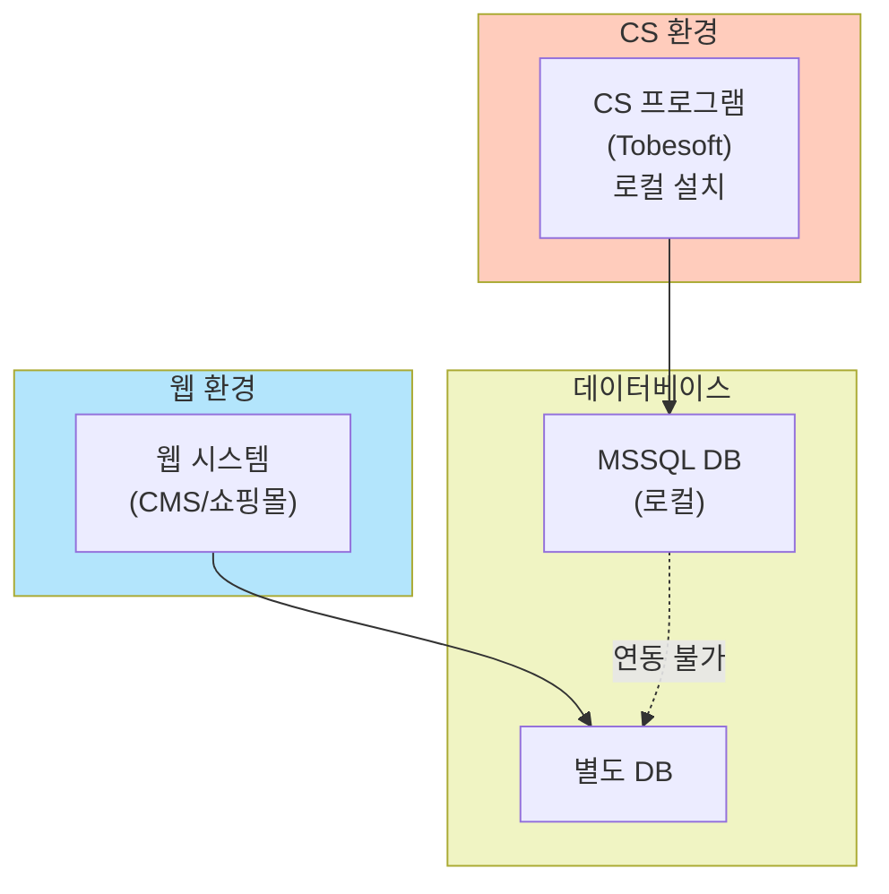
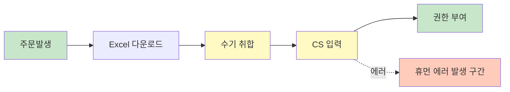
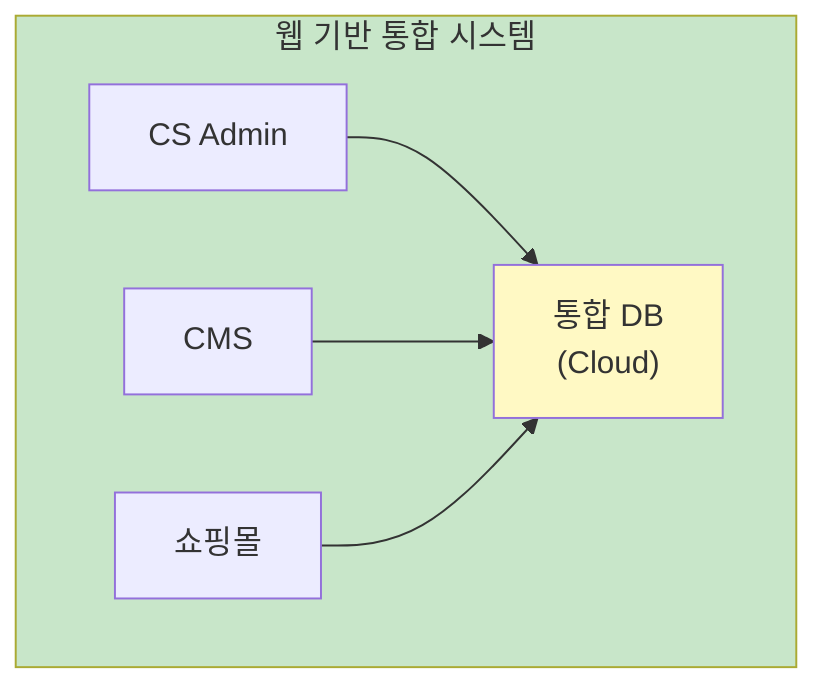
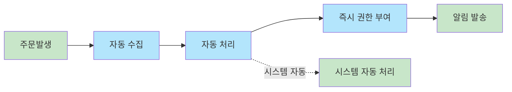

# 현황(AS-IS) 및 개선방향(TO-BE)

## 핵심 전환 비전

> **"단절과 수작업"에서 "연결과 자동화"로**

---

## 상세 비교표

| 구분 | 현황 (AS-IS) | 개선방향 (TO-BE) |
|:---|:---|:---|
| **아키텍처** | • PC 설치형 프로그램 (C/S) 방식 • 웹(CMS/쇼핑몰)과 기술적 연동(API) 불가 | • 100% 웹 기반 (Web-based) 시스템 전환 • 장소/PC 제약 없는 접속 및 실시간 연동 구현 |
| **데이터** | • 채널별(자사몰, 외부몰, 후원) 데이터 고립 • 담당자의 Excel 수기 취합 및 업로드 필수 | • 고객/주문 데이터 통합 DB 일원화 • API/스크래핑을 활용한 데이터 수집 자동화 |
| **프로세스** | • 데이터 단절로 인한 결제-권한 부여 지연 • 수작업 의존으로 휴먼 에러 상존 | • CS ↔ CMS 실시간 동기화 (결제 즉시 열람) • 시스템 주도의 표준화된 자동 처리 프로세스 |

---

## AS-IS 상세 분석

### 1. 아키텍처 현황

**문제점:**
- [ ] 특정 PC에서만 접근 가능
- [ ] 시스템 간 데이터 연동 불가
- [ ] 실시간 정보 공유 제한

### 2. 데이터 현황

| 채널 | 데이터 위치 | 통합 방식 |
|------|------------|----------|
| 자사몰 | 별도 DB | Excel 수작업 |
| 외부몰 | 외부 플랫폼 | Excel 수작업 |
| 후원 | CS 프로그램 | - |

**문제점:**
- [ ] 고객 정보 중복 및 불일치
- [ ] 채널별 매출 통합 어려움
- [ ] 히스토리 추적 불가

### 3. 프로세스 현황

**문제점:**
- [ ] 처리 지연 (최대 __시간)
- [ ] 입력 오류 발생률
- [ ] 담당자 부재 시 업무 마비

---

## TO-BE 목표 모델

### 1. 아키텍처 목표

### 2. 데이터 통합 목표

- **단일 고객 뷰**: 모든 채널의 고객 정보 통합
- **실시간 동기화**: API/Webhook 기반 자동 연동
- **데이터 정합성**: 마스터 데이터 관리 체계

### 3. 자동화 프로세스 목표

---

## 전환 전략

| 단계 | 목표 | 핵심 활동 |
|:---:|:---|:---|
| 1 | 분석 | 현행 시스템 역공학, 요구사항 도출 |
| 2 | 설계 | 아키텍처, ERD, 프로세스 설계 |
| 3 | 계획 | 마이그레이션, RFP 작성 |

---

## 작성 이력

| 날짜 | 작성자 | 변경 내용 |
|------|--------|----------|
| YYYY-MM-DD | - | 초안 작성 |
