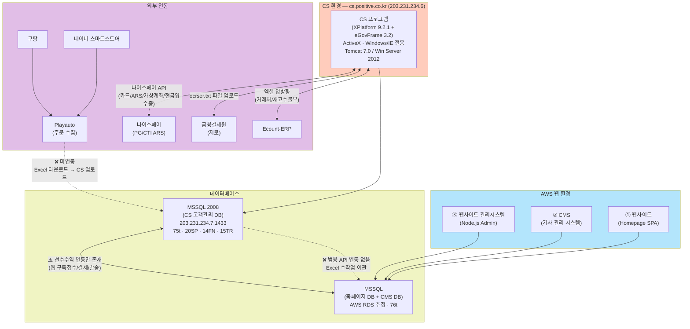
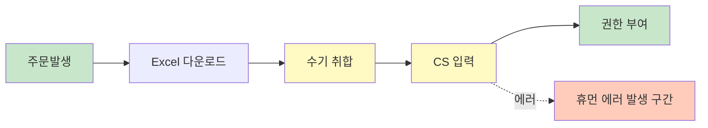
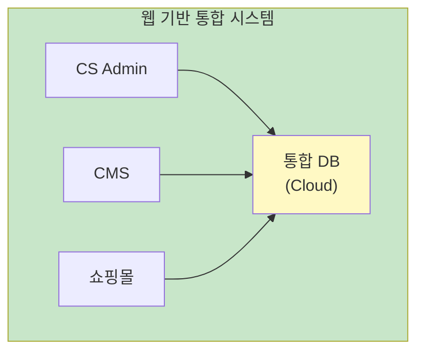
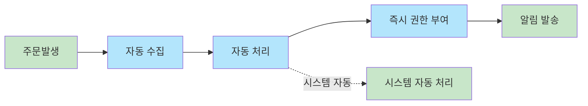

# 현황(AS-IS) 및 개선방향(TO-BE)

## 핵심 전환 비전

> **"단절과 수작업"에서 "연결과 자동화"로**

---

## 상세 비교표

| 구분 | 현황 (AS-IS) | 개선방향 (TO-BE) |
|:---|:---|:---|
| **아키텍처** | • ActiveX 기반 C/S 프로그램 (`cs.positive.co.kr`, Windows/IE 전용, 내부망/VPN 필수) • 웹 환경 3개 분리 (웹사이트·CMS·관리시스템, AWS) • 외부몰(네이버/쿠팡) 구독 주문 미연동 • CS DB ↔ 웹 DB 간 API 연동 불가 | • 100% 웹 기반 (Web-based) 시스템 전환 • 장소/PC 제약 없는 접속 및 실시간 연동 구현 |
| **데이터** | • 채널별(자사몰, 외부몰, 후원) 데이터 고립 • 담당자의 Excel 수기 취합 및 업로드 필수 | • 고객/주문 데이터 통합 DB 일원화 • API/스크래핑을 활용한 데이터 수집 자동화 |
| **프로세스** | • 데이터 단절로 인한 결제-권한 부여 지연 • 수작업 의존으로 휴먼 에러 상존 | • CS ↔ CMS 실시간 동기화 (결제 즉시 열람) • 시스템 주도의 표준화된 자동 처리 프로세스 |

---

## AS-IS 상세 분석

### 1. 아키텍처 현황

#### CS 환경 (고객관리 시스템)

- **접속 주소**: `http://cs.positive.co.kr/` (`203.231.234.6`)
- **구동 방식**: ActiveX 기반 — Tobesoft XPlatform 9.2.1 + eGovFrame 3.2 (Windows/Internet Explorer 전용)
- **WAS**: Tomcat 7.0 (Windows Server 2012)
- **접근 조건**: 사내 내부망 또는 내부 VPN(MikroTik PPTP) 접속 필수
- **형상관리**: Visual SVN Server
- **데이터베이스**: MSSQL Server 2008 (`203.231.234.7:1433`) — 75개 테이블, 20 SP, 14 Function, 15 Trigger
- **화면 수**: **86개** (사용자 매뉴얼 74개 + 관리자 매뉴얼 12개)
- **외부 연동**: 나이스페이(PG 4종/CTI ARS), 금융결제원(지로), Ecount-ERP(엑셀 양방향), 더아이앤오(외부콜센터)

#### 웹 환경 (AWS)

웹 시스템은 다음 3개로 분리 운영 중이다:

| # | 시스템 | 용도 | 비고 |
|:-:|--------|------|------|
| 1 | **웹사이트** (Homepage) | 대외 홈페이지, 온라인 구독 신청/결제 | SPA 기반 |
| 2 | **CMS** (기사 관리 시스템) | 월간지 콘텐츠(기사/칼럼) 등록·관리 | 편집실 사용 |
| 3 | **웹사이트 관리시스템** (Admin) | 홈페이지 운영 관리, 회원/주문 관리 | Node.js 기반 |

- **데이터베이스**: AWS RDS MSSQL (추정) — 홈페이지 63개 테이블 + CMS 13개 테이블

#### 외부 판매 채널

네이버 스마트스토어, 쿠팡 등 외부 쇼핑몰에서도 구독 상품을 판매하고 있으며, 구독 일자·수량에 해당하는 물품의 **구매 형식 결제**로 처리된다. 외부몰 주문은 Playauto를 통해 수집한다.

#### 아키텍처 다이어그램

**문제점:**
- [ ] CS 프로그램이 ActiveX/IE 전용으로 Windows PC + 내부망/VPN에서만 접근 가능
- [ ] CS DB(`203.231.234.7`, 온프레미스) ↔ 웹 DB(AWS RDS) 간 범용 API 연동 없음 — 데이터 이관은 전적으로 Excel 수작업에 의존
- [x] 단, **선수수익 반영에 한해** 웹↔CS 이벤트 기반 연동이 존재함을 확인 (관리자 매뉴얼 — `D:\POSITIVEWebIntefaceLog\` 로그 경로)
- [ ] 외부몰(네이버/쿠팡) 구독 주문이 CS 시스템에 자동 반영되지 않음 — Playauto에서 Excel 다운로드 후 수동 업로드
- [ ] 웹사이트·CMS·관리시스템이 분리 운영되어 실시간 정보 공유 제한
- [ ] 결제 발생 → CMS 열람 권한 부여까지 수작업 지연 (최대 1영업일)
- [ ] Windows Server 2012 + MSSQL 2008 — 모두 EOL(지원 종료) 상태로 보안 패치 중단

### 2. 데이터 현황

| 채널 | 데이터 위치 | 통합 방식 |
|------|------------|----------|
| 자사몰 | 별도 DB | Excel 수작업 |
| 외부몰 | 외부 플랫폼 | Excel 수작업 |
| 후원 | CS 프로그램 | - |

**문제점:**
- [ ] 고객 정보 중복 및 불일치
- [ ] 채널별 매출 통합 어려움
- [ ] 히스토리 추적 불가

### 3. 프로세스 현황

**문제점:**
- [ ] 처리 지연 (최대 __시간)
- [ ] 입력 오류 발생률
- [ ] 담당자 부재 시 업무 마비

---

## TO-BE 목표 모델

### 1. 아키텍처 목표

### 2. 데이터 통합 목표

- **단일 고객 뷰**: 모든 채널의 고객 정보 통합
- **실시간 동기화**: API/Webhook 기반 자동 연동
- **데이터 정합성**: 마스터 데이터 관리 체계

### 3. 자동화 프로세스 목표

---

## 전환 전략

| 단계 | 목표 | 핵심 활동 |
|:---:|:---|:---|
| 1 | 분석 | 현행 시스템 역공학, 요구사항 도출 |
| 2 | 설계 | 아키텍처, ERD, 프로세스 설계 |
| 3 | 계획 | 마이그레이션, RFP 작성 |

---

## 작성 이력

| 날짜 | 작성자 | 변경 내용 |
|------|--------|----------|
| 2026-03-09 | 김명직 | 관리자 매뉴얼 V1.1 기반 인프라 상세(IP/OS/WAS) 추가, 외부연동 7종 반영, 웹연동 로그 발견사항 반영, CS DB 위치 온프레미스로 수정 |
| 2026-03-09 | 김명직 | AS-IS 아키텍처 현황 전면 개편 — cs.positive.co.kr/ActiveX 구조, 웹 환경 3개 분리, 외부몰 미연동 문제 반영 |
| YYYY-MM-DD | - | 초안 작성 |
