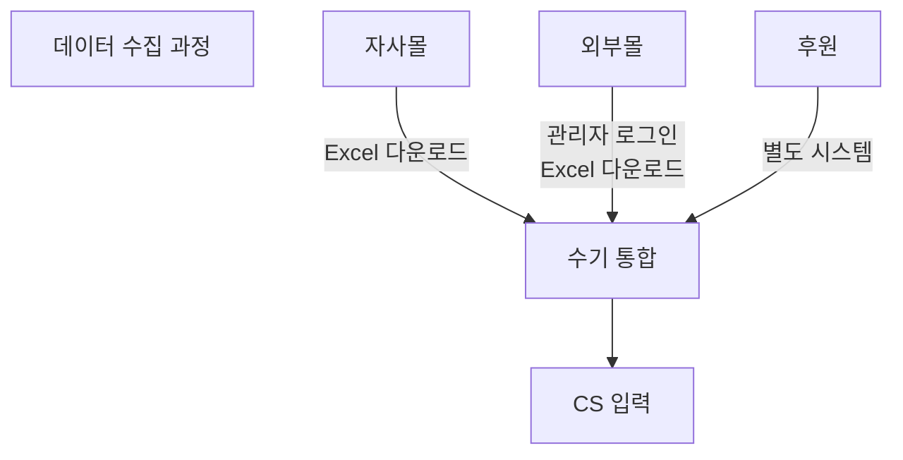

# 업무 분석

실무자 워크 쉐도잉을 통해 연동 불가로 인해 발생하는 엑셀 수작업 및 중복 업무 식별

---

## 분석 방법

### 분석 접근법

| 방법 | 목적 | 현황 |
|------|------|:----:|
| 문서 분석 | 업무플로우 PDF 4건 + DB 정의서 3건 기반 업무 흐름 추정 | ✅ 완료 |
| DB 역공학 | 151개 테이블, 49개 비즈니스 로직(SP/Function/Trigger) 분석 | ✅ 완료 |
| 워크 쉐도잉 | 실무자 업무 관찰을 통한 추정 검증 및 정량 데이터 수집 | ⬜ 미수행 |
| 인터뷰 | 실무자 5명 + 외부 개발자 1명 대상, Pain Point 식별 | ⬜ 미수행 |

### 워크 쉐도잉 계획 (Work Shadowing)
실무자의 일상 업무를 관찰하여 실제 업무 흐름과 문제점을 파악

| 대상 팀 | 대상자 | 기간 | 방법 | 시기 |
|---------|--------|------|------|------|
| 정기구독팀 | 정황규, 어은진 | 1~2일 | 업무 관찰 및 기록 | Week 3 |
| 영업추진팀 | 이성수, 권지은 | 1일 | 업무 관찰 및 기록 | Week 3 |
| 경영지원팀 | 송윤경 | 0.5일 | 업무 관찰 및 기록 | Week 3 |

:::note[추정 기반 분석]
아래 업무 흐름도 및 수작업 분석은 업무플로우 PDF 4건과 DB 정의서 분석 결과를 기반으로 **추정** 작성되었습니다. 정량 데이터(소요 시간, 건수, 오류율)는 인터뷰 및 워크 쉐도잉 후 확정됩니다.
:::

---

## 현행 업무 흐름도

> 조직도 기반 4개 팀의 업무 플로우를 문서 분석(업무플로우 PDF #19-22) 및 DB 역공학을 통해 정리. 정량 데이터(소요 시간, 건수)는 🔶 추정이며, 인터뷰/워크 쉐도잉 후 확정 필요.

### 1. 정기구독팀 (정황규, 어은진) — 5단계

```
① 구독 접수        ② 결제 확인         ③ 발송 처리
┌──────────┐    ┌──────────┐    ┌──────────┐
│ 전화/웹   │───▶│ 나이스페이 │───▶│ CS 프로그램│
│ 구독 신청 │    │ PG 확인  │    │ 발송 데이터│
│ (CS/콜센터)│    │ 지로 확인 │    │  생성     │
└──────────┘    └──────────┘    └────┬─────┘
                                     │
                    ④ 배송 관리       │      ⑤ CS 처리
                ┌──────────┐    ┌────┴─────┐
                │ 우체국/   │◀───│ 발송 지시 │
                │ CJ대한통운│    │ 라벨 출력 │
                └──────────┘    └──────────┘
```

| 단계 | 담당 | 사용 시스템 | 수작업 여부 |
|------|------|-----------|:----------:|
| ① 구독 접수 | 정기구독팀 + 더아이앤오(콜센터) | CS System (XPlatform) | 수동 입력 |
| ② 결제 확인 | 정기구독팀 | 나이스페이 PG + CS System | 수동 확인 |
| ③ 발송 처리 | 정기구독팀 | CS System → SP 호출 | 반자동 |
| ④ 배송 관리 | 정기구독팀 | 우체국/CJ 연동 | 수동 |
| ⑤ CS 처리 | 정기구독팀 + 콜센터 | CS System + CTI | 수동 |

### 2. 영업추진팀 (이성수, 권지은) — 7단계

```
① 주문 수집       ② 주문 확인        ③ 결제 처리
┌──────────┐    ┌──────────┐    ┌──────────┐
│ Playauto │───▶│ Excel    │───▶│ 나이스페이 │
│ (네이버,  │    │ 다운로드  │    │ PG 결제  │
│  쿠팡)    │    │ 수동 확인 │    │ 확인     │
└──────────┘    └──────────┘    └────┬─────┘
                                     │
④ 재고 확인       ⑤ 발송 지시        │
┌──────────┐    ┌──────────┐    ┌────┴─────┐
│ CS 프로그램│◀───│ CS 프로그램│◀───│ CS 입력  │
│ 재고 조회 │    │ 발송 처리 │    │ (수동)   │
└──────────┘    └────┬─────┘    └──────────┘
                     │
⑥ 배송 관리       ⑦ CS/환불
┌──────────┐    ┌──────────┐
│ CJ대한통운│◀───│ CS 처리  │
│ 배송 추적 │    │ 환불/교환 │
└──────────┘    └──────────┘
```

| 단계 | 담당 | 사용 시스템 | 수작업 여부 |
|------|------|-----------|:----------:|
| ① 주문 수집 | 영업추진팀 | Playauto → Excel | **수동** (핵심 병목) |
| ② 주문 확인 | 영업추진팀 | Excel (각 채널 관리자) | **수동** |
| ③ 결제 처리 | 영업추진팀 | 나이스페이 PG | 수동 확인 |
| ④ 재고 확인 | 영업추진팀 | CS System | 수동 조회 |
| ⑤ 발송 지시 | 영업추진팀 | CS System | 반자동 |
| ⑥ 배송 관리 | 영업추진팀 | CJ대한통운 | 수동 |
| ⑦ CS/환불 | 영업추진팀 | CS System + 나이스페이 | 수동 |

### 3. 경영지원팀 (송윤경, 김나현) — 5단계

```
① 매출 관리       ② 정산 처리        ③ 세금계산서
┌──────────┐    ┌──────────┐    ┌──────────┐
│ CS 프로그램│───▶│ Excel    │───▶│ 이카운트  │
│ 매출 집계 │    │ 수동 취합 │    │ ERP 입력 │
│ (수동 조회)│    │ 나이스페이 │    │ (이중 입력)│
└──────────┘    │ 정산 확인 │    └────┬─────┘
                └──────────┘         │
                                     │
④ 기안/결재                     ⑤ 월결산
┌──────────┐                ┌──────────┐
│ 이카운트  │◀───────────────│ 이카운트  │
│ 기안 작성 │                │ 월 마감  │
│ 전자결재  │                │ 보고서   │
└──────────┘                └──────────┘
```

| 단계 | 담당 | 사용 시스템 | 수작업 여부 |
|------|------|-----------|:----------:|
| ① 매출 관리 | 경영지원팀 | CS System → Excel | **수동** (핵심 병목) |
| ② 정산 처리 | 경영지원팀 | Excel + 나이스페이 | **수동** |
| ③ 세금계산서 | 경영지원팀 | 이카운트 ERP (이중 입력) | **수동** (이중 작업) |
| ④ 기안/결재 | 경영지원팀 | 이카운트 ERP | 수동 |
| ⑤ 월결산 | 경영지원팀 | 이카운트 ERP + Excel | 수동 |

### 4. 앵두아트프로젝트 — 7단계

```
① 기획           ② 제작            ③ 재고 관리
┌──────────┐    ┌──────────┐    ┌──────────┐
│ 상품 기획 │───▶│ 디자인/  │───▶│ CS 프로그램│
│ (아트상품) │    │ 제작     │    │ 재고 등록 │
└──────────┘    └──────────┘    └────┬─────┘
                                     │
④ 판매            ⑤ 주문 처리       │
┌──────────┐    ┌──────────┐    ┌────┴─────┐
│ 홈페이지  │◀───│ 관리자   │◀───│ 상품 등록 │
│ + 외부몰  │    │ 주문 확인│    │          │
└──────────┘    └────┬─────┘    └──────────┘
                     │
⑥ 배송            ⑦ 정산
┌──────────┐    ┌──────────┐
│ CJ대한통운│◀───│ 매출 취합│
│ 발송     │    │ 정산 처리│
└──────────┘    └──────────┘
```

| 단계 | 담당 | 사용 시스템 | 수작업 여부 |
|------|------|-----------|:----------:|
| ① 기획 | 앵두아트 | - | - |
| ② 제작 | 앵두아트 | - | - |
| ③ 재고 관리 | 앵두아트 | CS System | 수동 |
| ④ 판매 | 앵두아트 | 홈페이지 Admin + 외부몰 | 수동 등록 |
| ⑤ 주문 처리 | 앵두아트 | Admin + Playauto | 수동 |
| ⑥ 배송 | 앵두아트 | CJ대한통운 | 수동 |
| ⑦ 정산 | 앵두아트 + 경영지원 | Excel + 이카운트 | 수동 |

### 5. 주문 처리 프로세스 (통합 뷰)


### 6. 데이터 취합 프로세스 (통합 뷰)



---

## 수작업 구간 식별

### 식별된 수작업 항목

> 🔶 소요 시간, 빈도, 건수는 업무플로우 PDF와 DB 구조 분석 기반 **추정치**입니다. 인터뷰/워크 쉐도잉 후 확정 필요.

| No | 업무 | 현재 방식 | 소요 시간 🔶 | 빈도 🔶 | 오류 위험 | 관련 DB |
|----|------|----------|:--------:|:----:|:--------:|---------|
| 1 | 외부몰 주문 다운로드 | Playauto 접속 → 네이버/쿠팡 주문 Excel 다운로드 | 10~15분 | 일 2~3회 | 중 | - (외부 시스템) |
| 2 | Excel 데이터 취합 | 채널별 Excel 파일 수동 통합 (복사/붙여넣기) | 15~20분 | 일 1~2회 | **상** | - |
| 3 | CS 프로그램 수동 입력 | Excel → CS System(XPlatform) 건별 수동 입력 | 3~5분/건 | 일 20~50건 🔶 | **상** | PT_Customer, PT_Subscribe, PT_Receiver |
| 4 | CMS 권한 수동 부여 | CS 결제 확인 후 CMS 별도 접속 → 열람 권한 수동 부여 | 2~3분/건 | 결제 확인 시마다 | **상** | PT_Finance → ptcms_member |
| 5 | 결제-구독 수동 매칭 | 나이스페이 PG 입금 확인 → CS System에서 해당 고객 수동 매칭 | 2~3분/건 | 일 10~30건 🔶 | 상 | PT_NicepayCreditcardIncome, PT_Finance |
| 6 | 지로 입금 수동 확인 | 지로 입금 내역 수동 대조 → CS 프로그램 반영 | 3~5분/건 | 일 5~15건 🔶 | **상** | sp_PT_GiroFileUpload 등 6개 SP |
| 7 | 홈페이지 주문 이관 | 홈페이지 Admin에서 주문 확인 → CS System에 수동 재입력 | 5~10분/건 | 일 5~10건 🔶 | **상** | PTM_Orders → PT_Customer |
| 8 | 배송 라벨 출력 | CS System에서 발송 데이터 생성 → 우체국/CJ 시스템에 수동 업로드 | 20~30분 | 월 1~2회 (월간지 발송) | 중 | sp_PT_SendBookData |
| 9 | 매출 데이터 취합 | CS System + 나이스페이 + Playauto → Excel 수동 취합 | 30~60분 | 일 1회 | **상** | PT_Finance + 나이스페이 정산 |
| 10 | ERP 이중 입력 | CS System 매출 데이터 → 이카운트 ERP 별도 입력 (기안/세금계산서) | 10~20분/건 | 일 3~5건 🔶 | **상** | CS 매출 → 이카운트 (별도 시스템) |
| 11 | 데이터 검증 (목시 확인) | CS System 입력 데이터 육안 검증 | 10~15분 | 일 1~2회 | 상 | 전체 |
| 12 | 구독 만료 처리 | 만료 고객 수동 확인 → CS System 상태 변경 + CMS 권한 회수 | 2~3분/건 | 일 5~10건 🔶 | 중 | sp_PT_SubscribeCancel, ptcms_member |

### 수작업 시간 추정 (일간)

> 🔶 인터뷰/워크 쉐도잉 전 문서 기반 추정치. 실측 후 보정 필요.

```
┌─────────────────────────────────────────────────────────────────────┐
│                    일일 수작업 시간 추정 (2명 기준)                    │
├─────────────────────────────────────────────────────────────────────┤
│                                                                      │
│  [정기구독팀] 정황규, 어은진 — 추정 3~4시간/일                         │
│   ├─ 주문 다운로드/취합      : 25~35분                                │
│   ├─ CS 프로그램 수동 입력   : 60~150분 (20~50건 × 3분)              │
│   ├─ CMS 권한 수동 부여      : 20~30분                                │
│   ├─ 결제-구독 매칭          : 20~60분                                │
│   ├─ 데이터 검증             : 10~15분                                │
│   └─ 구독 만료 처리          : 10~30분                                │
│                                                                      │
│  [영업추진팀] 이성수, 권지은 — 추정 2~3시간/일                         │
│   ├─ Playauto 주문 수집      : 10~15분                                │
│   ├─ Excel 취합/CS 입력      : 60~90분                                │
│   ├─ 홈페이지 주문 이관      : 25~50분 (5~10건 × 5분)                │
│   └─ CS/환불 수동 처리       : 30~60분                                │
│                                                                      │
│  [경영지원팀] 송윤경, 김나현 — 추정 1.5~2시간/일                       │
│   ├─ 매출 데이터 취합        : 30~60분                                │
│   ├─ ERP 이중 입력           : 30~60분                                │
│   └─ 지로 입금 확인          : 15~30분                                │
│                                                                      │
│  ━━━━━━━━━━━━━━━━━━━━━━━━━━━━━━━━━━━━━━━━━━━━━━━━━━                │
│  총 추정: 6.5~9시간/일 (전 직원 합산)                                 │
│  월간 환산: 130~180시간/월 (근무일 20일 기준) 🔶                       │
│                                                                      │
└─────────────────────────────────────────────────────────────────────┘
```

### 수작업 유형별 분류

| 유형 | 해당 항목 | 건수 | 자동화 가능성 |
|------|----------|:----:|:------------:|
| **시스템 간 데이터 이관** | #3, #4, #7, #10 | 4건 | ⭐⭐⭐ (API 연동으로 완전 자동화) |
| **외부 채널 수집** | #1, #2, #5, #6 | 4건 | ⭐⭐⭐ (API 직접 연동 시) |
| **수동 검증/대조** | #5, #6, #11 | 3건 | ⭐⭐ (자동 검증 + 예외만 수동) |
| **물류/출력** | #8 | 1건 | ⭐⭐ (배송 API 연동 시 부분 자동화) |

### 수작업으로 인한 문제

1. **시간 낭비**
   - 일일 수작업 총 소요 시간: 🔶 6.5~9시간 (전 직원 합산)
   - 월간 환산: 🔶 130~180시간 (인건비 약 250~350만원 상당)
   - 전체 근무시간 대비 수작업 비율: 🔶 약 40~55% (추정)

2. **오류 발생**
   - 입력 오류 위험 항목: 12건 중 7건이 "상"
   - 가장 큰 리스크: C/S↔홈페이지↔CMS 간 데이터 불일치 (동일 고객 3곳에 분산)
   - 오류 수정 소요 시간: 🔶 10~30분/건 (원인 추적 포함)
   - 월간 오류 추정: 🔶 10~20건 (CS 입력 오류, 결제-구독 불일치, 권한 누락 등)

3. **업무 집중도 저하**
   - 단순 반복 업무(데이터 복사/입력/확인)로 인한 피로 누적
   - 본질적 CS 업무(고객 응대, 상담)에 투입 시간 감소
   - 월간지 발송 시기(월 1회) 업무 폭주 → 나머지 업무 지연

4. **데이터 정합성 리스크**
   - 고객 1명의 정보가 최대 3곳에 분산: C/S(PT_Customer) + 홈페이지(PTM_Members) + CMS(ptcms_member)
   - 동일 고객 중복 등록 또는 정보 불일치 규모 미확인 (→ VPN 접근 후 크로스 체크 필요)
   - 외부몰(네이버/쿠팡) 주문 ↔ C/S 고객 매핑 기준 불명확

---

## 병목 구간 분석

### 주요 병목 지점

```
병목 심각도: 🔴 높음 | 🟠 중간 | 🟢 낮음

1. [주문 수집 → CS 입력]  🔴 Critical
   - 원인: Playauto/홈페이지 → CS System 간 API 연동 없음
   - 영향: 주문 처리 지연 🔶 2~4시간 (수동 입력 대기)
   - 건수: 🔶 일 25~60건 (외부몰 + 홈페이지 + 전화 접수 합산)
   - 관련 DB: PT_Customer, PT_Subscribe, PTM_Orders

2. [결제 확인 → CMS 권한 부여]  🔴 Critical
   - 원인: CS System(On-Prem MSSQL) ↔ CMS(AWS MSSQL) 완전 분리
   - 영향: 고객 콘텐츠 이용 지연 🔶 수시간~1영업일
   - 고객 불만: 결제 완료 후 즉시 이용 불가 → CS 문의 증가
   - 관련 DB: PT_Finance → ptcms_member (수동 처리)

3. [매출 데이터 취합 → ERP 입력]  🔴 Critical
   - 원인: CS System ↔ 이카운트 ERP 간 연동 없음
   - 영향: 이중 입력 🔶 30~60분/일, 데이터 불일치 리스크
   - 관련 DB: PT_Finance → 이카운트 (별도 시스템, API 미연동)

4. [다채널 데이터 취합]  🟠 Major
   - 원인: 자사몰 + 외부몰(네이버/쿠팡) + 후원 각각 별도 관리
   - 영향: 일일 취합 🔶 30~50분, 채널 간 데이터 형식 불일치
   - 관련: Playauto(네이버/쿠팡), 홈페이지 Admin, CS System

5. [지로/가상계좌 입금 확인]  🟠 Major
   - 원인: 지로 입금 자동 매칭 불가 (수동 대조)
   - 영향: 건별 대조 🔶 3~5분, 일 5~15건
   - 관련 DB: sp_PT_GiroFileUpload, PT_NicepayVirtualAccount

6. [구독 만료 → CMS 권한 회수]  🟠 Major
   - 원인: 만료 자동 감지 → CMS 연동 없음
   - 영향: 만료 후에도 콘텐츠 접근 가능 (무임승차 리스크)
   - 관련 DB: sp_PT_SubscribeCancel ↛ ptcms_member

7. [배송 처리 (월간지 발송)]  🟢 Minor
   - 원인: 월 1회 대량 발송 시 CS System → 우체국/CJ 수동 업로드
   - 영향: 월 1회, 🔶 2~3시간 집중 작업
   - 관련 DB: sp_PT_SendBookData
```

### 병목 영향도 매트릭스

```
               빈도 (일일)
           높음(매일)    낮음(월간)
          ┌───────────┬───────────┐
  영향도  │ ① 주문→CS │ ⑧ 배송   │
  높음    │ ② CMS권한 │           │
          │ ③ ERP이중 │           │
          ├───────────┼───────────┤
  영향도  │ ④ 데이터  │ ⑥ 구독   │
  중간    │   취합    │   만료    │
          │ ⑤ 지로    │           │
          └───────────┴───────────┘
  
  → 좌상단 (빈도 높음 × 영향도 높음) = 최우선 자동화 대상
```

### 병목 해소를 위한 개선 방향

| 병목 | 현재 | 개선 방향 | 예상 효과 🔶 | 우선순위 |
|------|------|----------|:-----------:|:--------:|
| 주문 수집 | Playauto → Excel → CS 수동 입력 | API 자동 연동 (Playauto/네이버/쿠팡 → 통합 DB) | 일 2~4시간 절감 | ⭐⭐⭐ |
| CMS 권한 | CS 결제 확인 → CMS 별도 수동 처리 | 결제 확인 → CMS 자동 권한 부여 (API) | 고객 대기 시간 제거 | ⭐⭐⭐ |
| ERP 이중 입력 | CS 매출 → Excel → 이카운트 수동 입력 | 이카운트 API 연동 또는 통합 DB 연계 | 일 30~60분 절감 | ⭐⭐⭐ |
| 데이터 취합 | 채널별 관리자 로그인 → Excel 수동 통합 | 통합 대시보드 (단일 DB 조회) | 일 30~50분 절감 | ⭐⭐ |
| 지로 매칭 | 지로 파일 → 고객 수동 대조 | 지로 파일 자동 파싱 + 고객 매칭 | 건당 3~5분 절감 | ⭐⭐ |
| 구독 만료 | 수동 확인 → CS 상태 변경 + CMS 수동 회수 | 스케줄러 자동 감지 → CMS 연동 자동 처리 | 무임승차 방지 | ⭐⭐ |
| 배송 | CS → 수동 업로드 | CJ대한통운 API 직접 연동 | 월 2~3시간 절감 | ⭐ |

### 자동화 시 기대 효과 (추정)

| 지표 | AS-IS 🔶 | TO-BE 목표 | 개선율 |
|------|:--------:|:----------:|:------:|
| 일일 수작업 시간 (전 직원) | 6.5~9시간 | 1~2시간 | **75~80% 절감** |
| 월간 수작업 시간 | 130~180시간 | 20~40시간 | **75~80% 절감** |
| 주문 처리 소요 시간 | 2~4시간 (수동) | 실시간~30분 | **90% 이상** |
| 결제→CMS 권한 부여 | 수시간~1영업일 | 실시간 (자동) | **100%** |
| 데이터 입력 오류율 | 🔶 2~5% (추정) | 0.1% 미만 | **95% 이상** |
| 고객 정보 분산 | 3곳 (C/S+웹+CMS) | 1곳 (통합 DB) | **완전 통합** |

---

## 업무 분석 체크리스트

### 주문처리 프로세스
- [x] 채널별로 주문 처리 과정이 다른지? 어디서 갈라지는지? → ✅ 4개 채널(자사몰, 외부몰, 전화, 후원) 별도 처리 확인
- [ ] Playauto의 정확한 역할 — 주문 수집만? 결제 확인도? → 🔶 주문 수집 + 배송 상태 전달 추정, 인터뷰 확인 필요
- [ ] 결제 확인 → 권한 부여까지 실제 소요 시간? → 🔶 수시간~1영업일 추정
- [x] 수작업이 발생하는 단계는? → ✅ 12건 식별 완료
- [ ] 가장 시간이 오래 걸리는 단계는? → 🔶 CS 수동 입력 추정, 실측 필요
- [ ] 담당자 부재 시 멈추는 단계가 있는지? → 인터뷰 필요

### 데이터 취합 프로세스
- [x] 취합 주기는? → 🔶 일간 (매출 취합), 월간 (정산)
- [ ] 한 번 취합 시 데이터 양은? → 인터뷰 필요 (일 20~60건 추정)
- [x] 채널별 데이터 형식이 다른지? → ✅ Excel 포맷 상이 (Playauto/네이버/쿠팡 각각)
- [x] 통합 시 기준 키(고객ID 등)는 무엇인지? → ✅ PT_Customer.Customer_ID (decimal 13), 홈페이지는 PTM_Members 별도
- [x] 수작업이 발생하는 단계는? → ✅ 전 단계 수작업 (다운로드→통합→입력→검증)
- [ ] 오류가 자주 발생하는 단계는? → 인터뷰 필요

### CS(고객서비스) 처리 흐름
- [x] 문의 접수 경로 (전화, 이메일, 기타) → ✅ 전화(CTI, 서울정보시스템), 홈페이지 문의
- [x] 고객 정보 조회 시 사용하는 시스템 → ✅ CS System(XPlatform), CTI 팝업(전화 인입 시)
- [ ] 주문/결제 관련 문의 처리 시, 주문처리 프로세스의 어느 단계를 참조하는지 → 인터뷰 필요
- [x] 내부 CS팀과 외주 콜센터(더아이앤오)의 업무 분담 기준 → 🔶 더아이앤오: 일반 문의, 내부: 결제/구독 변경 추정

### 문서 기반 추정 검증
- [ ] 주문 수집: Playauto → Excel 다운로드 → CS 프로그램 수동 입력 — 실제 맞는지?
- [ ] 데이터 취합: 각 채널별 관리자 로그인 → Excel 다운 → 수기 통합 — 실제 맞는지?
- [ ] 권한 부여: 결제 확인 후 CMS에 별도 접속하여 수동 처리 — 실제 맞는지?
- [x] CS 시스템(MSSQL)과 웹 시스템(MSSQL, AWS)은 완전 분리, 연동 없음 — ✅ DB 정의서 분석으로 확인
- [ ] 위 추정 외에 우리가 모르는 수작업 구간이 있는지?
- [ ] 우리가 파악하지 못한 시스템이나 도구가 있는지?

### 기타
- [x] CS프로그램 기능별 사용 여부 구분 (근태관리·재고관리는 미사용 확인됨)
- [ ] 워크 쉐도잉 일정 확정
- [ ] CS 담당자 인터뷰 완료
- [ ] 운영 담당자 인터뷰 완료
- [x] 업무 흐름도 작성 완료 (문서 기반, 검증 필요)
- [ ] 수작업 구간 정량화 완료 (추정치 작성, 실측 필요)
- [ ] 병목 분석 완료 (추정 기반 작성, 인터뷰 후 확정)

---

## 작성 이력

| 날짜 | 작성자 | 변경 내용 |
|------|--------|----------|
| 2026-02-23 | - | 초안 작성 |
| 2026-03-03 | 현승인 | 4개 팀(정기구독팀, 영업추진팀, 경영지원팀, 앵두아트프로젝트) 업무 플로우 상세 추가 (AS-IS 문서 기반), 팀별 단계/담당/시스템/수작업 여부 테이블 작성, MySQL→MSSQL 표기 수정 |
| 2026-03-03 | 현승인 | 수작업 구간 5건→12건 확대 식별, 항목별 소요시간/빈도/오류위험 추정치 작성, 일일 수작업 시간 6.5~9시간 추정, 수작업 유형별 분류 및 자동화 가능성 평가 추가 |
| 2026-03-03 | 현승인 | 병목 구간 3건→7건 확대, 병목 영향도 매트릭스 신설, 개선 방향별 예상 효과 추정, 자동화 시 기대효과 테이블 추가 (75~80% 절감 목표) |
| 2026-03-03 | 현승인 | 분석 방법 체계화 (문서분석/DB역공학/워크쉐도잉/인터뷰), 워크쉐도잉 계획 구체화 (대상 5명, Week 3), 체크리스트 수행 상태 갱신 (12/27 항목 완료 또는 추정 완료) |
