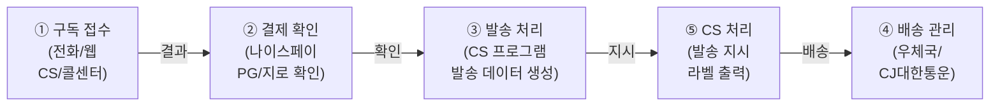
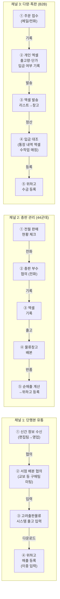
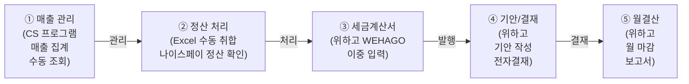
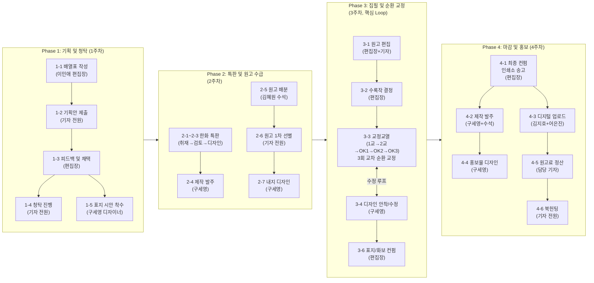
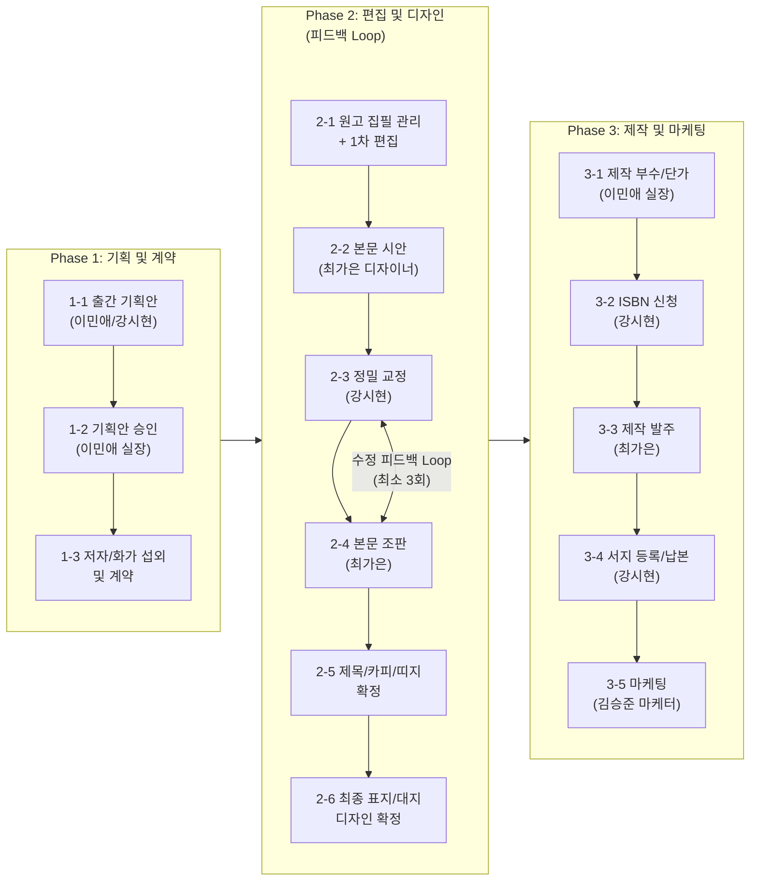
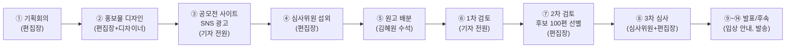
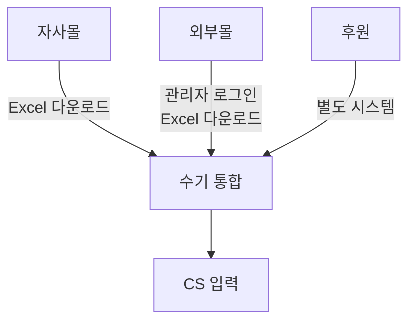
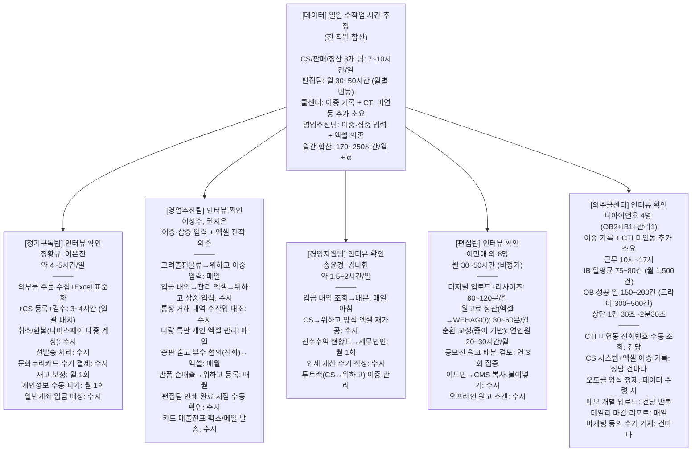
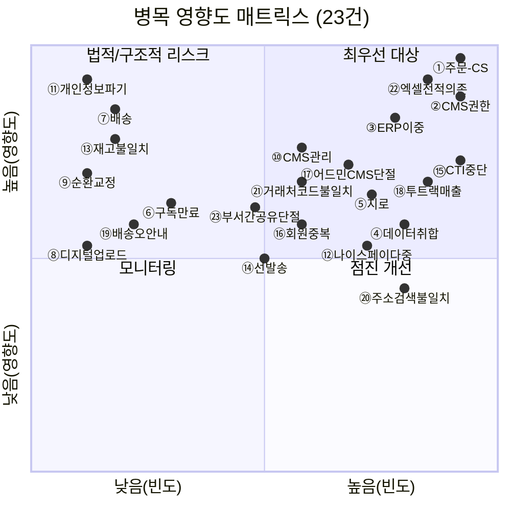

# 업무 분석

각 팀 인터뷰 및 워크쉐도잉을 통해 개선이 필요한 병목 및 중복 업무를 식별합니다.

---

## 분석 방법

### 분석 접근법

| 방법 | 목적 | 현황 |
|-----|------|----|
| 문서 분석 | 업무플로우 PDF 4건 + 편집팀 업무플로우 PDF 1건 + CMS 개선사항 PDF 1건 + DB 정의서 3건 기반 업무 흐름 추정 | 완료 |
| DB 역공학 | 151개 테이블, 49개 비즈니스 로직(SP/Function/Trigger) 분석 | 완료 |
| 워크쉐도잉 | 실무자 업무 관찰을 통한 추정 검증 및 정량 데이터 수집 | 완료 (인터뷰와 병행 수행) |
| 인터뷰 | 실무자 5명 + 외부 개발자 1명 대상, Pain Point 식별 | 완료 (정기구독�am/편집팀/경영지원팀/외주콜센터/영업추진팀 5건) |

### 워크쉐도잉 수행 결과 (Work Shadowing)
실무자의 일상 업무를 인터뷰와 병행하여 관찰 완료

| 대상 팀     | 대상자         | 기간    | 방법           | 상태 |
|------------|---------------|--------|---------------|:----:|
| 정기구독팀 | 정황규, 어은진 | 1\~2일 | 인터뷰 병행 관찰 | 완료 |
| 영업추진팀 | 이성수, 권지은 | 1일 | 인터뷰 병행 관찰 | 완료 |
| 경영지원팀 | 송윤경 | 0.5일 | 인터뷰 병행 관찰 | 완료 |

> **[참고]** 분석 기반
>
> 아래 업무 흐름도 및 수작업 분석은 업무플로우 PDF 4건, 편집팀 업무플로우 PDF, CMS 개선사항 PDF, DB 정의서 분석 결과를 기반으로 작성되었으며, 인터뷰 및 워크쉐도잉(병행 수행)을 통해 검증·보정되었습니다.

---

## 현행 업무 흐름도

> 조직도 기반 5개 팀의 업무 플로우를 문서 분석(업무플로우 PDF #19-22 + 편집팀 업무플로우 PDF) 및 DB 역공학을 통해 정리. 정량 데이터(소요 시간, 건수)는 [추정] 추정이며, 인터뷰·워크쉐도잉을 통해 검증 완료. 일부 항목은 실측 보정 반영.

### 1. 정기구독팀 (정황규, 어은진) — 5단계

| 단계 | 담당 | 사용 시스템 | 수작업 여부 |
|------|------|-----------|:----------:|
| ① 구독 접수 | 정기구독팀 + 더아이앤오(콜센터) | CS System (XPlatform) | 수동 입력 |
| ② 결제 확인 | 정기구독팀 | 나이스페이 PG + CS System | 수동 확인 |
| ③ 발송 처리 | 정기구독팀 | CS System → SP 호출 | 반자동 |
| ④ 배송 관리 | 정기구독팀 | 우체국/CJ 연동 | 수동 |
| ⑤ CS 처리 | 정기구독팀 + 콜센터 | CS System + CTI | 수동 |

### 2. 영업추진팀 (이성수, 권지은) — 3채널 병행

> **[주의]** 기존 추정 오류 보정
>
> 기존 업무 분석에서 영업추진팀을 **Playauto→Excel→CS System** 파이프라인으로 추정했으나, 인터뷰 결과 이는 **정기구독팀 소관 업무**임이 확인됨. 영업추진팀은 CS 시스템을 거의 사용하지 않으며, 고려출판물류·위하고·엑셀이 핵심 도구. 다량 특판 거래처 대부분은 CS 시스템 내 **회원으로 존재하지 않음**.

| 채널 | 담당 | 사용 시스템 | 수작업 여부 |
|------|------|-----------|:----------:|
| 단행본 유통 | 이성수(영업), 권지은(출고) | SCM(예스24/알라딘/교보), 고려출판물류 시스템, 위하고 | **수동** (이중 입력) |
| 총판 관리 (44군데) | 이성수(협의), 권지은(보조) | 전화, 엑셀, 위하고 | **수동** (전화+엑셀) |
| 다량·특판 (B2B) | 권지은(관리), 이성수(계약) | 메일/전화, 개인 엑셀, 위하고 | **수동** (삼중 입력) |
| 정산 | 권지은 | CS 시스템(카드전표만), 경영지원팀 엑셀, 위하고 | **수동** |

### 3. 경영지원팀 (송윤경, 김나현) — 5단계

| 단계 | 담당 | 사용 시스템 | 수작업 여부 |
|------|------|-----------|:----------:|
| ① 매출 관리 | 경영지원팀 | CS System → Excel | **수동** (핵심 병목) |
| ② 정산 처리 | 경영지원팀 | Excel + 나이스페이 | **수동** |
| ③ 세금계산서 | 경영지원팀 | 위하고(WEHAGO) (이중 입력) | **수동** (이중 작업) |
| ④ 기안/결재 | 경영지원팀 | 위하고(WEHAGO) | 수동 |
| ⑤ 월결산 | 경영지원팀 | 위하고(WEHAGO) + Excel | 수동 |

### 4. 편집팀 (이민애 편집장 외 8명) — 월간지 / 단행본 / 공모전

> 편집팀 업무플로우 PDF 및 CMS 개선사항 PDF 분석 기반. 편집팀은 CS/판매/정산과 다른 **콘텐츠 제작** 라인이며, 디지털 업로드(4-3)에서 CS팀(어은진)과 교차합니다.

#### 5-1. 월간지 제작 (28-Step, 4주 사이클)

| Phase | 단계 | 담당 | 사용 시스템/도구 | 수작업 여부 |
|-------|------|------|-----------------|:----------:|
| 1. 기획 | 배열표→기획안→채택→청탁 | 편집장 + 기자 4명 | 없음 (구두/문서) | - |
| 2. 원고 수급 | 특판 제작, 원고 배분/선별, 내지 디자인 | 수석기자 + 기자 + 디자이너 | InDesign, 이메일 | 수동 |
| 3. 순환 교정 | 윤문→교정교열(5단계)→디자인 수정 루프 | 편집장 + 기자 4명 + 디자이너 | InDesign, 프린트 교정지 | **수동** (핵심 Loop) |
| 4. 마감/홍보 | 송고→발주→**디지털 업로드**→정산→북헌팅 | 편집장 + 디자이너 + 기자 | 인쇄소, **홈페이지 어드민**, 온라인서점 | **수동** (업로드) |

#### 5-2. 단행본 출판 (17-Step)

| Phase | 단계 | 담당 | 사용 시스템/도구 | 수작업 여부 |
|-------|------|------|-----------------|:----------:|
| 1. 기획/계약 | 기획안→승인→저자 계약 | 이민애/강시현 | 없음 (문서) | - |
| 2. 편집/디자인 | 편집→시안→교정→조판→**피드백 Loop (3회+)** | 강시현 + 최가은 | InDesign | **수동** (핵심 Loop) |
| 3. 제작/마케팅 | 부수 결정→ISBN→발주→서지→마케팅 | 이민애/강시현/최가은/김승준 | 인쇄소, 서점 시스템, 국립중앙도서관 | 수동 |

#### 5-3. 공모전 운영 (연 3회)

> 생활문예대상, 한화 갱년기 공모전, 청년이야기대상 — 편집팀 전원 참여

| 단계 | 담당 | 주요 활동 | 수작업 여부 |
|------|------|----------|:----------:|
| 기획/홍보 | 편집장 + 디자이너 + 기자 전원 | 기획회의, 포스터/광고 디자인, 사이트 게시 | 수동 |
| 응모 관리 | 김혜원 수석 + 기자 전원 | 원고 배분(1\~4차), 1차 검토 | **수동** (대량 원고 처리) |
| 심사 | 편집장 + 외부 심사위원 | 2차 검토(100편→최종), 3차 심사 | 수동 |
| 발표/후속 | 기자 전원 + 아르바이트 | 입상 안내, 상패/상장 디자인, 선물 발송 | **수동** |

#### 편집팀 담당자별 R&R 요약

| 담당자 | 역할 | 월간지 | 단행본 | 공모전 |
|--------|------|--------|--------|--------|
| 이민애 | 편집장/실장 | 총괄 (기획\~마감) | 기획 총괄, 손익 검토 | 기획/최종 심사 |
| 김혜원 | 수석기자 | 원고 물류 허브 | - | 원고 배분 총괄 |
| 강시현 | 편집자/매니저 | - | 책임편집, ISBN/납본 | - |
| 김지민 | 기자 | 코너 5개 | - | 1차 검토 |
| 김지호 | 기자 | 코너 5개 + **디지털 업로드** | - | 1차 검토 |
| 함은재 | 기자 | 코너 4개 + 포티 | - | 1차 검토 |
| 구세영 | 디자이너 | **월간지 전담** | - | 포스터/상패 |
| 최가은 | 디자이너 | - | **단행본 전담** | - |
| 김승준 | 마케터 | - | 마케팅 전략/실행 | - |

### 5. 주문 처리 프로세스 (통합 뷰)

### 6. 데이터 취합 프로세스 (통합 뷰)

---

## 수작업 구간 식별

### 식별된 수작업 항목

> **[참고]** 추정치와 실측치 구분
>
> - [추정] = 추정 (문서 분석 기반, 실측 미완료)
> - 완료 = 인터뷰·워크쉐도잉 확인 완료
> - 인터뷰 완료: 정기구독팀(2026-03-17), 편집팀(2026-03-12), 경영지원팀(2026-03-19), 외주콜센터(2026-03-24), 영업추진팀(2026-04-02)

> **[주의]** 수작업 #4 (CMS 권한 수동 부여)
>
> 정기구독팀 인터뷰 결과, 해당 팀 소관 업무가 아님을 확인. 편집팀 인터뷰에서도 CMS 권한 부여 주체가 특정되지 않아 추가 확인 필요.

| No     | 업무                           | 현재 방식                                                                                                                                 |           소요 시간            |         빈도          |     오류 위험     | 관련 DB |
| ------ | ---------------------------- | ------------------------------------------------------------------------------------------------------------------------------------- | :------------------------: | :-----------------: | :-----------: | -------------------------------------- |
| 1      | 외부몰 주문 다운로드                  | Playauto 접속 → 외부몰 10개 주문 Excel 다운로드 + 미연동 채널(나이스북, 더매거진) 직접 접속                                                                        |         [추정] 10\~15분         |      일 1회 (오전)      |       중       | - (외부 시스템) |
| 2      | Excel 데이터 취합·표준화             | 10개+ 채널별 상이한 Excel 양식 → 어드민 업로드 규격으로 수작업 표준화 (주소 분리, 열 맞춤)                                                                            | **매일 오전 3\~4시간** (일괄 배치) |        일 1회         |     **상**     | - |
| 3      | CS 프로그램 일괄 등록                | 가공된 Excel → 어드민 업로드 → 회원번호 매칭 → 다운로드 후 모니터 2대 육안 검수·수정 → CS System 최종 등록                                                              |    **#2에 포함** (일괄 배치)    |        일 1회         |     **상**     | `PT_Customer`, `PT_Subscribe`, `PT_Receiver` |
| 4      | CMS 권한 수동 부여 [주의]              | CS 결제 확인 후 CMS 별도 접속 → 열람 권한 수동 부여                                                                                                    |         [추정] 2\~3분/건         |      결제 확인 시마다      |     **상**     | `PT_Finance` → `ptcms_member` |
| 5      | 결제-구독 수동 매칭                  | 나이스페이 PG·가상계좌·일반계좌 입금 확인 → CS System에서 해당 고객 수동 매칭                                                                                    |    **#2에 포함** (일괄 배치)    |        일 1회         |       상       | `PT_NicepayCreditcardIncome`, `PT_Finance` |
| 6      | 지로 입금 수동 확인                  | 지로 입금 내역 수동 대조 → CS 프로그램 반영                                                                                                           |          3\~5분/건           | 기존 유지분만, 신규 거의 없음 |     **상**     | `sp_PT_GiroFileUpload` 등 6개 SP |
| 7      | 홈페이지 주문 이관                   | 홈페이지 어드민에서 주문 확인 → CS System에 수동 재입력                                                                                                |          5\~10분/건          |     일 5\~10건 [추정]     |     **상**     | `PTM_Orders` → `PT_Customer` |
| 8      | 배송 라벨 출력                     | CS System에서 발송 데이터 생성 → 우체국/CJ 시스템에 수동 업로드                                                                                            |  20\~30분 (전날 배치 예약 필요)   |  월 1\~2회 (월간지 발송)   |       중       | `sp_PT_SendBookData` |
| 9      | 매출 데이터 취합                    | CS System + 나이스페이 + Playauto → Excel 수동 취합. 매일 아침 신한 인사이트 뱅크 → 엑셀 다운로드 → 구글 드라이브 공유 → 담당자별 배분 → 위하고 수금 등록 (경영지원팀 인터뷰)               |        **매일 아침**         |        일 1회         |     **상**     | `PT_Finance` + 나이스페이 정산 |
| 10     | ERP 이중 입력                    | CS System 매출 데이터 → 위하고 ERP 별도 입력 (기안/세금계산서). CS↔위하고 양쪽 입력 + 엑셀 수작업 재가공, 위하고 커스터마이징 불가 (경영지원팀 인터뷰)                                   |          **수시**          |         수시          |     **상**     | CS 매출 → 위하고 (별도 시스템) |
| 11     | 데이터 검증 (목시 확인)               | CS System 입력 데이터 육안 검증                                                                                                                |          10\~15분           |       일 1\~2회       |       상       | 전체 |
| 12     | 구독 만료 처리                     | 만료 고객 수동 확인 → CS System 상태 변경 + CMS 권한 회수                                                                                             |          2\~3분/건           |     일 5\~10건 [추정]     |       중       | `sp_PT_SubscribeCancel`, `ptcms_member` |
| 13     | 디지털 업로드 (월간지)                | 홈페이지 어드민 + 온라인서점(교보/알라딘 등)에 목차·이미지·콘텐츠 수동 업로드. CMS에 발행 완료 최종본 업로드, 이미지/파일 용량 제한으로 리사이즈 작업 추가 소요 (편집팀 인터뷰)                         |       **60\~120분**       |        월 1회         |     **상**     | 홈페이지 어드민, 외부 서점 시스템 |
| 14     | 원고료 정산                       | 기고자별 원고료 수동 산출 → 경영지원팀에 정산 요청 (Excel). 필자별 원고 매수·이미지 종류·수량 엑셀 정리 → 수동 비용 산정 → WEHAGO 상신, 전월 대비 차액 증감 파트별 전달 (편집팀 인터뷰)               |       **30\~60분**        |        월 1회         |       중       | - (Excel → WEHAGO) |
| 15     | 순환 교정 (월간지)                  | 프린트 교정지 기반 5단계 순환 교정 (1교→2교→OK1→OK2→OK3), 수정사항 구두/종이 전달. 종이 기반 유지 확인 — PDF 전환 시도했으나 실무자(수정 확인 불편, 눈 피로, 소통 필요) 저항으로 현행 유지 (편집팀 인터뷰) |     **연인원 20\~30시간**     |       월 1사이클        |       상       | - (프린트 교정지) |
| 16     | 공모전 원고 관리                    | 응모 원고 수작업 배분(1\~4차), 1차 검토 결과 수기 집계. 기자당 월 250개 검토, 배분은 수기 처리 — 어드민에 담당 기자 지정 기능 자체 없음 (편집팀 인터뷰)                                    |     **연인원 20\~40시간**     |        연 3회         |       중       | - (이메일/Excel) |
| 17     | 단행본 서지 등록·납본                 | ISBN 신청, 국립중앙도서관 납본, 서점 서지 등록 — 각 사이트 개별 수동 입력                                                                                        |         60\~90분/건          |     연 5\~20건      |       중       | 국립중앙도서관, 서점 시스템 |
| 18 | 선물 선발송 처리              | 정상 구독 데이터 생성 → 재발송 복제 생성 → 기존 정상 데이터 삭제 (3\~4단계)                                                                                      |         건당 다수 단계         |         수시          |     **상**     | `PT_GiftSend`, `PT_RegularSend_Info` |
| 19 | 문화누리카드 수기 결제           | 온라인 결제 불가 → 고객 전화로 카드번호 청취 → 사내 실물 단말기에서 수기 결제                                                                                        |         건당 전화+수기         |         수시          |     **상**     | - (오프라인 단말기) |
| 20 | 새벽햇살 기부처 수동 매칭         | 교정기관 기부 상품 입금 건 한 달간 모아서 수동 기부처 매칭 → 편집팀 전달                                                                                           |         월 1회 일괄          |        월 1회         |       중       | `PT_Subscribe` (새벽햇살) |
| 21 | 개인정보 수동 파기             | 5년 경과 만료자 Excel 추출 → 일일이 눈으로 대조하며 삭제 (자동 파기 기능 없음)                                                                                    |          매월 수동           |        월 1회         | **상 (법적 리스크)** | `PT_Customer` |
| 22 | 재고 강제 보정               | WEHAGO/CS 시스템/물류 창고 간 재고 불일치 → 매월 말 임의 수치 조정으로 강제 맞춤                                                                                  |           매월 말           |        월 1회         |     **상**     | `PT_GiftStock`, WEHAGO |
| 23 | 나이스페이 다중 계정 전환         | 결제 출처별 4\~5개 나이스페이 계정 번갈아 접속하여 카드 취소 처리                                                                                               |         건당 계정 전환         |      취소 건 발생 시      |       중       | - (나이스페이 외부 시스템) |
| 24 | 미연동 채널 수동 다운로드         | Playauto 미연동 채널(나이스북, 더매거진 등) 개별 사이트 직접 접속 또는 메일 수신                                                                                   |            매일            |        일 1회         |       중       | - (외부 시스템) |
| 25 | 송장 번호 재가공·업로드          | 배송 창고 운송장 Excel → CS 시스템 업로드 양식으로 재가공 후 일괄 등록                                                                                         |           발송 시           |       월 1\~2회       |       중       | `sp_PT_SendBookData` |
| 26 | 일반계좌 입금 수동 매칭          | 가상계좌 외 일반계좌로 입금된 정기 구독 건 수동 조회·매칭                                                                                                     |            수시            |         수시          |       상       | `PT_Finance` |
| 27 | 동일인 다중 계정 관리           | 동일인 여러 아이디/회원번호 보유, 외부몰 구매자 자사 계정 미연동 → CS 문의 시 수동 식별                                                                                 |            수시            |       CS 발생 시       |       중       | `PT_Customer`, `PTM_Members` |
| 28 | 어드민→CMS 원고 복사·붙여넣기     | 채택 완료 원고를 어드민에서 CMS로 수동 복사·붙여넣기하여 이관 (두 시스템 간 연동 없음)                                                                                  |          건당 수분           |        채택 시         |     **상**     | 홈페이지 어드민, CMS |
| 29 | 오프라인 원고 개별 스캔          | 우편/팩스 원고를 기자가 직접 스캔 → NAS/기자 PC에 분산 저장 (어드민·CMS 미등록). 약 40박스, 7천 편 추정                                                                 |            수시            |         수시          |       중       | - (NAS/PC) |
| 30 | CMS 이미지 리사이즈 작업        | CMS 이미지/파일 업로드 시 용량 제한 초과 → 리사이즈 작업 필수, 화질 저하 동반                                                                                      |         건당 추가 소요         |        업로드 시        |       중       | CMS (ptcms_contents) |
| 31 | 원고 배분 수기 처리            | 공모전·독자글 원고를 기자별로 배분할 때, 어드민에 담당 기자 지정 기능 없어 수기 처리                                                                                     |           월 1회           |        월 1회         |       중       | 홈페이지 어드민 |
| 32 | 어드민 원고 개별 프린트          | 어드민에서 일괄 프린트 불가 → 원고 내용에 개별 진입하여 하나씩 프린트                                                                                              |         건당 반복 작업         |         수시          |       중       | 홈페이지 어드민 |
| 33 | CMS 원고 복사·붙여넣기 활용      | CMS에 프린트 기능 없어 콘텐츠 제작·참고·청탁 시 복사-붙여넣기 방식으로 수작업                                                                                        |            수시            |         수시          |       중       | CMS (ptcms_contents) |
| 34 | 중복 투고 전화 확인            | 중복 투고 여부를 CMS 검색 + 제보/기자 직접 전화 확인에 의존. 실제 중복 투고 사례 발생                                                                                 |            수시            |         수시          |       상       | CMS, 수동 전화 |
| 35 | 공모전 페이지 개발자 요청         | 공모전 진행 시 페이지 텍스트·메뉴명 수정에도 개발자에게 하드코딩 요청 필요 (어드민 편집 권한 없음)                                                                             |          공모전 시           |        연 3회         |       중       | 홈페이지 어드민 |
| 36 | 참고도서 현황 수동 대조          | CMS 등록 참고도서 현황과 실제 보유 현황 불일치 시 수동 대조. 중복 구매 방지 목적                                                                                     |            수시            |         수시          |      하       | CMS (참고도서 관리) |
| 37 | 입금 내역 조회→배분            | 신한 인사이트 뱅크 통합 조회 → 엑셀 다운로드 → 구글 드라이브 시트 공유 → 각 매출 담당자 배분 → 위하고 수금 등록                                                                  |          매일 아침           |        일 1회         |       상       | - (신한 인사이트 뱅크, 구글 드라이브, WEHAGO) |
| 38 | CS→위하고 양식 엑셀 재가공       | CS 시스템 데이터를 위하고 업로드 양식에 맞추기 위해 엑셀 수작업 재가공(복사/붙여넣기). 실수 발생                                                                             |            수시            |         수시          |     **상**     | CS System → WEHAGO |
| 39 | 선수수익 현황표 추출→세무법인       | CS 시스템에서 선수수익 현황표 등 추출 → 서식 정리 → 세무법인 전달. 세무법인이 위하고에 업로드                                                                              |           월 1회           |        월 1회         |       중       | CS System → 세무법인 → WEHAGO |
| 40 | 인세 계산 수기 작성            | 판매 건수 및 인세 계산을 수기로 작성하여 위하고 업로드. 유상 판매분 세부 작업 전부 수작업                                                                                  |            수시            |         수시          |       중       | - (Excel → WEHAGO) |
| 41 | CTI 미연동 전화번호 수동 조회     | KT→LG 변경 후 CTI 팝업 불가 → 전화번호 수동 복사하여 CS 시스템에서 고객 조회. 안심번호 고객은 식별 불가                                                                    |         건당 추가 소요         |       상담 건마다        |     **상**     | CS System |
| 42 | CS 시스템+별도 엑셀 이중 기록     | CS 시스템 입력과 콜센터 자체 엑셀 관리 병행. 메모 일괄 업로드 기능 없어 하나씩 업로드                                                                                   |          상담 건마다          |       상담 건마다        |     **상**     | CS System + 별도 스프레드시트 |
| 43 | 오토콜 시스템 양식 정제          | 본사 DB 엑셀을 오토콜 시스템 양식에 맞게 수동 정제 후 업로드                                                                                                  |         데이터 수령 시         |         수시          |       중       | - (오토콜 시스템) |
| 44 | 메모/회원정보 개별 업로드         | 구독연장 시 관련 메모를 CS 시스템에 함께 업로드할 수 없어 건별 개별 업로드                                                                                          |         건당 반복 작업         |       상담 건마다        |       중       | CS System |
| 45 | 데일리 마감 리포트 작성          | 데일리/위클리/먼슬리 리포트를 CS 시스템·LG 인바운드·별도 스프레드시트에서 각각 추출하여 별도 작성 → 본사 메일 발송                                                                  |         매일 퇴근 전          |        일 1회         |       중       | CS System, LG 인바운드, 스프레드시트 |
| 46 | 콜백 미처리 내역 재전화          | LG 전산에 콜백으로 쌓인 미처리 내역을 확인하여 재전화                                                                                                       |         일 평균 5건          |        일 1회         |      하       | LG 전산 시스템 |
| 47 | 안심번호 고객 수동 식별          | 외부몰 구독자 안심번호 사용 시 CS 시스템에서 식별 불가 → 추가 정보(성함, 주소 등) 수동 확인                                                                              |            수시            |         수시          |       중       | CS System |
| 48 | 마케팅 동의 여부 수기 기재        | 개인정보·마케팅 동의 여부 체크 기능 부재 → 비고란에 수기 기재. 아웃바운드 대상 선별에 영향                                                                                 |          상담 건마다          |       상담 건마다        |       상       | CS System |
| 49 | 고려출판물류→위하고 이중 입력       | 단행본 출고 시 고려출판물류 시스템에 입력 → 위하고 ERP에 매출 재등록 (이중 입력)                                                                                     |            매일            |        일 1회         |     **상**     | 고려출판물류, WEHAGO |
| 50 | 입금 내역→관리 엑셀→위하고 삼중 입력  | 경영지원팀 통장 입금 내역 엑셀 → 관리용 엑셀 확인 → 위하고 수금 등록. 3단계 입력                                                                                     |            수시            |         수시          |     **상**     | 구글 드라이브, Excel, WEHAGO |
| 51 | 통장 거래 내역 수작업 대조        | 경영지원팀 제공 통장 내역 엑셀을 일일이 열어보고, 다량 특판 건·단행본 건 분리하여 미수금 수작업 매칭                                                                            |            수시            |         수시          |     **상**     | 구글 드라이브, Excel |
| 52 | 다량 특판 개인 엑셀 관리         | 거래처별 출고량·단가·입금 여부·결제 방식·발행 시점·출고일을 수많은 시트로 구성된 개인 엑셀에 전적으로 의존. 버전관리 부재, 파일 유실 시 미수금 관리 불가                                             |            매일            |         매일          |  **상 (리스크)**   | - (개인 Excel) |
| 53 | 총판 출고 부수 협의·엑셀 기록      | 44개 총판/서점에 전화로 출고 부수 협의 → 엑셀 기록                                                                                                       |            매월            |        월 1회         |       중       | - (전화, Excel) |
| 54 | 반품 수량 확인→순매출 계산→위하고 등록 | 명세서로 반품 수량 체크 → 순매출 산출 → 위하고에 수동 등록                                                                                                   |            매월            |        월 1회         |       중       | WEHAGO |
| 55 | 편집팀 인쇄/출고 완료 시점 수동 확인  | 신간·단행본 인쇄 완료 시점을 시스템으로 알 수 없어 위하고 기안 문서 또는 구두로 확인                                                                                     |            수시            |         수시          |       중       | WEHAGO (기안), 구두 |
| 56 | 카드 매출전표 팩스/메일 수동 발송    | 법인 카드 결제 후 팩스 영수증을 요구하는 거래처를 위해 인쇄 후 수동 팩스 또는 메일 발송                                                                                   |            수시            |         수시          |       중       | CS System (카드결제), 팩스기 |
| 57 | 엑셀 발송 리스트→창고 전달        | 출고 대상 리스트를 엑셀로 작성 → 위하고를 통해 창고에 전달                                                                                                    |            매월            |        월 1회         |       중       | Excel, WEHAGO |
| 58 | 다량 특판 유동 주문 월별 변경사항 확인 | 다량 특판 거래처의 유동 주문(부수 변경, 중지, 재개 등) 변경사항을 월별로 수동 확인                                                                                     |            매월            |        월 1회         |       중       | Excel, 전화 |

### 수작업 시간 추정 (일간)

> **[참고]** 인터뷰 완료 현황
>
> 5개 팀 인터뷰 완료. 정기구독팀·경영지원팀 실측 포함, 편집팀·콜센터·영업추진팀 정성 확인.

### 수작업 유형별 분류

| 유형               | 해당 항목                                         | 건수  |                      자동화/간소화 가능성                       |
| ---------------- | --------------------------------------------- | :-: | :------------------------------------------------- |
| **시스템 간 데이터 이관** | #3, #4, #7, #10, #28, #38, #39, #49, #50, #54 | 10건 | 3/5 (엑셀 추출 프로그램 활용으로 간소화, API 미제공으로 인한 수동 구간은 유지)  |
| **외부 채널 수집**     | #1, #2, #5, #6, #24, #37                      | 6건  |  3/5 (엑셀 추출 프로그램 활용으로 간소화, 위하고 구간은 수동 유지)   |
| **수동 검증/대조**     | #5, #6, #11, #21, #22, #34, #36, #51          | 8건  |                2/5 (자동 검증 + 예외만 수동)                 |
| **결제/정산 처리**     | #23, #26, #40, #56                            | 4건  |    2/5 (엑셀 추출 프로그램 활용으로 간소화, 위하고 API 미제공, 인세 세부 작업 등 완전 자동화 제한)    |
| **물류/출력**        | #8, #18, #25, #57                             | 4건  |      2/5 (엑셀 추출 프로그램 활용으로 간소화 + 선발송 로직 단순화)       |
| **특수 업무 프로세스**   | #19, #20, #27, #48, #58                       | 5건  |   2/5 (기부처 자동매칭, 회원정보 연결 및 통합, 마케팅 동의 체크, 유동 주문 알림 기능 개선 + 문화누리 온라인결제 수동 처리)   |
| **콘텐츠 업로드/배포**   | #13, #17, #29, #30, #32, #33                  | 6건  |  2/5 (CMS 자체 기능 개선으로 부분 자동화)   |
| **콘텐츠 제작 프로세스**  | #14, #15, #16, #31, #35                       | 5건  |         1/5 (워크플로 도구 도입 시 부분 자동화, 완전 자동화 불가)         |
| **콜센터 업무 비효율**   | #41, #42, #43, #44, #45, #46, #47             | 7건  |        2/5 (CTI 복구, 일괄 업로드, 데이터 연동 시 해소)         |
| **엑셀 기반 수기 관리**  | #52, #53, #55                                 | 3건  |             2/5 (시스템 기반 관리 전환 시 해소)              |

### 수작업으로 인한 문제

1. **시간 낭비**
   - 일일 수작업 총 소요 시간: 7\~10시간 (CS/판매/정산 3개 팀, 정기구독팀·경영지원팀 실측 포함) + 편집팀 별도 + 콜센터 별도 + 영업추진팀 이중·삼중 입력 별도
   - 월간 환산: 170\~250시간 (3개 팀) + 편집팀 30\~50시간 + 콜센터 이중 작업 시간 + 영업추진팀 엑셀 기반 수작업 시간
   - 전체 근무시간 대비 수작업 비율: 약 45\~60% (정기구독팀 실측 기준 50%+)

2. **오류 발생**
   - 입력 오류 위험 항목: 58건 중 25건 이상이 "상" 이상
   - 가장 큰 리스크: **개인정보 자동 파기 기능 부재** (법적 리스크, R1) + C/S↔홈페이지↔CMS 간 데이터 불일치 + **다량 특판 개인 엑셀 유실 리스크** (영업추진팀)
   - 오류 수정 소요 시간: [추정] 10\~30분/건 (원인 추적 포함)
   - 월간 오류 추정: [추정] 10\~20건 (CS 입력 오류, 결제-구독 불일치, 권한 누락 등)

3. **업무 집중도 저하**
   - 단순 반복 업무(데이터 복사/입력/확인)로 인한 피로 누적
   - 본질적 CS 업무(고객 응대, 상담)에 투입 시간 감소
   - 월간지 발송 시기(월 1회) 업무 폭주 → 나머지 업무 지연

4. **데이터 정합성 리스크**
   - 고객 1명의 정보가 최대 3곳에 분산: C/S(`PT_Customer`) + 홈페이지(`PTM_Members`) + CMS(`ptcms_member`)
   - 동일 고객 중복 등록 또는 정보 불일치 규모 미확인 (→ VPN 접근 후 크로스 체크 필요)
   - 외부몰(네이버/쿠팡) 주문 ↔ C/S 고객 매핑 기준 불명확

---

## 병목 구간 분석

### 주요 병목 지점

병목 심각도: 높음 | 중간 | 하

#### 1. [주문 수집 → CS 입력] — 높음 (Critical)
- **원인**: Playauto/홈페이지 → CS System 간 API 연동 없음
- **영향**: 주문 처리 지연 3\~4시간 (수동 입력 대기)
- **건수**: [추정] 일 25\~60건 (외부몰 + 홈페이지 + 전화 접수 합산)
- **관련 DB**: `PT_Customer`, `PT_Subscribe`, `PTM_Orders`

#### 2. [결제 확인 → CMS 권한 부여] — 높음 (Critical)
- **원인**: CS System(On-Prem MSSQL) ↔ CMS(AWS MSSQL) 완전 분리
- **영향**: 고객 콘텐츠 이용 지연 [추정] 수시간\~1영업일
- **고객 불만**: 결제 완료 후 즉시 이용 불가 → CS 문의 증가
- **관련 DB**: `PT_Finance` → `ptcms_member` (수동 처리)

> **[주의]** 인터뷰 검증 결과
>
> 정기구독팀 인터뷰(2026-03-17)에서 CMS 권한 부여는 **정기구독팀 소관 업무가 아님**을 확인. 편집팀 포함 5개 팀 인터뷰 완료되었으나, **담당 부서 미확정**.

#### 3. [매출 데이터 취합 → ERP 입력] — 높음 (Critical)
- **원인**: CS System ↔ 위하고(WEHAGO) ERP 간 연동 없음
- **영향**: 이중 입력 [추정] 30\~60분/일, 데이터 불일치 리스크
- **관련 DB**: `PT_Finance` → 위하고(WEHAGO) (별도 시스템, API 미연동)

#### 4. [다채널 데이터 취합] — 중간 (Major)
- **원인**: 자사몰 + 외부몰(네이버/쿠팡) + 후원 각각 별도 관리
- **영향**: 데이터 취합만 [추정] 30\~50분, 전체 배치 프로세스(다운로드→가공→등록→검수)는 3\~4시간. 채널 간 데이터 형식 불일치
- **관련**: Playauto(네이버/쿠팡), 홈페이지 어드민, CS System

#### 5. [지로/가상계좌 입금 확인] — 중간 (Major)
- **원인**: 지로 입금 자동 매칭 불가 (수동 대조)
- **영향**: 건별 대조 [추정] 3\~5분. 지로 신규 발생 없음(기존 유지분만). 가상계좌·일반계좌 수동 매칭이 실제 병목
- **관련 DB**: `sp_PT_GiroFileUpload`, `PT_NicepayVirtualAccount`

#### 6. [구독 만료 → CMS 권한 회수] — 중간 (Major)
- **원인**: 만료 자동 감지 → CMS 연동 없음
- **영향**: 만료 후에도 콘텐츠 접근 가능 (무임승차 리스크)
- **관련 DB**: `sp_PT_SubscribeCancel` ↛ `ptcms_member`

> **[주의]** 인터뷰 검증 결과
>
> 병목②(CMS 권한 부여)와 동일 이슈. 5개 팀 인터뷰 완료되었으나, CMS 권한 회수 **담당 부서 미확정**.

#### 7. [배송 처리 (월간지 발송)] — 하 (Minor)
- **원인**: 월 1회 대량 발송 시 CS System → 우체국/CJ 수동 업로드
- **영향**: 월 1회, [추정] 2\~3시간 집중 작업
- **관련 DB**: `sp_PT_SendBookData`

#### 8. [디지털 업로드 (편집팀↔CS팀)] — 중간 (Major)
- **원인**: 홈페이지 어드민 + 온라인서점(교보/알라딘 등)에 목차·이미지·콘텐츠를 각각 수동 업로드. CMS 에디터 기능 부족으로 작업 효율 저하
- **영향**: 월 1회, 1\~2시간. 김지호(편집팀) + 어은진(정기구독팀) 공동 작업 → 팀 간 업무 경계 모호
- **관련**: 홈페이지 어드민, 외부 서점 시스템 (API 미연동)

#### 9. [순환 교정 프로세스 (월간지)] — 중간 (Major)
- **원인**: 5단계 교정(1교→2교→OK1→OK2→OK3)이 프린트 교정지 기반, 수정사항 구두/종이 전달
- **영향**: 월 1사이클, 편집팀 전원 연인원 20\~30시간 소요. 교정 누락·중복 수정 리스크
- **관련**: InDesign, 프린트 교정지 (디지털 교정 도구 미사용)

#### 10. [CMS 콘텐츠 관리 전반] — 중간 (Major)
- **원인**: 예약 발행 미지원, 버전 관리 없음, 검색 기능 부족, 오디오 콘텐츠 별도 관리
- **영향**: 콘텐츠 발행 유연성 부족, 수정 이력 추적 불가, 과거 데이터 이관 불가
- **관련**: 홈페이지 어드민 CMS 전체

### 병목 영향도 매트릭스

> **[참고]** 병목 항목 식별 현황
>
> 기존 10건 + 정기구독팀 6건 + 편집팀/경영지원팀/콜센터 4건 + 영업추진팀 3건 = 총 23건. 신규 항목은 ⑪\~㉓으로 표기.

> **[참고]** 매트릭스 해석
>
> **최우선 대상** (빈도 높음 × 영향도 높음)
> - ① 주문→CS, ② CMS 권한, ③ ERP 이중, ⑮ CTI 중단, ⑱ 투트랙 매출, ㉒ 엑셀 전적 의존
>
> **법적 리스크**
> - ⑪ 개인정보 자동 파기 부재 — 빈도 낮지만 영향도 최상위 (법적 제재 가능)
>
> **(신규) 신규 식별 항목**
> - ㉒ 엑셀 전적 의존 — 담당자 부재/퇴사 시 미수금 관리 불가 (높음, 영업추진팀)
> - ㉑ 거래처 코드 불일치 — 시스템 기반 영업 관리 불가 (영업추진팀)
> - ㉓ 부서 간 공유 단절 — 편집↔영업 출고 스케줄 차질 (영업추진팀)

#### 신규 병목 상세 (⑪–㉓)

> 5개 팀 인터뷰 결과를 기반으로 신규 식별된 병목 13건. 정기구독팀(⑪–⑯), 편집팀/경영지원팀/콜센터(⑰–⑳), 영업추진팀(㉑–㉓) 인터뷰에서 확인.

#### 11. [개인정보 수동 파기] — 높음 (Critical, 법적 리스크)
- **원인**: 5년 경과 만료자를 자동 파기하는 기능 부재. Excel 추출 → 육안 대조 → 수동 삭제
- **영향**: 개인정보 보호법 위반 리스크 (과태료/행정처분 가능), 누락 시 기업 신뢰도 타격
- **관련 DB**: `PT_Customer`
- **관련**: 수작업 #21, 개선 요구 R1 (정기구독팀)

#### 12. [나이스페이 다중 계정 전환] — 중간 (Major)
- **원인**: 결제 출처별 4\~5개 나이스페이 계정을 번갈아 접속해야 카드 취소 처리 가능
- **영향**: 취소/환불 건당 계정 전환 소요, 계정 혼동 시 오류 리스크
- **관련**: 수작업 #23, 개선 요구 R2 (정기구독팀)

#### 13. [재고 3시스템 불일치] — 중간 (Major)
- **원인**: WEHAGO/CS 시스템/물류 창고 간 재고 수치 불일치. 자동 연동 없음
- **영향**: 매월 말 임의 수치 보정으로 강제 맞춤 → 재고 데이터 신뢰도 저하
- **관련 DB**: `PT_GiftStock`, WEHAGO (외부)
- **관련**: 수작업 #22, 개선 요구 R3 (정기구독팀)

#### 14. [선물 선발송 복잡 프로세스] — 중간 (Major)
- **원인**: 정상 구독 데이터 생성 → 재발송 복제 → 기존 삭제 (3\~4단계). 단순한 "선발송" 처리에 불필요한 우회 로직
- **영향**: 처리 복잡도 높음, 실수 시 구독 데이터 꼬임
- **관련 DB**: `PT_GiftSend`, `PT_RegularSend_Info`
- **관련**: 수작업 #18, 개선 요구 R5 (정기구독팀)

#### 15. [CTI 시스템 중단] — 높음 (Critical)
- **원인**: KT→LG 회선 전환 후 CTI(서울정보시스템) 전화 인입 팝업 미작동
- **영향**: 고객 전화 인입 시 고객 정보 팝업 불가 → CS 응대 속도 저하, 고객 만족도 하락
- **관련**: 개선 요구 R7 (정기구독팀)

#### 16. [동일인 다중 계정] — 중간 (Major)
- **원인**: 동일인이 여러 회원번호 보유, 외부몰 구매자↔자사 계정 미연동
- **영향**: CS 문의 시 수동 식별 필요, 통합 이력 조회 불가
- **관련 DB**: `PT_Customer`, `PTM_Members`
- **관련**: 수작업 #27, 개선 요구 R6 (정기구독팀)

#### 17. [어드민-CMS 단절] — 중간 (Major)
- **원인**: 홈페이지 어드민(원고 응모)과 CMS(발행 원고)가 연동되지 않아, 채택된 원고를 CMS에 **일일이 복사·붙여넣기**하는 수작업 발생. 두 시스템 간 데이터 흐름이 완전히 단절
- **영향**: 편집팀 전원이 원고 이관 시 수작업 소요, 메타데이터 누락·불일치 위험, CMS 검색 정확도 저하
- **관련**: 수작업 #28, 개선 요구 R2 (편집팀)

#### 18. [투트랙 매출관리] — 중간 (Major)
- **원인**: 정기구독 매출은 CS 시스템, 그 외 매출(다량 특판·단행본 등)은 위하고 ERP로 나뉘어 관리. 위하고는 출판사 전용이 아니어서 물류↔회계 완전 연동 불가, **업체별 커스터마이징 요청도 사실상 불가능**. 또한 개별 도서/물건 제작 시 투입 비용(인쇄비, 종이값, 인건비 등)과 **매출을 한눈에 비교할 수 있는 시스템이 없으며**, 세무법인·위하고에서는 전체 매출 기준으로만 관리
- **영향**: 동일 데이터를 양쪽에 각각 입력하거나 엑셀 수작업 재가공(복사/붙여넣기) 필요, 매출 원가·BEP 산출 불가, 인세 수기 계산. 개별 도서별 수익성 판단 불가로 추가 인쇄 여부 등 의사결정 근거 부재
- **관련**: 수작업 #37~#40, 개선 요구 R1·R2 (경영지원팀), 경영지원팀 인터뷰 3-2

> **[참고]** 매출 원가 관리 시스템 구현 난이도
>
> 원가 데이터 자체가 체계적으로 축적되어 있지 않아 시스템화 난이도 높음. 지출결의서·견적서 등 원 데이터의 정확성 확인이 선행되어야 함.

#### 19. [배송정보 오안내] — 중간 (Major)
- **원인**: 월간지 발송 전 데이터 배치 작업(18:00~24:00) 예약 시점과 실제 배송일 차이로 인해, 시스템상 배송 완료이나 실제 미발송 건 존재. 배송일 표기(접수일 vs 실제 배송일) 혼동
- **영향**: 고객에게 잘못된 배송 상태를 안내하는 오안내 위험, CS 재문의 유발, 고객 만족도 하락
- **관련**: 수작업 #41(CTI 수동 조회), 콜센터 인터뷰 3-6

#### 20. [주소검색 불일치] — 하 (Minor)
- **원인**: 도로명/지번 주소 혼용 및 입력 방식 불일치('경기도'/'경기' 등). 띄어쓰기·명칭 약어에 따라 검색 결과 상이
- **영향**: 동일 주소를 여러 번 검색해야 하는 비효율, 상담 시간 증가
- **관련**: 콜센터 인터뷰 3-4, 개선 요구 R1 (콜센터)

#### 21. [거래처 코드 불일치·중복] — 중간 (Major)
- **원인**: 위하고 거래처 코드와 CS 시스템 코드가 다르거나, 동일 업체에 대해 이름 변경으로 중복 코드 생성. 대부분의 B2B 거래처가 CS 시스템 내 미등록
- **영향**: 정합성 확보 불가, 거래처 검색 시 혼선, 시스템 기반 영업 관리 불가능
- **관련 DB**: CS System, WEHAGO (외부)
- **관련**: 수작업 #52, 개선 요구 R5·R6 (영업추진팀)

#### 22. [엑셀 전적 의존 리스크] — 높음 (Critical)
- **원인**: 다량 특판의 결제 방식·발행 시점·출고일·미수금 관리를 개인 엑셀 파일에 전적으로 의존. 버전관리 부재, 과거 이력 추적 불가
- **영향**: 담당자 부재/퇴사 시 미수금 관리 자체 불가능, 파일 유실·손상 시 복구 불가, 오기 발생 시 수금 업무 충돌
- **관련**: 수작업 #52·#53, 개선 요구 R3 (영업추진팀)

#### 23. [부서 간 정보 공유 단절 (영업↔편집)] — 중간 (Major)
- **원인**: 편집팀의 신간/단행본 인쇄 완료 시점을 시스템으로 알 수 없어, 영업추진팀이 위하고 기안 문서 또는 구두로 수동 확인
- **영향**: 출고 스케줄 수립 지연, 거래처 약속 이행 차질 위험
- **관련**: 수작업 #55, 개선 요구 R7 (영업추진팀)

### 병목 해소를 위한 개선 방향

> **[참고]** 개선 항목 현황
>
> 기존 10건 + 정기구독팀 6건 + 편집팀/경영지원팀/콜센터 4건 + 영업추진팀 3건 = 총 23건. 정기구독팀·편집팀·경영지원팀·콜센터·영업추진팀 인터뷰 완료 항목 포함.

| 병목                   | 현재                                                | 개선 방향                                                       |              예상 효과 [추정]              | 우선순위 |
| -------------------- | ------------------------------------------------- | ----------------------------------------------------------- | :--------------------------------: | :--: |
| 주문 수집                | Playauto → Excel → CS 수동 입력                       | 엑셀 추출 프로그램 활용 (Playauto/네이버/쿠팡 → 표준화 → CS 등록 효율화)           |            일 2\~4시간 절감             | 3/5  |
| CMS 권한               | CS 결제 확인 → CMS 별도 수동 처리                           | 결제 확인 → CMS 자동 권한 부여 (API)                                  |            고객 대기 시간 제거             | 3/5  |
| ERP 이중 입력            | CS 매출 → Excel → 위하고 수동 입력                         | 엑셀 추출 프로그램으로 데이터 가공 효율화 (위하고 등록은 수동 유지)                     |            일 30\~60분 절감            |  3/5  |
| **개인정보 파기**        | 5년 경과 만료자 수동 추출·삭제 (자동 파기 없음)                     | **보유기간 경과 자동 파기** (스케줄러 + 감사 로그)                            |            높음 (법적 리스크 해소)            | 3/5  |
| **CTI 복구**         | KT→LG 전환 후 CTI 팝업 미작동                             | 웹 기반 CTI 연동 (SIP/WebRTC) 또는 기존 CTI 복구                       |            CS 응대 속도 정상화            |  2/5  |
| 데이터 취합               | 채널별 관리자 로그인 → Excel 수동 통합                         | 통합 대시보드 (단일 DB 조회)                                          |            일 30\~50분 절감            |  2/5  |
| 지로 매칭                | 지로 파일 → 고객 수동 대조                                  | 지로 파일 자동 파싱 + 고객 매칭                                         |            건당 3\~5분 절감             |  2/5  |
| 구독 만료                | 수동 확인 → CS 상태 변경 + CMS 수동 회수                      | 스케줄러 자동 감지 → CMS 연동 자동 처리                                   |              무임승차 방지               |  2/5  |
| **결제 API 통합**      | 4\~5개 나이스페이 계정 번갈아 접속 (취소/환불)                     | 결제 통합 API (단일 인터페이스 → 다중 계정 자동 라우팅)                         |           취소/환불 건당 시간 절감           |  2/5  |
| **재고 동기화**         | WEHAGO/CS/창고 간 불일치 → 매월 수동 보정                     | CS/창고 간 재고 동기화 (위하고 구간은 엑셀 추출로 효율화, 수동 유지)                  |           재고 데이터 신뢰도 확보            |  2/5  |
| **회원정보 연결 및 통합**         | 동일인 다중 계정, 외부몰↔자사 미연동                             | 전화번호/이메일 기반 회원 연결 및 통합 + 외부몰 매핑                                  |            고객 360° 뷰 확보            |  2/5  |
| 배송                   | CS → 수동 업로드                                       | 엑셀 추출 프로그램 활용으로 송장 데이터 가공 효율화                               |            월 2\~3시간 절감             |  1/5   |
| **선발송 단순화**        | 정상→복제→삭제 3\~4단계 우회 처리                             | 선발송 전용 로직 (1단계 처리)                                          |          처리 복잡도 제거, 오류 방지          |  1/5   |
| 디지털 업로드              | 홈페이지 어드민 + 서점 개별 수동 업로드                         | CMS 통합 발행 (서점 업로드는 API 불가로 수동 유지)                           |            월 1\~2시간 절감             |  2/5  |
| 순환 교정                | 프린트 교정지 기반 수동 교정                                  | 디지털 교정 도구 (교정 이력 추적)                                        |        교정 효율 30\~40% 개선 [추정]         |  1/5   |
| CMS 전반               | 기능 부족 (예약발행/버전관리/검색 없음)                           | 현대적 CMS 구축 (Headless CMS)                                   |          콘텐츠 운영 효율 전반 개선           |  2/5  |
| **어드민-CMS 연동**     | 채택 원고를 CMS에 일일이 복사·붙여넣기 (두 시스템 데이터 단절)            | 어드민 채택 → CMS 자동 이관 (API 연동 + 메타데이터 동기화)                     |     원고 이관 수작업 제거, 메타데이터 정합성 확보     | 3/5  |
| **매출 관리 일원화**      | CS↔위하고 투트랙 매출 관리, 엑셀 재가공, 커스터마이징 불가. 개별 도서별 투입 비용·매출 비교 시스템 없음 | 통합 DB 기반 매출 관리 + 원가 데이터 표준 양식 정립 + 엑셀 추출 프로그램으로 위하고 등록 효율화 (위하고 등록은 수동 유지) | 이중 입력 축소, 원가·BEP 산출 기반 확보 |  2/5  |
| **배송 오안내 방지**      | 데이터 배치 시점 ≠ 실제 배송일 → 시스템상 배송 완료이나 실제 미발송          | 예상 배송일 필드 추가 + 배치 시점과 배송 상태 분리 표시                           |        오안내 위험 해소, CS 재문의 감소        |  2/5  |
| **주소 검색 정규화**      | 도로명/지번 혼용, '경기도'/'경기' 등 입력 방식 불일치                 | 주소 정규화 API (행정안전부 주소 DB) + 유연한 검색(띄어쓰기·약어 무관)               |       주소 검색 1회 완결, 상담 시간 단축        |  1/5   |
| **거래처 코드 통합**      | 위하고/CS 시스템 코드 불일치, 중복 코드 존재, B2B 거래처 CS 미등록       | 거래처 코드 매핑 테이블 + 품절/절판 필터링 + 거래처 등록·관리 기능                    |    영업 데이터 정합성 확보, 시스템 기반 관리 전환     |  2/5  |
| **엑셀→시스템 전환 (영업)** | 다량 특판 전적 개인 엑셀 의존, 버전관리 부재, 담당자 부재 시 업무 마비        | 영업 관리 모듈 (거래처별 출고·단가·미수금 관리, 필수 일정 알림), 위하고 등록은 수동 유지       |      높음 (담당자 의존도 해소, 미수금 추적 용이)      | 3/5  |
| **부서 간 상태 공유**     | 편집팀 인쇄/출고 완료 시점을 영업팀이 알 수 없음 (구두/기안 문서 의존)        | 인쇄·출고 상태값 자동 공유 (알림 + 대시보드)                                 |      출고 스케줄 수립 효율화, 거래처 약속 이행      |  2/5  |

### 개선 시 기대 효과 (추정)

> **[참고]** 효과 측정 기준
>
> 수작업 58건 · 병목 23건 기반. 인터뷰 확인 완료 항목 포함.

| 지표                   |         AS-IS [추정]          |          TO-BE 목표           |       개선율       |
| -------------------- | :-----------------------: | :-------------------------: | :-------------: |
| 수작업 항목 총 건수          |      58건 (5개 팀 합산)      | 10건 이하 (수동 유지 불가피 항목만) | **80% 이상 자동화/간소화** |
| 일일 수작업 시간 (CS/판매/정산) |         7\~10시간         |          1\~2시간           | **75\~80% 절감**  |
| 월간 수작업 시간 (전 팀 합산)   |       170\~250시간        |          30\~50시간          | **75\~80% 절감**  |
| 주문 처리 소요 시간          |        2\~4시간 (수동)        |  30분\~1시간 (엑셀 추출 프로그램 활용)   |   **80% 이상**   |
| 결제→CMS 권한 부여         |         수시간\~1영업일         |          실시간(자동)           |    **100%**     |
| 데이터 입력 오류율           |       2\~5% (추정)       |           0.1% 미만           | **95% 이상**  |
| 고객 정보 분산             |      3곳 (C/S+웹+CMS)       |         1곳 (통합 DB)          |    **완전 통합**    |
| 병목 구간              |   23건 (빈도·영향도 매트릭스 기반)    |  5\~10건 이하 (시스템 병목 최소화)   | **55\~75% 해소**  |
| CMS 문제점            | 16개 영역 (10 기존 + 6 인터뷰 확인) |  현대적 CMS 전환 (Headless CMS)  |    **전면 개선**    |

---

## CMS 개선사항 (콘텐츠 관리 시스템)

> **[참고]** 분석 기반
>
> 좋은생각 CMS 개선사항 PDF 분석 + 편집팀 인터뷰 검증 완료. 현행 CMS(홈페이지 어드민)의 **편집팀 + 구독팀 공통 Pain Point**를 정리.

### 현행 CMS 문제점

| 영역 | 현재 상태 | 문제점 |
|------|----------|--------|
| 원고 등록/수정 | 홈페이지 어드민 직접 입력 | 에디터 기능 부족, 이미지 삽입 불편, 수정 이력 없음 |
| 이미지/파일 용량 | 업로드 용량 제한 | 용량 초과 시 리사이즈 작업 필요 → 화질 저하 동반 (편집팀 인터뷰 확인) |
| 카테고리/태그 | 고정 카테고리 | 유연한 분류 불가, 태그 검색 미지원 |
| 메타데이터 | 미관리 | 주제어 검색만 가능, 메타데이터 없어 중복 콘텐츠 검증 불충분 (편집팀 인터뷰 확인) |
| 예약 발행 | 미지원 | 수동 발행만 가능 → 담당자(김지호) 특정 시간에 수동 업로드 |
| 버전 관리 | 없음 | 원고 수정 시 이전 버전 복구 불가, 변경 이력 추적 불가 |
| 검색 | 기본 검색만 | 상세 검색(기간별/카테고리별/저자별) 불가 |
| 프린트 기능 | CMS: 없음 / 어드민: 개별만 | CMS에서 프린트 기능 전면 부재, 어드민에서 일괄 프린트 불가 → 건별 반복 작업 (편집팀 인터뷰 확인) |
| 배분 기능 | 없음 | 원고 배분 시 담당 기자 지정 기능 없음 → 수기 처리 (편집팀 인터뷰 확인) |
| 어드민-CMS 연동 | 완전 단절 | 채택 원고를 CMS에 일일이 복사·붙여넣기 → 병목 ⑰ (편집팀 인터뷰 확인) |
| 회원/구독 관리 | CS System과 분리 | CS 결제 확인 → CMS 수동 권한 부여 (병목 ②와 동일) |
| 푸시 알림 | 미지원 | 신규 콘텐츠 발행 시 구독자 알림 불가 |
| 오디오 콘텐츠 | 별도 관리 | '읽어주는 좋은생각' 오디오 파일을 별도로 업로드·관리 |
| 이미지 저작권 | 미관리 | 이미지 출처·저작권 정보 체계적 관리 불가 |
| 과거 데이터 | 이관 불가 | 약 7천 편 오프라인 원고 + 어드민 10년치 데이터 이관 도구 없음 (편집팀 인터뷰 확인) |
| 외부 접근 | 내부 전산망 전용 | 사내에서만 접속 가능, 재택·외부 작업 불가 (편집팀 인터뷰 확인) |

### CMS 개선 방향

| 개선 항목 | 현재 | 개선 방향 | 관련 수작업 항목 |
|-----------|------|----------|:---------------:|
| WYSIWYG 에디터 강화 | 기본 HTML 입력 | 리치 에디터 (이미지 드래그앤드롭, 미리보기) | #13 |
| 예약 발행 | 수동 발행 | 날짜/시간 지정 자동 발행 | #13 |
| 버전 관리 | 없음 | 원고별 버전 이력 + 롤백 기능 | #15 |
| 구독 연동 | CS 수동 연동 | 결제 → CMS 자동 권한 (API) | 병목 ② |
| 오디오 연동 | 별도 업로드 | 원고 ↔ 오디오 매핑 통합 관리 | #13 |
| 이미지 저작권 관리 | 미관리 | 이미지별 출처/라이선스 메타데이터 | - |
| 과거 데이터 이관 | 불가 | 마이그레이션 도구 + 데이터 매핑 (7천 편 + 어드민 10년치) | #36 |
| 푸시 알림 | 미지원 | 발행 시 자동 알림 (FCM/APNs) | - |
| 통합 검색 | 기본 검색 | 기간/카테고리/저자/태그 필터 검색 | - |
| 어드민-CMS 자동 연동 | 완전 단절 (수동 복사·붙여넣기) | 채택 원고 → CMS 자동 이관 + 메타데이터 동기화 | #28, 병목 ⑰ |
| 파일 용량 제한 해제 | 업로드 용량 제한 → 리사이즈 필요 | 업로드 용량 확대 또는 자동 압축 + 원본 보존 | #30 |
| 프린트 기능 | CMS 없음, 어드민 개별만 | CMS 콘텐츠 프린트 + 어드민 일괄 프린트 기능 추가 | #32, #33 |
| 원고 배분 자동화 | 배분 기능 없음 (수기 처리) | 담당 기자 지정·배분 기능 + 검토 현황 대시보드 | #31 |
| 메타데이터 관리 | 주제어만 검색 가능 | 원고별 메타데이터 자동 태깅 + 중복 투고 자동 감지 | #34 |
| 외부 접근 | 내부 전산망 전용 | 클라우드 기반 접근 (VPN/2차 인증) | - |

---

## 업무 분석 체크리스트

### 주문처리 프로세스

| 항목 | 상태 |
|------|:----:|
| 채널별로 주문 처리 과정이 다른지? 어디서 갈라지는지? | 완료 |
| Playauto의 정확한 역할 — 주문 수집만? 결제 확인도? | 완료 |
| 결제 확인 → 권한 부여까지 실제 소요 시간? | 완료 |
| 수작업이 발생하는 단계는? | 완료 |
| 가장 시간이 오래 걸리는 단계는? | 완료 |

> **[참고]** 주문처리 분석 결과
>
> - 4개 채널(자사몰, 외부몰, 전화, 후원) 별도 처리 확인
> - Playauto는 주문 수집만 (10개 외부몰). 결제 확인·배송 상태는 미처리 (정기구독팀 인터뷰 확인)
> - CMS 권한 부여는 편집팀 소관. 어드민→CMS 원고 이관은 수동 복사·붙여넣기 (편집팀 인터뷰 확인)
> - 58건 식별 완료 (초기 17건 + 정기구독팀 10건 + 편집팀 9건 + 경영지원팀 4건 + 외주콜센터 8건 + 영업추진팀 10건)
> - Excel 데이터 취합·표준화가 가장 시간 소요 (매일 오전 3\~4시간, 정기구독팀 인터뷰 확인)

### 데이터 취합 프로세스

| 항목 | 상태 |
|------|:----:|
| 취합 주기는? | 완료 |
| 한 번 취합 시 데이터 양은? | 완료 |
| 채널별 데이터 형식이 다른지? | 완료 |
| 통합 시 기준 키(고객ID 등)는 무엇인지? | 완료 |
| 수작업이 발생하는 단계는? | 완료 |
| 오류가 자주 발생하는 단계는? | 완료 |

> **[참고]** 데이터 취합 분석 결과
>
> - 취합 주기: 일간 (매일 아침 신한 인사이트 뱅크 조회 → 구글 드라이브 배분, 경영지원팀 인터뷰 확인), 월간 (정산)
> - 10개+ 채널 Excel 일괄 처리 (정기구독팀 매일 오전 3\~4시간 소요)
> - Excel 포맷 상이 (Playauto/네이버/쿠팡 각각)
> - `PT_Customer.Customer_ID` (decimal 13), 홈페이지는 `PTM_Members` 별도
> - 전 단계 수작업 (다운로드→통합→입력→검증)
> - 위하고 양식 맞춤 엑셀 재가공(복사/붙여넣기) 시 실수 발생 (경영지원팀 인터뷰 확인)

### CS(고객서비스) 처리 흐름

| 항목 | 상태 |
|------|:----:|
| 문의 접수 경로 (전화, 이메일, 기타) | 완료 |
| 고객 정보 조회 시 사용하는 시스템 | 완료 |
| 주문/결제 관련 문의 처리 시, 주문처리 프로세스의 어느 단계를 참조하는지 | 완료 |
| 내부 CS팀과 외주 콜센터(더아이앤오)의 업무 분담 기준 | 완료 |

> **[참고]** CS 처리 분석 결과
>
> - 전화(CTI, 서울정보시스템), 홈페이지 문의
> - CS System(XPlatform), CTI 팝업(전화 인입 시)
> - 회원번호/전화번호로 CS 시스템 조회 → 구독 상태·배송 현황 확인. 카드 취소·환불은 본사 이관 (콜센터 인터뷰 확인)
> - ARS 분기(1=구독, 2=도서, 3=편집, 4=직통), 회선 3개 더아이앤오 + 1개 직통. 건별 수수료 기반 계약 (정기구독팀 인터뷰 확인)

### 문서 기반 추정 검증

| 항목 | 상태 |
|------|:----:|
| 주문 수집: Playauto → Excel 다운로드 → CS 프로그램 수동 입력 — 실제 맞는지? | 완료 |
| 데이터 취합: 각 채널별 관리자 로그인 → Excel 다운 → 수기 통합 — 실제 맞는지? | 완료 |
| 권한 부여: 결제 확인 후 CMS에 별도 접속하여 수동 처리 — 실제 맞는지? | 완료 |

> **[참고]** 검증 결과 추가 확인 사항
>
> - CS 시스템(MSSQL)과 웹 시스템(MSSQL, AWS)은 완전 분리, 연동 없음 (DB 정의서 분석으로 확인)
> - 추정 외 신규 발견 수작업: 4개 팀 인터뷰로 31건 신규 수작업 발견 (#28\~#58). 어드민-CMS 복사·붙여넣기, 오프라인 원고 스캔, 투트랙 매출 재가공, CTI 수동 조회, 이중 기록, 고려출판물류→위하고 이중 입력, 다량 특판 엑셀 전적 의존 등
> - 파악하지 못한 시스템/도구: 오토콜 시스템(더아이앤오), LG유플러스 인바운드 시스템, 신한 인사이트 뱅크, NAS(편집팀 핵심 저장소), 구글 드라이브(매출 배분), 고려출판물류 시스템(영업추진팀 단행본 유통)

### 기타

| 항목 | 상태 |
|------|:----:|
| CS프로그램 기능별 사용 여부 구분 (근태관리·재고관리는 미사용 확인됨) | 완료 |
| 워크쉐도잉 일정 확정 | 완료 (인터뷰와 병행 수행) |
| CS 담당자 인터뷰 완료 | 완료 (정기구독팀, 2026-03-17) |
| 운영 담당자 인터뷰 완료 | 완료 (영업추진팀 2026-04-02, 경영지원팀 2026-03-19) |
| 업무 흐름도 작성 완료 | 완료 (문서 기반 + 인터뷰 검증) |
| 수작업 구간 정량화 완료 | 완료 (추정치 + 인터뷰 실측 반영, 58건) |
| 병목 분석 완료 | 완료 (추정 + 인터뷰 검증, 23건) |

### 편집팀 업무 분석

| 항목 | 상태 |
|------|:----:|
| 월간지 제작 프로세스 (28-Step, 4주 사이클) | 완료 (PDF 분석) |
| 단행본 출판 프로세스 (17-Step) | 완료 (PDF 분석) |
| 공모전 운영 프로세스 (연 3회) | 완료 (PDF 분석) |
| 편집팀 R&R 매핑 (9명) | 완료 |
| 편집팀 ↔ CS팀 교차 업무 실제 확인 (4-3 디지털 업로드: 김지호+어은진) | 완료 |
| 순환 교정 실제 소요 시간 실측 | 완료 (종이 기반 유지 확정) |
| 편집팀 추정 수작업 시간 검증 | 완료 (VD1\~VD5 검증) |

> **[참고]** 편집팀 교차 업무 상세
>
> - 편집팀은 어드민/CMS/NAS 중심, 정기구독팀은 CS 시스템 중심으로 업무 영역 분리
> - 단행본 배분 등에서 접점 존재 (편집팀 인터뷰 VD2)
> - 종이 기반 유지 확정. 디지털 전환 시도했으나 실무자 저항으로 현행 유지 (편집팀 인터뷰 VD3). 인터뷰 병행 관찰로 확인 완료
> - 디지털 업로드 시 리사이즈 추가 소요, 기자당 월 250개 원고 검토, 원고료 엑셀 정산→WEHAGO 상신 (편집팀 인터뷰)

### CMS 개선사항

| 항목 | 상태 |
|------|:----:|
| 현행 CMS 문제점 식별 (10개 영역) | 완료 (PDF 분석) |
| CMS 개선 방향 정리 (9개 항목) | 완료 |
| 과거 데이터 이관 대상 규모 파악 | 완료 (오프라인 원고 약 7천 편, 어드민 10년치) |
| CMS 현행 시스템 상세 기술 스택 확인 | 미완료 (향후 인터뷰/VPN 접근 필요) |
| '읽어주는 좋은생각' 오디오 콘텐츠 현행 운영 방식 확인 | 미완료 (향후 확인 필요) |

---

## 작성 이력

| 날짜         | 작성자 | 변경 내용                                                                                                                                                                                                                                                                                                                                                                      |
| ---------- | --- | -------------------------------------------------------------------------------------------------------------------------------------------------------------------------------------------------------------------------------------------------------------------------------------------------------------------------------------------------------------------------- |
| 2026-02-23 | -   | 초안 작성                                                                                                                                                                                                                                                                                                                                                                      |
| 2026-03-03 | 현승인 | 4개 팀(정기구독팀, 영업추진팀, 경영지원팀, 편집팀) 업무 플로우 상세 추가 (AS-IS 문서 기반), 팀별 단계/담당/시스템/수작업 여부 테이블 작성, MySQL→MSSQL 표기 수정                                                                                                                                                                                                                                                                   |
| 2026-03-03 | 현승인 | 수작업 구간 5건→12건 확대 식별, 항목별 소요시간/빈도/오류위험 추정치 작성, 일일 수작업 시간 6.5\~9시간 추정, 수작업 유형별 분류 및 자동화 가능성 평가 추가                                                                                                                                                                                                                                                                            |
| 2026-03-03 | 현승인 | 병목 구간 3건→7건 확대, 병목 영향도 매트릭스 신설, 개선 방향별 예상 효과 추정, 자동화 시 기대효과 테이블 추가 (75\~80% 절감 목표)                                                                                                                                                                                                                                                                                         |
| 2026-03-03 | 현승인 | 분석 방법 체계화 (문서분석/DB역공학/워크쉐도잉/인터뷰), 워크쉐도잉 계획 구체화 (대상 5명, Week 3), 체크리스트 수행 상태 갱신 (12/27 항목 완료 또는 추정 완료)                                                                                                                                                                                                                                                                      |
| 2026-03-09 | 현승인 | 편집팀(5번째 팀) 업무 흐름도 추가 — 월간지(28-Step)/단행본(17-Step)/공모전(14단계)/R&R(9명), 수작업 항목 12건→17건 확대(#13\~#17 편집팀), 병목 7건→10건 확대(디지털 업로드/순환교정/CMS), CMS 개선사항 섹션 신설(10개 문제점/9개 개선 방향)                                                                                                                                                                                                      |
| 2026-03-23 | 현승인 | 정기구독팀 인터뷰 결과 반영 — 수작업 17건→27건 확대(N1\~N10 신규), 병목 10건→16건 확대(개인정보파기/나이스페이다중/재고불일치/선발송/CTI중단/회원중복), 기존 수작업 #1\~#5 추정치 완료 확인치로 보정, 기대 효과 테이블 AS-IS 수치 보정(7\~10시간/일, 170\~250시간/월), 체크리스트 갱신(Playauto 역할/콜센터 분담/문서추정 3건 검증 완료)                                                                                                                                                  |
| 2026-03-30 | 현승인 | 편집팀/경영지원팀/콜센터 인터뷰 결과 교차 반영 — 수작업 27건→49건 확대(#28\~#49 신규 22건), 병목 16건→20건 확대(어드민CMS단절/투트랙매출/배송오안내/주소검색불일치), 기존 수작업 #9·#10·#13\~#16 [추정]→완료 전환, ERP 명칭 이카운트→위하고 수정, CMS 문제점 10→16개 확대(용량제한/프린트부재/배분부재/어드민CMS단절/메타데이터부재/외부접근불가), CMS 개선 방향 9→15개 확대, 병목 해소 개선 방향 16→20건 갱신, 자동화 기대효과 테이블 49건 기준 갱신, 체크리스트 갱신(오류발생단계/주문결제문의/권한부여/수작업구간/시스템도구/편집팀교차업무/순환교정/편집팀수작업시간/데이터이관규모 확인 완료) |
| 2026-04-06 | 현승인 | 영업추진팀 인터뷰 결과 반영 — 영업추진팀 워크플로 전면 재작성(Playauto 기반 추정→고려출판물류/위하고/엑셀 기반 3채널 구조로 보정), 수작업 49건→59건 확대(#50\~#59 신규 10건), 병목 20건→23건 확대(거래처코드불일치/엑셀전적의존/부서간공유단절), 수작업 시간 추정 team2 [추정]→완료 전환, 수작업 유형별 분류 10개 유형으로 확대(엑셀 기반 수기 관리 신설), 병목 해소 개선 방향 20→23건 갱신(거래처코드통합/엑셀→시스템전환/부서간상태공유), 자동화 기대효과 59건·23건 기준 갱신, 체크리스트 갱신                                                               |
| 2026-04-27 | 현승인 | 병목 해소 우선순위 재조정(3/5 8건→6건 축소), 식별된 수작업 항목 수정(총 58건), 수작업 유형별 분류 일부 내용 수정 및 등급 재배분, 병목 영향도 매트릭스 원문자 복원·좌표 분산, 신규 병목 상세 내용 수정, 기타 문서 구조 개선                                                                                                                                                                                                                                               |
