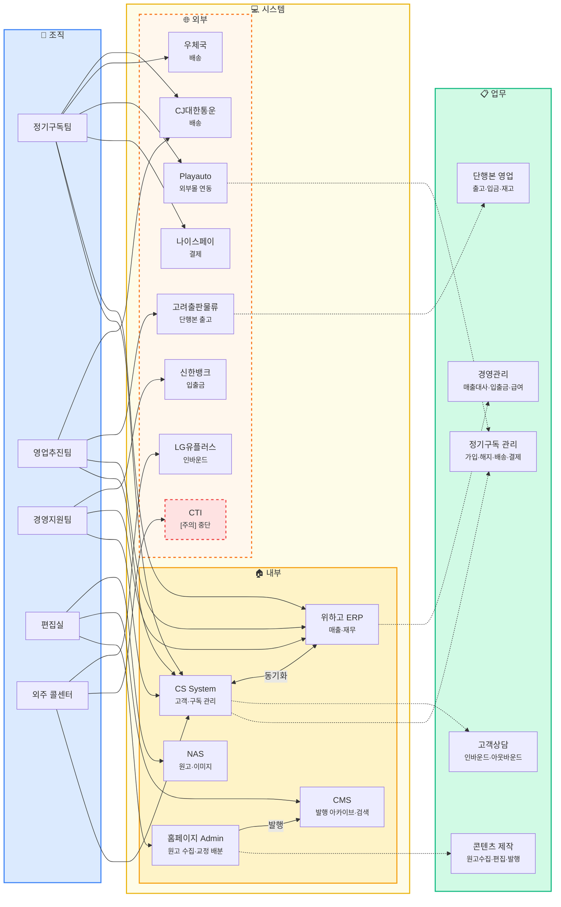
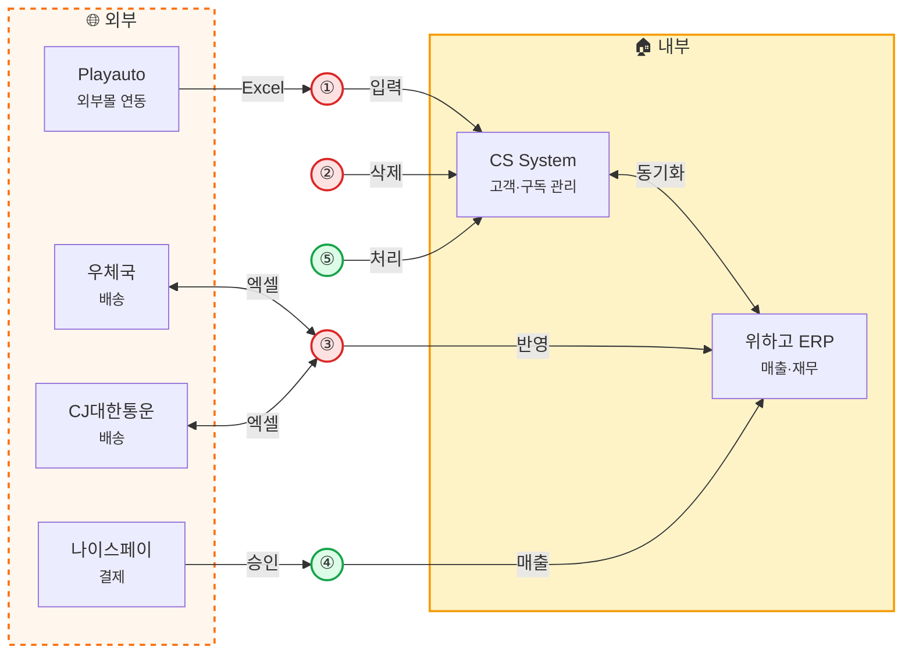
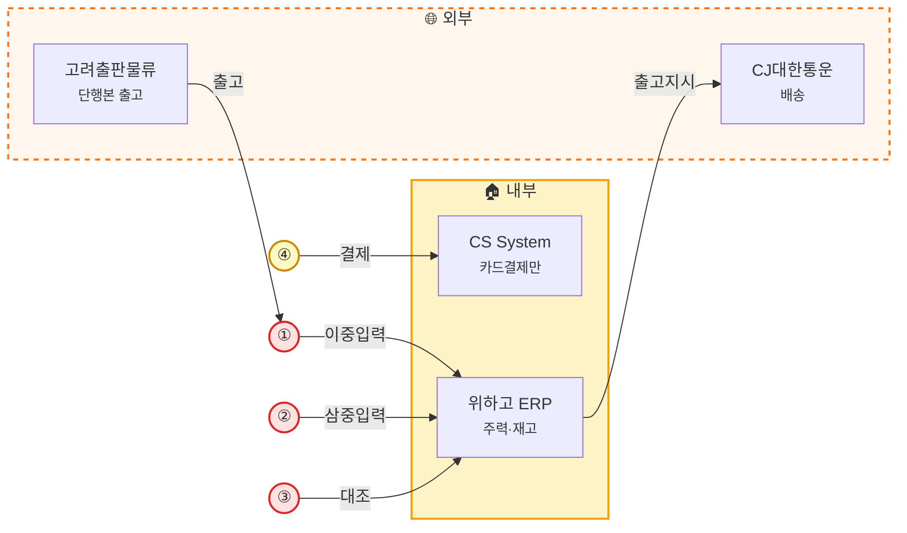
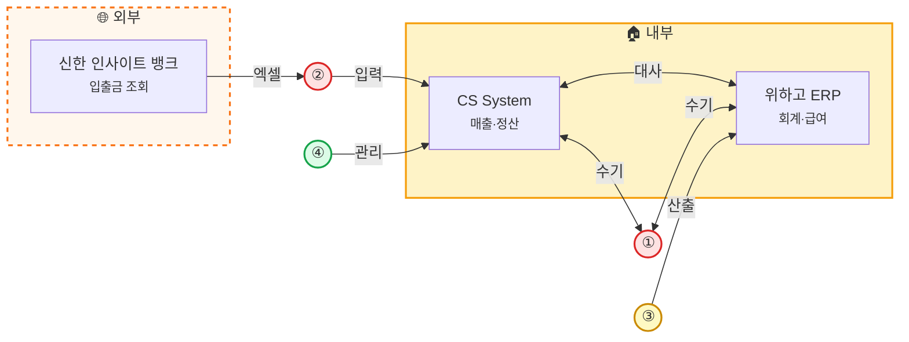
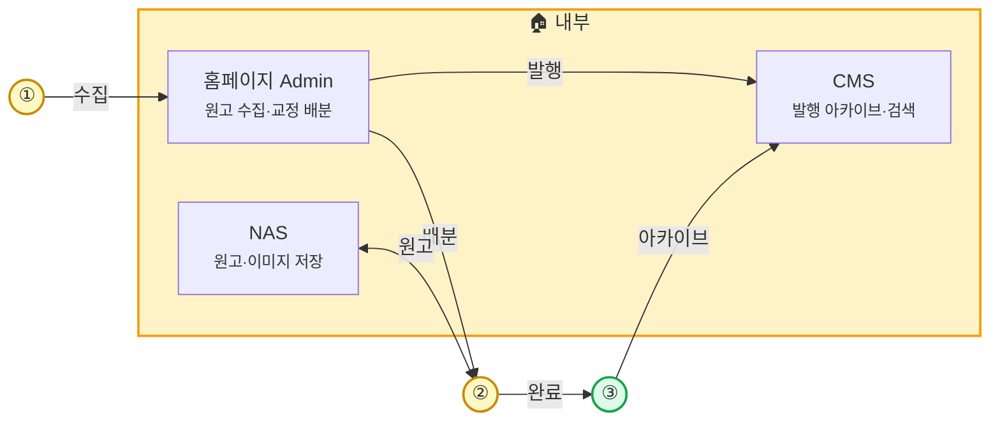
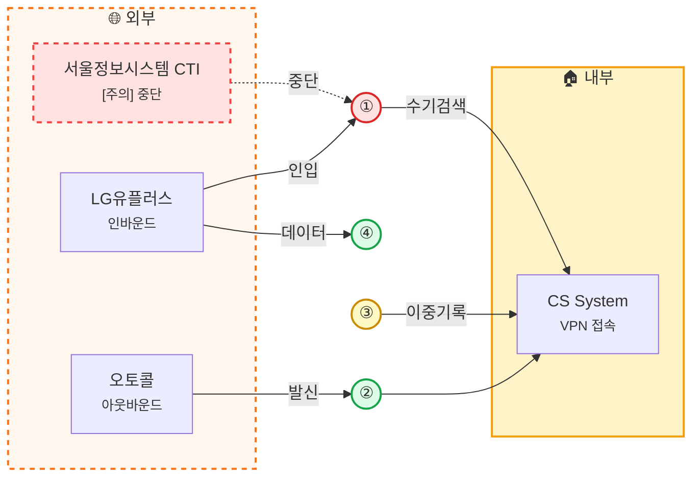
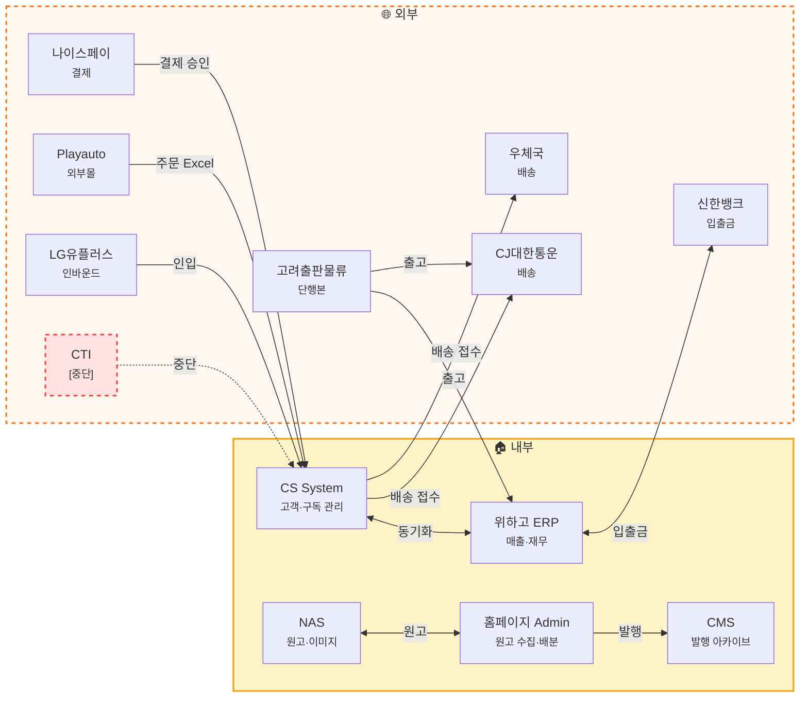
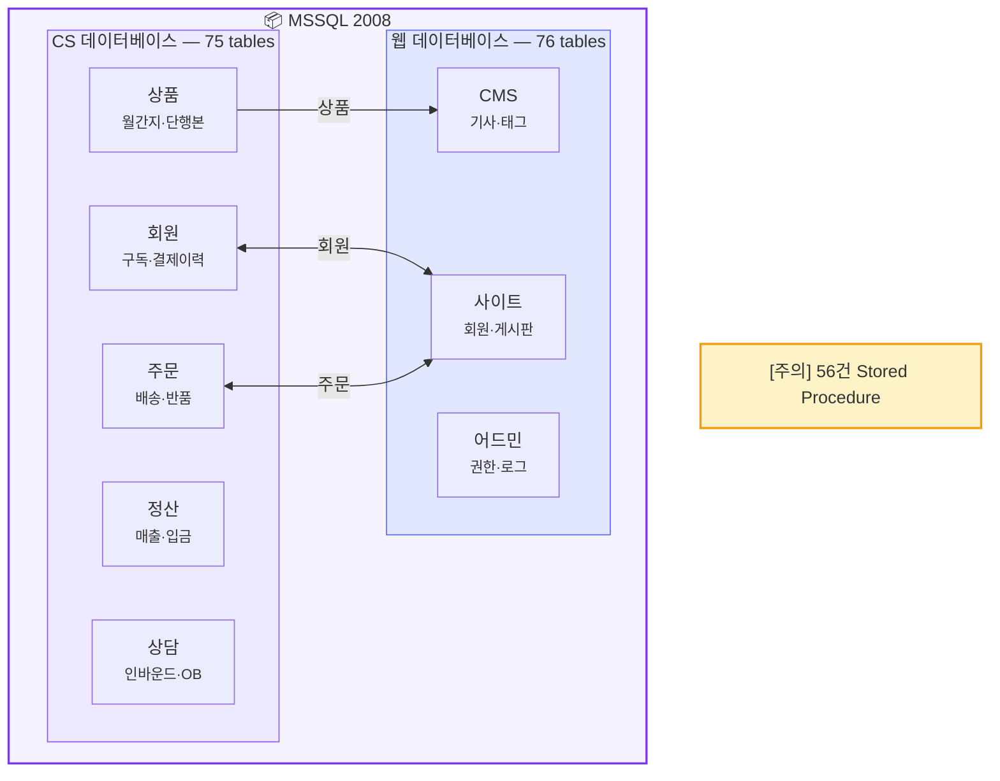

# 엔티티 관계도 (Entity Relationship Map)

좋은생각의 **조직(Organization) → 시스템(System) → 업무(Process)** 간 연계를 한눈에 파악할 수 있도록 구성한 전체 관계도입니다.

---

## 1. 전체 조감도

조직이 어떤 시스템을 사용하고, 어떤 업무를 수행하는지 3개 레이어로 조망합니다.

---

## 2. 팀별 조감도

각 팀이 사용하는 시스템과 수행하는 업무만 추출한 개별 뷰입니다.

### 2-1. 정기구독팀

<small>병목 업무 · 일반 업무</small>

| 업무 | 설명 |
|:---:|:---|
| ① | 신규 가입접수: Playauto(외부몰) Excel → CS 수기입력 |
| ② | 구독 해지 → CS 수기삭제 |
| ③ | 배송 관리: 우체국·CJ ↔ 엑셀 매칭 → ERP 반영 |
| ④ | 결제·입금: 나이스페이 승인 → ERP 매출 전송 |
| ⑤ | 선물·재발송 → CS 처리 |

### 2-2. 영업추진팀

<small>병목 업무 · 주의 업무</small>

| 업무 | 설명 |
|:---:|:---|
| ① | 단행본 출고: 고려출판물류 → ERP 이중입력 |
| ② | 입금 관리: 엑셀 → 관리 → 위하고 삼중입력 |
| ③ | 재고 관리: 통장내역 수작업 대조 |
| ④ | 다량특판: 개인엑셀 관리 → CS 카드결제 |

### 2-3. 경영지원팀

<small>병목 업무 · 주의 업무 · 일반 업무</small>

| 업무 | 설명 |
|:---:|:---|
| ① | 매출 관리: CS ↔ ERP 수기 대사 |
| ② | 입출금 확인: 신한뱅크 → 엑셀 → CS 수기입력 |
| ③ | 급여 산출: ERP 수기 산출 |
| ④ | 선수수익 관리 → CS |

### 2-4. 편집실 (월간지 + 단행본)

<small>주의 업무 · 일반 업무</small>

| 업무 | 설명 |
|:---:|:---|
| ① | 원고 수집: 다양한 채널 → Admin 수집·배분 |
| ② | 편집·교정: Admin 배분 → NAS 작업 → 완료 |
| ③ | 발행·아카이브: 완료 콘텐츠 → CMS 아카이브·검색 |

### 2-5. 외주 콜센터 (더아이앤오)

<small>병목 업무 · 주의 업무 · 일반 업무</small>

| 업무 | 설명 |
|:---:|:---|
| ① | 인바운드 상담: CTI 중단 → CS 수기 번호 검색 |
| ② | 아웃바운드 콜: 오토콜 → 구독만료·연장 안내 |
| ③ | 상담 이력 기록: CS + 엑셀 이중기록 |
| ④ | 리포트 작성: 데일리·위클리·먼슬리 |

---

## 3. 시스템 간 연동 관계

내부 시스템과 외부 시스템 간의 데이터 흐름을 보여줍니다.

---

## 4. 데이터베이스 구조 개요

CS System의 MSSQL 2008 데이터베이스 구성을 보여줍니다.

---

## 범례

| 기호 | 의미 |
|:---:|:---|
| 상 | 병목 업무 (업무 지연·오류 발생) |
| 중 | 주의 업무 (비효율적이나 운영 가능) |
| 하 | 일반 업무 |
| `→` | 데이터 흐름 (일방향) |
| `<-->` | 데이터 동기화 (쌍방향) |
| `-.->` | 중단/미연동 |
| [주의] | 서비스 중단 또는 주의 필요 |
