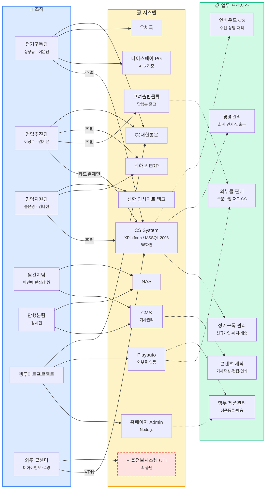
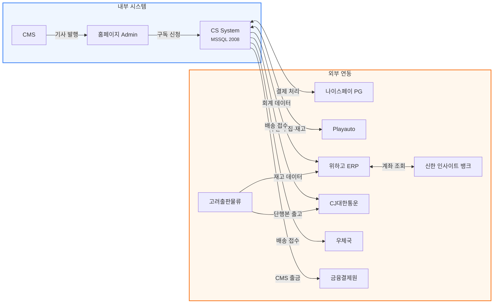
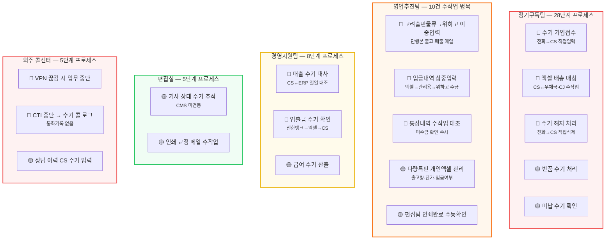
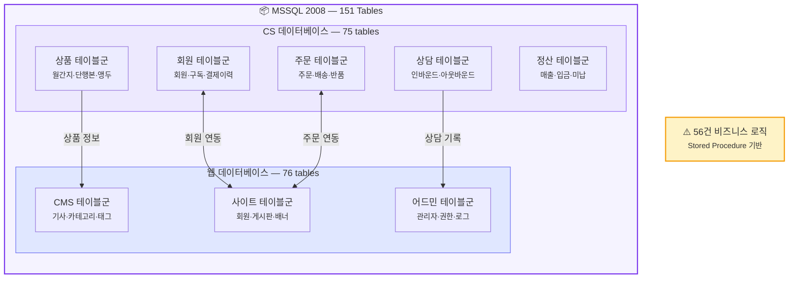

# 엔티티 관계도 (Entity Relationship Map)

좋은생각의 **조직(Organization) → 시스템(System) → 업무(Process)** 간 연계를 한눈에 파악할 수 있도록 구성한 전체 관계도입니다.

---

## 1. 전체 조감도

조직이 어떤 시스템을 사용하고, 어떤 업무를 수행하는지 3개 레이어로 조망합니다.

---

## 2. 시스템 간 연동 관계

내부 시스템과 외부 시스템 간의 데이터 흐름을 보여줍니다.

---

## 3. 수작업 병목 지도

현행 업무에서 식별된 **56건의 수작업** 중 핵심 병목을 팀별로 표시합니다.
빨간색 항목이 개선 우선순위가 높은 병목 구간입니다.

---

## 4. 데이터베이스 구조 개요

CS System의 MSSQL 2008 데이터베이스 151개 테이블 구성을 보여줍니다.

---

## 범례

| 기호 | 의미 |
|------|------|
| 🔴 | 높은 우선순위 병목 (업무 지연·오류 발생) |
| 🟡 | 중간 우선순위 (비효율적이나 운영 가능) |
| `실선 →` | 시스템 사용 / 데이터 흐름 |
| `점선 -.->` | 업무 수행 관계 |
| ⚠️ | 서비스 중단 또는 주의 필요 |

---

## 5. 인터랙티브 네트워크 그래프

위 정적 다이어그램을 **클릭·드래그·줌** 가능한 네트워크로 탐색합니다.
노드를 클릭하면 상세 정보가 표시되고, 상단 필터로 레이어별 표시를 제어할 수 있습니다.

  <button class="net-filter active" data-group="org">🏢 조직</button>
  <button class="net-filter active" data-group="sys">💻 시스템</button>
  <button class="net-filter active" data-group="proc">📋 업무</button>
  <button id="net-fullscreen" class="net-btn-fullscreen">⛶ 전체화면</button>
  <button id="net-reset" class="net-btn-reset">↺ 초기화</button>

⛶ 전체화면 버튼을 누르면 크게 볼 수 있습니다

  💡 노드를 클릭하면 상세 정보가 여기에 표시됩니다. 드래그로 이동, 스크롤로 줌할 수 있습니다.

  

    <button class="net-filter-fs active" data-group="org">🏢 조직</button>
    <button class="net-filter-fs active" data-group="sys">💻 시스템</button>
    <button class="net-filter-fs active" data-group="proc">📋 업무</button>
    
    <button id="net-fs-reset" class="net-btn-fs-action">↺ 초기화</button>
    <button id="net-fs-close" class="net-btn-fs-action">ESC 닫기</button>
  

  

    

  

  
💡 노드를 클릭하면 상세 정보가 표시됩니다.

<button class="mermaid-zoom-close" id="mermaid-close">ESC 닫기</button>

