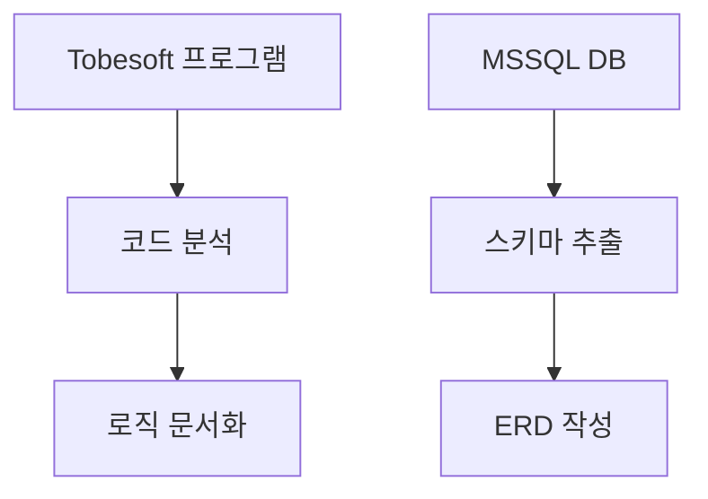
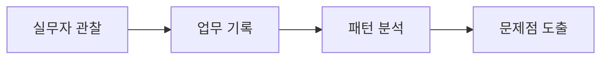
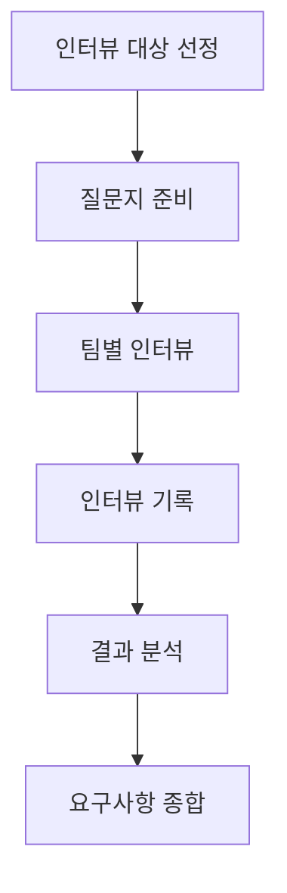
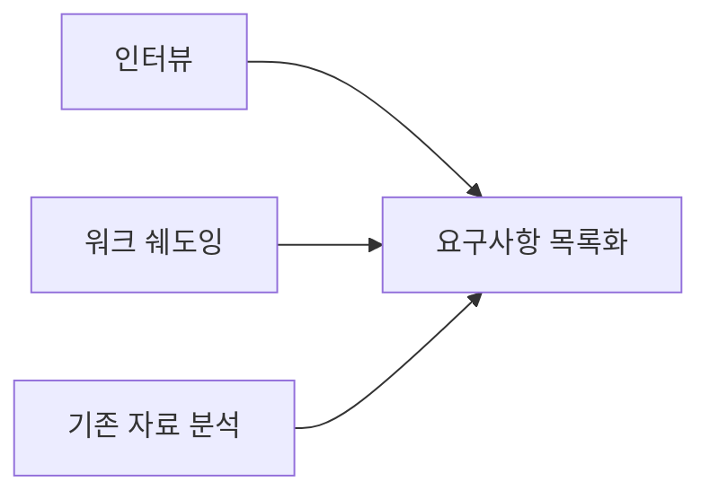

# 현황 분석 (AS-IS Analysis)

ISP 1단계(1\~3주)에서 수행하는 현황 분석 문서입니다.

---

## 조사 준비

### [조사 가이드 및 주의사항](./investigation-guide)
현황 분석 착수 전 반드시 확인해야 할 사항 및 리스크 대응 전략

- 조사 전 확보해야 할 자료 목록
- 외부 개발자 협조 제한 시 대응 전략
- 역공학 기반 분석 방법
- 인터뷰 전략 및 체크리스트

:::caution[조사 시작 전 필독]
외부 개발자의 적극적인 협조가 어려운 상황입니다. **역공학 + 사용자 인터뷰** 중심으로 분석을 진행하며, 불명확한 부분은 "추정" 표기 후 검증하는 전략을 사용합니다.
:::

---

## 분석 영역

### [시스템 정밀진단](./system-diagnosis)
로컬 프로그램(Tobesoft) 내 하드코딩 된 로직 및 MSSQL DB 구조 역공학(Reverse Engineering)

- DB 스키마 분석
- 비즈니스 로직 추출
- 시스템 의존성 파악

### [업무 분석](./business-analysis)
실무자 워크 쉐도잉을 통해 연동 불가로 인해 발생하는 엑셀 수작업 및 중복 업무 식별

- 업무 흐름도 (As-Is Flow)
- 수작업 구간 식별
- 병목 지점 분석

### [이해관계자 인터뷰](./interview)
핵심 업무 담당자 인터뷰를 통한 현행 업무 파악 및 요구사항 수집

- 팀별 업무 현황 파악
- 문제점 및 개선점 도출
- 기능 요구사항 취합
- 레퍼런스 및 참고사항 수집

### [요구사항 분석](./requirements)
웹 기반 전환 시 필요한 현업의 필수 기능 및 UI/UX 개선 요구사항 도출

- 기능 요구사항
- 비기능 요구사항
- UI/UX 개선 요구사항

---

## 핵심 산출물

| 산출물 | 설명 | 상태 |
|--------|------|:----:|
| 현행 업무흐름도 | 현재 업무 프로세스 시각화 | ⬜ |
| AS-IS ERD (역공학) | 현행 DB 구조 분석 결과 | ⬜ |
| 시스템 구조적 문제 진단서 | 현행 시스템의 문제점 정리 | ⬜ |
| 이해관계자 인터뷰 결과 | 팀별 인터뷰 내용 및 요구사항 | ⬜ |
| 요구사항 정의서 (초안) | 현업 요구사항 수집 결과 | ⬜ |

---

## 분석 방법론

### 1. 시스템 역공학

### 2. 워크 쉐도잉

### 3. 이해관계자 인터뷰

### 4. 요구사항 수집

---

## 일정

| 주차 | 활동 | 담당 |
|:---:|------|------|
| 1주 | 시스템 분석 착수, DB 스키마 추출 | - |
| 2주 | 업무 분석(워크 쉐도잉), 이해관계자 인터뷰 | - |
| 3주 | 인터뷰 결과 종합, 요구사항 분석, 분석 보고서 작성 | - |

---

## CS 시스템 메뉴 분석

### [CS 시스템 메뉴 분석](./menu-analysis)
현행 CS 시스템(Tobesoft) 전체 메뉴의 부서별 사용 현황 분석 및 존치·통합·폐기 판정

- 5개 대분류 109개 메뉴 전수 조사
- 4개 부서(정기구독팀, 콜센터, 경영지원팀, 영업추진팀) 교차 분석
- 메뉴별 존치/통합/폐기 판정 및 근거
- 전환 시 우선순위 권고

---

## 관련 회의록 및 인터뷰 자료

### [회의록·인터뷰 자료 모음](./meeting-notes)
킥오프 회의록, 인터뷰 기록 등 현황 분석 과정에서 수행된 회의 및 인터뷰 자료

- 킥오프 회의 안건 및 회의록
- 팀별 인터뷰 기록
- 회의 결과 및 후속 조치 사항
