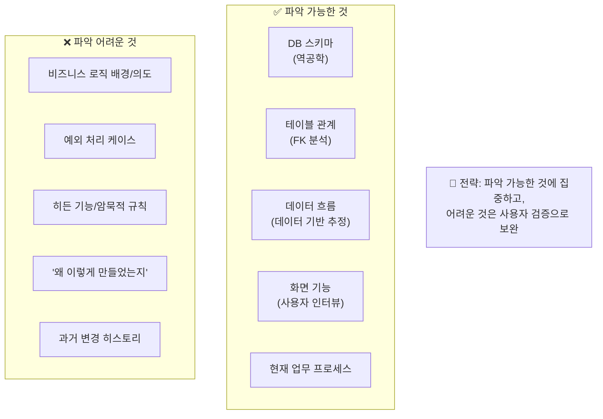
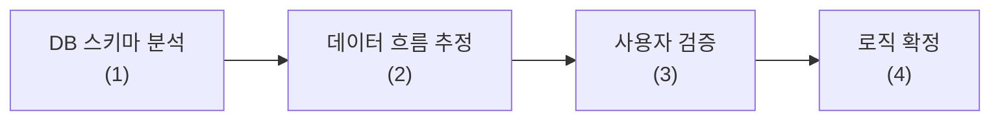
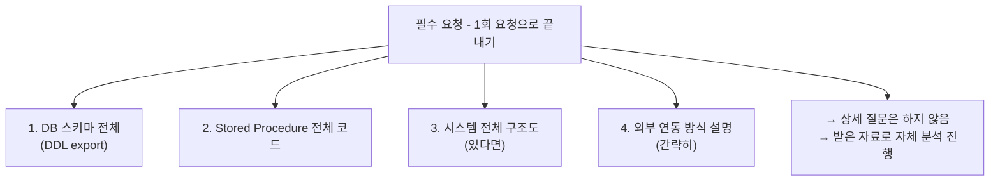
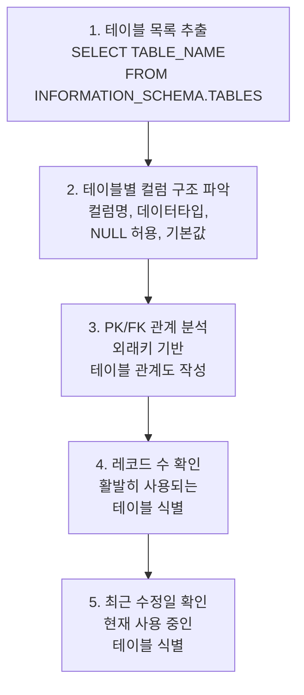
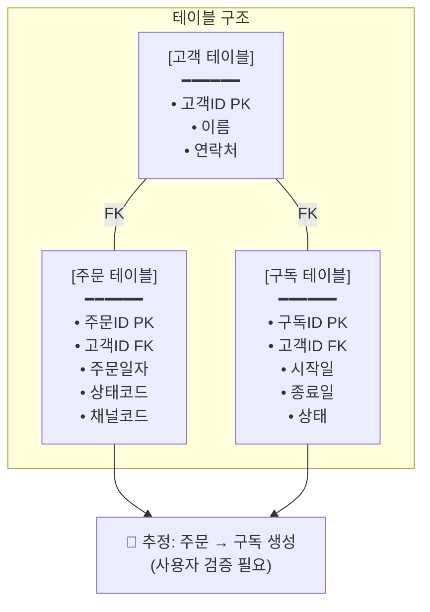

# 조사 가이드 및 주의사항

ISP 1단계(현황 분석) 수행 전 반드시 확인해야 할 사항과 리스크 대응 전략입니다.

---

## 현재 상황 요약

| 항목 | 상태 | 리스크 수준 |
|------|------|:----------:|
| XPlatform 소스코드 | 확보 필요 (요청 예정) | 🟠 |
| DB 접근 권한 | 확보 필요 (VPN 접근 선행) | 🟠 |
| DB 정의서 (문서) | ✅ 확보 완료 (C/S + CMS + 홈페이지) | 🟢 |
| 기존 담당자 협조 | 외부 개발자 (협조 제한 예상) | 🔴 |
| 외부 연동 채널 | Playauto(네이버/쿠팡), 나이스페이, CJ대한통운 확인 완료 | 🟢 |
| 기존 문서 | IT운영 현황, 조직도, 업무플로우 PDF 등 23건 확보 | 🟢 |

---

## 1. 조사 전 확보해야 할 자료

### 필수 자료 (Must Have)

| 자료 | 요청 대상 | 용도 | 상태 |
|------|----------|------|:----:|
| **DB 스키마 덤프 (DDL)** | 외부 개발자 | 테이블 구조, 관계 파악 | ⬜ (DB 정의서로 대체 분석 완료) |
| **Stored Procedure 목록/코드** | 외부 개발자 | 핵심 비즈니스 로직 파악 | ⬜ (정의서 기반 20 SP 목록 확보) |
| **DB 접속 정보** | 외부 개발자/IT | 직접 데이터 분석 | ⬜ (VPN 접근 선행 필요) |
| **주요 화면 스크린샷** | 정기구독팀 (사용자) | 기능 매핑 | ⬜ |

### 권장 자료 (Should Have)

| 자료 | 요청 대상 | 용도 | 상태 |
|------|----------|------|:----:|
| XPlatform 소스코드 | 외부 개발자 | 화면별 로직 분석 | ⬜ |
| 기존 설계 문서 | 외부 개발자 | 시스템 이해 단축 | ⬜ (없을 가능성 높음) |
| 운영 매뉴얼 | 정기구독팀/영업추진팀 | 업무 흐름 파악 | ⬜ |
| 시스템 구성도 | 외부 개발자 | 전체 아키텍처 이해 | ✅ (IT운영현황 문서로 확보) |

### 선택 자료 (Nice to Have)

| 자료 | 요청 대상 | 용도 | 상태 |
|------|----------|------|:----:|
| 과거 개발 히스토리 | 외부 개발자 | 변경 이력 파악 | ⬜ |
| 장애 이력 | 경영지원팀 | 취약점 파악 | ⬜ |
| 사용자 요청 이력 | 정기구독팀 | 개선 포인트 파악 | ⬜ |

---

## 2. 리스크 관리: 외부 개발자 협조 제한

### 문제 상황



### 대응 전략

#### 전략 1: 역공학 중심 접근



**단계별 수행 방법**:

| 단계 | 활동 | 산출물 |
|:----:|------|--------|
| 1 | DB 스키마 덤프, 테이블 목록화 | AS-IS ERD (초안) |
| 2 | FK 관계 분석, 데이터 샘플 확인 | 데이터 흐름도 (초안) |
| 3 | 사용자에게 "이렇게 동작하나요?" 검증 | 검증된 데이터 흐름도 |
| 4 | 불명확한 부분은 "추정" 표기 후 진행 | 최종 분석 문서 |

#### 전략 2: 사용자 중심 분석

**실사용자가 개발자보다 더 잘 아는 것**:
- 실제 업무 흐름 (What)
- 예외 상황 대응 방법 (How)
- 현재 시스템의 불편한 점 (Pain Point)
- 꼭 필요한 기능 vs 안 쓰는 기능

**사용자 인터뷰로 파악할 것**:

- [ ] 일일 업무 흐름 시간순
- [ ] 자주 사용하는 화면 기능 Top 5
- [ ] 거의 안 쓰는 기능
- [ ] 예외 상황 처리 방법
- [ ] 수작업으로 하는 것들
- [ ] 가장 불편한 점 Top 3

#### 전략 3: 최소 정보 요청 전략

외부 개발자에게는 **핵심만 요청**:



---

## 3. 역공학 기반 분석 방법

### DB 스키마 분석 절차



### 테이블 분류 기준

| 분류 | 기준 | 분석 우선순위 |
|------|------|:------------:|
| **핵심 테이블** | 레코드 多 + 최근 수정 | ⭐⭐⭐ |
| **참조 테이블** | 코드성 데이터, 변경 적음 | ⭐⭐ |
| **이력 테이블** | 로그성 데이터 | ⭐ |
| **미사용 테이블** | 레코드 0 또는 오래된 수정일 | - |

### 데이터 기반 업무 흐름 추정



---

## 3-1. 역공학 수행 결과 요약

> 외부 개발자 협조 제한 상황에서 **전략 1: 역공학 중심 접근**을 적용한 결과입니다. DB 정의서 3건 + IT운영현황 + 업무플로우 PDF 4건을 분석하여 아래 결과를 도출했습니다. 상세 분석 결과는 [시스템 정밀진단](./system-diagnosis)에 기록되어 있습니다.

### 수행 내역

| 단계 | 계획 | 수행 결과 | 상태 |
|:----:|------|----------|:----:|
| 1 | DB 스키마 덤프, 테이블 목록화 | 정의서 기반 151개 테이블 전수 분류 (DDL 대체) | ✅ |
| 2 | FK 관계 분석, 데이터 샘플 확인 | Customer_ID 중심 ERD 작성, 관계도 도출 | ✅ |
| 3 | 사용자에게 "이렇게 동작하나요?" 검증 | 🔶 미수행 (인터뷰 일정 미확정) | ⬜ |
| 4 | 불명확한 부분은 "추정" 표기 후 진행 | 49개 비즈니스 로직 중 추정 표기 적용 | ✅ |

### DB 분석 결과 요약

```
┌─────────────────────────────────────────────────────────────────┐
│               역공학 분석 결과 (2026-03-03 기준)                  │
├─────────────────────────────────────────────────────────────────┤
│                                                                  │
│  [C/S 고객관리 DB]        [CMS DB]         [홈페이지 DB]          │
│  ────────────────         ──────           ────────────          │
│  75 tables                13 tables        63 tables             │
│  20 Stored Procedures     -                7 Procedures          │
│  14 Functions             -                -                     │
│  15 Triggers              -                -                     │
│                                                                  │
│  총 151 tables, 27 SPs, 14 Functions, 15 Triggers               │
│                                                                  │
│  허브 엔티티: PT_Customer (Customer_ID decimal 13)               │
│  핵심 관계: Customer → Subscribe → Receiver → Finance            │
│  핵심 병목: On-Prem ↔ AWS 간 API 연동 없음 (수동 Excel 이관)     │
│                                                                  │
└─────────────────────────────────────────────────────────────────┘
```

### 테이블 분류 결과

| 분류 | C/S | CMS | 홈페이지 | 합계 | 비고 |
|------|:---:|:---:|:-------:|:----:|------|
| 핵심 테이블 | 13 | 1 | 4 | **18** | 고객/구독/배송/결제/주문 |
| 계정/권한 | 8 | 1 | - | 9 | PT_Account 계열 |
| 결제/정산 | 15 | - | 7 | 22 | 나이스페이 + 선수수익 |
| 발송/물류 | 10 | - | 3 | 13 | DM/도서 발송 |
| 상담/CS | 5 | - | - | 5 | 상담이력, 환불 |
| 코드/관리 | 9 | 4 | 2 | 15 | 코드 마스터, 그룹 |
| 콘텐츠 | - | 5 | 15 | 20 | 블로그, 배너, CMS |
| 상품 | - | 2 | 16 | 18 | 홈페이지 상품 카탈로그 |
| 선물/쿠폰 | 4 | - | 9 | 13 | 포인트, 쿠폰, 이벤트 |
| SMS/알림 | 2 | - | 1 | 3 | SMS, 알림톡 |
| 시스템/로그 | 4 | - | 6 | 10 | 모니터링, 에러 로그 |
| 레거시/임시 | 5 | - | - | 5 | PT_Admin07, PT_Temp_Report |
| **합계** | **75** | **13** | **63** | **151** | |

### 비즈니스 로직 분류

| 로직 영역 | SP | Function | Trigger | 합계 | 핵심 여부 |
|-----------|:--:|:--------:|:-------:|:----:|:---------:|
| 구독 관리 | 2 | 1 | 5 | 8 | ⭐⭐⭐ |
| 결제/정산 | 3 | 2 | 2 | 7 | ⭐⭐⭐ |
| 배송/발송 | 2 | 4 | 1 | 7 | ⭐⭐⭐ |
| 지로 처리 | 6 | - | - | 6 | ⭐⭐ |
| 쿠폰 | 2 | - | - | 2 | ⭐ |
| 고객 관리 | 2 | 2 | 1 | 5 | ⭐⭐⭐ |
| 재고/선물 | 1 | 1 | 4 | 6 | ⭐⭐ |
| 모니터링/유틸 | 2 | 4 | 2 | 8 | ⭐ |
| 홈페이지 | 7 | - | - | 7 | ⭐⭐ |
| **합계** | **27** | **14** | **15** | **56** | |

### 식별된 주요 리스크

| ID | 항목 | 리스크 | 심각도 | 대응 방안 | 상태 |
|----|------|--------|:------:|----------|:----:|
| R-01 | CMS 연동 방식 | Admin↔CMS API 연동 방식 코드 레벨 미확인 | 🟠 | CMS 담당자 또는 외부 개발자 확인 | Open |
| R-02 | 하드코딩 로직 | XPlatform 코드 내 비즈니스 로직 범위 미확인 | 🔴 | 소스코드 접근 후 분석 필요 | Open |
| R-03 | 데이터 정합성 | 동일 고객 C/S↔웹 간 중복 등록 규모 미확인 | 🟠 | 라이브 DB 접근 후 크로스 체크 | Open |
| R-04 | 레코드 규모 | 각 테이블 레코드 수 미확인 → 이관 시간 추정 불가 | 🟠 | VPN 접근 후 SELECT COUNT(*) 실행 | Open |
| R-05 | 이카운트 ERP 연동 | ERP API 스펙 미확보 | 🟠 | 이카운트 API 문서 조사 필요 | Open |
| R-06 | CTI 웹 전환 | 서울정보시스템 CTI의 웹 기반 연동 가능 여부 미확인 | 🟠 | 서울정보시스템 문의 필요 | Open |

### 남은 작업

```
□ 라이브 DB 접근 (VPN 선행)
  □ 테이블별 레코드 수 확인 — SELECT COUNT(*) FROM [테이블]
  □ 최근 수정일 기반 활성 테이블 식별
  □ 데이터 품질 점검 (중복, NULL, 이상값)
  □ C/S↔웹 간 고객 데이터 크로스 체크

□ 소스 코드 분석 (XPlatform 소스 확보 후)
  □ 화면-SP 매핑표 작성
  □ 하드코딩 로직 목록화
  □ 예외 처리 케이스 추출

□ 사용자 검증 (인터뷰)
  □ 문서 기반 추정 플로우 검증
  □ "우리가 모르는 수작업" 추가 식별
  □ 시스템 미사용 기능 확인
```

---

## 4. 인터뷰 전략

### 인터뷰 대상별 접근법

#### 외부 개발자 (1회, 30분\~1시간)

**목적**: 전체 구조 파악, 핵심 포인트만 확인

**질문 예시**:
- "시스템 전체 구조를 간략히 설명해 주실 수 있나요?"
- "가장 복잡한 로직이 어디에 있나요?"
- "외부 연동(Playauto, CMS 등)은 어떤 방식으로 하나요?"
- "이 시스템에서 가장 주의해야 할 부분이 있다면?"

**주의사항**:
- 상세 질문 기대하지 않기
- 답변 안 해도 추궁하지 않기
- 받을 수 있는 자료 요청에 집중

#### 실사용자 — 정기구독팀/영업추진팀 (다회, 각 1시간)

**목적**: 실제 업무 흐름, Pain Point 파악

**질문 예시**:
- "하루 업무를 시간순으로 설명해 주세요"
- "이 화면에서 어떤 작업을 하시나요?" (화면 보며)
- "고객 문의가 들어오면 어떤 순서로 처리하시나요?"
- "예외 상황(환불, 오류 등)은 어떻게 처리하시나요?"
- "가장 불편하거나 시간이 오래 걸리는 작업은?"
- "이 기능은 자주 사용하시나요?" (기능별 확인)

**Tip**: 
- 실제 화면을 보면서 진행 (화면 공유 또는 방문)
- 워크 쉐도잉 가능하면 가장 좋음

#### 경영지원팀 (1회, 30분\~1시간)

**목적**: 데이터 활용 현황, 리포트/정산 요구사항

**질문 예시**:
- "현재 어떤 데이터/리포트를 보고 계신가요?"
- "이카운트 ERP와 CS 프로그램 이중 입력이 어떤 부분에서 발생하나요?"
- "정산/매출 취합 시 가장 불편한 점은?"
- "필요한데 못 보고 있는 데이터가 있나요?"

### 인터뷰 일정 계획

> 인터뷰 대상자 10명 확정됨 — 상세는 [이해관계자 인터뷰](./interview) 참조

| 주차 | 대상 | 목적 | 소요시간 |
|:----:|------|------|:--------:|
| 1주 | 외부 개발자 | 시스템 구조 파악, 자료 수령 | 1시간 |
| 1주 | 정황규 (정기구독팀) | 전체 업무 흐름 파악 | 1시간 |
| 2주 | 어은진 (정기구독팀) | 구독/발송 업무 상세 | 1시간 |
| 2주 | 이성수 (영업추진팀) | 주문수집/외부채널 업무 상세 | 1시간 |
| 2주 | 권지은 (영업추진팀) | CS/환불 처리 업무 상세 | 1시간 |
| 2주 | 송윤경 (경영지원팀) | 정산/ERP 연동 현황 | 30분 |
| 3주 | 정다정 (콘텐츠부문 연구소장) | CMS 운영/콘텐츠 업무 | 30분 |
| 3주 | 더아이앤오 (외부콜센터) | 콜센터 CS 업무 흐름 | 30분 |
| 3주 | (필요시) 추가 인터뷰 | 불명확한 부분 확인 | - |

---

## 5. 조사 체크리스트

### Phase 1: 사전 준비 (조사 시작 전)

```
☑ 자료 요청
  ☑ DB 정의서 3건 확보 (C/S 고객관리, CMS, 홈페이지)
  ☑ IT운영현황 문서 확보 (시스템 구성도 대체)
  ☑ 조직도, 업무플로우 PDF 4건 확보
  □ 외부 개발자에게 DB 스키마 DDL 요청 (정의서로 대체 분석 완료)
  □ 외부 개발자에게 Stored Procedure 실제 코드 요청
  □ 정기구독팀에게 주요 화면 스크린샷 요청

☑ 인터뷰 준비
  ☑ 인터뷰 대상자 10명 리스트업 (실명/역할 확정)
  □ 일정 조율
  □ 질문지 준비

□ 환경 준비
  □ VPN 접근 (MikroTik PPTP → 61.32.95.235)
  □ DB 접속 환경 세팅 (SSMS 또는 Azure Data Studio)
  □ 화면 녹화/캡처 도구 준비
  ☑ 문서 템플릿 준비 (Astro Starlight 기반 ISP 사이트)
```

### Phase 2: 데이터 분석

```
☑ DB 스키마 분석 (문서 기반 — 라이브 DB 접근 전)
  ☑ 테이블 목록 작성 — 151개 전수 분류 완료
  □ 테이블별 레코드 수 확인 (VPN 접근 후 라이브 DB 필요)
  ☑ PK/FK 관계 분석 — Customer_ID 중심 ERD 작성 완료
  ☑ AS-IS ERD 초안 작성 — system-diagnosis.md에 반영 완료

☑ 데이터 흐름 분석 (문서 기반)
  ☑ 핵심 테이블 식별 — 13개 핵심, 8개 카테고리로 분류
  ☑ 데이터 흐름 추정 — 채널별 주문→구독→배송→결제 흐름도 작성
  ☑ Stored Procedure 로직 분석 — 20 SP, 14 Function, 15 Trigger 목록/기능 파악

□ 데이터 품질 확인 (라이브 DB 접근 필요)
  □ 중복 데이터 확인
  □ NULL 값 비율 확인
  ☑ 개인정보 항목 식별 — PT_Customer(48 cols), PT_Receiver(43 cols) 등
```

### Phase 3: 업무 분석

```
□ 인터뷰 수행
  □ 외부 개발자 인터뷰
  □ 정기구독팀 인터뷰 (정황규, 어은진)
  □ 영업추진팀 인터뷰 (이성수, 권지은)
  □ 경영지원팀 인터뷰 (송윤경)

☑ 업무 흐름 문서화 (문서 기반 — 인터뷰 후 검증 필요)
  ☑ 주요 업무 프로세스 흐름도 — 4개 팀 업무 플로우 작성
  ☑ 수작업 구간 12건 식별, 항목별 소요시간/빈도/오류위험 추정
  ☑ 병목 구간 7건 식별, 영향도 매트릭스 및 개선 방향 작성
  □ 화면-기능 매핑표 (XPlatform 소스 또는 스크린샷 필요)
  □ 예외 케이스 목록 (인터뷰 필요)

☑ Pain Point 정리 (추정 기반 — 인터뷰 후 정량화)
  ☑ 현재 불편사항 추정 목록 — 수작업 12건, 병목 7건 식별
  ☑ 일일 수작업 시간 추정 — 6.5\~9시간/일 (전 직원 합산)
  ☑ 자동화 시 기대효과 추정 — 75\~80% 절감 목표
  □ 수작업 항목 실측 정량화 (인터뷰/워크 쉐도잉 필요)
  □ 개선 요구사항 우선순위 확정 (인터뷰 필요)
```

### Phase 4: 외부 연동 분석

```
☑ 연동 채널 파악
  ☑ 현재 사용 채널 목록 확인 — 6개 채널 확정
  ☑ 각 채널 연동 방식 확인 — Playauto(수동), 나이스페이(API), CJ대한통운
  ☑ Playauto 연동 상세 확인 — 수동 다운로드/업로드 방식

□ API 스펙 수집
  □ 네이버 스마트스토어 API (TO-BE에서 직접 연동 시 필요)
  □ 쿠팡 오픈 API
  □ CMS 연동 API (현행 Admin↔CMS 연동 방식 확인 필요)

☑ 연동 현황 문서화
  ☑ 현재 연동 구조도 — AS-IS 아키텍처 다이어그램에 반영
  ☑ 데이터 흐름 (외부 → 내부) — system-diagnosis.md에 반영
```

---

## 6. 불명확한 부분 처리 원칙

조사 중 파악이 어려운 부분이 있을 경우:

### 표기 원칙

| 상태 | 표기 | 의미 |
|------|------|------|
| 확인됨 | ✅ | 담당자/사용자 확인 완료 |
| 추정 | 🔶 | 데이터 기반 추정 (검증 필요) |
| 미확인 | ❓ | 정보 부족으로 파악 불가 |

### 문서화 예시

```
## 주문 처리 프로세스

1. 주문 수집 ✅
   - Playauto에서 주문 파일 다운로드 (CS팀 확인)
   
2. 주문 입력 🔶
   - CS System에 수동 입력 추정 (화면 존재 확인)
   - 자동 입력 기능 유무 미확인
   
3. CMS 권한 부여 ❓
   - 연동 방식 미확인 (외부 개발자 답변 없음)
   - 추가 조사 필요
```

### 리스크 등록

파악 불가 항목은 **리스크 레지스터**에 등록:

| ID | 항목 | 리스크 | 대응 방안 | 상태 |
|----|------|--------|----------|:----:|
| R-01 | CMS 연동 방식 | 설계 시 잘못된 가정 가능 | CMS 담당자 별도 확인 | Open |
| R-02 | 하드코딩 비즈니스 로직 | 신규 시스템에서 누락 가능 | XPlatform 소스 접근 후 분석 | Open |
| R-03 | C/S↔웹 고객 데이터 중복 | 이관 시 데이터 불일치 | 라이브 DB 크로스 체크 | Open |
| R-04 | 레코드 규모 미확인 | 이관 시간/리소스 추정 불가 | VPN 접근 후 COUNT 확인 | Open |
| R-05 | 이카운트 ERP API 스펙 미확보 | TO-BE 연동 범위 확정 불가 | 이카운트 API 문서 조사 | Open |
| R-06 | CTI 웹 전환 가능 여부 | 웹 전환 시 CTI 재연동 필요 | 서울정보시스템 문의 | Open |

---

## 다음 단계

조사 완료 후 작성할 문서:
- [시스템 정밀진단](./system-diagnosis) - DB/로직 분석 결과 ✅ (문서 기반 분석 완료)
- [업무 분석 (워크 쉐도잉)](./business-analysis) - 업무 흐름 분석 결과 ✅ (문서 기반 작성 — 4팀 플로우, 수작업 12건, 병목 7건. 인터뷰 후 정량 확정)
- [이해관계자 인터뷰](./interview) - 인터뷰 결과 정리 (대상자 10명 확정, 인터뷰 미수행)
- [기능요건 도출](./requirements) - 도출된 요구사항 ✅ (DB 기반 22건 + 추가 26건 = 48건 분석 완료, 인터뷰 후 우선순위 확정)

---

## 작성 이력

| 날짜 | 작성자 | 변경 내용 |
|------|--------|----------|
| 2026-02-23 | - | 초안 작성 |
| 2026-03-03 | 김명직 | 현황 요약 업데이트 (DB 정의서/IT운영문서/업무플로우 확보 반영), 자료 확보 상태 갱신, 팀명 실제 조직 반영 (CS팀→정기구독팀, 운영팀→영업추진팀/경영지원팀), 인터뷰 대상 실명/일정 반영 (10명), 역공학 수행 결과 요약 섹션 신설 (151 tables 분류, 56개 로직, 6건 리스크), Phase 1-4 체크리스트 수행 상태 갱신, 리스크 레지스터 6건으로 확장 |
| 2026-03-03 | 김명직 | Phase 3 업무 분석 체크리스트 갱신 — 수작업 12건/병목 7건 식별 결과 반영, Pain Point 추정 기반 정리 완료로 업데이트, 다음 단계 링크 현황 갱신 (요구사항 22건→48건) |
