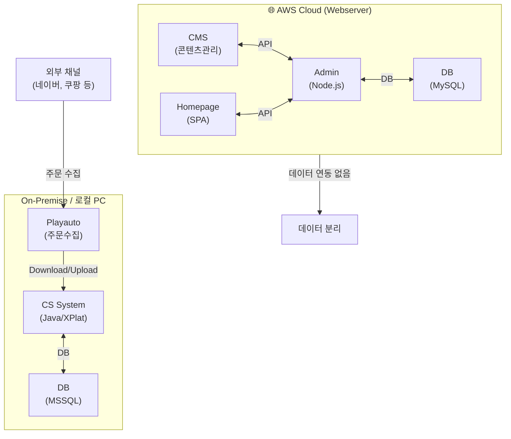
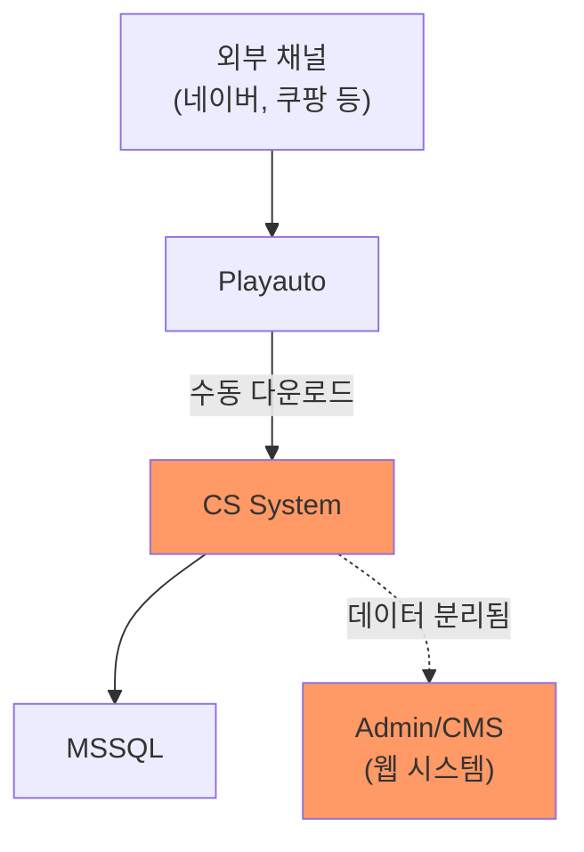
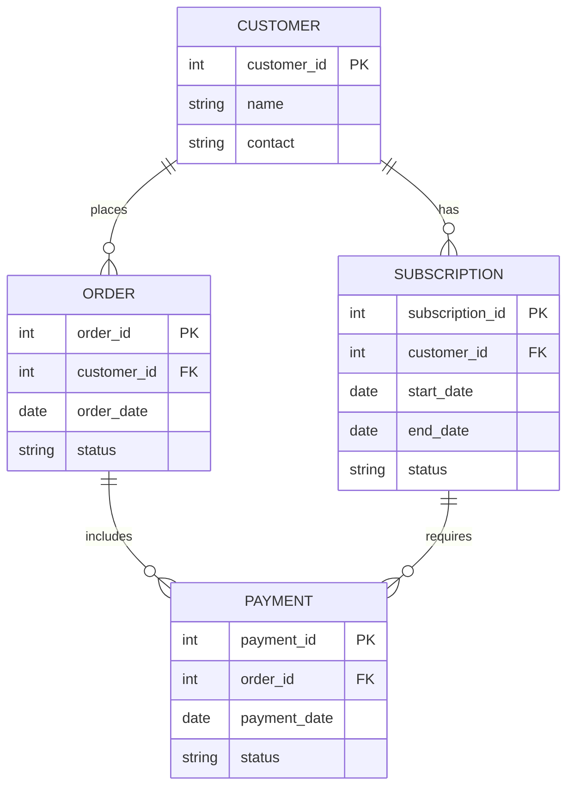
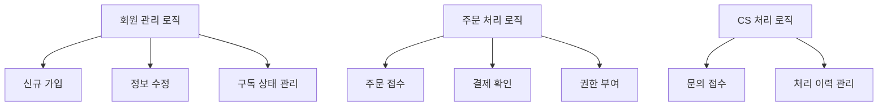
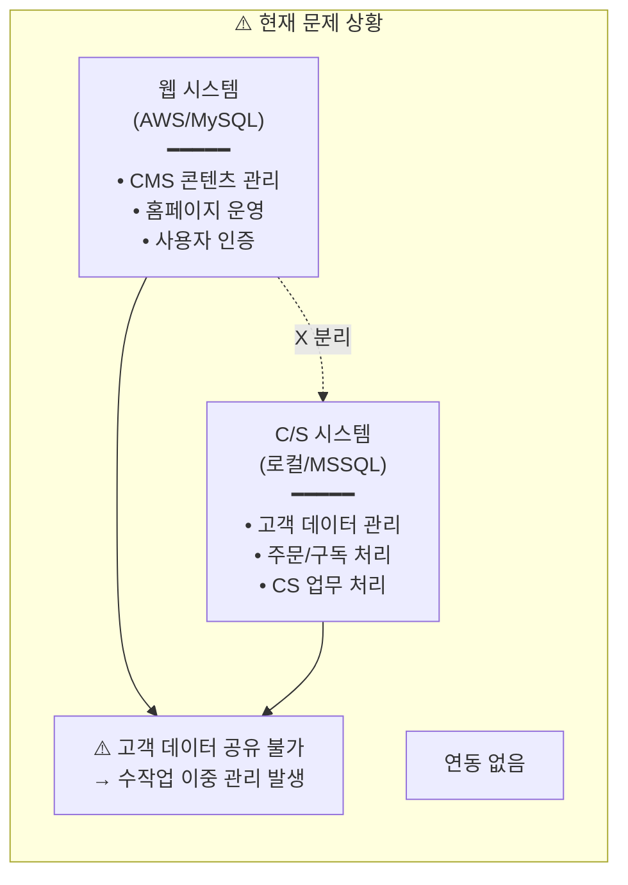
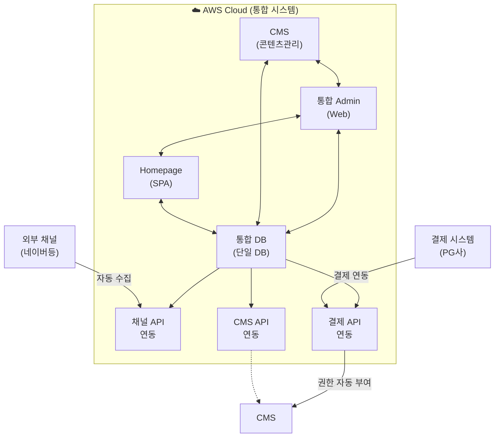

# 시스템 정밀진단

로컬 프로그램(Tobesoft) 내 하드코딩 된 로직 및 MSSQL DB 구조 역공학(Reverse Engineering)

---

## AS-IS 시스템 아키텍처

현재 좋은생각 시스템은 다음과 같이 구성되어 있습니다.

### 시스템 구성 요소

| 구분 | 컴포넌트 | 기술 스택 | 역할 | 위치 |
|------|----------|-----------|------|------|
| **웹 시스템** | CMS | - | 콘텐츠 관리 시스템 | AWS |
| | Admin | Node.js | 웹 관리자 시스템 | AWS |
| | Homepage | SPA | 고객용 홈페이지 | AWS |
| | DB | MySQL | 웹 시스템 데이터 저장 | AWS |
| **C/S 시스템** | CS System | Java, XPlatform | 고객관리 프로그램 (로컬 설치형) | 로컬 PC |
| | DB | MSSQL | CS 시스템 데이터 저장 | 사내 서버 |
| **외부 연동** | Playauto | 외부 솔루션 | 외부 채널 주문 수집 | 로컬 PC |

### 데이터 흐름

---

## 분석 대상

### 1. 애플리케이션 (C/S 시스템)

| 항목 | 내용 |
|------|------|
| **프로그램명** | CS System (고객관리 시스템) |
| **개발 플랫폼** | Java, Tobesoft XPlatform |
| **설치 환경** | 로컬 PC (Windows) |
| **외부 연동** | Playauto (주문 수집 솔루션) |

### 2. 애플리케이션 (웹 시스템)

| 항목 | 내용 |
|------|------|
| **Admin** | Node.js 기반 관리자 시스템 |
| **Homepage** | SPA (Single Page Application) |
| **CMS** | 콘텐츠 관리 시스템 (API 연동) |
| **호스팅** | AWS |

### 3. 데이터베이스

| 항목 | CS 시스템 DB | 웹 시스템 DB |
|------|-------------|--------------|
| **DBMS** | Microsoft SQL Server | MySQL |
| **용도** | 고객/주문 데이터 | 웹 콘텐츠/사용자 |
| **위치** | 사내 서버 | AWS |
| **연동 상태** | ⚠️ 분리됨 | ⚠️ 분리됨 |

---

## 역공학 분석 결과

### AS-IS ERD

### 테이블 목록

| No | 테이블명 | 설명 | 레코드 수 |
|----|----------|------|-----------|
| 1 | (조사 예정) | | |
| 2 | | | |
| 3 | | | |

### 주요 비즈니스 로직

---

## 시스템 구조적 문제점

### 핵심 문제: 시스템 이원화

### 기술적 문제

| 문제 | 상세 내용 | 영향 | 심각도 |
|------|-----------|------|:------:|
| **C/S 아키텍처** | Java/XPlatform 기반 로컬 설치형 | 원격 근무 불가, 웹 연동 제한 | 🔴 |
| **DB 이원화** | MSSQL(C/S) + MySQL(웹) 분리 운영 | 실시간 데이터 공유 불가 | 🔴 |
| **수동 데이터 연동** | Playauto → CS System 수동 다운로드 | 처리 지연, 오류 가능성 | 🔴 |
| **레거시 기술 스택** | XPlatform (단종 위험) | 유지보수 인력 확보 어려움 | 🟠 |
| **하드코딩된 로직** | 비즈니스 로직이 코드에 내장 | 변경 시 개발 필요 | 🟠 |
| **문서화 부재** | 시스템 명세서 없음 | 시스템 이해/이관 어려움 | 🟠 |

### 데이터 문제

| 문제 | 상세 내용 | 영향 | 심각도 |
|------|-----------|------|:------:|
| **고객 데이터 분리** | 웹 회원 ↔ CS 고객 데이터 불일치 | 통합 고객 뷰 불가 | 🔴 |
| **주문 채널별 분산** | 네이버/쿠팡 등 채널별 개별 관리 | 통합 분석 어려움 | 🔴 |
| **CMS 권한 수동 처리** | 구독 결제 → 권한 부여 수작업 | 처리 지연, 누락 발생 | 🟠 |
| **데이터 정합성** | 동일 고객 중복 등록 가능 | 데이터 품질 저하 | 🟠 |

### 운영 문제

| 문제 | 상세 내용 | 영향 | 심각도 |
|------|-----------|------|:------:|
| **로컬 PC 의존** | CS 시스템이 특정 PC에 설치 | 장애 시 업무 중단 | 🔴 |
| **수작업 프로세스** | 주문→입력→권한부여 수동 처리 | 인력 낭비, 오류 발생 | 🔴 |
| **실시간 현황 파악 불가** | 데이터 분리로 통합 대시보드 불가 | 의사결정 지연 | 🟠 |

---

## TO-BE 개선 방향

### 목표 아키텍처 개요

### 주요 개선 포인트

| AS-IS | TO-BE | 기대 효과 |
|-------|-------|----------|
| C/S 로컬 설치형 | 웹 기반 Admin | 어디서나 접속 가능 |
| DB 이원화 (MSSQL + MySQL) | 통합 DB | 실시간 데이터 공유 |
| Playauto 수동 연동 | API 자동 수집 | 실시간 주문 처리 |
| CMS 권한 수동 부여 | 자동 권한 부여 | 처리 시간 단축 |
| 분산된 고객 데이터 | 통합 고객 뷰 | 360° 고객 관리 |

> 상세 설계는 [목표 모델 설계 (TO-BE Design)](/goodthinking-isp/03-design/) 섹션 참조

---

## 분석 진행 기록

### 체크리스트

- [ ] Tobesoft 프로그램 소스 접근 권한 확보
- [ ] MSSQL 접속 정보 확보
- [ ] DB 스키마 덤프 완료
- [ ] 테이블별 용도 파악 완료
- [ ] 주요 Stored Procedure 분석 완료
- [ ] ERD 작성 완료

### 작성 이력

| 날짜 | 작성자 | 변경 내용 |
|------|--------|----------|
| YYYY-MM-DD | - | 초안 작성 |
